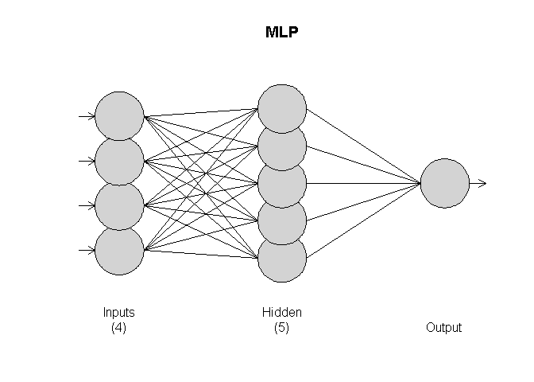
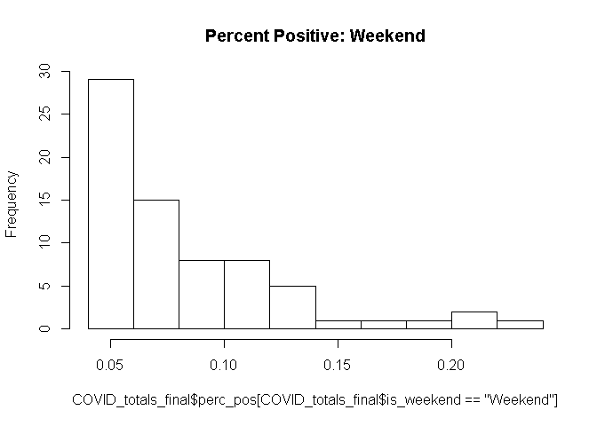
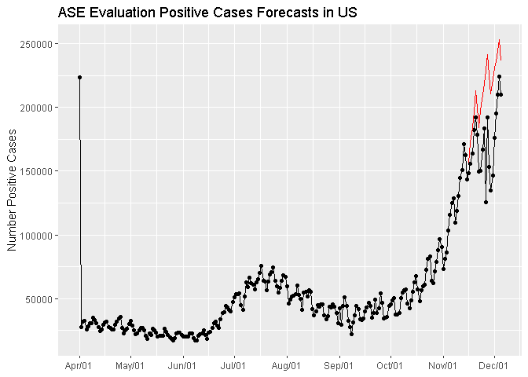

# US National - Daily Positives


**Loading the Data**

Data was loaded from the Covid Tracking website using the APIs they provided.
NOTE: if the CSV does not pull we have the JSON API as an alternate method

https://covidtracking.com/about-data/data-definitions


** NOTE: DATA PULL AS OF NOV 30, 2020 **
Results will vary depending on when you initiate a fresh pull


```r
#load full dataframe
# https://covidtracking.com/about-data/data-definitions

### ALTERNATE USING JSON API
#library(jsonlite)
#covidjson.df <- fromJSON( 'https://api.covidtracking.com/v1/states/daily.json' )

# CSV API
covidlive.df <- read.csv('https://api.covidtracking.com/v1/states/daily.csv', header = T)

# validate data set
str(covidlive.df)
```

```
## 'data.frame':	15577 obs. of  55 variables:
##  $ date                       : int  20201205 20201205 20201205 20201205 20201205 20201205 20201205 20201205 20201205 20201205 ...
##  $ state                      : Factor w/ 56 levels "AK","AL","AR",..: 1 2 3 4 5 6 7 8 9 10 ...
##  $ positive                   : int  34963 267589 169382 0 358900 1311625 257347 127715 22872 39096 ...
##  $ probableCases              : int  NA 45785 22671 NA 12139 NA 11014 8131 NA 1441 ...
##  $ negative                   : int  1032268 1415357 1601735 2140 2003152 23590350 1574219 3294383 704515 398514 ...
##  $ pending                    : int  NA NA NA NA NA NA NA NA NA NA ...
##  $ totalTestResultsSource     : Factor w/ 4 levels "posNeg","totalTestEncountersViral",..: 4 3 4 4 3 4 2 1 2 2 ...
##  $ totalTestResults           : int  1067231 1637161 1748446 2140 2349913 24901975 3442114 3422098 727387 769818 ...
##  $ hospitalizedCurrently      : int  166 1867 1056 NA 2931 10273 1812 1150 193 306 ...
##  $ hospitalizedCumulative     : int  799 26331 9380 NA 28006 NA 14844 12257 NA NA ...
##  $ inIcuCurrently             : int  NA NA 359 NA 701 2265 NA NA 54 36 ...
##  $ inIcuCumulative            : int  NA 2290 NA NA NA NA NA NA NA NA ...
##  $ onVentilatorCurrently      : int  24 NA 178 NA 431 NA NA NA 22 NA ...
##  $ onVentilatorCumulative     : int  NA 1317 1038 NA NA NA NA NA NA NA ...
##  $ recovered                  : int  7165 168387 148131 NA 55640 NA 13760 9800 16596 18605 ...
##  $ dataQualityGrade           : Factor w/ 8 levels "","#REF!","A",..: 3 3 4 7 4 5 3 6 4 4 ...
##  $ lastUpdateEt               : Factor w/ 7202 levels "","10/1/2020 00:00",..: 1742 1746 1737 1631 1737 1740 1739 1709 1712 1733 ...
##  $ dateModified               : Factor w/ 7202 levels "","2020-02-26T00:00:00Z",..: 7189 7193 7184 7078 7184 7187 7186 7156 7159 7180 ...
##  $ checkTimeEt                : Factor w/ 7202 levels "","02/25 19:00",..: 7189 7193 7184 7078 7184 7187 7186 7156 7159 7180 ...
##  $ death                      : int  143 3877 2620 0 6925 19791 2724 5146 695 782 ...
##  $ hospitalized               : int  799 26331 9380 NA 28006 NA 14844 12257 NA NA ...
##  $ dateChecked                : Factor w/ 7202 levels "","2020-02-26T00:00:00Z",..: 7189 7193 7184 7078 7184 7187 7186 7156 7159 7180 ...
##  $ totalTestsViral            : int  1067231 NA 1748446 2140 NA 24901975 NA 3413967 NA NA ...
##  $ positiveTestsViral         : int  42805 NA NA NA NA NA NA NA NA 39295 ...
##  $ negativeTestsViral         : int  1023349 NA 1601735 NA NA NA NA NA NA NA ...
##  $ positiveCasesViral         : int  NA 221804 146711 0 346761 1311625 246333 119584 NA 37655 ...
##  $ deathConfirmed             : int  143 3454 2402 NA 6406 NA NA 4143 NA 688 ...
##  $ deathProbable              : int  NA 423 218 NA 519 NA NA 1003 NA 94 ...
##  $ totalTestEncountersViral   : int  NA NA NA NA NA NA 3442114 NA 727387 769818 ...
##  $ totalTestsPeopleViral      : int  NA 1637161 NA NA 2349913 NA 1815644 NA 315818 437610 ...
##  $ totalTestsAntibody         : int  NA NA NA NA 369832 NA 214953 NA NA NA ...
##  $ positiveTestsAntibody      : int  NA NA NA NA NA NA 18530 NA NA NA ...
##  $ negativeTestsAntibody      : int  NA NA NA NA NA NA 194770 NA NA NA ...
##  $ totalTestsPeopleAntibody   : int  NA 74594 NA NA NA NA NA NA NA NA ...
##  $ positiveTestsPeopleAntibody: int  NA NA NA NA NA NA NA NA NA NA ...
##  $ negativeTestsPeopleAntibody: int  NA NA NA NA NA NA NA NA NA NA ...
##  $ totalTestsPeopleAntigen    : int  NA NA 155355 NA NA NA NA NA NA NA ...
##  $ positiveTestsPeopleAntigen : int  NA NA 27547 NA NA NA NA NA NA NA ...
##  $ totalTestsAntigen          : int  NA NA 21856 NA NA NA NA 49816 NA NA ...
##  $ positiveTestsAntigen       : int  NA NA 3300 NA NA NA NA NA NA NA ...
##  $ fips                       : int  2 1 5 60 4 6 8 9 11 10 ...
##  $ positiveIncrease           : int  922 3390 2245 0 6799 25068 5125 0 392 698 ...
##  $ negativeIncrease           : int  15940 8058 11959 0 16875 201429 0 0 8753 1845 ...
##  $ total                      : int  1067231 1682946 1771117 2140 2362052 24901975 1831566 3422098 727387 437610 ...
##  $ totalTestResultsIncrease   : int  16862 10793 13760 0 23169 226497 45040 0 9145 9014 ...
##  $ posNeg                     : int  1067231 1682946 1771117 2140 2362052 24901975 1831566 3422098 727387 437610 ...
##  $ deathIncrease              : int  1 46 34 0 40 209 0 0 2 0 ...
##  $ hospitalizedIncrease       : int  5 0 51 0 268 0 82 0 0 0 ...
##  $ hash                       : Factor w/ 15577 levels "0000831d10ed7915f0ccfcd211652c27ca1f259e",..: 13096 7402 1329 8696 10783 8162 10658 3416 3355 1878 ...
##  $ commercialScore            : int  0 0 0 0 0 0 0 0 0 0 ...
##  $ negativeRegularScore       : int  0 0 0 0 0 0 0 0 0 0 ...
##  $ negativeScore              : int  0 0 0 0 0 0 0 0 0 0 ...
##  $ positiveScore              : int  0 0 0 0 0 0 0 0 0 0 ...
##  $ score                      : int  0 0 0 0 0 0 0 0 0 0 ...
##  $ grade                      : logi  NA NA NA NA NA NA ...
```


##Data Cleaning

There are a number of issues with the data quality

* the data set includes data from outside the official 50 US states [Guam, Puerto Rico, etc]
* the date field is seen as a factor
* there are a number of parameters with missing values that far exceed 5%
* states began recording their data on different dates
* states did not use the same tests, data collection, or schema to record their results


**US Territories**

The data includes measurements from US territories such as Guam, American Somoa, Puerto Rico, and the Virgin Islands. First we need to filter out to include only the 50 US States plus the District of Columbia.

NOTE: we add an abritrary rowId field simply to help with advanced queries


```r
#remove Non US States: Guam, Puerto Rico, American Somoa, Virgin Islands
# ALTERNATE: covidlive.df[covidlive.df$state != c('AS','GU','MP','PR','VI'),] 
covidlive.df %>% dplyr::filter( !state %in% c('AS','GU','MP','PR','VI')) -> covidclean.df

# add rowId for easier tracking & comparison: INTERNAL USE ONLY
covidclean.df$rowId <- 1:length(covidclean.df$positive)
```


**Date**

The date is being stored as a factor rather than an actual 'date' object. Here we convert to a POSIX date object. 


```r
# convert date from factor to date type
base::as.Date( as.factor(covidclean.df$date), "%Y%m%d" ) -> covidclean.df$date
```

The start date for the entire data set is from Jan 22, 2020. However showing by state we can see the discrepancy, that most of the states did not start recording data until after March of 2020. 


```r
covidclean.df %>%
  dplyr::select(date, state) %>% 
  group_by(state) %>% 
  summarise(
     first_date = min(date), total_tests = n()
  ) %>% .[order(.$first_date,decreasing = T),]
```

```
## # A tibble: 51 x 3
##    state first_date total_tests
##    <fct> <date>           <int>
##  1 AL    2020-03-07         274
##  2 CT    2020-03-07         274
##  3 ID    2020-03-07         274
##  4 LA    2020-03-07         274
##  5 ME    2020-03-07         274
##  6 MO    2020-03-07         274
##  7 MS    2020-03-07         274
##  8 MT    2020-03-07         274
##  9 ND    2020-03-07         274
## 10 OK    2020-03-07         274
## # ... with 41 more rows
```

For the purpose of accurate modeling for the entire US we must filter to the lowest common denominator of March 7, 2020


```r
# filter date filter(date > '2020-03-08')

covidclean.df %>% 
  dplyr::filter( date > '2020-03-07') -> covidclean.df
```


##Missing and Inconsistent Values

We can see most fields have a large number of missing values. However the data quality issues is a bit more complex than that, since there are also discrepancies in the test values.

For example positive vs positiveTestViral vs positiveTestAntibodies. Or certain states derive the total tests based on adding all the other tests together, where as some record this value separately.

Furthermore these values are *cumulative* and certain states did not record a delta increase and thus this is calculated from the columns running total, which erroneously substitutes a 0 whenever there is a missing value

Our strategy needs to be a little bit different since different states may have used different parameters to record their results


```r
# Missing Values: from VIM package
aggr(covidclean.df, 
     plot = F,
     prop = F, 
     combined = F, 
     numbers = T, 
     sortVars = T, 
     sortCombs = T)
```

```
## 
##  Missings in variables:
##                     Variable Count
##                     positive    15
##                probableCases  8774
##                     negative    65
##                      pending 12658
##             totalTestResults    24
##        hospitalizedCurrently  1904
##       hospitalizedCumulative  4681
##               inIcuCurrently  6619
##              inIcuCumulative 11235
##        onVentilatorCurrently  8025
##       onVentilatorCumulative 12998
##                    recovered  3655
##                        death   485
##                 hospitalized  4681
##              totalTestsViral  5344
##           positiveTestsViral  9275
##           negativeTestsViral 10893
##           positiveCasesViral  2899
##               deathConfirmed  7659
##                deathProbable  9079
##     totalTestEncountersViral 10382
##        totalTestsPeopleViral  7499
##           totalTestsAntibody 11115
##        positiveTestsAntibody 12136
##        negativeTestsAntibody 12934
##     totalTestsPeopleAntibody 12672
##  positiveTestsPeopleAntibody 13129
##  negativeTestsPeopleAntibody 13159
##      totalTestsPeopleAntigen 13384
##   positiveTestsPeopleAntigen 13517
##            totalTestsAntigen 12827
##         positiveTestsAntigen 13266
##                        grade 13923
```


AK has most of the missing values for any of the positive derivatives. However, seeing that the negative is fully detailed its reasonable to assume that at this point they had not had their first positive Covid-19 test

MA has some discrepancies with the total number of tests, yet have a value for positiveTestsViral

All discrepancies occur within the first half of March 2020


```r
# show missing positive vs all positive derived columns

covidclean.df[is.na(covidclean.df$positive), c('date','state', 'positive', 'negative', 'total', 'positiveTestsViral', 'totalTestResults', 'totalTestsViral' ) ]
```

```
##             date state positive negative total positiveTestsViral
## 13465 2020-03-16    AK       NA      144   144                 NA
## 13516 2020-03-15    AK       NA      144   144                 NA
## 13567 2020-03-14    AK       NA      144   144                 NA
## 13618 2020-03-13    AK       NA       60    60                 NA
## 13669 2020-03-12    AK       NA       46    60                 NA
## 13720 2020-03-11    AK       NA       46    60                 NA
## 13739 2020-03-11    MA       NA       NA     0                141
## 13771 2020-03-10    AK       NA       23    32                 NA
## 13790 2020-03-10    MA       NA       NA     0                118
## 13822 2020-03-09    AK       NA       23    32                 NA
## 13841 2020-03-09    MA       NA       NA     0                104
## 13850 2020-03-09    ND       NA        0     0                 NA
## 13873 2020-03-08    AK       NA       14    20                 NA
## 13892 2020-03-08    MA       NA       NA     0                 97
## 13901 2020-03-08    ND       NA        0     0                 NA
##       totalTestResults totalTestsViral
## 13465              144             144
## 13516              144             144
## 13567              144             144
## 13618               60              60
## 13669               46              46
## 13720               46              46
## 13739              684             684
## 13771               23              23
## 13790              502             502
## 13822               23              23
## 13841              393             393
## 13850               NA              NA
## 13873               14              14
## 13892              312             312
## 13901               NA              NA
```


Here we have quite a bit of discrepancies in terms of correlating total tests, positive, negative, etc. For exmple MA on March 10, 2020:

* totalTestResults of 502
* positiveTestsViral o 118
* total of 0
* negative NA
* positive NA


Looking at the dates we can see all discrepancies occur within the first half of March 2020


```r
# show all negatives

covidclean.df[is.na(covidclean.df$negative), c('date','state', 'positive', 'negative',  'negativeTestsViral', 'total', 'positiveTestsViral','negativeTestsAntibody', 'negativeTestsPeopleAntibody', 'totalTestResults', 'totalTestsViral' ) ]
```

```
##             date state positive negative negativeTestsViral total
## 13424 2020-03-17    GA      146       NA                 NA   146
## 13425 2020-03-17    HI       10       NA                 NA    10
## 13475 2020-03-16    GA      121       NA                 NA   121
## 13476 2020-03-16    HI        7       NA                 NA     7
## 13508 2020-03-16    TX       57       NA                 NA    57
## 13515 2020-03-16    WY        3       NA                286     3
## 13526 2020-03-15    GA       99       NA                 NA    99
## 13527 2020-03-15    HI        2       NA                 NA     2
## 13559 2020-03-15    TX       56       NA                 NA    56
## 13566 2020-03-15    WY        3       NA                166     3
## 13577 2020-03-14    GA       66       NA                 NA    66
## 13578 2020-03-14    HI        2       NA                 NA     2
## 13586 2020-03-14    MA       38       NA                 NA    38
## 13610 2020-03-14    TX       51       NA                 NA    51
## 13617 2020-03-14    WY        2       NA                145     2
## 13628 2020-03-13    GA       42       NA                 NA    42
## 13629 2020-03-13    HI        2       NA                 NA     2
## 13637 2020-03-13    MA       23       NA                 NA    23
## 13661 2020-03-13    TX       39       NA                 NA    39
## 13668 2020-03-13    WY        1       NA                107     1
## 13679 2020-03-12    GA       31       NA                 NA    31
## 13680 2020-03-12    HI        2       NA                 NA     2
## 13688 2020-03-12    MA        8       NA                 NA     8
## 13712 2020-03-12    TX       23       NA                 NA    23
## 13719 2020-03-12    WY        1       NA                 74     1
## 13730 2020-03-11    GA       22       NA                 NA    22
## 13731 2020-03-11    HI        2       NA                 NA     2
## 13739 2020-03-11    MA       NA       NA                 NA     0
## 13744 2020-03-11    MO        1       NA                 46     1
## 13747 2020-03-11    NC        7       NA                 NA     7
## 13763 2020-03-11    TX       21       NA                 NA    21
## 13770 2020-03-11    WY        0       NA                 37     0
## 13781 2020-03-10    GA       17       NA                 NA    17
## 13782 2020-03-10    HI        2       NA                 NA     2
## 13790 2020-03-10    MA       NA       NA                 NA     0
## 13795 2020-03-10    MO        1       NA                 34     1
## 13796 2020-03-10    MS        0       NA                 NA     0
## 13798 2020-03-10    NC        7       NA                 NA     7
## 13809 2020-03-10    PA       12       NA                 NA    12
## 13813 2020-03-10    TN        7       NA                 NA     7
## 13814 2020-03-10    TX       13       NA                 NA    13
## 13823 2020-03-09    AL        0       NA                 NA     0
## 13832 2020-03-09    GA       12       NA                 NA    12
## 13833 2020-03-09    HI        2       NA                 NA     2
## 13837 2020-03-09    IN        2       NA                 NA     2
## 13841 2020-03-09    MA       NA       NA                 NA     0
## 13846 2020-03-09    MO        1       NA                 29     1
## 13847 2020-03-09    MS        0       NA                 NA     0
## 13849 2020-03-09    NC        2       NA                 NA     2
## 13860 2020-03-09    PA       10       NA                 NA    10
## 13864 2020-03-09    TN        3       NA                 NA     3
## 13865 2020-03-09    TX       12       NA                 NA    12
## 13872 2020-03-09    WY        0       NA                 19     0
## 13874 2020-03-08    AL        0       NA                 NA     0
## 13883 2020-03-08    GA        7       NA                 NA     7
## 13884 2020-03-08    HI        1       NA                 NA     1
## 13888 2020-03-08    IN        2       NA                 NA     2
## 13892 2020-03-08    MA       NA       NA                 NA     0
## 13897 2020-03-08    MO        1       NA                 24     1
## 13898 2020-03-08    MS        0       NA                 NA     0
## 13900 2020-03-08    NC        2       NA                 NA     2
## 13911 2020-03-08    PA        6       NA                 NA     6
## 13915 2020-03-08    TN        3       NA                 NA     3
## 13916 2020-03-08    TX        8       NA                 NA     8
## 13923 2020-03-08    WY        0       NA                  9     0
##       positiveTestsViral negativeTestsAntibody negativeTestsPeopleAntibody
## 13424                185                    NA                          NA
## 13425                 10                    NA                          NA
## 13475                100                    NA                          NA
## 13476                  7                    NA                          NA
## 13508                 NA                    NA                          NA
## 13515                 14                    NA                          NA
## 13526                 68                    NA                          NA
## 13527                  4                    NA                          NA
## 13559                 NA                    NA                          NA
## 13566                 12                    NA                          NA
## 13577                 41                    NA                          NA
## 13578                  2                    NA                          NA
## 13586                308                    NA                          NA
## 13610                 NA                    NA                          NA
## 13617                  6                    NA                          NA
## 13628                 32                    NA                          NA
## 13629                  2                    NA                          NA
## 13637                234                    NA                          NA
## 13661                 NA                    NA                          NA
## 13668                  1                    NA                          NA
## 13679                  7                    NA                          NA
## 13680                  2                    NA                          NA
## 13688                170                    NA                          NA
## 13712                 NA                    NA                          NA
## 13719                  1                    NA                          NA
## 13730                  4                    NA                          NA
## 13731                  2                    NA                          NA
## 13739                141                    NA                          NA
## 13744                  8                    NA                          NA
## 13747                 NA                    NA                          NA
## 13763                 NA                    NA                          NA
## 13770                  0                    NA                          NA
## 13781                  2                    NA                          NA
## 13782                  2                    NA                          NA
## 13790                118                    NA                          NA
## 13795                  8                    NA                          NA
## 13796                 NA                    NA                          NA
## 13798                 NA                    NA                          NA
## 13809                 NA                    NA                          NA
## 13813                 NA                    NA                          NA
## 13814                 NA                    NA                          NA
## 13823                 NA                    NA                          NA
## 13832                  1                    NA                          NA
## 13833                  1                    NA                          NA
## 13837                  3                    NA                          NA
## 13841                104                    NA                          NA
## 13846                  7                    NA                          NA
## 13847                 NA                    NA                          NA
## 13849                 NA                    NA                          NA
## 13860                 NA                    NA                          NA
## 13864                 NA                    NA                          NA
## 13865                 NA                    NA                          NA
## 13872                  0                    NA                          NA
## 13874                 NA                    NA                          NA
## 13883                  0                    NA                          NA
## 13884                  1                    NA                          NA
## 13888                  1                    NA                          NA
## 13892                 97                    NA                          NA
## 13897                  7                    NA                          NA
## 13898                 NA                    NA                          NA
## 13900                 NA                    NA                          NA
## 13911                 NA                    NA                          NA
## 13915                 NA                    NA                          NA
## 13916                 NA                    NA                          NA
## 13923                  0                    NA                          NA
##       totalTestResults totalTestsViral
## 13424             1500            1500
## 13425              306              NA
## 13475              959             959
## 13476              189              NA
## 13508               57              NA
## 13515              300             300
## 13526              707             707
## 13527               59              NA
## 13559               56              NA
## 13566              178             178
## 13577              466             466
## 13578               28              NA
## 13586             3036            3036
## 13610               51              NA
## 13617              151             151
## 13628              336             336
## 13629               21              NA
## 13637             2101            2101
## 13661               39              NA
## 13668              108             108
## 13679               81              81
## 13680               16              NA
## 13688             1116            1116
## 13712               23              NA
## 13719               75              75
## 13730               44              44
## 13731               15              NA
## 13739              684             684
## 13744               54              54
## 13747                7              NA
## 13763               21              NA
## 13770               37              37
## 13781               29              29
## 13782               12              NA
## 13790              502             502
## 13795               42              42
## 13796                0              NA
## 13798                7              NA
## 13809               12              NA
## 13813                7              NA
## 13814               13              NA
## 13823                0              NA
## 13832                6               6
## 13833               11              NA
## 13837               42              42
## 13841              393             393
## 13846               36              36
## 13847                0              NA
## 13849                2              NA
## 13860               10              NA
## 13864                3              NA
## 13865               12              NA
## 13872               19              19
## 13874                0              NA
## 13883                0               0
## 13884                9              NA
## 13888               33              33
## 13892              312             312
## 13897               31              31
## 13898                0              NA
## 13900                2              NA
## 13911                6              NA
## 13915                3              NA
## 13916                8              NA
## 13923                9               9
```

```r
#covidclean.df[is.na(covidclean.df$positive), c('date','state', 'total', 'totalTestResults', 'totalTestsViral', 'totalTestsAntibody', 'totalTestsAntigen', 'totalTestsPeopleAntibody', 'totalTestsPeopleAntigen', 'totalTestsPeopleViral' ) ]
```


To help further illustrate the data discrepancy we are going to look at data with missing values for death. Again as these are all prior to April of 2020 its reasonable to assume these states had not recorded any deaths during these dates.

Additionally, if you compare total, totalTestResults, and the sum of negative + positive, its clear there are some discrepancies to account for


```r
# show all deaths

covidclean.df[is.na(covidclean.df$death), c('date','state', 'death', 'positive', 'negative',  'negativeTestsViral', 'total', 'positiveTestsViral', 'totalTestResults', 'totalTestsViral', 'deathConfirmed', 'deathProbable' ) ]
```

```
##             date state death positive negative negativeTestsViral total
## 12711 2020-03-31    HI    NA      204     8471                 NA  8675
## 12762 2020-03-30    HI    NA      175     7825                 NA  8000
## 12813 2020-03-29    HI    NA      151     6849                 NA  7000
## 12864 2020-03-28    HI    NA      120     4357                 NA  4477
## 12892 2020-03-28    RI    NA      312     2742               2871  3192
## 12915 2020-03-27    HI    NA      106     4357                 NA  4463
## 12930 2020-03-27    MT    NA      108     2590                 NA  2698
## 12943 2020-03-27    RI    NA      248     2502               2611  2888
## 12966 2020-03-26    HI    NA       95     4357                 NA  4452
## 12976 2020-03-26    ME    NA      155     3394                 NA  3549
## 12981 2020-03-26    MT    NA       71     2128                 NA  2199
## 12994 2020-03-26    RI    NA      217     2300               2396  2698
## 13005 2020-03-26    WY    NA       53     1052               1887  1105
## 13017 2020-03-25    HI    NA       90     4357                 NA  4447
## 13027 2020-03-25    ME    NA      149     3177                 NA  3326
## 13032 2020-03-25    MT    NA       53     1948                 NA  2001
## 13045 2020-03-25    RI    NA      176     2124               2215  2496
## 13056 2020-03-25    WY    NA       44      954               1654   998
## 13068 2020-03-24    HI    NA       77     3589                 NA  3666
## 13069 2020-03-24    IA    NA      124     2315                 NA  2439
## 13078 2020-03-24    ME    NA      125     3014                 NA  3139
## 13083 2020-03-24    MT    NA       46     1643                 NA  1689
## 13096 2020-03-24    RI    NA      148     1951               2032  2176
## 13107 2020-03-24    WY    NA       29      710               1403   739
## 13119 2020-03-23    HI    NA       56     2955                 NA  3011
## 13120 2020-03-23    IA    NA      105     2043                 NA  2148
## 13129 2020-03-23    ME    NA      107     2791                 NA  2898
## 13134 2020-03-23    MT    NA       34     1146                 NA  1180
## 13138 2020-03-23    NH    NA       78     1374                 NA  2341
## 13140 2020-03-23    NM    NA       83     5890                 NA  5973
## 13147 2020-03-23    RI    NA      129     1713               1789  2058
## 13158 2020-03-23    WY    NA       26      592               1259   618
## 13170 2020-03-22    HI    NA       48      263                 NA   311
## 13171 2020-03-22    IA    NA       90     1215                 NA  1305
## 13180 2020-03-22    ME    NA       89     2264                 NA  2353
## 13185 2020-03-22    MT    NA       31     1146                 NA  1177
## 13189 2020-03-22    NH    NA       65     1188                 NA  2212
## 13191 2020-03-22    NM    NA       65     5321                 NA  5386
## 13198 2020-03-22    RI    NA      113     1547               1620  1876
## 13201 2020-03-22    TN    NA      505     3272                 NA  3777
## 13209 2020-03-22    WY    NA       24      438               1049   462
## 13212 2020-03-21    AR    NA      118      567                 NA   839
## 13221 2020-03-21    HI    NA       37      124                 NA   161
## 13222 2020-03-21    IA    NA       68     1049                 NA  1117
## 13223 2020-03-21    ID    NA       31      880                 NA   911
## 13231 2020-03-21    ME    NA       73     2264                 NA  2337
## 13236 2020-03-21    MT    NA       20     1146                 NA  1166
## 13240 2020-03-21    NH    NA       55      973                 NA  1970
## 13242 2020-03-21    NM    NA       57     4722                 NA  4779
## 13249 2020-03-21    RI    NA       88     1284               1338  1662
## 13252 2020-03-21    TN    NA      371     3272                 NA  3643
## 13260 2020-03-21    WY    NA       23      438                984   461
## 13263 2020-03-20    AR    NA       96      351                 NA   650
## 13272 2020-03-20    HI    NA       26      124                 NA   150
## 13273 2020-03-20    IA    NA       45      642                 NA   687
## 13274 2020-03-20    ID    NA       23      590                 NA   613
## 13282 2020-03-20    ME    NA       57     2264                 NA  2321
## 13284 2020-03-20    MN    NA      303     3741                 NA  4044
## 13287 2020-03-20    MT    NA       16      931                 NA   947
## 13291 2020-03-20    NH    NA       44      745                 NA  1420
## 13293 2020-03-20    NM    NA       57     3771                 NA  3828
## 13300 2020-03-20    RI    NA       74     1161               1212  1375
## 13303 2020-03-20    TN    NA      228      563                 NA   791
## 13311 2020-03-20    WY    NA       19      331                910   350
## 13314 2020-03-19    AR    NA       46      310                 NA   469
## 13323 2020-03-19    HI    NA       16       93                 NA   109
## 13324 2020-03-19    IA    NA       38       83                 NA   121
## 13325 2020-03-19    ID    NA       11      459                 NA   470
## 13333 2020-03-19    ME    NA       53     2004                 NA  2057
## 13335 2020-03-19    MN    NA      287     2949                 NA  3236
## 13337 2020-03-19    MS    NA       50      552                 NA   602
## 13338 2020-03-19    MT    NA       12      761                 NA   773
## 13342 2020-03-19    NH    NA       39      621                 NA   891
## 13344 2020-03-19    NM    NA       43     3771                 NA  3814
## 13347 2020-03-19    OH    NA      119      140                 NA   259
## 13351 2020-03-19    RI    NA       61      968               1015  1363
## 13354 2020-03-19    TN    NA      154      349                 NA   503
## 13358 2020-03-19    VT    NA       21      619                 NA   640
## 13360 2020-03-19    WI    NA      174     2192                 NA  2366
## 13362 2020-03-19    WY    NA       18      271                716   289
## 13365 2020-03-18    AR    NA       33      236                 NA   319
## 13369 2020-03-18    CT    NA       68      125                 NA   193
## 13370 2020-03-18    DC    NA       31      138                 NA   170
## 13374 2020-03-18    HI    NA       14       93                 NA   107
## 13375 2020-03-18    IA    NA       29       83                 NA   112
## 13376 2020-03-18    ID    NA        9      459                 NA   468
## 13384 2020-03-18    ME    NA       43     1670                 NA  1713
## 13386 2020-03-18    MN    NA      269     2685                 NA  2954
## 13388 2020-03-18    MS    NA       34      479                 NA   513
## 13389 2020-03-18    MT    NA       10      499                 NA   509
## 13392 2020-03-18    NE    NA       24      206                446   230
## 13393 2020-03-18    NH    NA       26      513                 NA   747
## 13395 2020-03-18    NM    NA       35     2762                 NA  2797
## 13398 2020-03-18    OH    NA       88      140                 NA   228
## 13399 2020-03-18    OK    NA       29      378                 NA   517
## 13402 2020-03-18    RI    NA       44      719                753  1097
## 13405 2020-03-18    TN    NA       98      349                 NA   447
## 13409 2020-03-18    VT    NA       19      565                 NA   584
## 13411 2020-03-18    WI    NA      121     1577                 NA  1698
## 13413 2020-03-18    WY    NA       15      178                580   193
## 13416 2020-03-17    AR    NA       22      197                 NA   260
## 13420 2020-03-17    CT    NA       41      125                 NA   166
## 13421 2020-03-17    DC    NA       22      104                 NA   126
## 13425 2020-03-17    HI    NA       10       NA                 NA    10
## 13426 2020-03-17    IA    NA       23       83                 NA   106
## 13427 2020-03-17    ID    NA        7      346                 NA   353
## 13433 2020-03-17    MA    NA      118     1633                 NA  1751
## 13434 2020-03-17    MD    NA       57       94                 NA   151
## 13435 2020-03-17    ME    NA       32     1303                 NA  1335
## 13437 2020-03-17    MN    NA      246     2276                 NA  2522
## 13439 2020-03-17    MS    NA       21      368                 NA   389
## 13440 2020-03-17    MT    NA        8      303                 NA   311
## 13443 2020-03-17    NE    NA       21      206                351   227
## 13444 2020-03-17    NH    NA       17      355                 NA   567
## 13446 2020-03-17    NM    NA       28     2326                 NA  2354
## 13449 2020-03-17    OH    NA       67      140                 NA   207
## 13450 2020-03-17    OK    NA       17      247                 NA   346
## 13451 2020-03-17    OR    NA       47      689                 NA   920
## 13452 2020-03-17    PA    NA       96      879                 NA   975
## 13453 2020-03-17    RI    NA       33      608                637   790
## 13455 2020-03-17    SD    NA       11      551                 NA   597
## 13456 2020-03-17    TN    NA       73      330                 NA   403
## 13460 2020-03-17    VT    NA       17      473                 NA   490
## 13462 2020-03-17    WI    NA       83     1038                 NA  1121
## 13464 2020-03-17    WY    NA       10       95                444   105
## 13467 2020-03-16    AR    NA       22      132                 NA   168
## 13471 2020-03-16    CT    NA       26      125                 NA   151
## 13472 2020-03-16    DC    NA       17       96                 NA   120
## 13476 2020-03-16    HI    NA        7       NA                 NA     7
## 13477 2020-03-16    IA    NA       22       83                 NA   105
## 13478 2020-03-16    ID    NA        5      265                 NA   270
## 13479 2020-03-16    IL    NA       93      932                 NA  1025
## 13484 2020-03-16    MA    NA       97     1199                 NA  1296
## 13486 2020-03-16    ME    NA       17      764                 NA   781
## 13487 2020-03-16    MI    NA     2895      272                 NA  3197
## 13488 2020-03-16    MN    NA      179     1839                 NA  2018
## 13490 2020-03-16    MS    NA       12      277                 NA   289
## 13491 2020-03-16    MT    NA        7      198                 NA   205
## 13494 2020-03-16    NE    NA       18      170                276   188
## 13495 2020-03-16    NH    NA       13      271                 NA   379
## 13497 2020-03-16    NM    NA       23     1249                 NA  1272
## 13500 2020-03-16    OH    NA       50      140                 NA   551
## 13501 2020-03-16    OK    NA       10      174                 NA   213
## 13502 2020-03-16    OR    NA       39      579                 NA   800
## 13503 2020-03-16    PA    NA       76      670                 NA   746
## 13504 2020-03-16    RI    NA       22      455                475   626
## 13506 2020-03-16    SD    NA       10      494                 NA   504
## 13507 2020-03-16    TN    NA       52      270                 NA   322
## 13508 2020-03-16    TX    NA       57       NA                 NA    57
## 13511 2020-03-16    VT    NA       12      392                 NA   404
## 13513 2020-03-16    WI    NA       56      504                 NA   560
## 13515 2020-03-16    WY    NA        3       NA                286     3
## 13518 2020-03-15    AR    NA       16      103                 NA   149
## 13522 2020-03-15    CT    NA       20      125                 NA   145
## 13523 2020-03-15    DC    NA       16       79                 NA   115
## 13527 2020-03-15    HI    NA        2       NA                 NA     2
## 13528 2020-03-15    IA    NA       18       83                 NA   101
## 13529 2020-03-15    ID    NA        5      174                 NA   179
## 13530 2020-03-15    IL    NA       64      449                 NA   708
## 13535 2020-03-15    MA    NA       64      584                 NA   648
## 13536 2020-03-15    MD    NA       31       94                 NA   125
## 13537 2020-03-15    ME    NA        3       91                 NA   111
## 13538 2020-03-15    MI    NA     2188      205                 NA  2419
## 13539 2020-03-15    MN    NA      128     1387                 NA  1515
## 13541 2020-03-15    MS    NA       10       84                 NA    94
## 13542 2020-03-15    MT    NA        7      103                 NA   167
## 13543 2020-03-15    NC    NA       32      227                 NA   410
## 13545 2020-03-15    NE    NA       17       80                222   130
## 13546 2020-03-15    NH    NA       13      271                 NA   379
## 13548 2020-03-15    NM    NA       17      566                 NA   583
## 13551 2020-03-15    OH    NA       36      139                 NA   525
## 13552 2020-03-15    OK    NA        9      118                 NA   139
## 13553 2020-03-15    OR    NA       36      420                 NA   681
## 13554 2020-03-15    PA    NA       63      205                 NA   451
## 13555 2020-03-15    RI    NA       20      364                380   441
## 13556 2020-03-15    SC    NA       19      154                 NA   173
## 13557 2020-03-15    SD    NA        9      327                 NA   342
## 13558 2020-03-15    TN    NA       39      157                 NA   196
## 13559 2020-03-15    TX    NA       56       NA                 NA    56
## 13562 2020-03-15    VT    NA        8      320                 NA   328
## 13564 2020-03-15    WI    NA       37      313                 NA   350
## 13566 2020-03-15    WY    NA        3       NA                166     3
## 13568 2020-03-14    AL    NA        6       22                 NA    74
## 13569 2020-03-14    AR    NA       12       65                 NA   103
## 13573 2020-03-14    CT    NA       11      125                 NA   136
## 13574 2020-03-14    DC    NA       10       49                 NA    69
## 13578 2020-03-14    HI    NA        2       NA                 NA     2
## 13579 2020-03-14    IA    NA       17       83                 NA   100
## 13580 2020-03-14    ID    NA        2      174                 NA   176
## 13581 2020-03-14    IL    NA       46      316                 NA   444
## 13585 2020-03-14    LA    NA       51      109                 NA   160
## 13586 2020-03-14    MA    NA       38       NA                 NA    38
## 13587 2020-03-14    MD    NA       26       94                 NA   120
## 13588 2020-03-14    ME    NA        3       91                 NA   111
## 13589 2020-03-14    MI    NA     1728      205                 NA  1959
## 13590 2020-03-14    MN    NA       90      847                 NA   937
## 13592 2020-03-14    MS    NA        6       84                 NA    90
## 13593 2020-03-14    MT    NA        5      103                 NA   108
## 13594 2020-03-14    NC    NA       23      137                 NA   160
## 13596 2020-03-14    NE    NA       14       80                195   127
## 13597 2020-03-14    NH    NA        7      212                 NA   250
## 13599 2020-03-14    NM    NA       13      482                 NA   495
## 13601 2020-03-14    NY    NA      517     3609                 NA  4126
## 13602 2020-03-14    OH    NA       13       50                 NA   222
## 13603 2020-03-14    OK    NA        4       36                 NA    77
## 13604 2020-03-14    OR    NA       30      337                 NA   524
## 13605 2020-03-14    PA    NA       47      205                 NA   402
## 13606 2020-03-14    RI    NA       19      310                326   386
## 13607 2020-03-14    SC    NA       13      110                 NA   123
## 13608 2020-03-14    SD    NA        9      182                 NA   194
## 13609 2020-03-14    TN    NA       32      130                 NA   162
## 13610 2020-03-14    TX    NA       51       NA                 NA    51
## 13611 2020-03-14    UT    NA        6      381                383   387
## 13612 2020-03-14    VA    NA       30      117                 NA   147
## 13613 2020-03-14    VT    NA        5      218                 NA   223
## 13615 2020-03-14    WI    NA       23      169                 NA   192
## 13616 2020-03-14    WV    NA        0       26                 NA    31
## 13617 2020-03-14    WY    NA        2       NA                145     2
## 13619 2020-03-13    AL    NA        1       11                 NA    12
## 13620 2020-03-13    AR    NA        9       30                 NA    61
## 13624 2020-03-13    CT    NA        6       99                 NA   105
## 13625 2020-03-13    DC    NA       10       20                 NA    30
## 13629 2020-03-13    HI    NA        2       NA                 NA     2
## 13630 2020-03-13    IA    NA       16       83                 NA   128
## 13631 2020-03-13    ID    NA        0      131                 NA   131
## 13632 2020-03-13    IL    NA       32      294                 NA   418
## 13633 2020-03-13    IN    NA       12       61                 NA    73
## 13634 2020-03-13    KS    NA        6       93                 NA    99
## 13635 2020-03-13    KY    NA       11      107                 NA   118
## 13636 2020-03-13    LA    NA       36       37                 NA    73
## 13637 2020-03-13    MA    NA       23       NA                 NA    23
## 13638 2020-03-13    MD    NA       17       94                 NA   111
## 13639 2020-03-13    ME    NA        3       91                 NA   111
## 13640 2020-03-13    MI    NA     1361      133                 NA  1520
## 13641 2020-03-13    MN    NA       62      541                 NA   603
## 13642 2020-03-13    MO    NA        2       71                 76    73
## 13643 2020-03-13    MS    NA        4       41                 NA    45
## 13644 2020-03-13    MT    NA        1       55                 NA    56
## 13645 2020-03-13    NC    NA       15       86                 NA   101
## 13647 2020-03-13    NE    NA       13       80                185   126
## 13648 2020-03-13    NH    NA        6       94                 NA   121
## 13650 2020-03-13    NM    NA       10      237                 NA   247
## 13652 2020-03-13    NY    NA      353     2483                 NA  2836
## 13653 2020-03-13    OH    NA       13       50                 NA   222
## 13654 2020-03-13    OK    NA        3       36                 NA    76
## 13655 2020-03-13    OR    NA       30      337                 NA   524
## 13656 2020-03-13    PA    NA       41      140                 NA   311
## 13657 2020-03-13    RI    NA       19      224                236   272
## 13658 2020-03-13    SC    NA       12       75                 NA    87
## 13659 2020-03-13    SD    NA        9       73                 NA    93
## 13660 2020-03-13    TN    NA       26      116                 NA   142
## 13661 2020-03-13    TX    NA       39       NA                 NA    39
## 13662 2020-03-13    UT    NA        6      215                217   221
## 13663 2020-03-13    VA    NA       30      117                 NA   147
## 13664 2020-03-13    VT    NA        2      132                 NA   134
## 13666 2020-03-13    WI    NA       23      169                 NA   192
## 13667 2020-03-13    WV    NA        0       17                 NA    21
## 13668 2020-03-13    WY    NA        1       NA                107     1
## 13670 2020-03-12    AL    NA        0       10                 NA    10
## 13671 2020-03-12    AR    NA        6       24                 NA    50
## 13672 2020-03-12    AZ    NA        9       82                 NA   115
## 13674 2020-03-12    CO    NA       72      524                 NA   596
## 13675 2020-03-12    CT    NA        6       89                 NA    95
## 13676 2020-03-12    DC    NA       10       20                 NA    30
## 13679 2020-03-12    GA    NA       31       NA                 NA    31
## 13680 2020-03-12    HI    NA        2       NA                 NA     2
## 13681 2020-03-12    IA    NA       14       67                 NA   105
## 13682 2020-03-12    ID    NA        0       93                 NA    93
## 13683 2020-03-12    IL    NA       25      266                 NA   367
## 13684 2020-03-12    IN    NA       12       52                 NA    64
## 13685 2020-03-12    KS    NA        4       41                 NA    45
## 13686 2020-03-12    KY    NA        8       56                 NA    64
## 13687 2020-03-12    LA    NA       14       37                 NA    51
## 13688 2020-03-12    MA    NA        8       NA                 NA     8
## 13689 2020-03-12    MD    NA       12       94                 NA   106
## 13690 2020-03-12    ME    NA        1       65                 NA    86
## 13691 2020-03-12    MI    NA      997       91                 NA  1115
## 13692 2020-03-12    MN    NA       43      307                 NA   350
## 13693 2020-03-12    MO    NA        1       64                 56    65
## 13694 2020-03-12    MS    NA        1       41                 NA    42
## 13695 2020-03-12    MT    NA        1       34                 NA    35
## 13696 2020-03-12    NC    NA       12       60                 NA    72
## 13697 2020-03-12    ND    NA        1       12                 NA    27
## 13698 2020-03-12    NE    NA       10       80                152   123
## 13699 2020-03-12    NH    NA        6       94                 NA   121
## 13701 2020-03-12    NM    NA       10      190                 NA   200
## 13703 2020-03-12    NY    NA      251     1823                 NA  2074
## 13704 2020-03-12    OH    NA        5       30                 NA    87
## 13705 2020-03-12    OK    NA        3       36                 NA    43
## 13706 2020-03-12    OR    NA       19      286                 NA   367
## 13707 2020-03-12    PA    NA       22      116                 NA   219
## 13708 2020-03-12    RI    NA       13      176                186   197
## 13709 2020-03-12    SC    NA       10       48                 NA    58
## 13710 2020-03-12    SD    NA        8       27                 NA    46
## 13711 2020-03-12    TN    NA       18       79                 NA    97
## 13712 2020-03-12    TX    NA       23       NA                 NA    23
## 13713 2020-03-12    UT    NA        4      126                126   130
## 13714 2020-03-12    VA    NA       17      117                 NA   134
## 13715 2020-03-12    VT    NA        2       88                 NA    90
## 13717 2020-03-12    WI    NA        9       84                 NA    93
## 13718 2020-03-12    WV    NA        0        7                 NA     8
## 13719 2020-03-12    WY    NA        1       NA                 74     1
## 13721 2020-03-11    AL    NA        0       10                 NA    10
## 13722 2020-03-11    AR    NA        0       12                 NA    26
## 13723 2020-03-11    AZ    NA        9       59                 NA   100
## 13724 2020-03-11    CA    NA      157      916                 NA  1073
## 13725 2020-03-11    CO    NA       45      298                 NA   343
## 13726 2020-03-11    CT    NA        3       71                 NA    74
## 13727 2020-03-11    DC    NA        5       20                 NA    40
## 13730 2020-03-11    GA    NA       22       NA                 NA    22
## 13731 2020-03-11    HI    NA        2       NA                 NA     2
## 13732 2020-03-11    IA    NA       13       46                 NA    86
## 13733 2020-03-11    ID    NA        0       67                 NA    67
## 13734 2020-03-11    IL    NA       19      244                 NA   326
## 13735 2020-03-11    IN    NA       10       33                 NA    43
## 13736 2020-03-11    KS    NA        1       41                 NA    42
## 13737 2020-03-11    KY    NA        8       46                 NA    54
## 13738 2020-03-11    LA    NA        6       37                 NA    43
## 13739 2020-03-11    MA    NA       NA       NA                 NA     0
## 13740 2020-03-11    MD    NA        9       94                 NA   103
## 13741 2020-03-11    ME    NA        0       42                 NA    47
## 13742 2020-03-11    MI    NA      727       57                 NA   802
## 13743 2020-03-11    MN    NA       21      217                 NA   238
## 13744 2020-03-11    MO    NA        1       NA                 46     1
## 13745 2020-03-11    MS    NA        0       20                 NA    20
## 13746 2020-03-11    MT    NA        0       21                 NA    21
## 13747 2020-03-11    NC    NA        7       NA                 NA     7
## 13748 2020-03-11    ND    NA        0        7                 NA    13
## 13749 2020-03-11    NE    NA        5       47                134    68
## 13750 2020-03-11    NH    NA        4       38                 NA    47
## 13752 2020-03-11    NM    NA        5      155                 NA   160
## 13754 2020-03-11    NY    NA      195     1326                 NA  1521
## 13755 2020-03-11    OH    NA        4       21                 NA    49
## 13756 2020-03-11    OK    NA        2       15                 NA    28
## 13757 2020-03-11    OR    NA       19      286                 NA   367
## 13758 2020-03-11    PA    NA       16       88                 NA   158
## 13759 2020-03-11    RI    NA        5      139                144   168
## 13760 2020-03-11    SC    NA        9       32                 NA    41
## 13761 2020-03-11    SD    NA        5       13                 NA    20
## 13762 2020-03-11    TN    NA        7       50                 NA    57
## 13763 2020-03-11    TX    NA       21       NA                 NA    21
## 13764 2020-03-11    UT    NA        2       70                 70    72
## 13765 2020-03-11    VA    NA        9       60                 NA    69
## 13766 2020-03-11    VT    NA        1       57                 NA    58
## 13768 2020-03-11    WI    NA        3       43                 NA    46
## 13769 2020-03-11    WV    NA        0        3                 NA     5
## 13770 2020-03-11    WY    NA        0       NA                 37     0
## 13772 2020-03-10    AL    NA        0        0                 NA     0
## 13773 2020-03-10    AR    NA        0       12                 NA    15
## 13774 2020-03-10    AZ    NA        6       51                 NA    84
## 13775 2020-03-10    CA    NA      133      690                 NA   823
## 13776 2020-03-10    CO    NA       28      251                 NA   279
## 13777 2020-03-10    CT    NA        2       54                 NA    56
## 13778 2020-03-10    DC    NA        5       17                 NA    24
## 13780 2020-03-10    FL    NA       18      222                 NA   395
## 13781 2020-03-10    GA    NA       17       NA                 NA    17
## 13782 2020-03-10    HI    NA        2       NA                 NA     2
## 13783 2020-03-10    IA    NA        8       32                 NA    51
## 13784 2020-03-10    ID    NA        0       41                 NA    41
## 13785 2020-03-10    IL    NA       19      244                 NA   326
## 13786 2020-03-10    IN    NA        6       30                 NA    36
## 13787 2020-03-10    KS    NA        1       17                 NA    39
## 13788 2020-03-10    KY    NA        6       28                 NA    34
## 13789 2020-03-10    LA    NA        1       11                 NA    12
## 13790 2020-03-10    MA    NA       NA       NA                 NA     0
## 13791 2020-03-10    MD    NA        6       89                 NA    95
## 13792 2020-03-10    ME    NA        0       20                 NA    25
## 13793 2020-03-10    MI    NA      528       39                 NA   591
## 13794 2020-03-10    MN    NA       11      132                 NA   143
## 13795 2020-03-10    MO    NA        1       NA                 34     1
## 13796 2020-03-10    MS    NA        0       NA                 NA     0
## 13797 2020-03-10    MT    NA        0       15                 NA    15
## 13798 2020-03-10    NC    NA        7       NA                 NA     7
## 13799 2020-03-10    ND    NA        0        6                 NA     8
## 13800 2020-03-10    NE    NA        3       47                102    66
## 13801 2020-03-10    NH    NA        4       38                 NA    47
## 13803 2020-03-10    NM    NA        3       87                 NA    90
## 13805 2020-03-10    NY    NA      151      945                 NA  1096
## 13806 2020-03-10    OH    NA        3       14                 NA    32
## 13807 2020-03-10    OK    NA        2       15                 NA    28
## 13808 2020-03-10    OR    NA       15      213                 NA   295
## 13809 2020-03-10    PA    NA       12       NA                 NA    12
## 13810 2020-03-10    RI    NA        5      105                110   116
## 13811 2020-03-10    SC    NA        7       24                 NA    31
## 13812 2020-03-10    SD    NA        0       11                 NA    11
## 13813 2020-03-10    TN    NA        7       NA                 NA     7
## 13814 2020-03-10    TX    NA       13       NA                 NA    13
## 13815 2020-03-10    UT    NA        2       44                 44    46
## 13816 2020-03-10    VA    NA        8       53                 NA    61
## 13817 2020-03-10    VT    NA        1       34                 NA    35
## 13819 2020-03-10    WI    NA        2       36                 NA    38
## 13820 2020-03-10    WV    NA        0        2                 NA     5
## 13821 2020-03-10    WY    NA        0        0                 26     0
## 13823 2020-03-09    AL    NA        0       NA                 NA     0
## 13824 2020-03-09    AR    NA        0       12                 NA    12
## 13825 2020-03-09    AZ    NA        5       44                 NA    56
## 13826 2020-03-09    CA    NA      114      690                 NA   804
## 13827 2020-03-09    CO    NA       12      142                 NA   155
## 13828 2020-03-09    CT    NA        1       46                 NA    47
## 13829 2020-03-09    DC    NA        1       14                 NA    18
## 13831 2020-03-09    FL    NA       13      140                 NA   268
## 13832 2020-03-09    GA    NA       12       NA                 NA    12
## 13833 2020-03-09    HI    NA        2       NA                 NA     2
## 13834 2020-03-09    IA    NA        3       26                 NA    37
## 13835 2020-03-09    ID    NA        0       41                 NA    41
## 13836 2020-03-09    IL    NA        7      191                 NA   242
## 13837 2020-03-09    IN    NA        2       NA                 NA     2
## 13838 2020-03-09    KS    NA        1       11                 NA    12
## 13839 2020-03-09    KY    NA        4       17                 NA    21
## 13840 2020-03-09    LA    NA        1        5                 NA     6
## 13841 2020-03-09    MA    NA       NA       NA                 NA     0
## 13842 2020-03-09    MD    NA        5       73                 NA    78
## 13843 2020-03-09    ME    NA        0        1                 NA     1
## 13844 2020-03-09    MI    NA      372       36                 NA   419
## 13845 2020-03-09    MN    NA        5       80                 NA    85
## 13846 2020-03-09    MO    NA        1       NA                 29     1
## 13847 2020-03-09    MS    NA        0       NA                 NA     0
## 13848 2020-03-09    MT    NA        0       11                 NA    11
## 13849 2020-03-09    NC    NA        2       NA                 NA     2
## 13850 2020-03-09    ND    NA       NA        0                 NA     0
## 13851 2020-03-09    NE    NA        3       36                 88    48
## 13852 2020-03-09    NH    NA        4       38                 NA    47
## 13854 2020-03-09    NM    NA        0       69                 NA    69
## 13856 2020-03-09    NY    NA       88      607                 NA   695
## 13857 2020-03-09    OH    NA        3       11                 NA    19
## 13858 2020-03-09    OK    NA        1        8                 NA    19
## 13859 2020-03-09    OR    NA       14      165                 NA   231
## 13860 2020-03-09    PA    NA       10       NA                 NA    10
## 13861 2020-03-09    RI    NA        4       82                 85    92
## 13862 2020-03-09    SC    NA        7       24                 NA    31
## 13863 2020-03-09    SD    NA        0        5                 NA     5
## 13864 2020-03-09    TN    NA        3       NA                 NA     3
## 13865 2020-03-09    TX    NA       12       NA                 NA    12
## 13866 2020-03-09    UT    NA        1       33                 33    34
## 13867 2020-03-09    VA    NA        3       38                 NA    50
## 13868 2020-03-09    VT    NA        1       28                 NA    29
## 13870 2020-03-09    WI    NA        1       36                 NA    37
## 13871 2020-03-09    WV    NA        0        2                 NA     5
## 13872 2020-03-09    WY    NA        0       NA                 19     0
## 13874 2020-03-08    AL    NA        0       NA                 NA     0
## 13875 2020-03-08    AR    NA        0        6                 NA     6
## 13876 2020-03-08    AZ    NA        5       44                 NA    56
## 13877 2020-03-08    CA    NA       88      462                 NA   550
## 13878 2020-03-08    CO    NA        9      133                 NA   142
## 13879 2020-03-08    CT    NA        1       29                 NA    38
## 13880 2020-03-08    DC    NA        1       10                 NA    11
## 13882 2020-03-08    FL    NA       12      118                 NA   238
## 13883 2020-03-08    GA    NA        7       NA                 NA     7
## 13884 2020-03-08    HI    NA        1       NA                 NA     1
## 13885 2020-03-08    IA    NA        0       15                 NA    17
## 13886 2020-03-08    ID    NA        0       27                 NA    27
## 13887 2020-03-08    IL    NA        6      191                 NA   241
## 13888 2020-03-08    IN    NA        2       NA                 NA     2
## 13889 2020-03-08    KS    NA        1       11                 NA    12
## 13890 2020-03-08    KY    NA        1       13                 NA    14
## 13891 2020-03-08    LA    NA        0        5                 NA     5
## 13892 2020-03-08    MA    NA       NA       NA                 NA     0
## 13893 2020-03-08    MD    NA        3       52                 NA    55
## 13894 2020-03-08    ME    NA        0        1                 NA     1
## 13895 2020-03-08    MI    NA      251       26                 NA   287
## 13896 2020-03-08    MN    NA        2       48                 NA    50
## 13897 2020-03-08    MO    NA        1       NA                 24     1
## 13898 2020-03-08    MS    NA        0       NA                 NA     0
## 13899 2020-03-08    MT    NA        0       11                 NA    11
## 13900 2020-03-08    NC    NA        2       NA                 NA     2
## 13901 2020-03-08    ND    NA       NA        0                 NA     0
## 13902 2020-03-08    NE    NA        1       17                 81    23
## 13903 2020-03-08    NH    NA        4       38                 NA    47
## 13905 2020-03-08    NM    NA        0       57                 NA    57
## 13907 2020-03-08    NY    NA       60      328                 NA   388
## 13908 2020-03-08    OH    NA        0       10                 NA    14
## 13909 2020-03-08    OK    NA        1        8                 NA    11
## 13910 2020-03-08    OR    NA       14      100                 NA   167
## 13911 2020-03-08    PA    NA        6       NA                 NA     6
## 13912 2020-03-08    RI    NA        3       67                 70    82
## 13913 2020-03-08    SC    NA        2        8                 NA    10
## 13914 2020-03-08    SD    NA        0        5                 NA     5
## 13915 2020-03-08    TN    NA        3       NA                 NA     3
## 13916 2020-03-08    TX    NA        8       NA                 NA     8
## 13917 2020-03-08    UT    NA        1       26                 26    27
## 13918 2020-03-08    VA    NA        2       36                 NA    44
## 13919 2020-03-08    VT    NA        1       23                 NA    24
## 13921 2020-03-08    WI    NA        1       31                 NA    44
## 13922 2020-03-08    WV    NA        0        2                 NA     5
## 13923 2020-03-08    WY    NA        0       NA                  9     0
##       positiveTestsViral totalTestResults totalTestsViral deathConfirmed
## 12711                202             8830              NA             NA
## 12762                175             8145              NA             NA
## 12813                146             6955              NA             NA
## 12864                118             5797              NA             NA
## 12892                316             2844            3187             NA
## 12915                104             5068              NA             NA
## 12930                 NA             2698              NA             NA
## 12943                257             2603            2868             NA
## 12966                 92             4554              NA             NA
## 12976                 NA             3549              NA             NA
## 12981                 NA             2199              NA             NA
## 12994                230             2387            2626             NA
## 13005                 90             1977            1977             NA
## 13017                 84             4217              NA             NA
## 13027                 NA             3326              NA             NA
## 13032                 NA             2001              NA             NA
## 13045                195             2179            2410             NA
## 13056                 79             1733            1733             NA
## 13068                 69             3664              NA             NA
## 13069                 NA             2439              NA             NA
## 13078                 NA             3139              NA             NA
## 13083                 NA             1689              NA             NA
## 13096                169             1916            2201             NA
## 13107                 64             1467            1467             NA
## 13119                 54             3058              NA             NA
## 13120                 NA             2148              NA             NA
## 13129                 NA             2898              NA             NA
## 13134                 NA             1180              NA             NA
## 13138                 NA             2493            2493             NA
## 13140                 NA             5973              NA             NA
## 13147                149             1733            1938             NA
## 13158                 48             1307            1307             NA
## 13170                 47             2571              NA             NA
## 13171                 NA             1305              NA             NA
## 13180                 NA             2353              NA             NA
## 13185                 NA             1177              NA             NA
## 13189                 NA             1981            1981             NA
## 13191                 NA             5386              NA             NA
## 13198                135             1424            1755             NA
## 13201                 NA             3777              NA             NA
## 13209                 37             1086            1086             NA
## 13212                 NA              685             685             NA
## 13221                 37             1809              NA             NA
## 13222                 NA             1117              NA             NA
## 13223                 NA              911              NA             NA
## 13231                 NA             2337              NA             NA
## 13236                 NA             1166              NA             NA
## 13240                 NA             1623            1623             NA
## 13242                 NA             4779              NA             NA
## 13249                105             1286            1443             NA
## 13252                 NA             3643              NA             NA
## 13260                 36             1020            1020             NA
## 13263                 NA              447             447             NA
## 13272                 22             1157              NA             NA
## 13273                 NA              687              NA             NA
## 13274                 NA              613              NA             NA
## 13282                 NA             2321              NA             NA
## 13284                 NA             4044              NA             NA
## 13287                 NA              947              NA             NA
## 13291                 NA             1312            1312             NA
## 13293                 NA             3828              NA             NA
## 13300                 84             1075            1296             NA
## 13303                 NA              791              NA             NA
## 13311                 32              942             942             NA
## 13314                 NA              356             356             NA
## 13323                 15              719              NA             NA
## 13324                 NA              121              NA             NA
## 13325                 NA              470              NA             NA
## 13333                 NA             2057              NA             NA
## 13335                 NA             3236              NA             NA
## 13337                 NA              602              NA             NA
## 13338                 NA              773              NA             NA
## 13342                 NA             1049            1049             NA
## 13344                 NA             3814              NA             NA
## 13347                 NA              259              NA             NA
## 13351                 69              798            1084             NA
## 13354                 NA              503              NA             NA
## 13358                 NA             1135            1135             NA
## 13360                 NA             3185              NA             NA
## 13362                 28              744             744             NA
## 13365                 NA              269             269             NA
## 13369                 NA              193              NA             NA
## 13370                 NA              169              NA             NA
## 13374                 11              486              NA             NA
## 13375                 NA              112              NA             NA
## 13376                 NA              468              NA             NA
## 13384                 NA             1713              NA             NA
## 13386                 NA             2954              NA             NA
## 13388                 NA              513              NA             NA
## 13389                 NA              509              NA             NA
## 13392                  7              473             473             NA
## 13393                 NA              833             833             NA
## 13395                 NA             2797              NA             NA
## 13398                 NA              228              NA             NA
## 13399                 NA              407              NA             NA
## 13402                 52              673             805             NA
## 13405                 NA              447              NA             NA
## 13409                 NA              811             811             NA
## 13411                 NA             2130              NA             NA
## 13413                 21              601             601             NA
## 13416                 NA              219             219             NA
## 13420                 NA              166              NA             NA
## 13421                 NA              126              NA             NA
## 13425                 10              306              NA             NA
## 13426                 NA              106              NA             NA
## 13427                 NA              353              NA             NA
## 13433                787             9145            9145             NA
## 13434                 NA               NA              NA             NA
## 13435                 NA             1335              NA             NA
## 13437                 NA             2522              NA             NA
## 13439                 NA              389              NA             NA
## 13440                 NA              311              NA             NA
## 13443                  6              376             376             NA
## 13444                 NA              686             686             NA
## 13446                 NA             2354              NA             NA
## 13449                 NA              207              NA             NA
## 13450                 NA              264              NA             NA
## 13451                 NA              736              NA             NA
## 13452                 NA              975              NA             NA
## 13453                 40              499             677             NA
## 13455                 NA              562              NA             NA
## 13456                 NA              403              NA             NA
## 13460                 NA              549             549             NA
## 13462                 NA             1320              NA             NA
## 13464                 17              461             461             NA
## 13467                 NA              154             154             NA
## 13471                 NA              151              NA             NA
## 13472                 NA              113              NA             NA
## 13476                  7              189              NA             NA
## 13477                 NA              105              NA             NA
## 13478                 NA              270              NA             NA
## 13479                 NA             1025              NA             NA
## 13484                532             6355            6355             NA
## 13486                 NA              781              NA             NA
## 13487                 NA             3167              NA              1
## 13488                 NA             2018              NA             NA
## 13490                 NA              289              NA             NA
## 13491                 NA              205              NA             NA
## 13494                  5              300             300             NA
## 13495                 NA              526             526             NA
## 13497                 NA             1272              NA             NA
## 13500                 NA              190              NA             NA
## 13501                 NA              184              NA             NA
## 13502                 NA              618              NA             NA
## 13503                 NA              746              NA             NA
## 13504                 24              402             499             NA
## 13506                 NA              504              NA             NA
## 13507                 NA              322              NA             NA
## 13508                 NA               57              NA             NA
## 13511                 NA              428             428             NA
## 13513                 NA              942              NA             NA
## 13515                 14              300             300             NA
## 13518                 NA              119             119             NA
## 13522                 NA              145              NA             NA
## 13523                 NA               95              NA             NA
## 13527                  4               59              NA             NA
## 13528                 NA              101              NA             NA
## 13529                 NA              179              NA             NA
## 13530                 NA              513              NA             NA
## 13535                380             4120            4120             NA
## 13536                 NA               NA              NA             NA
## 13537                 NA               94              NA             NA
## 13538                 NA             2393              NA              0
## 13539                 NA             1515              NA             NA
## 13541                 NA               94              NA             NA
## 13542                 NA              110              NA             NA
## 13543                 NA              259              NA             NA
## 13545                  5              246             246             NA
## 13546                 NA              405             405             NA
## 13548                 NA              583              NA             NA
## 13551                 NA              175              NA             NA
## 13552                 NA              127              NA             NA
## 13553                 NA              456              NA             NA
## 13554                 NA              268              NA             NA
## 13555                 22              347             402             NA
## 13556                 NA              173              NA             NA
## 13557                 NA              336              NA             NA
## 13558                 NA              196              NA             NA
## 13559                 NA               56              NA             NA
## 13562                 NA              370             370             NA
## 13564                 NA              577              NA             NA
## 13566                 12              178             178             NA
## 13568                 NA               28              NA             NA
## 13569                 NA               77              77             NA
## 13573                 NA              136              NA             NA
## 13574                 NA               59              NA             NA
## 13578                  2               28              NA             NA
## 13579                 NA              100              NA             NA
## 13580                 NA              176              NA             NA
## 13581                 NA              362              NA             NA
## 13585                 NA              160              NA             NA
## 13586                308             3036            3036             NA
## 13587                 NA               NA              NA             NA
## 13588                 NA               94              NA             NA
## 13589                 NA             1933              NA              0
## 13590                 NA              937              NA             NA
## 13592                 NA               90              NA             NA
## 13593                 NA              108              NA             NA
## 13594                 NA              160              NA             NA
## 13596                  3              217             217             NA
## 13597                 NA              319             319             NA
## 13599                 NA              495              NA             NA
## 13601                 NA             4126              NA             NA
## 13602                 NA               63              NA             NA
## 13603                 NA               40              NA             NA
## 13604                 NA              367              NA             NA
## 13605                 NA              252              NA             NA
## 13606                 21              257             347             NA
## 13607                 NA              123              NA             NA
## 13608                 NA              191              NA             NA
## 13609                 NA              162              NA             NA
## 13610                 NA               51              NA             NA
## 13611                 12              395             395             NA
## 13612               2098             6680              NA             NA
## 13613                 NA              238             238             NA
## 13615                 NA              306              NA             NA
## 13616                 NA               26              NA             NA
## 13617                  6              151             151             NA
## 13619                 NA               12              NA             NA
## 13620                 NA               39              39             NA
## 13624                 NA              105              NA             NA
## 13625                 NA               30              NA             NA
## 13629                  2               21              NA             NA
## 13630                 NA               99              NA             NA
## 13631                 NA              131              NA             NA
## 13632                 NA              326              NA             NA
## 13633                 30              411             411             NA
## 13634                 NA               99              NA             NA
## 13635                 NA              118             118             NA
## 13636                 NA               73              NA             NA
## 13637                234             2101            2101             NA
## 13638                 NA               NA              NA             NA
## 13639                 NA               94              NA             NA
## 13640                 NA             1494              NA              0
## 13641                 NA              603              NA             NA
## 13642                 11               87              87             NA
## 13643                 NA               45              NA             NA
## 13644                 NA               56              NA             NA
## 13645                 NA              101              NA             NA
## 13647                  0              204             204             NA
## 13648                 NA              249             249             NA
## 13650                 NA              247              NA             NA
## 13652                 NA             2836              NA             NA
## 13653                 NA               63              NA             NA
## 13654                 NA               39              NA             NA
## 13655                 NA              367              NA             NA
## 13656                 NA              181              NA             NA
## 13657                 21              201             257             NA
## 13658                 NA               87              NA             NA
## 13659                 NA               82              NA             NA
## 13660                 NA              142              NA             NA
## 13661                 NA               39              NA             NA
## 13662                  6              223             223             NA
## 13663               2095             6601              NA             NA
## 13664                 NA              149             149             NA
## 13666                 NA              176              NA             NA
## 13667                 NA               17              NA             NA
## 13668                  1              108             108             NA
## 13670                 NA               10              NA             NA
## 13671                 NA               30              30             NA
## 13672                 NA               91              NA             NA
## 13674                 NA              198              NA             NA
## 13675                 NA               95              NA             NA
## 13676                 NA               30              NA             NA
## 13679                  7               81              81             NA
## 13680                  2               16              NA             NA
## 13681                 NA               81              NA             NA
## 13682                 NA               93              NA             NA
## 13683                 NA              291              NA             NA
## 13684                 16              201             201             NA
## 13685                 NA               45              NA             NA
## 13686                 NA               64              64             NA
## 13687                 NA               51              NA             NA
## 13688                170             1116            1116             NA
## 13689                 NA               NA              NA             NA
## 13690                 NA               66              NA             NA
## 13691                 NA             1088              NA              0
## 13692                 NA              350              NA             NA
## 13693                  9               65              65             NA
## 13694                 NA               42              NA             NA
## 13695                 NA               35              NA             NA
## 13696                 NA               72              NA             NA
## 13697                 NA               17              26             NA
## 13698                  0              171             171             NA
## 13699                 NA              204             204             NA
## 13701                 NA              200              NA             NA
## 13703                 NA             2074              NA             NA
## 13704                 NA               35              NA             NA
## 13705                 NA               39              NA             NA
## 13706                 NA              305              NA             NA
## 13707                 NA              138              NA             NA
## 13708                 15              150             201             NA
## 13709                 NA               58              NA             NA
## 13710                 NA               35              NA             NA
## 13711                 NA               97              NA             NA
## 13712                 NA               23              NA             NA
## 13713                  4              130             130             NA
## 13714               2094             6516              NA             NA
## 13715                 NA               99              99             NA
## 13717                 NA              105              NA             NA
## 13718                 NA                7              NA             NA
## 13719                  1               75              75             NA
## 13721                 NA               10              NA             NA
## 13722                 NA               12              12             NA
## 13723                 NA               68              NA             NA
## 13724                 NA             1073            1073             NA
## 13725                 NA               70              NA             NA
## 13726                 NA               74              NA             NA
## 13727                 NA               25              NA             NA
## 13730                  4               44              44             NA
## 13731                  2               15              NA             NA
## 13732                 NA               59              NA             NA
## 13733                 NA               67              NA             NA
## 13734                 NA              263              NA             NA
## 13735                 10              133             133             NA
## 13736                 NA               42              NA             NA
## 13737                 NA               54              54             NA
## 13738                 NA               43              NA             NA
## 13739                141              684             684             NA
## 13740                 NA               NA              NA             NA
## 13741                 NA               42              NA             NA
## 13742                 NA              784              NA              0
## 13743                 NA              238              NA             NA
## 13744                  8               54              54             NA
## 13745                 NA               20              NA             NA
## 13746                 NA               21              NA             NA
## 13747                 NA                7              NA             NA
## 13748                 NA                9              14             NA
## 13749                  0              150             150             NA
## 13750                 NA              162             162             NA
## 13752                 NA              160              NA             NA
## 13754                 NA             1521              NA             NA
## 13755                 NA               25              NA             NA
## 13756                 NA               17              NA             NA
## 13757                 NA              305              NA             NA
## 13758                 NA              104              NA             NA
## 13759                  6              116             150             NA
## 13760                 NA               41              NA             NA
## 13761                 NA               18              NA             NA
## 13762                 NA               57              NA             NA
## 13763                 NA               21              NA             NA
## 13764                  2               72              72             NA
## 13765               2092             6484              NA             NA
## 13766                 NA               66              66             NA
## 13768                 NA               59              NA             NA
## 13769                 NA                3              NA             NA
## 13770                  0               37              37             NA
## 13772                 NA                0              NA             NA
## 13773                 NA               12              12             NA
## 13774                 NA               57              NA             NA
## 13775                 NA              823             823             NA
## 13776                 NA               NA              NA             NA
## 13777                 NA               56              NA             NA
## 13778                 NA               22              NA             NA
## 13780                 NA              263              NA             NA
## 13781                  2               29              29             NA
## 13782                  2               12              NA             NA
## 13783                 NA               40              NA             NA
## 13784                 NA               41              NA             NA
## 13785                 NA              263              NA             NA
## 13786                  9               75              75             NA
## 13787                 NA               18              NA             NA
## 13788                 NA               34              34             NA
## 13789                 NA               12              NA             NA
## 13790                118              502             502             NA
## 13791                 NA               NA              NA             NA
## 13792                 NA               20              NA             NA
## 13793                 NA              567              NA              0
## 13794                 NA              143              NA             NA
## 13795                  8               42              42             NA
## 13796                 NA                0              NA             NA
## 13797                 NA               15              NA             NA
## 13798                 NA                7              NA             NA
## 13799                 NA                7              12             NA
## 13800                  0              116             116             NA
## 13801                 NA              118             118             NA
## 13803                 NA               90              NA             NA
## 13805                 NA             1096              NA             NA
## 13806                 NA               17              NA             NA
## 13807                 NA               17              NA             NA
## 13808                 NA              228              NA             NA
## 13809                 NA               12              NA             NA
## 13810                  6               89             116             NA
## 13811                 NA               31              NA             NA
## 13812                 NA               11              NA             NA
## 13813                 NA                7              NA             NA
## 13814                 NA               13              NA             NA
## 13815                  2               46              46             NA
## 13816               2092             6473              NA             NA
## 13817                 NA               38              38             NA
## 13819                 NA               40              NA             NA
## 13820                 NA                2              NA             NA
## 13821                  0               26              26             NA
## 13823                 NA                0              NA             NA
## 13824                 NA               12              12             NA
## 13825                 NA               49              NA             NA
## 13826                 NA              804             804             NA
## 13827                 NA               NA              NA             NA
## 13828                 NA               47              NA             NA
## 13829                 NA               15              NA             NA
## 13831                 NA              179              NA             NA
## 13832                  1                6               6             NA
## 13833                  1               11              NA             NA
## 13834                 NA               29              NA             NA
## 13835                 NA               41              NA             NA
## 13836                 NA              198              NA             NA
## 13837                  3               42              42             NA
## 13838                 NA               12              NA             NA
## 13839                 NA               21              21             NA
## 13840                 NA                6              NA             NA
## 13841                104              393             393             NA
## 13842                 NA               NA              NA             NA
## 13843                 NA                1              NA             NA
## 13844                 NA              408              NA              0
## 13845                 NA               85              NA             NA
## 13846                  7               36              36             NA
## 13847                 NA                0              NA             NA
## 13848                 NA               11              NA             NA
## 13849                 NA                2              NA             NA
## 13850                 NA               NA              NA             NA
## 13851                  0              101             101             NA
## 13852                 NA               93              93             NA
## 13854                 NA               69              NA             NA
## 13856                 NA              695              NA             NA
## 13857                 NA               14              NA             NA
## 13858                 NA                9              NA             NA
## 13859                 NA              179              NA             NA
## 13860                 NA               10              NA             NA
## 13861                  4               73              89             NA
## 13862                 NA               31              NA             NA
## 13863                 NA                5              NA             NA
## 13864                 NA                3              NA             NA
## 13865                 NA               12              NA             NA
## 13866                  1               34              34             NA
## 13867               2092             6463              NA             NA
## 13868                 NA               31              31             NA
## 13870                 NA               31              NA             NA
## 13871                 NA                2              NA             NA
## 13872                  0               19              19             NA
## 13874                 NA                0              NA             NA
## 13875                 NA                6               6             NA
## 13876                 NA               49              NA             NA
## 13877                 NA              550             550             NA
## 13878                 NA               NA              NA             NA
## 13879                 NA               30              NA             NA
## 13880                 NA               11              NA             NA
## 13882                 NA              143              NA             NA
## 13883                  0                0               0             NA
## 13884                  1                9              NA             NA
## 13885                 NA               15              NA             NA
## 13886                 NA               27              NA             NA
## 13887                 NA              197              NA             NA
## 13888                  1               33              33             NA
## 13889                 NA               12              NA             NA
## 13890                 NA               14              14             NA
## 13891                 NA                5              NA             NA
## 13892                 97              312             312             NA
## 13893                 NA               NA              NA             NA
## 13894                 NA                1              NA             NA
## 13895                 NA              277              NA              0
## 13896                 NA               50              NA             NA
## 13897                  7               31              31             NA
## 13898                 NA                0              NA             NA
## 13899                 NA               11              NA             NA
## 13900                 NA                2              NA             NA
## 13901                 NA               NA              NA             NA
## 13902                  0               92              92             NA
## 13903                 NA               76              76             NA
## 13905                 NA               57              NA             NA
## 13907                 NA              388              NA             NA
## 13908                 NA               10              NA             NA
## 13909                 NA                9              NA             NA
## 13910                 NA              114              NA             NA
## 13911                 NA                6              NA             NA
## 13912                  3               55              73             NA
## 13913                 NA               10              NA             NA
## 13914                 NA                5              NA             NA
## 13915                 NA                3              NA             NA
## 13916                 NA                8              NA             NA
## 13917                  1               27              27             NA
## 13918               2092             6462              NA             NA
## 13919                 NA               26              26             NA
## 13921                 NA               31              NA             NA
## 13922                 NA                2              NA             NA
## 13923                  0                9               9             NA
##       deathProbable
## 12711            NA
## 12762            NA
## 12813            NA
## 12864            NA
## 12892            NA
## 12915            NA
## 12930            NA
## 12943            NA
## 12966            NA
## 12976            NA
## 12981            NA
## 12994            NA
## 13005            NA
## 13017            NA
## 13027            NA
## 13032            NA
## 13045            NA
## 13056            NA
## 13068            NA
## 13069            NA
## 13078            NA
## 13083            NA
## 13096            NA
## 13107            NA
## 13119            NA
## 13120            NA
## 13129            NA
## 13134            NA
## 13138            NA
## 13140            NA
## 13147            NA
## 13158            NA
## 13170            NA
## 13171            NA
## 13180            NA
## 13185            NA
## 13189            NA
## 13191            NA
## 13198            NA
## 13201            NA
## 13209            NA
## 13212            NA
## 13221            NA
## 13222            NA
## 13223            NA
## 13231            NA
## 13236            NA
## 13240            NA
## 13242            NA
## 13249            NA
## 13252            NA
## 13260            NA
## 13263            NA
## 13272            NA
## 13273            NA
## 13274            NA
## 13282            NA
## 13284            NA
## 13287            NA
## 13291            NA
## 13293            NA
## 13300            NA
## 13303            NA
## 13311            NA
## 13314            NA
## 13323            NA
## 13324            NA
## 13325            NA
## 13333            NA
## 13335            NA
## 13337            NA
## 13338            NA
## 13342            NA
## 13344            NA
## 13347            NA
## 13351            NA
## 13354            NA
## 13358            NA
## 13360            NA
## 13362            NA
## 13365            NA
## 13369            NA
## 13370            NA
## 13374            NA
## 13375            NA
## 13376            NA
## 13384            NA
## 13386            NA
## 13388            NA
## 13389            NA
## 13392            NA
## 13393            NA
## 13395            NA
## 13398            NA
## 13399            NA
## 13402            NA
## 13405            NA
## 13409            NA
## 13411            NA
## 13413            NA
## 13416            NA
## 13420            NA
## 13421            NA
## 13425            NA
## 13426            NA
## 13427            NA
## 13433            NA
## 13434            NA
## 13435            NA
## 13437            NA
## 13439            NA
## 13440            NA
## 13443            NA
## 13444            NA
## 13446            NA
## 13449            NA
## 13450            NA
## 13451            NA
## 13452            NA
## 13453            NA
## 13455            NA
## 13456            NA
## 13460            NA
## 13462            NA
## 13464            NA
## 13467            NA
## 13471            NA
## 13472            NA
## 13476            NA
## 13477            NA
## 13478            NA
## 13479            NA
## 13484            NA
## 13486            NA
## 13487             1
## 13488            NA
## 13490            NA
## 13491            NA
## 13494            NA
## 13495            NA
## 13497            NA
## 13500            NA
## 13501            NA
## 13502            NA
## 13503            NA
## 13504            NA
## 13506            NA
## 13507            NA
## 13508            NA
## 13511            NA
## 13513            NA
## 13515            NA
## 13518            NA
## 13522            NA
## 13523            NA
## 13527            NA
## 13528            NA
## 13529            NA
## 13530            NA
## 13535            NA
## 13536            NA
## 13537            NA
## 13538             1
## 13539            NA
## 13541            NA
## 13542            NA
## 13543            NA
## 13545            NA
## 13546            NA
## 13548            NA
## 13551            NA
## 13552            NA
## 13553            NA
## 13554            NA
## 13555            NA
## 13556            NA
## 13557            NA
## 13558            NA
## 13559            NA
## 13562            NA
## 13564            NA
## 13566            NA
## 13568            NA
## 13569            NA
## 13573            NA
## 13574            NA
## 13578            NA
## 13579            NA
## 13580            NA
## 13581            NA
## 13585            NA
## 13586            NA
## 13587            NA
## 13588            NA
## 13589             1
## 13590            NA
## 13592            NA
## 13593            NA
## 13594            NA
## 13596            NA
## 13597            NA
## 13599            NA
## 13601            NA
## 13602            NA
## 13603            NA
## 13604            NA
## 13605            NA
## 13606            NA
## 13607            NA
## 13608            NA
## 13609            NA
## 13610            NA
## 13611            NA
## 13612            NA
## 13613            NA
## 13615            NA
## 13616            NA
## 13617            NA
## 13619            NA
## 13620            NA
## 13624            NA
## 13625            NA
## 13629            NA
## 13630            NA
## 13631            NA
## 13632            NA
## 13633            NA
## 13634            NA
## 13635            NA
## 13636            NA
## 13637            NA
## 13638            NA
## 13639            NA
## 13640             1
## 13641            NA
## 13642            NA
## 13643            NA
## 13644            NA
## 13645            NA
## 13647            NA
## 13648            NA
## 13650            NA
## 13652            NA
## 13653            NA
## 13654            NA
## 13655            NA
## 13656            NA
## 13657            NA
## 13658            NA
## 13659            NA
## 13660            NA
## 13661            NA
## 13662            NA
## 13663            NA
## 13664            NA
## 13666            NA
## 13667            NA
## 13668            NA
## 13670            NA
## 13671            NA
## 13672            NA
## 13674            NA
## 13675            NA
## 13676            NA
## 13679            NA
## 13680            NA
## 13681            NA
## 13682            NA
## 13683            NA
## 13684            NA
## 13685            NA
## 13686            NA
## 13687            NA
## 13688            NA
## 13689            NA
## 13690            NA
## 13691             1
## 13692            NA
## 13693            NA
## 13694            NA
## 13695            NA
## 13696            NA
## 13697            NA
## 13698            NA
## 13699            NA
## 13701            NA
## 13703            NA
## 13704            NA
## 13705            NA
## 13706            NA
## 13707            NA
## 13708            NA
## 13709            NA
## 13710            NA
## 13711            NA
## 13712            NA
## 13713            NA
## 13714            NA
## 13715            NA
## 13717            NA
## 13718            NA
## 13719            NA
## 13721            NA
## 13722            NA
## 13723            NA
## 13724            NA
## 13725            NA
## 13726            NA
## 13727            NA
## 13730            NA
## 13731            NA
## 13732            NA
## 13733            NA
## 13734            NA
## 13735            NA
## 13736            NA
## 13737            NA
## 13738            NA
## 13739            NA
## 13740            NA
## 13741            NA
## 13742             0
## 13743            NA
## 13744            NA
## 13745            NA
## 13746            NA
## 13747            NA
## 13748            NA
## 13749            NA
## 13750            NA
## 13752            NA
## 13754            NA
## 13755            NA
## 13756            NA
## 13757            NA
## 13758            NA
## 13759            NA
## 13760            NA
## 13761            NA
## 13762            NA
## 13763            NA
## 13764            NA
## 13765            NA
## 13766            NA
## 13768            NA
## 13769            NA
## 13770            NA
## 13772            NA
## 13773            NA
## 13774            NA
## 13775            NA
## 13776            NA
## 13777            NA
## 13778            NA
## 13780            NA
## 13781            NA
## 13782            NA
## 13783            NA
## 13784            NA
## 13785            NA
## 13786            NA
## 13787            NA
## 13788            NA
## 13789            NA
## 13790            NA
## 13791            NA
## 13792            NA
## 13793             0
## 13794            NA
## 13795            NA
## 13796            NA
## 13797            NA
## 13798            NA
## 13799            NA
## 13800            NA
## 13801            NA
## 13803            NA
## 13805            NA
## 13806            NA
## 13807            NA
## 13808            NA
## 13809            NA
## 13810            NA
## 13811            NA
## 13812            NA
## 13813            NA
## 13814            NA
## 13815            NA
## 13816            NA
## 13817            NA
## 13819            NA
## 13820            NA
## 13821            NA
## 13823            NA
## 13824            NA
## 13825            NA
## 13826            NA
## 13827            NA
## 13828            NA
## 13829            NA
## 13831            NA
## 13832            NA
## 13833            NA
## 13834            NA
## 13835            NA
## 13836            NA
## 13837            NA
## 13838            NA
## 13839            NA
## 13840            NA
## 13841            NA
## 13842            NA
## 13843            NA
## 13844             0
## 13845            NA
## 13846            NA
## 13847            NA
## 13848            NA
## 13849            NA
## 13850            NA
## 13851            NA
## 13852            NA
## 13854            NA
## 13856            NA
## 13857            NA
## 13858            NA
## 13859            NA
## 13860            NA
## 13861            NA
## 13862            NA
## 13863            NA
## 13864            NA
## 13865            NA
## 13866            NA
## 13867            NA
## 13868            NA
## 13870            NA
## 13871            NA
## 13872            NA
## 13874            NA
## 13875            NA
## 13876            NA
## 13877            NA
## 13878            NA
## 13879            NA
## 13880            NA
## 13882            NA
## 13883            NA
## 13884            NA
## 13885            NA
## 13886            NA
## 13887            NA
## 13888            NA
## 13889            NA
## 13890            NA
## 13891            NA
## 13892            NA
## 13893            NA
## 13894            NA
## 13895             0
## 13896            NA
## 13897            NA
## 13898            NA
## 13899            NA
## 13900            NA
## 13901            NA
## 13902            NA
## 13903            NA
## 13905            NA
## 13907            NA
## 13908            NA
## 13909            NA
## 13910            NA
## 13911            NA
## 13912            NA
## 13913            NA
## 13914            NA
## 13915            NA
## 13916            NA
## 13917            NA
## 13918            NA
## 13919            NA
## 13921            NA
## 13922            NA
## 13923            NA
```


Showing discrepancies between total tests vs positive + negative. Note this is significant as this will effect the positivity rate. And again, because this is a *cumulative* total, this can cause further issues with the data.

And again looking at the variety of total parameters, 'total' is overall the most accurate and has the fewest missing values


```r
covidclean.df[ 
  covidclean.df$total - (covidclean.df$positive + covidclean.df$negative) != 0
  , c('state', 'date', 'positive', 'negative','total', 'totalTestResults' ) ] %>% 
  .[order(.$state, decreasing = F),]
```

```
##       state       date positive negative   total totalTestResults
## 12904    AK 2020-03-27       74     2314    2401             2388
## 13466    AL 2020-03-16       28       28      96               56
## 13517    AL 2020-03-15       12       28      86               40
## 13568    AL 2020-03-14        6       22      74               28
## 13161    AR 2020-03-22      165      711     995              876
## 13212    AR 2020-03-21      118      567     839              685
## 13263    AR 2020-03-20       96      351     650              447
## 13314    AR 2020-03-19       46      310     469              356
## 13365    AR 2020-03-18       33      236     319              269
## 13416    AR 2020-03-17       22      197     260              219
## 13467    AR 2020-03-16       22      132     168              154
## 13518    AR 2020-03-15       16      103     149              119
## 13569    AR 2020-03-14       12       65     103               77
## 13620    AR 2020-03-13        9       30      61               39
## 13671    AR 2020-03-12        6       24      50               30
## 13722    AR 2020-03-11        0       12      26               12
## 13773    AR 2020-03-10        0       12      15               12
## 12856    AZ 2020-03-28      873     7455    8349             8328
## 12907    AZ 2020-03-27      736     7455    8221             8191
## 12958    AZ 2020-03-26      577      347     957              924
## 13009    AZ 2020-03-25      450      323     826              773
## 13060    AZ 2020-03-24      357      313     692              670
## 13111    AZ 2020-03-23      265      309     580              574
## 13162    AZ 2020-03-22      152      282     521              434
## 13213    AZ 2020-03-21      104      240     466              344
## 13264    AZ 2020-03-20       65      211     377              276
## 13315    AZ 2020-03-19       44      175     349              219
## 13366    AZ 2020-03-18       28      148     278              176
## 13417    AZ 2020-03-17       20      142     228              162
## 13468    AZ 2020-03-16       18      125     206              143
## 13519    AZ 2020-03-15       12      121     183              133
## 13570    AZ 2020-03-14       12      121     183              133
## 13621    AZ 2020-03-13        9       94     143              103
## 13672    AZ 2020-03-12        9       82     115               91
## 13723    AZ 2020-03-11        9       59     100               68
## 13774    AZ 2020-03-10        6       51      84               57
## 13825    AZ 2020-03-09        5       44      56               49
## 13876    AZ 2020-03-08        5       44      56               49
## 11735    CA 2020-04-19    30333   250567  288100           280900
## 11786    CA 2020-04-18    28963   230703  266866           259666
## 11837    CA 2020-04-17    27528   224086  258814           251614
## 11888    CA 2020-04-16    26182   220218  259600           246400
## 11939    CA 2020-04-15    24424   192062  229686           216486
## 11990    CA 2020-04-14    23338   178870  215408           202208
## 12041    CA 2020-04-13    22348   168534  204082           190882
## 12092    CA 2020-04-12    21794   168534  203528           190328
## 12143    CA 2020-04-11    20615   152604  186419           173219
## 12194    CA 2020-04-10    19472   145391  178763           164863
## 12245    CA 2020-04-09    18309   145191  177600           163500
## 12296    CA 2020-04-08    16957   127307  158864           144264
## 12347    CA 2020-04-07    15865   115364  145329           131229
## 12398    CA 2020-04-06    14336   103095  132431           117431
## 12449    CA 2020-04-05    13438   103095  131533           116533
## 12500    CA 2020-04-04    12026   101674  126700           113700
## 12551    CA 2020-04-03    10701    24599   94800            35300
## 12602    CA 2020-04-02     9191    23809   92500            33000
## 12653    CA 2020-04-01     8155    21772   87327            29927
## 12704    CA 2020-03-31     7482    21772   86654            29254
## 12755    CA 2020-03-30     6447    20549   91396            26996
## 12806    CA 2020-03-29     5708    20549   90657            26257
## 12857    CA 2020-03-28     4643    20549   89592            25192
## 12908    CA 2020-03-27     3879    17380   78659            21259
## 12959    CA 2020-03-26     3006    17380   77786            20386
## 13010    CA 2020-03-25     2355    15921   66876            18276
## 13061    CA 2020-03-24     2102    13452   27654            15554
## 13112    CA 2020-03-23     1733    12567   26400            14300
## 13827    CO 2020-03-09       12      142     155               NA
## 13879    CT 2020-03-08        1       29      38               30
## 12656    DC 2020-04-01      586     3262    3850             3848
## 12707    DC 2020-03-31      495     3262    3759             3757
## 12758    DC 2020-03-30      401     2682    3085             3083
## 12809    DC 2020-03-29      342     2469    2812             2811
## 12860    DC 2020-03-28      304     2211    2516             2515
## 12911    DC 2020-03-27      267     1897    2166             2164
## 12962    DC 2020-03-26      231     1626    1858             1857
## 13013    DC 2020-03-25      183     1423    1609             1606
## 13064    DC 2020-03-24      137     1195    1334             1332
## 13268    DC 2020-03-20       71      501     573              572
## 13319    DC 2020-03-19       39      153     203              192
## 13370    DC 2020-03-18       31      138     170              169
## 13472    DC 2020-03-16       17       96     120              113
## 13523    DC 2020-03-15       16       79     115               95
## 13574    DC 2020-03-14       10       49      69               59
## 13727    DC 2020-03-11        5       20      40               25
## 13778    DC 2020-03-10        5       17      24               22
## 13829    DC 2020-03-09        1       14      18               15
## 13473    DE 2020-03-16        8       36      76              120
## 13524    DE 2020-03-15        6       36      74               60
## 13575    DE 2020-03-14        6       36      74               28
## 13626    DE 2020-03-13        4       30      44               19
## 13677    DE 2020-03-12        4       23      41               12
## 13728    DE 2020-03-11        1       17      20               10
## 13779    DE 2020-03-10        0       17      20               NA
## 13830    DE 2020-03-09        0       15      18               NA
## 10       FL 2020-12-05  1032552  6464040 7502460         12986939
## 61       FL 2020-12-04  1022354  6421830 7450008         12857097
## 112      FL 2020-12-03  1012456  6376281 7394508         12735220
## 163      FL 2020-12-02  1001800  6336387 7343888         12615881
## 214      FL 2020-12-01   991910  6295909 7293480         12517482
## 265      FL 2020-11-30   983370  6256432 7245368         12427765
## 316      FL 2020-11-29   976944  6227391 7209879         12356348
## 367      FL 2020-11-28   969813  6197289 7172614         12271258
## 418      FL 2020-11-27   963751  6167085 7136330         12191982
## 469      FL 2020-11-26   946956  6081679 7034139         11949292
## 520      FL 2020-11-25   946956  6081679 7034139         11949292
## 571      FL 2020-11-24   938830  6043595 6987875         11842707
## 622      FL 2020-11-23   930728  5997774 6933916         11740720
## 673      FL 2020-11-22   924614  5973787 6903821         11660928
## 724      FL 2020-11-21   918240  5931934 6855659         11570159
## 775      FL 2020-11-20   910065  5892625 6808089         11456461
## 826      FL 2020-11-19   901234  5854290 6760852         11348596
## 877      FL 2020-11-18   892352  5812647 6710260         11237905
## 928      FL 2020-11-17   884625  5778913 6668727         11150840
## 979      FL 2020-11-16   877340  5748137 6630613         11073495
## 1030     FL 2020-11-15   872810  5726495 6604444         11022168
## 1081     FL 2020-11-14   862990  5691962 6560090         10899389
## 1132     FL 2020-11-13   858585  5664400 6528047         10861776
## 1183     FL 2020-11-12   851825  5641888 6498725         10783307
## 1234     FL 2020-11-11   846321  5620660 6472000         10714303
## 1285     FL 2020-11-10   840652  5593589 6439198         10646926
## 1336     FL 2020-11-09   836370  5573760 6415035         10600474
## 1387     FL 2020-11-08   832525  5557306 6394717         10555504
## 1438     FL 2020-11-07   825906  5519123 6349896         10453650
## 1489     FL 2020-11-06   821526  5504450 6330765         10405346
## 1540     FL 2020-11-05   816376  5474729 6295829         10328997
## 1591     FL 2020-11-04   810256  5436911 6251843         10236958
## 1642     FL 2020-11-03   805924  5419836 6230375         10182460
## 1693     FL 2020-11-02   801371  5399014 6204955         10126764
## 1744     FL 2020-11-01   796802  5379089 6180447         10086898
## 1795     FL 2020-10-31   791997  5334795 6131384          9979348
## 1846     FL 2020-10-30   789714  5284167 6078459          9943626
## 1897     FL 2020-10-29   784331  5284167 6073077          9855604
## 1948     FL 2020-10-28   780220  5249957 6034722          9774192
## 1999     FL 2020-10-27   776215  5215423 5996172          9703491
## 2050     FL 2020-10-26   771989  5202736 5979222          9638950
## 2101     FL 2020-10-25   768653  5174087 5947272          9582390
## 2152     FL 2020-10-24   766305  5161810 5932637          9532175
## 2203     FL 2020-10-23   761924  5093972 5860373          9411692
## 2254     FL 2020-10-22   758306  5053848 5816614          9318880
## 2305     FL 2020-10-21   752845  5007558 5764781          9221524
## 2356     FL 2020-10-20   750739  5007558 5762675          9189623
## 2407     FL 2020-10-19   747183  4982556 5734079          9131321
## 2458     FL 2020-10-18   745492  4967372 5717185          9095257
## 2509     FL 2020-10-17   743018  4951619 5698963          9042143
## 2560     FL 2020-10-16   739050  4925248 5668584          8965336
## 2611     FL 2020-10-15   735685  4898533 5638509          8887690
## 2662     FL 2020-10-14   732399  4873615 5610312          8824105
## 2713     FL 2020-10-13   729591  4854675 5588567          8771490
## 2764     FL 2020-10-12   726934  4831259 5562420          8717711
## 2815     FL 2020-10-11   725415  4816040 5545670          8680909
## 2866     FL 2020-10-10   720001  4789241 5513418          8575105
## 2917     FL 2020-10-09   720001  4789241 5513418          8552582
## 2968     FL 2020-10-08   717148  4763745 5485027          8482940
## 3019     FL 2020-10-07   713902  4737004 5454998          8411529
## 3070     FL 2020-10-06   711358  4713453 5428896          8350705
## 3121     FL 2020-10-05   709157  4694809 5408029          8307712
## 3172     FL 2020-10-04   707751  4680415 5392219          8272347
## 3223     FL 2020-10-03   705965  4661868 5371885          8222917
## 3274     FL 2020-10-02   703212  4639717 5346953          8164667
## 3325     FL 2020-10-01   700602  4616691 5321279          8094054
## 3376     FL 2020-09-30   698051  4594668 5296699          8034148
## 3427     FL 2020-09-29   696171  4585548 5285700          7993421
## 3478     FL 2020-09-28   692962  4560370 5257334          7929199
## 3529     FL 2020-09-27   692234  4552877 5249112          7910195
## 3580     FL 2020-09-26   690387  4536325 5230713          7864927
## 3631     FL 2020-09-25   687656  4510107 5201750          7798487
## 3682     FL 2020-09-24   684847  4486459 5175307          7732872
## 3733     FL 2020-09-23   682370  4465481 5151816          7674776
## 3784     FL 2020-09-22   679776  4444433 5128159          7625850
## 3835     FL 2020-09-21   677362  4427821 5109048          7585328
## 3886     FL 2020-09-20   675691  4411335 5090897          7547048
## 3937     FL 2020-09-19   673194  4387321 5064408          7493574
## 3988     FL 2020-09-18   669684  4360601 5034155          7415354
## 4039     FL 2020-09-17   666507  4336517 5006841          7339212
## 4090     FL 2020-09-16   663234  4312822 4979849          7266009
## 4141     FL 2020-09-15   660946  4300001 4964707          7214436
## 4192     FL 2020-09-14   658203  4275278 4937195          7151340
## 4243     FL 2020-09-13   656485  4259936 4920117          7105309
## 4294     FL 2020-09-12   654090  4240109 4897875          7049267
## 4345     FL 2020-09-11   650922  4218375 4872914          6977912
## 4396     FL 2020-09-10   647318  4195528 4846416          6911776
## 4447     FL 2020-09-09   644781  4179100 4827438          6865939
## 4498     FL 2020-09-08   642775  4166781 4813082          6827065
## 4549     FL 2020-09-07   640978  4153415 4797931          6790731
## 4600     FL 2020-09-06   639166  4138339 4781029          6749937
## 4651     FL 2020-09-05   636653  4119940 4760170          6699970
## 4702     FL 2020-09-04   633060  4099796 4736413          6638472
## 4753     FL 2020-09-03   629913  4080683 4714105          6575983
## 4804     FL 2020-09-02   626426  4060360 4690301          6518566
## 4855     FL 2020-09-01   624116  4044826 4672401          6474550
## 4906     FL 2020-08-31   616629  3992068 4612169          6364260
## 4957     FL 2020-08-30   614753  3978022 4596272          6330707
## 5008     FL 2020-08-29   612206  3956208 4571888          6278817
## 5059     FL 2020-08-28   609074  3931871 4544392          6215891
## 5110     FL 2020-08-27   605342  3905373 4514188          6150627
## 5161     FL 2020-08-26   602113  3884096 4489713          6099975
## 5212     FL 2020-08-25   599176  3861022 4463753          6043455
## 5263     FL 2020-08-24   596511  3844327 4444399          6007222
## 5314     FL 2020-08-23   594287  3828062 4425917          5968059
## 5365     FL 2020-08-22   591283  3804250 4399105          5915679
## 5416     FL 2020-08-21   587023  3773926 4364513          5830583
## 5467     FL 2020-08-20   582407  3747150 4333161          5763199
## 5518     FL 2020-08-19   577891  3722192 4303933          5696967
## 5569     FL 2020-08-18   573811  3699108 4276733          5639141
## 5620     FL 2020-08-17   570024  3676782 4250605          5590913
## 5671     FL 2020-08-16   567375  3659212 4230378          5558341
## 5722     FL 2020-08-15   563628  3633088 4200506          5509603
## 5773     FL 2020-08-14   557337  3597280 4158335          5428856
## 5824     FL 2020-08-13   549340  3564981 4117939          5354124
## 5875     FL 2020-08-12   543113  3536678 4083320          5289628
## 5926     FL 2020-08-11   535018  3506483 4044945          5222659
## 5977     FL 2020-08-10   529256  3476896 4009514          5167187
## 6028     FL 2020-08-09   525106  3452857 3981316          5119253
## 6079     FL 2020-08-08   518967  3419295 3941612          5047703
## 6130     FL 2020-08-07   510624  3378864 3892862          4964316
## 6181     FL 2020-08-06   503083  3346974 3853382          4890559
## 6232     FL 2020-08-05   495510  3312145 3810932          4801814
## 6283     FL 2020-08-04   490086  3287128 3780494          4752867
## 6334     FL 2020-08-03   484729  3260914 3748871          4704476
## 6385     FL 2020-08-02   479915  3233865 3717174          4652563
## 6436     FL 2020-08-01   472859  3199415 3675683          4578231
## 6487     FL 2020-07-31   463357  3157702 3624422          4493776
## 6538     FL 2020-07-30   454457  3117738 3575499          4411574
## 6589     FL 2020-07-29   444622  3075342 3523184          4331458
## 6640     FL 2020-07-28   435302  3038322 3476641          4256937
## 6691     FL 2020-07-27   426164  2998750 3427816          4180523
## 6742     FL 2020-07-26   417360  2962648 3382879          4105191
## 6793     FL 2020-07-25   408114  2921866 3332830          4023711
## 6844     FL 2020-07-24   396069  2874324 3273120          3921208
## 6895     FL 2020-07-23   383749  2821074 3207449          3830539
## 6946     FL 2020-07-22   373637  2775092 3151253          3750496
## 6997     FL 2020-07-21   363973  2729916 3096351          3661911
## 7048     FL 2020-07-20   354710  2691712 3048813          3595456
## 7099     FL 2020-07-19   344305  2652594 2999305          3526542
## 7150     FL 2020-07-18   331920  2594419 2928659          3424946
## 7201     FL 2020-07-17   321747  2553527 2877524          3344252
## 7252     FL 2020-07-16   310573  2499843 2812579          3252528
## 7303     FL 2020-07-15   296814  2434143 2733146          3149444
## 7354     FL 2020-07-14   286822  2393614 2680823          3078403
## 7405     FL 2020-07-13   277639  2357139 2636773          3018914
## 7456     FL 2020-07-12   265432  2304196 2571724          2917932
## 7507     FL 2020-07-11   250283  2220788 2473111          2788787
## 7558     FL 2020-07-10   240009  2177476 2419396          2711279
## 7609     FL 2020-07-09   228759  2124680 2355335          2626323
## 7660     FL 2020-07-08   219869  2096424 2318066          2579547
## 7711     FL 2020-07-07   209922  2055400 2266926          2512111
## 7762     FL 2020-07-06   202623  2027493 2231632          2468749
## 7813     FL 2020-07-05   196386  2000088 2197982          2428240
## 7864     FL 2020-07-04   186530  1956445 2144647          2364452
## 7915     FL 2020-07-03   175200  1902766 2079683          2286612
## 7966     FL 2020-07-02   165876  1863077 2030636          2225989
## 8017     FL 2020-07-01   156434  1821357 1979885          2163496
## 8068     FL 2020-06-30   149889  1792561 1944354          2121648
## 8119     FL 2020-06-29   143862  1766402 1912008          2082221
## 8170     FL 2020-06-28   138499  1740822 1881047          2044514
## 8221     FL 2020-06-27   130145  1696980 1828856          1979724
## 8272     FL 2020-06-26   120611  1645925 1768288          1908520
## 8323     FL 2020-06-25   111797  1606626 1720098          1843506
## 8374     FL 2020-06-24   106806  1559328 1667669          1790441
## 8425     FL 2020-06-23   101335  1537249 1640009          1757843
## 8476     FL 2020-06-22    97537  1517270 1616353          1724166
## 8527     FL 2020-06-21    94786  1502005 1598416          1690172
## 8578     FL 2020-06-20    90169  1467475 1559274          1653080
## 8629     FL 2020-06-19    86167  1443123 1530868          1622106
## 8680     FL 2020-06-18    82854  1425386 1509697          1590585
## 8731     FL 2020-06-17    80160  1403040 1484440          1561493
## 8782     FL 2020-06-16    77733  1380200 1459083          1538668
## 8833     FL 2020-06-15    75042  1352858 1429067          1504255
## 8884     FL 2020-06-14    73282  1333447 1407913          1473348
## 8935     FL 2020-06-13    71149  1296861 1369251          1427556
## 8986     FL 2020-06-12    68673  1264928 1334843          1392549
## 9037     FL 2020-06-11    67039  1237679 1305960          1362057
## 9088     FL 2020-06-10    65370  1211652 1278156          1334261
## 9139     FL 2020-06-09    64128  1192305 1257533          1312922
## 9190     FL 2020-06-08    62970  1169646 1233640          1283747
## 9241     FL 2020-06-07    61941  1152220 1215322          1258807
## 9292     FL 2020-06-06    60549  1111427 1173241          1208092
## 9343     FL 2020-06-05    59305  1073452 1133950          1172244
## 9394     FL 2020-06-04    58286  1046860 1106367          1143981
## 9445     FL 2020-06-03    57021  1022149 1080361          1109419
## 9496     FL 2020-06-02    55812   992305 1049323          1083794
## 9547     FL 2020-06-01    55210   983570 1039940          1073626
## 9598     FL 2020-05-31    54510   965186 1021028          1049404
## 9700     FL 2020-05-29    52888   928742  982938          1008376
## 9751     FL 2020-05-28    51667   898331  951156           971639
## 9802     FL 2020-05-27    51053   880937  932945           952142
## 9853     FL 2020-05-26    50578   870969  922448           938170
## 9904     FL 2020-05-25    50075   856489  907552           920104
## 9955     FL 2020-05-24    49095   820368  870800           882626
## 10006    FL 2020-05-23    48550   806310  856423           866920
## 10057    FL 2020-05-22    47817   786045  835349           841067
## 10108    FL 2020-05-21    47092   765254  813817           817226
## 10159    FL 2020-05-20    45902   723877  771136           772023
## 10210    FL 2020-05-19    45427   668911  715707           700701
## 10261    FL 2020-05-18    44815   629970  676131           670220
## 10312    FL 2020-05-17    44161   606204  651844           650908
## 10363    FL 2020-05-16    43025   585236  629937           629359
## 10414    FL 2020-05-15    42545   565627  609400           622753
## 10465    FL 2020-05-14    41759   565627  608614           607219
## 10516    FL 2020-05-13    40967   552361  594519           591519
## 10567    FL 2020-05-12    40168   537681  578913           576962
## 10618    FL 2020-05-11    39562   520075  560717           555807
## 10669    FL 2020-05-10    39179   498352  538796           538027
## 10720    FL 2020-05-09    38498   487730  527680           524343
## 10771    FL 2020-05-08    37733   474142  513308           507598
## 10822    FL 2020-05-07    37389   454122  493010           490296
## 10873    FL 2020-05-06    36764   442049  480164           476485
## 10924    FL 2020-05-05    36183   428252  465700           461682
## 10975    FL 2020-05-04    35609   407373  444163           440615
## 11026    FL 2020-05-03    34841   392111  428178           425243
## 11179    FL 2020-04-30    32529   348715  382431           378239
## 11230    FL 2020-04-29    32015   340295  373562           368569
## 11281    FL 2020-04-28    31672   334029  366917           361556
## 11332    FL 2020-04-27    30924   324325  356348           349793
## 11383    FL 2020-04-26    30405   313085  344673           340916
## 11434    FL 2020-04-25    29610   302260  333162           324016
## 11485    FL 2020-04-24    28876   286785  316948           310609
## 11536    FL 2020-04-23    27662   267876  296839           291998
## 11587    FL 2020-04-22    26965   260318  288541           280934
## 11638    FL 2020-04-21    26106   249564  276873           268700
## 11689    FL 2020-04-20    25360   239565  266029           258121
## 11740    FL 2020-04-19    24647   230083  255909           248903
## 11842    FL 2020-04-17    22823   210718  234826           226950
## 11893    FL 2020-04-16    21624   196351  219300           211489
## 11944    FL 2020-04-15    20727   190998  213060           201864
## 11995    FL 2020-04-14    20135   181813  203223           195443
## 12046    FL 2020-04-13    19213   175606  196608           186752
## 12097    FL 2020-04-12    18404   163398  183099           178055
## 12148    FL 2020-04-11    17340   154439  173197           166804
## 12199    FL 2020-04-10    16252   145299  162962           157362
## 12250    FL 2020-04-09    15219   136185  152799           143351
## 12301    FL 2020-04-08    14173   127679  143176           136858
## 12352    FL 2020-04-07    13167   123415  137989           125348
## 12403    FL 2020-04-06    12008   109950  123100           114285
## 12454    FL 2020-04-05    11245   101253  113627           107267
## 12505    FL 2020-04-04    10097    90956  102334            95124
## 12556    FL 2020-04-03     8816    82137   92178            84386
## 12607    FL 2020-04-02     7548    69286   78119            71703
## 12658    FL 2020-04-01     6516    59529   67280            63259
## 12709    FL 2020-03-31     5612    54285   61060            55046
## 12913    FL 2020-03-27     2520    28186   32223            28363
## 12964    FL 2020-03-26     1985    23741   27169            22737
## 13015    FL 2020-03-25     1488    15374   18095            15835
## 13066    FL 2020-03-24     1205    13127   15340            12954
## 13117    FL 2020-03-23     1029    11063   12952            11284
## 13168    FL 2020-03-22      731     7990    9684             8487
## 13219    FL 2020-03-21      528     6579    8109             6192
## 13270    FL 2020-03-20      386     1870    3282             4773
## 13321    FL 2020-03-19      310     1533    2862             3671
## 13372    FL 2020-03-18      211     1225    2390             2616
## 13423    FL 2020-03-17      149      940    1961             1912
## 13474    FL 2020-03-16      122      684    1320             1321
## 13525    FL 2020-03-15       91      678    1223             1140
## 13576    FL 2020-03-14       51      478     750              704
## 13627    FL 2020-03-13       31      478     730              505
## 13678    FL 2020-03-12       26      301     474              387
## 13729    FL 2020-03-11       20      301     468              334
## 13780    FL 2020-03-10       18      222     395              263
## 13831    FL 2020-03-09       13      140     268              179
## 13882    FL 2020-03-08       12      118     238              143
## 13630    IA 2020-03-13       16       83     128               99
## 13681    IA 2020-03-12       14       67     105               81
## 13732    IA 2020-03-11       13       46      86               59
## 13783    IA 2020-03-10        8       32      51               40
## 13834    IA 2020-03-09        3       26      37               29
## 13885    IA 2020-03-08        0       15      17               15
## 13530    IL 2020-03-15       64      449     708              513
## 13581    IL 2020-03-14       46      316     444              362
## 13632    IL 2020-03-13       32      294     418              326
## 13683    IL 2020-03-12       25      266     367              291
## 13734    IL 2020-03-11       19      244     326              263
## 13785    IL 2020-03-10       19      244     326              263
## 13836    IL 2020-03-09        7      191     242              198
## 13887    IL 2020-03-08        6      191     241              197
## 13787    KS 2020-03-10        1       17      39               18
## 13537    ME 2020-03-15        3       91     111               94
## 13588    ME 2020-03-14        3       91     111               94
## 13639    ME 2020-03-13        3       91     111               94
## 13690    ME 2020-03-12        1       65      86               66
## 13741    ME 2020-03-11        0       42      47               42
## 13792    ME 2020-03-10        0       20      25               20
## 13487    MI 2020-03-16     2895      272    3197             3167
## 13538    MI 2020-03-15     2188      205    2419             2393
## 13589    MI 2020-03-14     1728      205    1959             1933
## 13640    MI 2020-03-13     1361      133    1520             1494
## 13691    MI 2020-03-12      997       91    1115             1088
## 13742    MI 2020-03-11      727       57     802              784
## 13793    MI 2020-03-10      528       39     591              567
## 13844    MI 2020-03-09      372       36     419              408
## 13895    MI 2020-03-08      251       26     287              277
## 13542    MT 2020-03-15        7      103     167              110
## 13492    NC 2020-03-16       33      296     480              329
## 13543    NC 2020-03-15       32      227     410              259
## 13544    ND 2020-03-15        1       95     100               74
## 13595    ND 2020-03-14        1       54      69               50
## 13646    ND 2020-03-13        1       39      52               29
## 13697    ND 2020-03-12        1       12      27               17
## 13748    ND 2020-03-11        0        7      13                9
## 13799    ND 2020-03-10        0        6       8                7
## 12423    NE 2020-04-06      409     6378    6795             6372
## 12474    NE 2020-04-05      363     5558    5933             5949
## 12525    NE 2020-04-04      321     5058    5389             5290
## 12576    NE 2020-04-03      279     4487    4777             4899
## 12627    NE 2020-04-02      246     3978    4235             4137
## 12678    NE 2020-04-01      210     3475    3693             3419
## 12729    NE 2020-03-31      172     2931    3111             3002
## 12780    NE 2020-03-30      145     2584    2734             2611
## 12831    NE 2020-03-29      108     1968    2080             2258
## 13545    NE 2020-03-15       17       80     130              246
## 13596    NE 2020-03-14       14       80     127              217
## 13647    NE 2020-03-13       13       80     126              204
## 13698    NE 2020-03-12       10       80     123              171
## 13749    NE 2020-03-11        5       47      68              150
## 13800    NE 2020-03-10        3       47      66              116
## 13851    NE 2020-03-09        3       36      48              101
## 13902    NE 2020-03-08        1       17      23               92
## 9415     NH 2020-06-04     4795    71170   77608            89448
## 9466     NH 2020-06-03     4749    70990   77465            85514
## 9517     NH 2020-06-02     4685    69659   76527            82744
## 9568     NH 2020-06-01     4651    67805   74117            81238
## 9619     NH 2020-05-31     4545    65735   71488            79859
## 9670     NH 2020-05-30     4492    64468   69920            77127
## 9721     NH 2020-05-29     4386    62476   67753            74980
## 9823     NH 2020-05-27     4231    60001   65602            70514
## 9925     NH 2020-05-25     4149    57237   63100            65977
## 9976     NH 2020-05-24     4089    55450   61383            64577
## 10027    NH 2020-05-23     4089    55450   61383            62612
## 10078    NH 2020-05-22     3935    51165   56626            60573
## 10129    NH 2020-05-21     3868    48962   54264            58218
## 10180    NH 2020-05-20     3721    47167   51749            55687
## 10231    NH 2020-05-19     3652    45822   50348            52260
## 10282    NH 2020-05-18     3596    41282   46359            50987
## 10333    NH 2020-05-17     3556    41196   45968            48386
## 10384    NH 2020-05-16     3464    39212   44077            46553
## 10435    NH 2020-05-15     3464    39148   43155            44206
## 10486    NH 2020-05-14     3299    35876   39910            42287
## 10537    NH 2020-05-13     3239    33977   37267            39618
## 10588    NH 2020-05-12     3160    32401   35615            38026
## 10639    NH 2020-05-11     3160    31723   35144            37116
## 10690    NH 2020-05-10     3011    30442   33965            35846
## 10741    NH 2020-05-09     2947    29351   32602            34174
## 10792    NH 2020-05-08     2843    27829   31204            32660
## 10843    NH 2020-05-07     2740    26066   29151            31540
## 10894    NH 2020-05-06     2636    25097   27812            30120
## 10945    NH 2020-05-05     2588    24282   26949            28788
## 10996    NH 2020-05-04     2588    24282   27114            27910
## 11047    NH 2020-05-03     2429    25964   28613            27484
## 11098    NH 2020-05-02     2310    22039   24508            26262
## 11149    NH 2020-05-01     2146    19903   22351            25142
## 11200    NH 2020-04-30     2054    19867   22193            23863
## 11251    NH 2020-04-29     2010    18736   20827            22258
## 11302    NH 2020-04-28     1938    18207   20368            21676
## 11353    NH 2020-04-27     1864    17860   19994            21029
## 11404    NH 2020-04-26     1787    16964   19301            20398
## 11455    NH 2020-04-25     1720    16007   18125            19568
## 11506    NH 2020-04-24     1670    15139   17233            18259
## 11557    NH 2020-04-23     1588    14424   16277            17667
## 11608    NH 2020-04-22     1491    13550   15266            16882
## 11659    NH 2020-04-21     1491    12848   14583            15948
## 11710    NH 2020-04-20     1392    12726   14416            15354
## 11761    NH 2020-04-19     1342    12082   13740            14701
## 11812    NH 2020-04-18     1287    11565   13026            14100
## 11863    NH 2020-04-17     1287    11421   12882            13535
## 11914    NH 2020-04-16     1139    11027   12287            13125
## 11965    NH 2020-04-15     1139    11027   12287            12654
## 12016    NH 2020-04-14     1020    10590   11635            12323
## 12067    NH 2020-04-13      985    10222   11332            12098
## 12118    NH 2020-04-12      929     9996   11044            11713
## 12169    NH 2020-04-11      885     9608   10586            11338
## 12220    NH 2020-04-10      819     9139   10113            10789
## 12271    NH 2020-04-09      788     8763    9694            10335
## 12322    NH 2020-04-08      788     8389    9266             9888
## 12373    NH 2020-04-07      715     8019    8783             9457
## 12424    NH 2020-04-06      669     7701    8471             9097
## 12475    NH 2020-04-05      621     7411    8125             8761
## 12526    NH 2020-04-04      540     6965    7599             8282
## 12577    NH 2020-04-03      479     6575    7168             7746
## 12628    NH 2020-04-02      415     6078    6619             7266
## 12679    NH 2020-04-01      415     5985    6497             6689
## 12730    NH 2020-03-31      314     5413    5792             6240
## 12781    NH 2020-03-30      314     5386    5844             5990
## 12832    NH 2020-03-29      214     4524    5023             5477
## 12883    NH 2020-03-28      187     3656    4139             5000
## 12934    NH 2020-03-27      158     3395    4145             4338
## 12985    NH 2020-03-26      137     3001    3850             3561
## 13036    NH 2020-03-25      108     2356    3268             3175
## 13087    NH 2020-03-24      101     1447    2417             2717
## 13138    NH 2020-03-23       78     1374    2341             2493
## 13189    NH 2020-03-22       65     1188    2212             1981
## 13240    NH 2020-03-21       55      973    1970             1623
## 13291    NH 2020-03-20       44      745    1420             1312
## 13342    NH 2020-03-19       39      621     891             1049
## 13393    NH 2020-03-18       26      513     747              833
## 13444    NH 2020-03-17       17      355     567              686
## 13495    NH 2020-03-16       13      271     379              526
## 13546    NH 2020-03-15       13      271     379              405
## 13597    NH 2020-03-14        7      212     250              319
## 13648    NH 2020-03-13        6       94     121              249
## 13699    NH 2020-03-12        6       94     121              204
## 13750    NH 2020-03-11        4       38      47              162
## 13801    NH 2020-03-10        4       38      47              118
## 13852    NH 2020-03-09        4       38      47               93
## 13903    NH 2020-03-08        4       38      47               76
## 10691    NJ 2020-05-10   138532   173915  313038           312447
## 10742    NJ 2020-05-09   137085   168121  305763           305206
## 10793    NJ 2020-05-08   135454   163305  299312           298759
## 10844    NJ 2020-05-07   133635   159023  293210           292658
## 10895    NJ 2020-05-06   131890   157030  289514           288920
## 10946    NJ 2020-05-05   130593   157030  288173           287623
## 10997    NJ 2020-05-04   128269   148951  277867           277220
## 11048    NJ 2020-05-03   126744   148322  275707           275066
## 11099    NJ 2020-05-02   123717   138595  262988           262312
## 11150    NJ 2020-05-01   121190   135355  257128           256545
## 11201    NJ 2020-04-30   118652   129266  248396           247918
## 11252    NJ 2020-04-29   116264   125054  241935           241318
## 13088    NJ 2020-03-24     3675     8325   12045            12000
## 13139    NJ 2020-03-23     2844      359    3297             3203
## 13190    NJ 2020-03-22     1914      327    2290             2241
## 13241    NJ 2020-03-21     1327      294    1661             1621
## 13292    NJ 2020-03-20      890      264    1240             1154
## 13343    NJ 2020-03-19      742      210    1026              952
## 13394    NJ 2020-03-18      427      190     638              617
## 13445    NJ 2020-03-17      267      163     485              430
## 13496    NJ 2020-03-16      178      120     318              298
## 13547    NJ 2020-03-15       98      120     252              218
## 13598    NJ 2020-03-14       50       97     227              147
## 13649    NJ 2020-03-13       50       97     227              147
## 13700    NJ 2020-03-12       30       74     124              104
## 13751    NJ 2020-03-11       24       57     101               81
## 13802    NJ 2020-03-10       15       44      79               59
## 13853    NJ 2020-03-09       11       35      60               46
## 13549    NV 2020-03-15       45      168     377             1669
## 13500    OH 2020-03-16       50      140     551              190
## 13551    OH 2020-03-15       36      139     525              175
## 13602    OH 2020-03-14       13       50     222               63
## 13653    OH 2020-03-13       13       50     222               63
## 13704    OH 2020-03-12        5       30      87               35
## 13755    OH 2020-03-11        4       21      49               25
## 13806    OH 2020-03-10        3       14      32               17
## 13857    OH 2020-03-09        3       11      19               14
## 13908    OH 2020-03-08        0       10      14               10
## 37       OK 2020-12-05   213245  2008829 2229102          2222074
## 88       OK 2020-12-04   208875  1982769 2197997          2191644
## 139      OK 2020-12-03   204048  1957441 2170203          2161489
## 190      OK 2020-12-02   202341  1940738 2151114          2143079
## 241      OK 2020-12-01   199482  1923468 2125507          2122950
## 292      OK 2020-11-30   197745  1873468 2079989          2071213
## 343      OK 2020-11-29   195545  1873468 2077789          2069013
## 394      OK 2020-11-28   193824  1873468 2076068          2067292
## 445      OK 2020-11-27   187567  1873468 2069811          2061035
## 496      OK 2020-11-26   184342  1873468 2066586          2057810
## 547      OK 2020-11-25   184342  1848563 2040896          2032905
## 598      OK 2020-11-24   180610  1830399 2014967          2011009
## 649      OK 2020-11-23   177874  1789645 1979129          1967519
## 700      OK 2020-11-22   174330  1789645 1975585          1963975
## 751      OK 2020-11-21   170924  1789645 1972179          1960569
## 802      OK 2020-11-20   167261  1739925 1917406          1907186
## 853      OK 2020-11-19   164340  1726221 1899162          1890561
## 904      OK 2020-11-18   161425  1707516 1876070          1868941
## 955      OK 2020-11-17   158408  1692611 1854556          1851019
## 1006     OK 2020-11-16   156857  1653599 1818455          1810456
## 1057     OK 2020-11-15   154128  1653599 1815726          1807727
## 1108     OK 2020-11-14   150205  1653599 1811803          1803804
## 1159     OK 2020-11-13   147358  1643665 1797457          1791023
## 1210     OK 2020-11-12   144691  1605803 1756214          1750494
## 1261     OK 2020-11-11   142334  1605803 1753857          1748137
## 1312     OK 2020-11-10   140157  1593041 1736274          1733198
## 1363     OK 2020-11-09   138455  1571321 1727645          1709776
## 1414     OK 2020-11-08   136258  1571321 1725448          1707579
## 1465     OK 2020-11-07   131751  1571321 1720941          1703072
## 1516     OK 2020-11-06   131751  1557850 1696038          1689601
## 1567     OK 2020-11-05   129873  1543684 1679440          1673557
## 1618     OK 2020-11-04   127772  1529345 1661988          1657117
## 1669     OK 2020-11-03   126526  1520813 1650146          1647339
## 1720     OK 2020-11-02   125195  1494632 1625320          1619827
## 1771     OK 2020-11-01   124111  1494632 1624236          1618743
## 1822     OK 2020-10-31   122762  1494632 1622887          1617394
## 1873     OK 2020-10-30   121495  1480280 1607836          1601775
## 1924     OK 2020-10-29   120193  1465992 1591558          1586185
## 1975     OK 2020-10-28   119152  1456714 1580427          1575866
## 2026     OK 2020-10-27   118409  1446067 1567554          1564476
## 2077     OK 2020-10-26   117399  1417024 1540558          1534423
## 2128     OK 2020-10-25   116736  1417024 1539895          1533760
## 2179     OK 2020-10-24   115685  1417024 1538844          1532709
## 2230     OK 2020-10-23   113856  1397696 1518410          1511552
## 2281     OK 2020-10-22   112483  1378605 1498200          1491088
## 2332     OK 2020-10-21   110855  1367370 1483496          1478225
## 2383     OK 2020-10-20   109548  1357462 1470147          1467010
## 2434     OK 2020-10-19   108073  1327532 1442892          1435605
## 2485     OK 2020-10-18   107299  1327532 1442118          1434831
## 2536     OK 2020-10-17   106503  1327532 1441322          1434035
## 2587     OK 2020-10-16   105308  1312840 1426388          1418148
## 2638     OK 2020-10-15   103836  1294932 1406892          1398768
## 2689     OK 2020-10-14   102615  1283054 1391893          1385669
## 2740     OK 2020-10-13   101493  1272223 1376842          1373716
## 2791     OK 2020-10-12   100184  1240518 1347206          1340702
## 2842     OK 2020-10-11    99387  1240518 1346409          1339905
## 2893     OK 2020-10-10    98621  1240518 1345643          1339139
## 2944     OK 2020-10-09    97088  1224883 1330227          1321971
## 2995     OK 2020-10-08    95564  1209306 1313177          1304870
## 3046     OK 2020-10-07    94352  1196271 1298143          1290623
## 3097     OK 2020-10-06    93346  1186715 1284045          1280061
## 3148     OK 2020-10-05    91982  1157074 1255974          1249056
## 3199     OK 2020-10-04    91317  1157074 1255309          1248391
## 3250     OK 2020-10-03    90748  1157074 1254740          1247822
## 3301     OK 2020-10-02    89559  1140601 1236445          1230160
## 3352     OK 2020-10-01    88369  1127072 1223964          1215441
## 3403     OK 2020-09-30    87199  1116829 1208954          1204028
## 3454     OK 2020-09-29    86219  1106184 1195540          1192403
## 3505     OK 2020-09-28    85194  1075475 1167322          1160669
## 3556     OK 2020-09-27    83510  1075475 1165638          1158985
## 3607     OK 2020-09-26    83510  1075475 1165638          1158985
## 3658     OK 2020-09-25    82520  1058144 1147032          1140664
## 3709     OK 2020-09-24    81244  1045682 1134356          1126926
## 3760     OK 2020-09-23    80161  1034165 1120393          1114326
## 3811     OK 2020-09-22    79072  1022767 1105375          1101839
## 3862     OK 2020-09-21    77908   995697 1082483          1073605
## 3913     OK 2020-09-20    76807   995697 1081382          1072504
## 3964     OK 2020-09-19    75804   995697 1080379          1071501
## 4015     OK 2020-09-18    74567   979650 1061708          1054217
## 4066     OK 2020-09-17    73318   966519 1047293          1039837
## 4117     OK 2020-09-16    72284   955312 1033856          1027596
## 4168     OK 2020-09-15    71314   945194 1017214          1016508
## 4219     OK 2020-09-14    70223   920176  996705           990399
## 4270     OK 2020-09-13    69354   920176  995836           989530
## 4321     OK 2020-09-12    68659   920176  995141           988835
## 4372     OK 2020-09-11    67642   907109  981447           974751
## 4423     OK 2020-09-10    66700   895010  968173           961710
## 4474     OK 2020-09-09    65929   887607  956177           953536
## 4525     OK 2020-09-08    65053   860086  930160           925139
## 4576     OK 2020-09-07    64220   860086  929327           924306
## 4627     OK 2020-09-06    63607   860086  928714           923693
## 4678     OK 2020-09-05    63187   860086  928294           923273
## 4729     OK 2020-09-04    62040   852355  920522           914395
## 4780     OK 2020-09-03    61027   842019  909027           903046
## 4831     OK 2020-09-02    60118   833124  898573           893242
## 4882     OK 2020-09-01    59399   827513  889688           886912
## 4933     OK 2020-08-31    58733   806545  872443           865278
## 4984     OK 2020-08-30    58020   806545  871730           864565
## 5035     OK 2020-08-29    57353   806545  871063           863898
## 5086     OK 2020-08-28    56260   799520  862267           855780
## 5137     OK 2020-08-27    55550   790299  852998           845849
## 13144    OK 2020-03-23       81      694     877              775
## 13195    OK 2020-03-22       67      669     838              736
## 13246    OK 2020-03-21       53      560     757              613
## 13297    OK 2020-03-20       49      538     961              587
## 13348    OK 2020-03-19       44      466     760              510
## 13399    OK 2020-03-18       29      378     517              407
## 13450    OK 2020-03-17       17      247     346              264
## 13501    OK 2020-03-16       10      174     213              184
## 13552    OK 2020-03-15        9      118     139              127
## 13603    OK 2020-03-14        4       36      77               40
## 13654    OK 2020-03-13        3       36      76               39
## 13705    OK 2020-03-12        3       36      43               39
## 13756    OK 2020-03-11        2       15      28               17
## 13807    OK 2020-03-10        2       15      28               17
## 13858    OK 2020-03-09        1        8      19                9
## 13909    OK 2020-03-08        1        8      11                9
## 13247    OR 2020-03-21      114     2003    2550             2117
## 13298    OR 2020-03-20      114     2003    2550             2117
## 13349    OR 2020-03-19       88     1329    1854             1417
## 13400    OR 2020-03-18       75     1118    1554             1193
## 13451    OR 2020-03-17       47      689     920              736
## 13502    OR 2020-03-16       39      579     800              618
## 13553    OR 2020-03-15       36      420     681              456
## 13604    OR 2020-03-14       30      337     524              367
## 13655    OR 2020-03-13       30      337     524              367
## 13706    OR 2020-03-12       19      286     367              305
## 13757    OR 2020-03-11       19      286     367              305
## 13808    OR 2020-03-10       15      213     295              228
## 13859    OR 2020-03-09       14      165     231              179
## 13910    OR 2020-03-08       14      100     167              114
## 13554    PA 2020-03-15       63      205     451              268
## 13605    PA 2020-03-14       47      205     402              252
## 13656    PA 2020-03-13       41      140     311              181
## 13707    PA 2020-03-12       22      116     219              138
## 13758    PA 2020-03-11       16       88     158              104
## 12892    RI 2020-03-28      312     2742    3192             2844
## 12943    RI 2020-03-27      248     2502    2888             2603
## 12994    RI 2020-03-26      217     2300    2698             2387
## 13045    RI 2020-03-25      176     2124    2496             2179
## 13096    RI 2020-03-24      148     1951    2176             1916
## 13147    RI 2020-03-23      129     1713    2058             1733
## 13198    RI 2020-03-22      113     1547    1876             1424
## 13249    RI 2020-03-21       88     1284    1662             1286
## 13300    RI 2020-03-20       74     1161    1375             1075
## 13351    RI 2020-03-19       61      968    1363              798
## 13402    RI 2020-03-18       44      719    1097              673
## 13453    RI 2020-03-17       33      608     790              499
## 13504    RI 2020-03-16       22      455     626              402
## 13555    RI 2020-03-15       20      364     441              347
## 13606    RI 2020-03-14       19      310     386              257
## 13657    RI 2020-03-13       19      224     272              201
## 13708    RI 2020-03-12       13      176     197              150
## 13759    RI 2020-03-11        5      139     168              116
## 13810    RI 2020-03-10        5      105     116               89
## 13861    RI 2020-03-09        4       82      92               73
## 13912    RI 2020-03-08        3       67      82               55
## 11823    SD 2020-04-18     1542    10118   11661            11660
## 11925    SD 2020-04-16     1311     9239   10552            10550
## 12180    SD 2020-04-11      626     7378    8006             8004
## 12384    SD 2020-04-07      320     5948    6270             6268
## 12537    SD 2020-04-04      212     5012    5225             5224
## 12588    SD 2020-04-03      187     4593    4783             4780
## 12843    SD 2020-03-29       90     3127    3218             3217
## 12945    SD 2020-03-27       58     2387    2465             2445
## 12996    SD 2020-03-26       46     1973    2144             2019
## 13047    SD 2020-03-25       41      819    1128              860
## 13098    SD 2020-03-24       30      790    1088              820
## 13149    SD 2020-03-23       28      762    1055              790
## 13200    SD 2020-03-22       21      740    1038              761
## 13251    SD 2020-03-21       14      691     973              705
## 13302    SD 2020-03-20       14      663     947              677
## 13353    SD 2020-03-19       11      551     947              562
## 13404    SD 2020-03-18       11      551     912              562
## 13455    SD 2020-03-17       11      551     597              562
## 13557    SD 2020-03-15        9      327     342              336
## 13608    SD 2020-03-14        9      182     194              191
## 13659    SD 2020-03-13        9       73      93               82
## 13710    SD 2020-03-12        8       27      46               35
## 13761    SD 2020-03-11        5       13      20               18
## 46       VA 2020-12-05   251173  3215838 3467355          3436348
## 97       VA 2020-12-04   247380  3169036 3416784          3386624
## 148      VA 2020-12-03   244503  3145233 3390122          3361001
## 199      VA 2020-12-02   242480  3136510 3379378          3350896
## 250      VA 2020-12-01   240063  3128510 3368908          3341426
## 301      VA 2020-11-30   237835  3115073 3353235          3326327
## 352      VA 2020-11-29   235942  3099560 3335840          3309343
## 403      VA 2020-11-28   233617  3087039 3320927          3295208
## 454      VA 2020-11-27   230444  3064078 3294839          3269710
## 505      VA 2020-11-26   228900  3032487 3261702          3236893
## 556      VA 2020-11-25   226300  3011440 3238044          3213866
## 607      VA 2020-11-24   223582  2986983 3210888          3187267
## 658      VA 2020-11-23   221038  2962917 3184337          3161059
## 709      VA 2020-11-22   217796  2923395 3141542          3118894
## 760      VA 2020-11-21   215679  2877381 3093409          3071135
## 811      VA 2020-11-20   213331  2843661 3057343          3035632
## 862      VA 2020-11-19   210787  2817305 3028532          3007461
## 913      VA 2020-11-18   208833  2794577 3003774          2983430
## 964      VA 2020-11-17   206762  2775870 2982944          2963157
## 1015     VA 2020-11-16   204637  2752608 2957511          2938133
## 1066     VA 2020-11-15   201960  2737283 2939521          2920737
## 1117     VA 2020-11-14   200799  2704518 2905610          2887002
## 1168     VA 2020-11-13   199262  2682533 2882113          2864009
## 1219     VA 2020-11-12   198027  2673174 2871571          2853797
## 1270     VA 2020-11-11   196506  2662121 2858989          2841807
## 1321     VA 2020-11-10   194912  2642227 2837428          2820659
## 1372     VA 2020-11-09   193477  2625610 2819390          2802850
## 1423     VA 2020-11-08   192175  2610887 2803333          2787106
## 1474     VA 2020-11-07   190873  2591166 2782303          2766353
## 1525     VA 2020-11-06   188770  2569584 2758620          2743229
## 1576     VA 2020-11-05   187202  2546788 2734287          2719206
## 1627     VA 2020-11-04   185836  2529339 2715437          2700765
## 1678     VA 2020-11-03   184679  2515092 2700051          2685669
## 1729     VA 2020-11-02   183418  2493643 2677370          2663155
## 1780     VA 2020-11-01   182392  2478984 2661665          2647659
## 1831     VA 2020-10-31   181190  2458349 2639812          2626052
## 1882     VA 2020-10-30   179639  2440113 2620054          2606664
## 1933     VA 2020-10-29   178183  2418421 2596938          2583805
## 1984     VA 2020-10-28   176754  2399005 2576095          2563313
## 2035     VA 2020-10-27   175409  2380176 2555920          2543515
## 2086     VA 2020-10-26   174275  2362994 2537581          2525421
## 2137     VA 2020-10-25   173371  2348445 2522099          2510113
## 2188     VA 2020-10-24   172372  2328174 2500829          2489017
## 2239     VA 2020-10-23   171284  2312057 2483651          2472061
## 2290     VA 2020-10-22   170104  2292638 2463166          2451698
## 2341     VA 2020-10-21   168772  2273738 2442825          2431736
## 2392     VA 2020-10-20   167754  2254727 2422730          2411940
## 2443     VA 2020-10-19   166828  2241672 2408783          2398111
## 2494     VA 2020-10-18   166138  2230940 2397360          2386778
## 2545     VA 2020-10-17   165238  2211312 2376840          2366380
## 2596     VA 2020-10-16   164124  2192773 2357226          2346899
## 2647     VA 2020-10-15   162941  2173685 2336945          2326802
## 2698     VA 2020-10-14   161610  2152330 2314274          2304369
## 2749     VA 2020-10-13   160805  2141205 2302323          2292562
## 2800     VA 2020-10-12   159570  2121521 2281412          2271842
## 2851     VA 2020-10-11   158716  2107189 2266201          2256820
## 2902     VA 2020-10-10   157905  2089271 2247477          2238204
## 2953     VA 2020-10-09   156649  2071582 2228543          2219510
## 3004     VA 2020-10-08   155535  2042835 2198680          2189792
## 3055     VA 2020-10-07   153691  2024851 2178904          2170313
## 3106     VA 2020-10-06   153182  2009181 2162682          2154168
## 3157     VA 2020-10-05   152557  1995552 2148438          2139991
## 3208     VA 2020-10-04   151870  1970955 2123107          2113878
## 3259     VA 2020-10-03   150803  1970955 2122064          2113878
## 3310     VA 2020-10-02   149687  1952511 2102498          2094361
## 3361     VA 2020-10-01   148721  1933246 2082293          2074236
## 3412     VA 2020-09-30   148271  1909374 2057959          2049988
## 3463     VA 2020-09-29   147516  1899549 2047425          2039510
## 3514     VA 2020-09-28   146593  1888024 2034905          2027168
## 3565     VA 2020-09-27   146144  1864395 2010804          2003129
## 3616     VA 2020-09-26   145408  1855171 2000889          1993344
## 3667     VA 2020-09-25   144433  1836216 1980997          1973499
## 3718     VA 2020-09-24   143492  1816517 1960367          1952965
## 3769     VA 2020-09-23   142590  1786980 1929868          1922606
## 3820     VA 2020-09-22   142010  1776479 1918797          1911580
## 3871     VA 2020-09-21   141138  1764336 1905817          1898637
## 3922     VA 2020-09-20   140511  1748306 1889125          1882028
## 3973     VA 2020-09-19   139655  1733700 1873654          1866666
## 4024     VA 2020-09-18   138702  1699533 1838532          1831623
## 4075     VA 2020-09-17   137460  1691052 1828838          1822012
## 4126     VA 2020-09-16   136359  1669888 1806596          1799851
## 4177     VA 2020-09-15   135514  1656294 1792137          1785553
## 4228     VA 2020-09-14   134571  1644758 1779637          1773158
## 4279     VA 2020-09-13   133814  1632424 1766542          1760096
## 4330     VA 2020-09-12   132940  1617170 1750382          1744020
## 4381     VA 2020-09-11   131640  1602407 1734387          1728110
## 4432     VA 2020-09-10   130525  1585937 1716795          1710556
## 4483     VA 2020-09-09   129289  1570715 1700276          1694203
## 4534     VA 2020-09-08   128407  1561337 1690027          1684048
## 4585     VA 2020-09-07   127571  1554527 1682392          1676446
## 4636     VA 2020-09-06   126926  1543158 1670352          1664475
## 4687     VA 2020-09-05   125727  1531829 1657841          1652020
## 4738     VA 2020-09-04   124779  1515049 1640101          1634308
## 4789     VA 2020-09-03   123668  1500863 1624861          1619053
## 4840     VA 2020-09-02   122542  1488149 1610969          1605290
## 4891     VA 2020-09-01   121615  1477074 1598924          1593368
## 4942     VA 2020-08-31   120594  1465957 1586869          1581291
## 4993     VA 2020-08-30   119747  1453680 1573740          1568194
## 5044     VA 2020-08-29   118809  1441864 1560983          1555487
## 5095     VA 2020-08-28   117592  1426844 1544724          1539290
## 5146     VA 2020-08-27   115458  1392084 1507891          1502521
## 5197     VA 2020-08-26   115458  1392084 1507870          1502521
## 5248     VA 2020-08-25   114635  1385335 1500317          1495014
## 5299     VA 2020-08-24   113630  1370350 1484287          1479117
## 5350     VA 2020-08-23   112966  1357921 1471196          1466033
## 5401     VA 2020-08-22   112072  1346403 1458766          1453671
## 5452     VA 2020-08-21   110860  1331101 1442318          1437278
## 5503     VA 2020-08-20   109882  1313046 1423301          1418335
## 5554     VA 2020-08-19   109019  1297996 1407358          1402471
## 5605     VA 2020-08-18   108282  1282023 1390686          1385832
## 5656     VA 2020-08-17   107421  1266021 1373758          1369037
## 5707     VA 2020-08-16   106687  1247161 1354189          1349460
## 5758     VA 2020-08-15   105750  1231490 1337647          1332938
## 5809     VA 2020-08-14   104838  1215434 1320711          1316037
## 5860     VA 2020-08-13   103622  1202481 1306493          1301909
## 5911     VA 2020-08-12   102521  1185035 1287953          1283409
## 5962     VA 2020-08-11   101745  1169800 1271972          1267512
## 6013     VA 2020-08-10   100749  1160798 1261943          1257605
## 6064     VA 2020-08-09   100086  1144172 1244602          1240339
## 6115     VA 2020-08-08    99189  1123839 1223390          1219165
## 6166     VA 2020-08-07    97882  1110863 1209220          1205004
## 6217     VA 2020-08-06    95867  1099060 1195401          1191304
## 6268     VA 2020-08-05    95049  1084707 1180179          1176180
## 6319     VA 2020-08-04    94251  1073787 1168413          1164515
## 6370     VA 2020-08-03    93106  1062002 1155430          1151604
## 6421     VA 2020-08-02    91782  1048244 1140341          1136568
## 6472     VA 2020-08-01    90801  1036560 1127713          1123927
## 6523     VA 2020-07-31    89888  1020859 1111196          1107360
## 6574     VA 2020-07-30    88904  1006069 1095465          1091615
## 6625     VA 2020-07-29    87993   988763 1077240          1073463
## 6676     VA 2020-07-28    86994   972416 1059846          1056148
## 6727     VA 2020-07-27    86072   953139 1039590          1036010
## 6778     VA 2020-07-26    84567   943673 1028633          1025066
## 6829     VA 2020-07-25    83609   926834 1010859          1007314
## 6880     VA 2020-07-24    82364   907935  990750           987188
## 6931     VA 2020-07-23    81237   890963  972617           969145
## 6982     VA 2020-07-22    80393   873794  954572           951174
## 7033     VA 2020-07-21    79371   860721  940519           937148
## 7084     VA 2020-07-20    78375   842086  920876           917501
## 7135     VA 2020-07-19    77430   829933  907816           910003
## 7186     VA 2020-07-18    76373   813328  890122           897264
## 7237     VA 2020-07-17    75433   801271  877174           880326
## 7288     VA 2020-07-16    74431   786742  861617           867931
## 7339     VA 2020-07-15    73527   771455  845364           854366
## 7390     VA 2020-07-14    72443   758407  831270           840502
## 7441     VA 2020-07-13    71642   742373  814481           826461
## 7492     VA 2020-07-12    70670   733375  804434           813923
## 7543     VA 2020-07-11    69782   716553  786700           797916
## 7594     VA 2020-07-10    68931   699794  769103           781377
## 7645     VA 2020-07-09    67988   685440  753798           767920
## 7696     VA 2020-07-08    67375   670624  738376           751199
## 7747     VA 2020-07-07    66740   661377  728430           738299
## 7798     VA 2020-07-06    66102   649011  715331           727501
## 7849     VA 2020-07-05    65748   643607  709601           718139
## 7900     VA 2020-07-04    65109   634120  699509           707750
## 7951     VA 2020-07-03    64393   623967  688643           696041
## 8002     VA 2020-07-02    63735   610521  674599           684558
## 8053     VA 2020-07-01    63203   595430  658990           671918
## 8104     VA 2020-06-30    62787   582247  645389           655404
## 8155     VA 2020-06-29    62189   574183  636633           645759
## 8206     VA 2020-06-28    61736   566592  628623           636714
## 8257     VA 2020-06-27    61247   556679  618210           626022
## 8308     VA 2020-06-26    60570   545893  606758           615504
## 8359     VA 2020-06-25    59946   533020  593269           603811
## 8410     VA 2020-06-24    59514   517057  576890           592071
## 8461     VA 2020-06-23    58994   509383  568668           581308
## 8512     VA 2020-06-22    58465   499658  558421           573171
## 8563     VA 2020-06-21    57994   487682  545973           564397
## 8614     VA 2020-06-20    57443   473961  531707           550142
## 8665     VA 2020-06-19    56793   455618  512696           541308
## 8716     VA 2020-06-18    56238   445830  502327           531435
## 8767     VA 2020-06-17    55775   438566  494654           520100
## 8818     VA 2020-06-16    55331   430107  485695           509881
## 8869     VA 2020-06-15    54886   424113  479258           502392
## 8920     VA 2020-06-14    54506   414494  469302           493715
## 8971     VA 2020-06-13    53869   406124  460276           484215
## 9022     VA 2020-06-12    53211   397319  450893           473654
## 9073     VA 2020-06-11    52647   354750  407755           463688
## 9124     VA 2020-06-10    52177   346187  398771           451588
## 9175     VA 2020-06-09    51738   339118  391239           440721
## 9226     VA 2020-06-08    51251   332341  383965           432667
## 9277     VA 2020-06-07    50681   329135  380201           424012
## 9328     VA 2020-06-06    49397   321734  371481           414775
## 9379     VA 2020-06-05    48532   315238  364144           404882
## 9430     VA 2020-06-04    47856   305734  354002           392951
## 9481     VA 2020-06-03    46905   295482  342822           381549
## 9532     VA 2020-06-02    46239   282650  329339           369281
## 9583     VA 2020-06-01    45398   279321  325138           361797
## 9634     VA 2020-05-31    44607   270784  315891           353839
## 9685     VA 2020-05-30    43611   261901  305993           344000
## 9736     VA 2020-05-29    42533   255844  298902           332047
## 9787     VA 2020-05-28    41401   245880  287757           319685
## 9838     VA 2020-05-27    40249   236798  277491           307928
## 9889     VA 2020-05-26    39342   227839  267593           296427
## 9940     VA 2020-05-25    37727   221023  259164           291201
## 9991     VA 2020-05-24    36244   207841  244496           283616
## 10042    VA 2020-05-23    35749   196721  232879           276297
## 10093    VA 2020-05-22    34950   190225  225639           265667
## 10144    VA 2020-05-21    34137   184462  219089           257480
## 10195    VA 2020-05-20    32908   179718  213144           246428
## 10246    VA 2020-05-19    32145   170644  203262           238274
## 10297    VA 2020-05-18    31140   165086  196756           232634
## 10348    VA 2020-05-17    30388   159973  190888           224126
## 10399    VA 2020-05-16    29683   155885  186053           216321
## 10450    VA 2020-05-15    28672   149342  178472           209111
## 10501    VA 2020-05-14    27813   139017  167326           201159
## 10552    VA 2020-05-13    26746   134646  161877           192424
## 10603    VA 2020-05-12    25800   129529  155776           186415
## 10654    VA 2020-05-11    25070   125547  151049           182211
## 10705    VA 2020-05-10    24081   118974  143561           176658
## 10756    VA 2020-05-09    23196   113953  137650           169541
## 10807    VA 2020-05-08    22342   107603  130494           161115
## 10858    VA 2020-05-07    21570   101582  123671           153833
## 10909    VA 2020-05-06    20256    93452  114177           145121
## 10960    VA 2020-05-05    20256    93452  114177           138936
## 11011    VA 2020-05-04    19492    92801  112771           135641
## 11062    VA 2020-05-03    18671    89331  108467           130820
## 11113    VA 2020-05-02    17731    84365  102554           124968
## 11164    VA 2020-05-01    16901    89539  106908           118355
## 11215    VA 2020-04-30    15846    75663   92092           112915
## 11266    VA 2020-04-29    14961    70979   86560           106271
## 11317    VA 2020-04-28    14339    68959   83858           102182
## 11368    VA 2020-04-27    13535    67144   81221            98928
## 11419    VA 2020-04-26    12970    63630   77139            95186
## 11470    VA 2020-04-25    12366    60276   74047            91125
## 11521    VA 2020-04-24    11594    57846   69927            87596
## 11572    VA 2020-04-23    10998    53891   65381            82606
## 11623    VA 2020-04-22    10266    50512   61255            77795
## 11674    VA 2020-04-21     9630    48724   58831            75079
## 11725    VA 2020-04-20     8990    47745   57203            73105
## 11776    VA 2020-04-19     8537    46196   55232            70666
## 11827    VA 2020-04-18     8053    43878   52417            67960
## 11878    VA 2020-04-17     7491    41506   49496            64655
## 11929    VA 2020-04-16     6889    39555   46981            61384
## 11980    VA 2020-04-15     6500    37669   44665            58358
## 12031    VA 2020-04-14     6171    36592   43232            56311
## 12082    VA 2020-04-13     5747    35654   41874            54698
## 12133    VA 2020-04-12     5274    34711   40506            52556
## 12184    VA 2020-04-11     5077    32922   38516            50191
## 12235    VA 2020-04-10     4509    30950   35980            47392
## 12286    VA 2020-04-09     4042    28984   33653            44020
## 13867    VA 2020-03-09        3       38      50             6463
## 13918    VA 2020-03-08        2       36      44             6462
## 13920    WA 2020-03-08      317     2315    2692             2632
## 49       WI 2020-12-05   437918  2188949 2626962          4595523
## 100      WI 2020-12-04   432207  2180320 2612622          4556566
## 151      WI 2020-12-03   426534  2169970 2596658          4517462
## 202      WI 2020-12-02   420930  2162616 2583704          4479199
## 253      WI 2020-12-01   416365  2156410 2572906          4453101
## 304      WI 2020-11-30   411730  2149996 2561869          4426030
## 355      WI 2020-11-29   409054  2143790 2552975          4398150
## 406      WI 2020-11-28   404999  2138110 2543257          4373089
## 457      WI 2020-11-27   399526  2133700 2533395          4351880
## 508      WI 2020-11-26   398104  2125202 2523469          4318215
## 559      WI 2020-11-25   392438  2116549 2509150          4281647
## 610      WI 2020-11-24   386441  2104756 2491339          4234962
## 661      WI 2020-11-23   379693  2094448 2474282          4196070
## 712      WI 2020-11-22   376238  2085252 2461617          4162656
## 763      WI 2020-11-21   372219  2073860 2446247          4122179
## 814      WI 2020-11-20   365190  2062191 2427549          4082743
## 865      WI 2020-11-19   358113  2049526 2407789          4032192
## 916      WI 2020-11-18   350665  2036941 2387764          3986414
## 967      WI 2020-11-17   342155  2024801 2367123          3946276
## 1018     WI 2020-11-16   334562  2009148 2343907          3893526
## 1069     WI 2020-11-15   329924  2001239 2331360          3865176
## 1120     WI 2020-11-14   323604  1989320 2313110          3822407
## 1171     WI 2020-11-13   318023  1975512 2293689          3768197
## 1222     WI 2020-11-12   309572  1964799 2274612          3728583
## 1273     WI 2020-11-11   301349  1949868 2251361          3679124
## 1324     WI 2020-11-10   293812  1939444 2233471          3644867
## 1375     WI 2020-11-09   286380  1926518 2213245          3597294
## 1426     WI 2020-11-08   281910  1916801 2199004          3564737
## 1477     WI 2020-11-07   277503  1908320 2186083          3540075
## 1528     WI 2020-11-06   269982  1896457 2166716          3497021
## 1579     WI 2020-11-05   263571  1881813 2145683          3440030
## 1630     WI 2020-11-04   257287  1872295 2129860          3408453
## 1681     WI 2020-11-03   251032  1861962 2113265          3377088
## 1732     WI 2020-11-02   244928  1846618 2091803          3327915
## 1783     WI 2020-11-01   241423  1841205 2082877          3310356
## 1834     WI 2020-10-31   237870  1826636 2064753          3289120
## 1885     WI 2020-10-30   232062  1817061 2049274          3235669
## 1936     WI 2020-10-29   226705  1803465 2030339          3198101
## 1987     WI 2020-10-28   221559  1795161 2016852          3160380
## 2038     WI 2020-10-27   217429  1789158 2006730          3138375
## 2089     WI 2020-10-26   211928  1777892 1989933          3103682
## 2140     WI 2020-10-25   208917  1768026 1977058          3075804
## 2191     WI 2020-10-24   205139  1757630 1962888          3046677
## 2242     WI 2020-10-23   200466  1744072 1944718          3005516
## 2293     WI 2020-10-22   195823  1730646 1926661          2965073
## 2344     WI 2020-10-21   192191  1718564 1910964          2924206
## 2395     WI 2020-10-20   187828  1712883 1900934          2910573
## 2446     WI 2020-10-19   183142  1703813 1887156          2895243
## 2497     WI 2020-10-18   175227  1590569 1765938          2875130
## 2548     WI 2020-10-17   175227  1590569 1765972          2848236
## 2599     WI 2020-10-16   175227  1590569 1766002          2815801
## 2650     WI 2020-10-15   171122  1579844 1751202          2780644
## 2701     WI 2020-10-14   167082  1568389 1735684          2746785
## 2752     WI 2020-10-13   163759  1556954 1720952          2719579
## 2803     WI 2020-10-12   160331  1545692 1706271          2689612
## 2854     WI 2020-10-11   158315  1537877 1696409          2664673
## 2905     WI 2020-10-10   155602  1530306 1686116          2636412
## 2956     WI 2020-10-09   152631  1518662 1671593          2603653
## 3007     WI 2020-10-08   149467  1506828 1656577          2568842
## 3058     WI 2020-10-07   146193  1493304 1639756          2538419
## 3109     WI 2020-10-06   143730  1482116 1626108          2511073
## 3160     WI 2020-10-05   141655  1472577 1614436          2487949
## 3211     WI 2020-10-04   139928  1465713 1605829          2466174
## 3262     WI 2020-10-03   138002  1456763 1594941          2440309
## 3313     WI 2020-10-02   134948  1445571 1580711          2411834
## 3364     WI 2020-10-01   132123  1434721 1567006          2379952
## 3415     WI 2020-09-30   129123  1423247 1552560          2346977
## 3466     WI 2020-09-29   126664  1413774 1540646          2323864
## 3517     WI 2020-09-28   124217  1405377 1529756          2302936
## 3568     WI 2020-09-27   122478  1399218 1521906          2279551
## 3619     WI 2020-09-26   120231  1393412 1513854          2251324
## 3670     WI 2020-09-25   117329  1383645 1501168          2220895
## 3721     WI 2020-09-24   114700  1371070 1485978          2192451
## 3772     WI 2020-09-23   112222  1360183 1472603          2161328
## 3823     WI 2020-09-22   110327  1348492 1459009          2139687
## 3874     WI 2020-09-21   108588  1337627 1446368          2121214
## 3925     WI 2020-09-20   107292  1332102 1439527          2104220
## 3976     WI 2020-09-19   105557  1325447 1431125          2084412
## 4027     WI 2020-09-18   103154  1315258 1418533          2057042
## 4078     WI 2020-09-17   100574  1304724 1405446          2029596
## 4129     WI 2020-09-16    98440  1295313 1393928          2001116
## 4180     WI 2020-09-15    96938  1284525 1381617          1982324
## 4231     WI 2020-09-14    95497  1273607 1369267          1966795
## 4282     WI 2020-09-13    94679  1270458 1365295          1954360
## 4333     WI 2020-09-12    93055  1264305 1357504          1935503
## 4384     WI 2020-09-11    91625  1254034 1345803          1917996
## 4435     WI 2020-09-10    90182  1245448 1335772          1898237
## 4486     WI 2020-09-09    88590  1238173 1326829          1874616
## 4537     WI 2020-09-08    87677  1230159 1317974          1864876
## 4588     WI 2020-09-07    86928  1226793 1313839          1853736
## 4639     WI 2020-09-06    86353  1221894 1308365          1841797
## 4690     WI 2020-09-05    85463  1217278 1302859          1827201
## 4741     WI 2020-09-04    84464  1210203 1294797          1807631
## 4792     WI 2020-09-03    82922  1199999 1283071          1786144
## 4843     WI 2020-09-02    82182  1191548 1273880          1770546
## 4894     WI 2020-09-01    81604  1183717 1265488          1753134
## 4945     WI 2020-08-31    80568  1172854 1253579          1739813
## 4996     WI 2020-08-30    80300  1169302 1249759          1728511
## 5047     WI 2020-08-29    79730  1164740 1244586          1715293
## 5098     WI 2020-08-28    78868  1156807 1235791          1699431
## 5149     WI 2020-08-27    78004  1148494 1226622          1675074
## 5200     WI 2020-08-26    77092  1138581 1215855          1657496
## 5251     WI 2020-08-25    76306  1128971 1205410          1639656
## 5302     WI 2020-08-24    75619  1119622 1195421          1629764
## 5353     WI 2020-08-23    75205  1115149 1190525          1616301
## 5404     WI 2020-08-22    74726  1110788 1185704          1605324
## 5455     WI 2020-08-21    73751  1103038 1176979          1589087
## 5506     WI 2020-08-20    72903  1093294 1166369          1571354
## 5557     WI 2020-08-19    72134  1084163 1156463          1550617
## 5608     WI 2020-08-18    71424  1075397 1147006          1533771
## 5659     WI 2020-08-17    70715  1066040 1136927          1523891
## 5710     WI 2020-08-16    70246  1060533 1130931          1513039
## 5761     WI 2020-08-15    69547  1055119 1124905          1499647
## 5812     WI 2020-08-14    68681  1044613 1113533          1480116
## 5863     WI 2020-08-13    67622  1035195 1103038          1459937
## 5914     WI 2020-08-12    66654  1023723 1090598          1440290
## 5965     WI 2020-08-11    66123  1014277 1080621          1424070
## 6016     WI 2020-08-10    65356  1001402 1066965          1413538
## 6067     WI 2020-08-09    64835   993742 1058730          1401171
## 6118     WI 2020-08-08    64213   986945 1051310          1387228
## 6169     WI 2020-08-07    63028   974948 1038094          1369431
## 6220     WI 2020-08-06    61985   961851 1023928          1348281
## 6271     WI 2020-08-05    61110   944984 1006210          1326425
## 6322     WI 2020-08-04    60171   928845  989124          1307072
## 6373     WI 2020-08-03    59401   911435  970941          1294013
## 6424     WI 2020-08-02    58990   904666  963778          1281022
## 6475     WI 2020-08-01    58058   895945  954160          1265723
## 6526     WI 2020-07-31    56934   882149  939215          1247008
## 6577     WI 2020-07-30    56079   867602  923803          1226990
## 6628     WI 2020-07-29    54988   851391  906486          1202789
## 6679     WI 2020-07-28    54064   837567  891741          1181765
## 6730     WI 2020-07-27    53281   823905  877290          1169575
## 6781     WI 2020-07-26    52680   817549  870306          1154619
## 6832     WI 2020-07-25    51715   808528  860334          1138167
## 6883     WI 2020-07-24    50727   795280  846184          1118188
## 6934     WI 2020-07-23    49669   778842  828593          1094528
## 6985     WI 2020-07-22    48583   764630  813264          1074345
## 7036     WI 2020-07-21    47836   750562  798588          1052376
## 7087     WI 2020-07-20    46675   737191  784012          1034736
## 7138     WI 2020-07-19    45948   730902  776989          1018322
## 7189     WI 2020-07-18    45099   723643  768901           998378
## 7240     WI 2020-07-17    44068   712197  756435           976125
## 7291     WI 2020-07-16    43139   699670  742963           953377
## 7342     WI 2020-07-15    42197   686299  728673           933612
## 7393     WI 2020-07-14    41349   673195  714691           913302
## 7444     WI 2020-07-13    40382   659479  700004           897045
## 7495     WI 2020-07-12    39877   653352  693377           882641
## 7546     WI 2020-07-11    39080   646504  685739           865483
## 7597     WI 2020-07-10    38099   635411  673661           847824
## 7648     WI 2020-07-09    37210   623554  660932           828148
## 7699     WI 2020-07-08    36410   611150  647712           810157
## 7750     WI 2020-07-07    35765   601012  636941           793502
## 7801     WI 2020-07-06    35230   588913  624315           784115
## 7852     WI 2020-07-05    34740   584111  618980           775047
## 7903     WI 2020-07-04    34207   579637  613973           762789
## 7954     WI 2020-07-03    33431   573553  607118           744970
## 8005     WI 2020-07-02    32809   563946  596898           727814
## 8056     WI 2020-07-01    32225   551607  583979           711741
## 8107     WI 2020-06-30    31662   539539  571370           697998
## 8158     WI 2020-06-29    31033   527359  558550           687226
## 8209     WI 2020-06-28    30707   521747  552600           674035
## 8260     WI 2020-06-27    30227   515723  546090           661113
## 8311     WI 2020-06-26    29668   507168  536978           646391
## 8362     WI 2020-06-25    29105   498561  527800           633173
## 8413     WI 2020-06-24    28641   487803  516604           616024
## 8464     WI 2020-06-23    28175   478165  506482           603428
## 8515     WI 2020-06-22    27878   466634  494681           594804
## 8566     WI 2020-06-21    27615   460334  488102           585943
## 8617     WI 2020-06-20    27326   454563  482044           575029
## 8668     WI 2020-06-19    26913   444751  471822           561349
## 8719     WI 2020-06-18    26590   433913  460677           547362
## 8770     WI 2020-06-17    26129   423736  450044           533187
## 8821     WI 2020-06-16    25844   414330  440366           521515
## 8872     WI 2020-06-15    25546   403447  429181           513940
## 8923     WI 2020-06-14    25340   397366  422890           505127
## 8974     WI 2020-06-13    25089   388399  413655           495117
## 9025     WI 2020-06-12    24795   377362  402329           481690
## 9076     WI 2020-06-11    24441   366054  390683           468731
## 9127     WI 2020-06-10    24070   357112  381372           454358
## 9178     WI 2020-06-09    23734   347210  371118           442511
## 9229     WI 2020-06-08    23434   333253  356893           434433
## 9280     WI 2020-06-07    23212   325867  349262           426055
## 9331     WI 2020-06-06    22937   314802  337916           415936
## 9382     WI 2020-06-05    22599   303332  326105           403728
## 9433     WI 2020-06-04    22193   291367  313756           390200
## 9484     WI 2020-06-03    21661   279711  301571           376851
## 9535     WI 2020-06-02    21155   263743  285107           365608
## 9586     WI 2020-06-01    20736   253595  274542           353637
## 9637     WI 2020-05-31    20564   250103  270878           342196
## 9688     WI 2020-05-30    20382   242908  263498           330781
## 9739     WI 2020-05-29    19843   233588  253666           318485
## 9790     WI 2020-05-28    19077   220719  240046           306408
## 9841     WI 2020-05-27    18513   210605  229453           293814
## 9892     WI 2020-05-26    17867   200874  218959           280179
## 9943     WI 2020-05-25    17571   193379  211157           270195
## 9994     WI 2020-05-24    17253   186206  203682           258534
## 10045    WI 2020-05-23    16843   179329  196395           247037
## 10096    WI 2020-05-22    16340   172703  189230           236020
## 10147    WI 2020-05-21    15792   163238  179250           224508
## 10198    WI 2020-05-20    15269   154300  169780           210815
## 10249    WI 2020-05-19    14692   148237  163140           198904
## 10300    WI 2020-05-18    14442   144502  159138           190832
## 10351    WI 2020-05-17    14257   139674  154113           184461
## 10402    WI 2020-05-16    13878   134206  148273           176642
## 10453    WI 2020-05-15    13344   128657  142192           166706
## 10504    WI 2020-05-14    12869   122598  135636           157960
## 10555    WI 2020-05-13    12449   117111  129754           149648
## 10606    WI 2020-05-12    12131   112748  125059           142841
## 10657    WI 2020-05-11    11920   108033  120133           137837
## 10708    WI 2020-05-10    11694   105163  117039           133144
## 10759    WI 2020-05-09    11402   101935  113541           127535
## 10810    WI 2020-05-08    11030    97265  108499           121754
## 10861    WI 2020-05-07    10621    93035  103875           116121
## 10912    WI 2020-05-06    10262    87826   98300           109754
## 10963    WI 2020-05-05     9896    83967   94099           104493
## 11014    WI 2020-05-04     9538    80467   90231           100579
## 11065    WI 2020-05-03     9227    77997   87455            97080
## 11116    WI 2020-05-02     8920    75570   84721            92814
## 11167    WI 2020-05-01     8550    72566   81334            88707
## 11218    WI 2020-04-30     8052    69394   77641            84901
## 11269    WI 2020-04-29     7660    66630   74517            80656
## 11320    WI 2020-04-28     7391    63535   71119            76980
## 11371    WI 2020-04-27     7161    61311   68676            73875
## 11422    WI 2020-04-26     6963    59235   66395            71627
## 11473    WI 2020-04-25     6715    57138   64094            68761
## 11524    WI 2020-04-24     6364    54573   61143            65802
## 11575    WI 2020-04-23     6011    51456   57668            63003
## 11626    WI 2020-04-22     5766    49502   55497            60111
## 11677    WI 2020-04-21     5509    47841   53569            57413
## 11728    WI 2020-04-20     5353    46603   52193            55407
## 11779    WI 2020-04-19     5176    45323   50747            54081
## 11830    WI 2020-04-18     5013    43962   49204            52091
## 11881    WI 2020-04-17     4839    42365   47402            49983
## 11932    WI 2020-04-16     4636    40974   45828            48018
## 11983    WI 2020-04-15     4453    39326   44059            46244
## 12034    WI 2020-04-14     4246    37997   42520            44493
## 12085    WI 2020-04-13     4080    36769   41122            43120
## 13921    WI 2020-03-08        1       31      44               31
## 12902    WV 2020-03-28       96     2331    2433             2427
## 12953    WV 2020-03-27       76     1779    1898             1855
## 13004    WV 2020-03-26       51     1031    1101             1082
## 13055    WV 2020-03-25       39      759     804              798
## 13157    WV 2020-03-23       16      444     464              460
## 13208    WV 2020-03-22       12      385     398              397
## 13259    WV 2020-03-21       11      330     343              341
## 13310    WV 2020-03-20        7      219     239              226
## 13361    WV 2020-03-19        2      143     148              145
## 13412    WV 2020-03-18        1      122     137              123
## 13463    WV 2020-03-17        0       80      84               80
## 13514    WV 2020-03-16        0       80      84               80
## 13565    WV 2020-03-15        0       38      39               38
## 13616    WV 2020-03-14        0       26      31               26
## 13667    WV 2020-03-13        0       17      21               17
## 13718    WV 2020-03-12        0        7       8                7
## 13769    WV 2020-03-11        0        3       5                3
## 13820    WV 2020-03-10        0        2       5                2
## 13871    WV 2020-03-09        0        2       5                2
## 13922    WV 2020-03-08        0        2       5                2
## NA     <NA>       <NA>       NA       NA      NA               NA
## NA.1   <NA>       <NA>       NA       NA      NA               NA
## NA.2   <NA>       <NA>       NA       NA      NA               NA
## NA.3   <NA>       <NA>       NA       NA      NA               NA
## NA.4   <NA>       <NA>       NA       NA      NA               NA
## NA.5   <NA>       <NA>       NA       NA      NA               NA
## NA.6   <NA>       <NA>       NA       NA      NA               NA
## NA.7   <NA>       <NA>       NA       NA      NA               NA
## NA.8   <NA>       <NA>       NA       NA      NA               NA
## NA.9   <NA>       <NA>       NA       NA      NA               NA
## NA.10  <NA>       <NA>       NA       NA      NA               NA
## NA.11  <NA>       <NA>       NA       NA      NA               NA
## NA.12  <NA>       <NA>       NA       NA      NA               NA
## NA.13  <NA>       <NA>       NA       NA      NA               NA
## NA.14  <NA>       <NA>       NA       NA      NA               NA
## NA.15  <NA>       <NA>       NA       NA      NA               NA
## NA.16  <NA>       <NA>       NA       NA      NA               NA
## NA.17  <NA>       <NA>       NA       NA      NA               NA
## NA.18  <NA>       <NA>       NA       NA      NA               NA
## NA.19  <NA>       <NA>       NA       NA      NA               NA
## NA.20  <NA>       <NA>       NA       NA      NA               NA
## NA.21  <NA>       <NA>       NA       NA      NA               NA
## NA.22  <NA>       <NA>       NA       NA      NA               NA
## NA.23  <NA>       <NA>       NA       NA      NA               NA
## NA.24  <NA>       <NA>       NA       NA      NA               NA
## NA.25  <NA>       <NA>       NA       NA      NA               NA
## NA.26  <NA>       <NA>       NA       NA      NA               NA
## NA.27  <NA>       <NA>       NA       NA      NA               NA
## NA.28  <NA>       <NA>       NA       NA      NA               NA
## NA.29  <NA>       <NA>       NA       NA      NA               NA
## NA.30  <NA>       <NA>       NA       NA      NA               NA
## NA.31  <NA>       <NA>       NA       NA      NA               NA
## NA.32  <NA>       <NA>       NA       NA      NA               NA
## NA.33  <NA>       <NA>       NA       NA      NA               NA
## NA.34  <NA>       <NA>       NA       NA      NA               NA
## NA.35  <NA>       <NA>       NA       NA      NA               NA
## NA.36  <NA>       <NA>       NA       NA      NA               NA
## NA.37  <NA>       <NA>       NA       NA      NA               NA
## NA.38  <NA>       <NA>       NA       NA      NA               NA
## NA.39  <NA>       <NA>       NA       NA      NA               NA
## NA.40  <NA>       <NA>       NA       NA      NA               NA
## NA.41  <NA>       <NA>       NA       NA      NA               NA
## NA.42  <NA>       <NA>       NA       NA      NA               NA
## NA.43  <NA>       <NA>       NA       NA      NA               NA
## NA.44  <NA>       <NA>       NA       NA      NA               NA
## NA.45  <NA>       <NA>       NA       NA      NA               NA
## NA.46  <NA>       <NA>       NA       NA      NA               NA
## NA.47  <NA>       <NA>       NA       NA      NA               NA
## NA.48  <NA>       <NA>       NA       NA      NA               NA
## NA.49  <NA>       <NA>       NA       NA      NA               NA
## NA.50  <NA>       <NA>       NA       NA      NA               NA
## NA.51  <NA>       <NA>       NA       NA      NA               NA
## NA.52  <NA>       <NA>       NA       NA      NA               NA
## NA.53  <NA>       <NA>       NA       NA      NA               NA
## NA.54  <NA>       <NA>       NA       NA      NA               NA
## NA.55  <NA>       <NA>       NA       NA      NA               NA
## NA.56  <NA>       <NA>       NA       NA      NA               NA
## NA.57  <NA>       <NA>       NA       NA      NA               NA
## NA.58  <NA>       <NA>       NA       NA      NA               NA
## NA.59  <NA>       <NA>       NA       NA      NA               NA
## NA.60  <NA>       <NA>       NA       NA      NA               NA
## NA.61  <NA>       <NA>       NA       NA      NA               NA
## NA.62  <NA>       <NA>       NA       NA      NA               NA
## NA.63  <NA>       <NA>       NA       NA      NA               NA
## NA.64  <NA>       <NA>       NA       NA      NA               NA
## NA.65  <NA>       <NA>       NA       NA      NA               NA
## NA.66  <NA>       <NA>       NA       NA      NA               NA
## NA.67  <NA>       <NA>       NA       NA      NA               NA
## NA.68  <NA>       <NA>       NA       NA      NA               NA
## NA.69  <NA>       <NA>       NA       NA      NA               NA
## NA.70  <NA>       <NA>       NA       NA      NA               NA
## NA.71  <NA>       <NA>       NA       NA      NA               NA
## NA.72  <NA>       <NA>       NA       NA      NA               NA
## NA.73  <NA>       <NA>       NA       NA      NA               NA
## NA.74  <NA>       <NA>       NA       NA      NA               NA
## NA.75  <NA>       <NA>       NA       NA      NA               NA
```


And here we can see which states are the biggest offenders. 


```r
covidclean.df[ 
  covidclean.df$total - (covidclean.df$positive + covidclean.df$negative) != 0
  , c('state', 'date', 'positive', 'negative', 'death' ) ] %>% 
  .[order(.$state, decreasing = F),] %>% count(state)
```

```
## Warning: Factor `state` contains implicit NA, consider using
## `forcats::fct_explicit_na`
```

```
## # A tibble: 33 x 2
##    state     n
##    <fct> <int>
##  1 AK        1
##  2 AL        3
##  3 AR       13
##  4 AZ       21
##  5 CA       28
##  6 CO        1
##  7 CT        1
##  8 DC       18
##  9 DE        8
## 10 FL      266
## # ... with 23 more rows
```


**Addressing NA Values**

Given that so many discrepancies existed prior to April 2020 we will again filter out data by date, to include only entries from April 2020 and on.


Also as mentioned several times above, the NA values discovered above were likely due to the fact that results for deaths or positive cases had not been recorded. Thus we will impute 0 for these NA values


```r
# filter date April 2020

covidclean.df %>% 
  dplyr::filter( date >= '2020-04-01') -> covidclean.df

#Replace NAs
covidclean.df[is.na(covidclean.df$positive),'positive'] <- 0
covidclean.df[is.na(covidclean.df$negative),'negative'] <- 0
covidclean.df[is.na(covidclean.df$death),'death'] <- 0

#validate range
range(covidclean.df$date)
```

```
## [1] "2020-04-01" "2020-12-05"
```

```r
#validate no more NA values
covidclean.df[is.na(covidclean.df$positive),c('state', 'date', 'positive', 'negative','total', 'totalTestResults' )] 
```

```
## [1] state            date             positive         negative        
## [5] total            totalTestResults
## <0 rows> (or 0-length row.names)
```

```r
covidclean.df[is.na(covidclean.df$negative),c('state', 'date', 'positive', 'negative','total', 'totalTestResults' )] 
```

```
## [1] state            date             positive         negative        
## [5] total            totalTestResults
## <0 rows> (or 0-length row.names)
```

```r
covidclean.df[is.na(covidclean.df$death),c('state', 'date', 'positive', 'negative','total', 'totalTestResults' )] 
```

```
## [1] state            date             positive         negative        
## [5] total            totalTestResults
## <0 rows> (or 0-length row.names)
```


## Hospitalized Patients


**Data Quality Issues**


```r
# show missing hospitalized columns
# no distinct date range or pattern

covidclean.df[is.na(covidclean.df$hospitalizedCurrently), c('state', 'death',  'hospitalizedCurrently','hospitalizedCumulative','hospitalized', 'inIcuCurrently', 'inIcuCumulative'  ) ]
```

```
##       state death hospitalizedCurrently hospitalizedCumulative
## 3186     MN  2133                    NA                   7887
## 3237     MN  2126                    NA                   7846
## 6851     KS   326                    NA                   1596
## 6902     KS   308                    NA                   1545
## 6953     KS   308                    NA                   1545
## 7004     KS   307                    NA                   1497
## 7055     KS   307                    NA                   1497
## 7106     KS   299                    NA                   1453
## 7157     KS   299                    NA                   1453
## 7208     KS   299                    NA                   1453
## 7259     KS   299                    NA                   1393
## 7310     KS   299                    NA                   1393
## 7361     KS   288                    NA                   1343
## 7407     HI    19                    NA                    125
## 7412     KS   288                    NA                   1343
## 7458     HI    19                    NA                    125
## 7463     KS   284                    NA                   1304
## 7509     HI    19                    NA                    125
## 7514     KS   284                    NA                   1304
## 7560     HI    19                    NA                    123
## 7565     KS   284                    NA                   1304
## 7609     FL  4111                    NA                  17479
## 7611     HI    19                    NA                    122
## 7616     KS   282                    NA                   1269
## 7660     FL  3991                    NA                  17068
## 7662     HI    19                    NA                    119
## 7667     KS   282                    NA                   1269
## 7711     FL  3943                    NA                  16733
## 7713     HI    19                    NA                    119
## 7718     KS   280                    NA                   1235
## 7762     FL  3880                    NA                  16352
## 7764     HI    19                    NA                    118
## 7769     KS   280                    NA                   1235
## 7813     FL  3832                    NA                  16201
## 7815     HI    19                    NA                    118
## 7820     KS   277                    NA                   1219
## 7864     FL  3803                    NA                  16040
## 7866     HI    19                    NA                    118
## 7871     KS   277                    NA                   1219
## 7915     FL  3785                    NA                  15795
## 7917     HI    18                    NA                    116
## 7922     KS   277                    NA                   1219
## 7966     FL  3718                    NA                  15454
## 7968     HI    18                    NA                    116
## 7973     KS   272                    NA                   1195
## 8017     FL  3650                    NA                  15125
## 8019     HI    18                    NA                    113
## 8024     KS   272                    NA                   1152
## 8068     FL  3604                    NA                  14879
## 8070     HI    18                    NA                    111
## 8075     KS   270                    NA                   1152
## 8119     FL  3546                    NA                  14651
## 8121     HI    18                    NA                    111
## 8126     KS   270                    NA                   1152
## 8170     FL  3518                    NA                  14540
## 8172     HI    18                    NA                    110
## 8177     KS   264                    NA                   1128
## 8221     FL  3489                    NA                  14432
## 8223     HI    17                    NA                    109
## 8228     KS   264                    NA                   1128
## 8272     FL  3464                    NA                  14281
## 8274     HI    17                    NA                    109
## 8279     KS   264                    NA                   1128
## 8323     FL  3423                    NA                  14068
## 8325     HI    17                    NA                    105
## 8330     KS   261                    NA                   1082
## 8374     FL  3377                    NA                  13865
## 8376     HI    17                    NA                    104
## 8381     KS   261                    NA                   1082
## 8425     FL  3333                    NA                  13614
## 8427     HI    17                    NA                     99
## 8432     KS   259                    NA                   1056
## 8476     FL  3266                    NA                  13407
## 8478     HI    17                    NA                     97
## 8483     KS   259                    NA                   1056
## 8527     FL  3254                    NA                  13325
## 8529     HI    17                    NA                     96
## 8534     KS   254                    NA                   1035
## 8578     FL  3237                    NA                  13227
## 8580     HI    17                    NA                     96
## 8585     KS   254                    NA                   1035
## 8629     FL  3197                    NA                  13062
## 8631     HI    17                    NA                     95
## 8636     KS   254                    NA                   1035
## 8680     FL  3154                    NA                  12862
## 8682     HI    17                    NA                     95
## 8687     KS   247                    NA                   1011
## 8731     FL  3110                    NA                  12673
## 8733     HI    17                    NA                     92
## 8738     KS   247                    NA                   1011
## 8782     FL  3085                    NA                  12489
## 8784     HI    17                    NA                     91
## 8789     KS   245                    NA                    988
## 8833     FL  3030                    NA                  12298
## 8835     HI    17                    NA                     91
## 8840     KS   245                    NA                    988
## 8884     FL  3022                    NA                  12224
## 8886     HI    17                    NA                     89
## 8891     KS   243                    NA                    973
## 8935     FL  3016                    NA                  12155
## 8937     HI    17                    NA                     87
## 8942     KS   243                    NA                    973
## 8986     FL  2967                    NA                  11986
## 8988     HI    17                    NA                     86
## 8993     KS   243                    NA                    973
## 9037     FL  2938                    NA                  11850
## 9039     HI    17                    NA                     85
## 9044     KS   240                    NA                    954
## 9088     FL  2889                    NA                  11621
## 9090     HI    17                    NA                     84
## 9095     KS   240                    NA                    954
## 9139     FL  2851                    NA                  11460
## 9141     HI    17                    NA                     84
## 9146     KS   236                    NA                    936
## 9190     FL  2798                    NA                  11282
## 9192     HI    17                    NA                     84
## 9197     KS   236                    NA                    936
## 9241     FL  2786                    NA                  11215
## 9243     HI    17                    NA                     83
## 9248     KS   232                    NA                    917
## 9292     FL  2773                    NA                  11163
## 9294     HI    17                    NA                     83
## 9299     KS   232                    NA                    917
## 9343     FL  2745                    NA                  11066
## 9345     HI    17                    NA                     83
## 9350     KS   232                    NA                    917
## 9394     FL  2691                    NA                  10923
## 9396     HI    17                    NA                     83
## 9401     KS   222                    NA                    890
## 9445     FL  2650                    NA                  10796
## 9447     HI    17                    NA                     83
## 9452     KS   222                    NA                    890
## 9496     FL  2613                    NA                  10678
## 9498     HI    17                    NA                     83
## 9503     KS   217                    NA                    862
## 9516     NE   178                    NA                     NA
## 9547     FL  2543                    NA                  10494
## 9549     HI    17                    NA                     83
## 9554     KS   217                    NA                    842
## 9567     NE   170                    NA                     NA
## 9598     FL  2534                    NA                  10453
## 9600     HI    17                    NA                     83
## 9605     KS   208                    NA                    842
## 9618     NE   170                    NA                     NA
## 9649     FL  2530                    NA                  10375
## 9651     HI    17                    NA                     83
## 9656     KS   208                    NA                    842
## 9669     NE   170                    NA                     NA
## 9700     FL  2495                    NA                  10243
## 9702     HI    17                    NA                     83
## 9707     KS   208                    NA                    842
## 9720     NE   164                    NA                     NA
## 9751     FL  2446                    NA                  10056
## 9753     HI    17                    NA                     83
## 9758     KS   205                    NA                    822
## 9771     NE   163                    NA                     NA
## 9802     FL  2400                    NA                   9899
## 9804     HI    17                    NA                     83
## 9809     KS   205                    NA                    822
## 9822     NE   153                    NA                     NA
## 9853     FL  2338                    NA                   9740
## 9855     HI    17                    NA                     84
## 9860     KS   188                    NA                    800
## 9873     NE   150                    NA                     NA
## 9904     FL  2331                    NA                   9681
## 9906     HI    17                    NA                     84
## 9911     KS   188                    NA                    800
## 9924     NE   150                    NA                     NA
## 9931     OK   313                    NA                    938
## 9955     FL  2316                    NA                   9638
## 9957     HI    17                    NA                     84
## 9962     KS   185                    NA                    787
## 9975     NE   147                    NA                     NA
## 10006    FL  2312                    NA                   9567
## 10008    HI    17                    NA                     84
## 10013    KS   185                    NA                    787
## 10026    NE   147                    NA                     NA
## 10057    FL  2268                    NA                   9372
## 10059    HI    17                    NA                     83
## 10064    KS   185                    NA                    787
## 10077    NE   143                    NA                     NA
## 10108    FL  2222                    NA                   9200
## 10110    HI    17                    NA                     82
## 10115    KS   178                    NA                    760
## 10128    NE   138                    NA                     NA
## 10159    FL  2173                    NA                   8934
## 10161    HI    17                    NA                     82
## 10166    KS   178                    NA                    760
## 10179    NE   132                    NA                     NA
## 10190    SC   399                    NA                   1444
## 10210    FL  2129                    NA                   8744
## 10212    HI    17                    NA                     82
## 10217    KS   173                    NA                    740
## 10230    NE   125                    NA                     NA
## 10241    SC   399                    NA                   1444
## 10261    FL  2073                    NA                   8553
## 10263    HI    17                    NA                     82
## 10268    KS   173                    NA                    740
## 10281    NE   123                    NA                     NA
## 10292    SC   391                    NA                   1421
## 10312    FL  2049                    NA                   8478
## 10314    HI    17                    NA                     82
## 10319    KS   172                    NA                    724
## 10332    NE   123                    NA                     NA
## 10343    SC   380                    NA                   1421
## 10363    FL  2040                    NA                   8393
## 10365    HI    17                    NA                     81
## 10370    KS   172                    NA                    724
## 10383    NE   119                    NA                     NA
## 10394    SC   380                    NA                   1421
## 10414    FL  1991                    NA                   7993
## 10416    HI    17                    NA                     81
## 10421    KS   172                    NA                    724
## 10434    NE   113                    NA                     NA
## 10445    SC   380                    NA                   1421
## 10465    FL  1948                    NA                   7993
## 10467    HI    17                    NA                     81
## 10472    KS   164                    NA                    704
## 10485    NE   107                    NA                     NA
## 10496    SC   371                    NA                   1338
## 10516    FL  1898                    NA                   7835
## 10518    HI    17                    NA                     81
## 10523    KS   164                    NA                    704
## 10547    SC   355                    NA                   1338
## 10567    FL  1849                    NA                   7654
## 10569    HI    17                    NA                     81
## 10574    KS   158                    NA                    660
## 10598    SC   355                    NA                   1338
## 10618    FL  1805                    NA                   7458
## 10620    HI    17                    NA                     81
## 10625    KS   158                    NA                    660
## 10638    NE    98                    NA                     NA
## 10649    SC   331                    NA                   1252
## 10669    FL  1791                    NA                   7404
## 10671    HI    17                    NA                     81
## 10676    KS   157                    NA                    657
## 10689    NE    96                    NA                     NA
## 10700    SC   331                    NA                   1252
## 10720    FL  1785                    NA                   7325
## 10722    HI    17                    NA                     81
## 10727    KS   157                    NA                    635
## 10740    NE    92                    NA                     NA
## 10744    NV   334                    NA                     NA
## 10751    SC   330                    NA                   1252
## 10771    FL  1738                    NA                   7157
## 10773    HI    17                    NA                     74
## 10778    KS   152                    NA                    608
## 10791    NE    90                    NA                     NA
## 10795    NV   328                    NA                     NA
## 10802    SC   316                    NA                   1152
## 10822    FL  1667                    NA                   6990
## 10824    HI    17                    NA                     74
## 10829    KS   147                    NA                    587
## 10842    NE    86                    NA                     NA
## 10846    NV   320                    NA                     NA
## 10853    SC   305                    NA                   1152
## 10873    FL  1605                    NA                   6776
## 10875    HI    17                    NA                     73
## 10880    KS   144                    NA                    571
## 10893    NE    82                    NA                     NA
## 10897    NV   311                    NA                     NA
## 10904    SC   305                    NA                   1152
## 10908    UT    58                    NA                    464
## 10924    FL  1536                    NA                   6546
## 10926    HI    17                    NA                     73
## 10931    KS   137                    NA                    566
## 10944    NE    78                    NA                     NA
## 10948    NV   297                    NA                     NA
## 10955    SC   283                    NA                   1110
## 10959    UT    56                    NA                    456
## 10975    FL  1423                    NA                   6329
## 10977    HI    17                    NA                     73
## 10982    KS   136                    NA                    553
## 10995    NE    78                    NA                     NA
## 10999    NV   292                    NA                     NA
## 11006    SC   275                    NA                   1110
## 11010    UT    50                    NA                    441
## 11024    DC   251                    NA                     NA
## 11026    FL  1403                    NA                   6244
## 11028    HI    16                    NA                     72
## 11033    KS   134                    NA                    547
## 11046    NE    76                    NA                     NA
## 11050    NV   287                    NA                     NA
## 11057    SC   275                    NA                   1110
## 11061    UT    50                    NA                    436
## 11075    DC   240                    NA                     NA
## 11077    FL  1388                    NA                   5945
## 11079    HI    16                    NA                     72
## 11084    KS   131                    NA                    541
## 11097    NE    73                    NA                     NA
## 11101    NV   281                    NA                     NA
## 11108    SC   267                    NA                   1110
## 11112    UT    49                    NA                    418
## 11126    DC   231                    NA                     NA
## 11128    FL  1314                    NA                   5795
## 11130    HI    16                    NA                     70
## 11135    KS   130                    NA                    534
## 11148    NE    70                    NA                     NA
## 11152    NV   277                    NA                     NA
## 11154    OH  1002                    NA                   3634
## 11159    SC   256                    NA                   1110
## 11163    UT    46                    NA                    403
## 11177    DC   224                    NA                     NA
## 11179    FL  1290                    NA                   5795
## 11180    GA  1120                    NA                   5156
## 11181    HI    16                    NA                     69
## 11186    KS   129                    NA                    523
## 11199    NE    68                    NA                     NA
## 11203    NV   269                    NA                     NA
## 11205    OH   975                    NA                   3533
## 11210    SC   244                    NA                   1000
## 11214    UT    46                    NA                    390
## 11228    DC   205                    NA                     NA
## 11230    FL  1240                    NA                   5624
## 11231    GA  1093                    NA                   5056
## 11232    HI    16                    NA                     69
## 11237    KS   125                    NA                    515
## 11250    NE    55                    NA                     NA
## 11254    NV   257                    NA                     NA
## 11256    OH   937                    NA                   3421
## 11261    SC   203                    NA                   1000
## 11265    UT    45                    NA                    383
## 11279    DC   190                    NA                     NA
## 11281    FL  1154                    NA                   5266
## 11282    GA  1026                    NA                   4814
## 11283    HI    16                    NA                     68
## 11288    KS   124                    NA                    504
## 11301    NE    55                    NA                     NA
## 11305    NV   251                    NA                     NA
## 11307    OH   799                    NA                   3340
## 11312    SC   177                    NA                    944
## 11316    UT    45                    NA                    370
## 11332    FL  1101                    NA                   5211
## 11333    GA   971                    NA                   4681
## 11334    HI    14                    NA                     68
## 11339    KS   120                    NA                    496
## 11352    NE    56                    NA                     NA
## 11356    NV   245                    NA                     NA
## 11358    OH   753                    NA                   3232
## 11363    SC   174                    NA                    944
## 11367    UT    41                    NA                    349
## 11383    FL  1094                    NA                   5155
## 11384    GA   912                    NA                   4359
## 11385    HI    14                    NA                     68
## 11390    KS   118                    NA                    485
## 11403    NE    53                    NA                     NA
## 11407    NV   235                    NA                     NA
## 11409    OH   728                    NA                   3178
## 11414    SC   174                    NA                    944
## 11418    UT    41                    NA                    345
## 11434    FL  1075                    NA                   5045
## 11435    GA   904                    NA                   4326
## 11436    HI    13                    NA                     67
## 11441    KS   117                    NA                    474
## 11454    NE    50                    NA                     NA
## 11458    NV   229                    NA                     NA
## 11460    OH   711                    NA                   3115
## 11465    SC   166                    NA                    944
## 11469    UT    41                    NA                    329
## 11485    FL  1031                    NA                   4888
## 11486    GA   892                    NA                   4221
## 11487    HI    12                    NA                     63
## 11491    IN   741                    NA                     NA
## 11492    KS   111                    NA                    457
## 11505    NE    47                    NA                     NA
## 11509    NV   216                    NA                     NA
## 11511    OH   690                    NA                   3053
## 11516    SC   150                    NA                    837
## 11520    UT    39                    NA                    315
## 11536    FL   979                    NA                   4693
## 11537    GA   872                    NA                   4069
## 11538    HI    12                    NA                     63
## 11542    IN   706                    NA                     NA
## 11543    KS   112                    NA                    442
## 11556    NE    45                    NA                     NA
## 11560    NV   210                    NA                     NA
## 11562    OH   656                    NA                   2960
## 11567    SC   150                    NA                    837
## 11571    UT    35                    NA                    301
## 11577    WY     7                    NA                     52
## 11587    FL   910                    NA                   4469
## 11588    GA   836                    NA                   3959
## 11589    HI    12                    NA                     56
## 11593    IN   661                    NA                     NA
## 11594    KS   110                    NA                    432
## 11607    NE    38                    NA                     NA
## 11611    NV   201                    NA                     NA
## 11613    OH   610                    NA                   2882
## 11618    SC   140                    NA                    837
## 11622    UT    34                    NA                    288
## 11638    FL   856                    NA                   4235
## 11639    GA   799                    NA                   3779
## 11640    HI    10                    NA                     55
## 11644    IN   630                    NA                     NA
## 11645    KS   107                    NA                    419
## 11658    NE    33                    NA                     NA
## 11662    NV   193                    NA                     NA
## 11664    OH   557                    NA                   2779
## 11669    SC   124                    NA                    776
## 11673    UT    32                    NA                    277
## 11689    FL   806                    NA                   4010
## 11690    GA   733                    NA                   3550
## 11691    HI    10                    NA                     52
## 11695    IN   569                    NA                     NA
## 11696    KS   100                    NA                    405
## 11700    MD   683                    NA                   3014
## 11709    NE    28                    NA                     NA
## 11713    NV   180                    NA                     NA
## 11715    OH   509                    NA                   2653
## 11720    SC   120                    NA                    776
## 11721    SD     7                    NA                     87
## 11724    UT    28                    NA                    268
## 11740    FL   781                    NA                   3930
## 11741    GA   687                    NA                   3464
## 11742    HI     9                    NA                     51
## 11746    IN   562                    NA                     NA
## 11747    KS    92                    NA                    390
## 11751    MD   626                    NA                   2886
## 11756    MS   159                    NA                    808
## 11760    NE    28                    NA                     NA
## 11764    NV   172                    NA                     NA
## 11766    OH   471                    NA                   2565
## 11771    SC   120                    NA                    776
## 11772    SD     7                    NA                     74
## 11775    UT    27                    NA                    259
## 11791    FL   754                    NA                   3842
## 11792    GA   673                    NA                   3420
## 11793    HI     9                    NA                     48
## 11797    IN   545                    NA                     NA
## 11798    KS    86                    NA                    383
## 11802    MD   582                    NA                   2757
## 11807    MS   152                    NA                    782
## 11811    NE    24                    NA                     NA
## 11815    NV   168                    NA                     NA
## 11817    OH   451                    NA                   2519
## 11822    SC   119                    NA                    776
## 11823    SD     7                    NA                     68
## 11826    UT    25                    NA                    251
## 11833    AK     9                    NA                     37
## 11842    FL   699                    NA                   3665
## 11843    GA   650                    NA                   3324
## 11844    HI     9                    NA                     45
## 11848    IN   519                    NA                     NA
## 11849    KS    84                    NA                    375
## 11853    MD   541                    NA                   2612
## 11858    MS   140                    NA                    736
## 11862    NE    24                    NA                     NA
## 11866    NV   162                    NA                     NA
## 11868    OH   418                    NA                   2424
## 11873    SC   109                    NA                    675
## 11874    SD     7                    NA                     63
## 11877    UT    23                    NA                    244
## 11884    AK     9                    NA                     36
## 11893    FL   646                    NA                   3460
## 11894    GA   587                    NA                   3108
## 11895    HI     9                    NA                     45
## 11899    IN   477                    NA                     NA
## 11900    KS    80                    NA                    359
## 11904    MD   499                    NA                   2451
## 11909    MS   129                    NA                    682
## 11913    NE    21                    NA                     NA
## 11917    NV   158                    NA                     NA
## 11919    OH   389                    NA                   2331
## 11924    SC   107                    NA                    675
## 11925    SD     7                    NA                     55
## 11928    UT    21                    NA                    238
## 11935    AK     9                    NA                     33
## 11944    FL   609                    NA                   3344
## 11945    GA   552                    NA                   2922
## 11946    HI     9                    NA                     45
## 11950    IN   436                    NA                     NA
## 11951    KS    76                    NA                    342
## 11955    MD   469                    NA                   2231
## 11960    MS   122                    NA                    645
## 11964    NE    20                    NA                     NA
## 11968    NV   150                    NA                     NA
## 11970    OH   361                    NA                   2237
## 11975    SC   107                    NA                    675
## 11976    SD     6                    NA                     51
## 11979    UT    20                    NA                    221
## 11985    WY     2                    NA                     43
## 11986    AK     9                    NA                     33
## 11995    FL   537                    NA                   3060
## 11996    GA   501                    NA                   2769
## 11997    HI     9                    NA                     44
## 12001    IN   388                    NA                     NA
## 12002    KS    69                    NA                    327
## 12006    MD   421                    NA                   2122
## 12011    MS   111                    NA                    596
## 12015    NE    18                    NA                     NA
## 12019    NV   141                    NA                     NA
## 12021    OH   324                    NA                   2156
## 12026    SC    97                    NA                    675
## 12027    SD     6                    NA                     45
## 12030    UT    19                    NA                    213
## 12036    WY     1                    NA                     43
## 12037    AK     8                    NA                     33
## 12046    FL   483                    NA                   2833
## 12047    GA   464                    NA                   2589
## 12048    HI     9                    NA                     44
## 12052    IN   350                    NA                     NA
## 12053    KS    62                    NA                    309
## 12057    MD   384                    NA                   1975
## 12062    MS    98                    NA                    549
## 12066    NE    17                    NA                     NA
## 12067    NH    23                    NA                    152
## 12070    NV   133                    NA                     NA
## 12072    OH   274                    NA                   2033
## 12077    SC    82                    NA                    496
## 12078    SD     6                    NA                     44
## 12081    UT    18                    NA                    201
## 12087    WY     1                    NA                     41
## 12088    AK     8                    NA                     33
## 12091    AZ   115                    NA                   1074
## 12095    DC    50                    NA                     NA
## 12097    FL   465                    NA                   2772
## 12098    GA   433                    NA                   2505
## 12099    HI     8                    NA                     44
## 12103    IN   343                    NA                     NA
## 12104    KS    56                    NA                    298
## 12108    MD   335                    NA                   1860
## 12109    ME    19                    NA                    120
## 12113    MS    96                    NA                    548
## 12117    NE    17                    NA                     NA
## 12118    NH    23                    NA                    146
## 12123    OH   253                    NA                   1948
## 12128    SC    82                    NA                    496
## 12129    SD     6                    NA                     43
## 12132    UT    18                    NA                    195
## 12138    WY     0                    NA                     40
## 12139    AK     8                    NA                     32
## 12142    AZ   108                    NA                   1037
## 12146    DC    47                    NA                     NA
## 12148    FL   438                    NA                   2661
## 12149    GA   428                    NA                   2479
## 12150    HI     8                    NA                     43
## 12154    IN   330                    NA                     NA
## 12155    KS    55                    NA                    293
## 12159    MD   298                    NA                   1709
## 12160    ME    19                    NA                    114
## 12164    MS    93                    NA                    528
## 12168    NE    17                    NA                     NA
## 12169    NH    22                    NA                    134
## 12174    OH   247                    NA                   1859
## 12179    SC    80                    NA                    496
## 12180    SD     6                    NA                     33
## 12183    UT    18                    NA                    190
## 12189    WY     0                    NA                     37
## 12190    AK     7                    NA                     30
## 12193    AZ    97                    NA                    995
## 12197    DC    38                    NA                     NA
## 12199    FL   390                    NA                   2487
## 12200    GA   416                    NA                   2351
## 12201    HI     6                    NA                     42
## 12205    IN   300                    NA                     NA
## 12206    KS    50                    NA                    274
## 12210    MD   255                    NA                   1413
## 12211    ME    17                    NA                    111
## 12215    MS    82                    NA                    482
## 12219    NE    15                    NA                     NA
## 12220    NH    21                    NA                    124
## 12225    OH   231                    NA                   1755
## 12230    SC    72                    NA                    496
## 12231    SD     6                    NA                     29
## 12234    UT    17                    NA                    183
## 12240    WY     0                    NA                     37
## 12241    AK     7                    NA                     30
## 12244    AZ    89                    NA                    950
## 12248    DC    32                    NA                     NA
## 12250    FL   354                    NA                   2268
## 12251    GA   379                    NA                   2159
## 12252    HI     5                    NA                     42
## 12256    IN   245                    NA                     NA
## 12257    KS    42                    NA                    263
## 12258    KY    73                    NA                     NA
## 12261    MD   221                    NA                   1348
## 12262    ME    16                    NA                    105
## 12266    MS    76                    NA                    441
## 12270    NE    14                    NA                     NA
## 12271    NH    18                    NA                    118
## 12276    OH   213                    NA                   1612
## 12281    SC    67                    NA                    241
## 12282    SD     6                    NA                     27
## 12285    UT    13                    NA                    168
## 12290    WV     5                    NA                     NA
## 12291    WY     0                    NA                     34
## 12292    AK     7                    NA                     28
## 12295    AZ    80                    NA                    906
## 12299    DC    27                    NA                     NA
## 12301    FL   309                    NA                   2062
## 12302    GA   362                    NA                   1993
## 12303    HI     5                    NA                     42
## 12307    IN   203                    NA                     NA
## 12308    KS    38                    NA                    223
## 12309    KY    65                    NA                     NA
## 12312    MD   191                    NA                   1210
## 12313    ME    14                    NA                    101
## 12314    MI  1600                    NA                     NA
## 12317    MS    67                    NA                    410
## 12318    MT     6                    NA                     31
## 12321    NE    12                    NA                     NA
## 12322    NH    18                    NA                    118
## 12327    OH   193                    NA                   1495
## 12332    SC    63                    NA                    241
## 12333    SD     6                    NA                     26
## 12336    UT    13                    NA                    158
## 12337    VA    75                    NA                    563
## 12341    WV     4                    NA                     NA
## 12342    WY     0                    NA                     33
## 12343    AK     6                    NA                     26
## 12346    AZ    73                    NA                    853
## 12350    DC    22                    NA                     NA
## 12352    FL   296                    NA                   1999
## 12353    GA   329                    NA                   1774
## 12354    HI     5                    NA                     26
## 12358    IN   173                    NA                     NA
## 12359    KS    27                    NA                    223
## 12360    KY    59                    NA                     NA
## 12363    MD   160                    NA                   1106
## 12364    ME    12                    NA                     99
## 12365    MI  1449                    NA                     NA
## 12368    MS    59                    NA                    377
## 12369    MT     6                    NA                     28
## 12372    NE    10                    NA                     NA
## 12373    NH     9                    NA                    103
## 12378    OH   167                    NA                   1354
## 12380    OR    33                    NA                    324
## 12383    SC    51                    NA                    241
## 12384    SD     6                    NA                     23
## 12387    UT    13                    NA                    148
## 12388    VA    63                    NA                    497
## 12392    WV     4                    NA                     NA
## 12393    WY     0                    NA                     33
## 12394    AK     6                    NA                     25
## 12397    AZ    65                    NA                    819
## 12401    DC    24                    NA                     NA
## 12403    FL   236                    NA                   1682
## 12404    GA   229                    NA                   1332
## 12405    HI     4                    NA                     21
## 12408    IL   307                    NA                     NA
## 12409    IN   139                    NA                     NA
## 12410    KS    25                    NA                    198
## 12411    KY    45                    NA                     NA
## 12414    MD   138                    NA                   1059
## 12415    ME    10                    NA                     92
## 12416    MI  1291                    NA                     NA
## 12419    MS    51                    NA                    475
## 12420    MT     6                    NA                     24
## 12423    NE     8                    NA                     NA
## 12424    NH     9                    NA                     92
## 12427    NV    79                    NA                     NA
## 12429    OH   142                    NA                   1214
## 12431    OR    27                    NA                    258
## 12432    PA   162                    NA                   1145
## 12434    SC    44                    NA                    241
## 12435    SD     4                    NA                     23
## 12438    UT    13                    NA                    138
## 12439    VA    54                    NA                    431
## 12443    WV     4                    NA                     NA
## 12444    WY     0                    NA                     23
## 12445    AK     6                    NA                     21
## 12448    AZ    64                    NA                    760
## 12452    DC    22                    NA                     NA
## 12454    FL   218                    NA                   1572
## 12455    GA   211                    NA                   1283
## 12456    HI     4                    NA                     19
## 12459    IL   274                    NA                     NA
## 12460    IN   127                    NA                     NA
## 12461    KS    22                    NA                    183
## 12462    KY    40                    NA                     NA
## 12465    MD   122                    NA                    936
## 12466    ME    10                    NA                     86
## 12467    MI  1150                    NA                     NA
## 12470    MS    43                    NA                    475
## 12471    MT     6                    NA                     24
## 12474    NE     8                    NA                     NA
## 12475    NH     9                    NA                     86
## 12478    NV    76                    NA                     NA
## 12480    OH   119                    NA                   1104
## 12481    OK    46                    NA                    330
## 12482    OR    27                    NA                    258
## 12483    PA   150                    NA                   1072
## 12485    SC    44                    NA                    241
## 12486    SD     2                    NA                     22
## 12489    UT     8                    NA                    124
## 12490    VA    51                    NA                    390
## 12494    WV     3                    NA                     NA
## 12495    WY     0                    NA                     23
## 12496    AK     5                    NA                     17
## 12499    AZ    52                    NA                    711
## 12503    DC    21                    NA                     NA
## 12505    FL   191                    NA                   1462
## 12506    GA   201                    NA                   1239
## 12507    HI     3                    NA                     18
## 12510    IL   243                    NA                     NA
## 12511    IN   116                    NA                     NA
## 12512    KS    21                    NA                    172
## 12513    KY    37                    NA                     NA
## 12516    MD   101                    NA                    821
## 12517    ME    10                    NA                     83
## 12518    MI  1030                    NA                     NA
## 12521    MS    35                    NA                    436
## 12522    MT     5                    NA                     24
## 12524    ND     3                    NA                     30
## 12525    NE     6                    NA                     NA
## 12526    NH     7                    NA                     80
## 12529    NV    70                    NA                     NA
## 12531    OH   102                    NA                   1006
## 12532    OK    42                    NA                    316
## 12533    OR    26                    NA                    239
## 12534    PA   136                    NA                   1004
## 12536    SC    40                    NA                    241
## 12537    SD     2                    NA                     19
## 12540    UT     8                    NA                    117
## 12541    VA    52                    NA                    312
## 12545    WV     2                    NA                     NA
## 12546    WY     0                    NA                     23
## 12547    AK     3                    NA                     17
## 12550    AZ    41                    NA                    667
## 12554    DC    15                    NA                     NA
## 12556    FL   163                    NA                   1287
## 12557    GA   184                    NA                   1158
## 12558    HI     2                    NA                     15
## 12561    IL   210                    NA                     NA
## 12562    IN   102                    NA                     NA
## 12563    KS    17                    NA                    151
## 12564    KY    31                    NA                     NA
## 12566    MA   265                    NA                    966
## 12567    MD    84                    NA                    664
## 12568    ME     9                    NA                     75
## 12569    MI   918                    NA                     NA
## 12571    MO    19                    NA                     NA
## 12572    MS    29                    NA                    420
## 12573    MT     5                    NA                     24
## 12575    ND     3                    NA                     29
## 12576    NE     6                    NA                     NA
## 12577    NH     5                    NA                     73
## 12580    NV    59                    NA                     NA
## 12582    OH    91                    NA                    895
## 12585    PA   102                    NA                    852
## 12587    SC    31                    NA                    241
## 12588    SD     2                    NA                     17
## 12591    UT     7                    NA                    106
## 12592    VA    46                    NA                    246
## 12594    WA   338                    NA                     NA
## 12596    WV     2                    NA                      1
## 12597    WY     0                    NA                     21
## 12598    AK     3                    NA                     16
## 12601    AZ    32                    NA                    616
## 12605    DC    12                    NA                     NA
## 12607    FL   128                    NA                   1123
## 12608    GA   163                    NA                   1056
## 12609    HI     1                    NA                     15
## 12612    IL   157                    NA                     NA
## 12613    IN    78                    NA                     NA
## 12614    KS    13                    NA                    138
## 12615    KY    20                    NA                     NA
## 12617    MA   229                    NA                    813
## 12618    MD    64                    NA                    582
## 12619    ME     7                    NA                     68
## 12620    MI   801                    NA                     NA
## 12622    MO    19                    NA                     NA
## 12623    MS    26                    NA                    360
## 12624    MT     5                    NA                     20
## 12626    ND     3                    NA                     28
## 12627    NE     5                    NA                     NA
## 12628    NH     4                    NA                     58
## 12631    NV    51                    NA                     NA
## 12633    OH    81                    NA                    802
## 12636    PA    90                    NA                    730
## 12638    SC    31                    NA                    241
## 12639    SD     2                    NA                     17
## 12642    UT     7                    NA                    100
## 12645    WA   310                    NA                     NA
## 12647    WV     2                    NA                      1
## 12648    WY     0                    NA                     19
## 12649    AK     3                    NA                     15
## 12652    AZ    29                    NA                    582
## 12656    DC    11                    NA                     NA
## 12658    FL    87                    NA                    949
## 12659    GA   139                    NA                    952
## 12660    HI     1                    NA                     13
## 12663    IL   141                    NA                     NA
## 12664    IN    65                    NA                     NA
## 12665    KS    10                    NA                    114
## 12666    KY    17                    NA                     NA
## 12668    MA   187                    NA                    682
## 12669    MD    52                    NA                    522
## 12670    ME     7                    NA                     63
## 12671    MI   676                    NA                     NA
## 12673    MO    18                    NA                     NA
## 12674    MS    22                    NA                    332
## 12675    MT     5                    NA                     17
## 12677    ND     3                    NA                     23
## 12678    NE     4                    NA                     NA
## 12679    NH     4                    NA                     56
## 12682    NV    45                    NA                     NA
## 12684    OH    65                    NA                    679
## 12687    PA    74                    NA                    620
## 12689    SC    26                    NA                    102
## 12690    SD     2                    NA                     12
## 12693    UT     7                    NA                     91
## 12694    VA    34                    NA                    165
## 12696    WA   282                    NA                     NA
## 12697    WI    24                    NA                    398
## 12698    WV     1                    NA                      1
## 12699    WY     0                    NA                     18
##       hospitalized inIcuCurrently inIcuCumulative
## 3186          7887             NA            2177
## 3237          7846             NA            2170
## 6851          1596             98             459
## 6902          1545            112             450
## 6953          1545            112             450
## 7004          1497            111             439
## 7055          1497            111             439
## 7106          1453             58             427
## 7157          1453             58             427
## 7208          1453             58             427
## 7259          1393             65             418
## 7310          1393             65             418
## 7361          1343             NA             410
## 7407           125             NA              NA
## 7412          1343             NA             410
## 7458           125             NA              NA
## 7463          1304             NA             405
## 7509           125             NA              NA
## 7514          1304             NA             405
## 7560           123             NA              NA
## 7565          1304             NA             405
## 7609         17479             NA              NA
## 7611           122             NA              NA
## 7616          1269             NA             397
## 7660         17068             NA              NA
## 7662           119             NA              NA
## 7667          1269             NA             397
## 7711         16733             NA              NA
## 7713           119             NA              NA
## 7718          1235             NA             384
## 7762         16352             NA              NA
## 7764           118             NA              NA
## 7769          1235             NA             384
## 7813         16201             NA              NA
## 7815           118             NA              NA
## 7820          1219             NA             377
## 7864         16040             NA              NA
## 7866           118             NA              NA
## 7871          1219             NA             377
## 7915         15795             NA              NA
## 7917           116             NA              NA
## 7922          1219             NA             377
## 7966         15454             NA              NA
## 7968           116             NA              NA
## 7973          1195             NA             367
## 8017         15125             NA              NA
## 8019           113             NA              NA
## 8024          1152             NA             367
## 8068         14879             NA              NA
## 8070           111             NA              NA
## 8075          1152             NA             360
## 8119         14651             NA              NA
## 8121           111             NA              NA
## 8126          1152             NA             360
## 8170         14540             NA              NA
## 8172           110             NA              NA
## 8177          1128             NA             356
## 8221         14432             NA              NA
## 8223           109             NA              NA
## 8228          1128             NA             356
## 8272         14281             NA              NA
## 8274           109             NA              NA
## 8279          1128             NA             356
## 8323         14068             NA              NA
## 8325           105             NA              NA
## 8330          1082             NA             348
## 8374         13865             NA              NA
## 8376           104             NA              NA
## 8381          1082             NA             348
## 8425         13614             NA              NA
## 8427            99             NA              NA
## 8432          1056             NA             342
## 8476         13407             NA              NA
## 8478            97             NA              NA
## 8483          1056             NA             342
## 8527         13325             NA              NA
## 8529            96             NA              NA
## 8534          1035             NA             338
## 8578         13227             NA              NA
## 8580            96             NA              NA
## 8585          1035             NA             338
## 8629         13062             NA              NA
## 8631            95             NA              NA
## 8636          1035             NA             338
## 8680         12862             NA              NA
## 8682            95             NA              NA
## 8687          1011             NA             333
## 8731         12673             NA              NA
## 8733            92             NA              NA
## 8738          1011             NA             333
## 8782         12489             NA              NA
## 8784            91             NA              NA
## 8789           988             NA             327
## 8833         12298             NA              NA
## 8835            91             NA              NA
## 8840           988             NA             327
## 8884         12224             NA              NA
## 8886            89             NA              NA
## 8891           973             NA             324
## 8935         12155             NA              NA
## 8937            87             NA              NA
## 8942           973             NA             324
## 8986         11986             NA              NA
## 8988            86             NA              NA
## 8993           973             NA             324
## 9037         11850             NA              NA
## 9039            85             NA              NA
## 9044           954             NA             316
## 9088         11621             NA              NA
## 9090            84             NA              NA
## 9095           954             NA             316
## 9139         11460             NA              NA
## 9141            84             NA              NA
## 9146           936             NA             311
## 9190         11282             NA              NA
## 9192            84             NA              NA
## 9197           936             NA             311
## 9241         11215             NA              NA
## 9243            83             NA              NA
## 9248           917             NA             306
## 9292         11163             NA              NA
## 9294            83             NA              NA
## 9299           917             NA             306
## 9343         11066             NA              NA
## 9345            83             NA              NA
## 9350           917             NA             306
## 9394         10923             NA              NA
## 9396            83             NA              NA
## 9401           890             NA             302
## 9445         10796             NA              NA
## 9447            83             NA              NA
## 9452           890             NA             302
## 9496         10678             NA              NA
## 9498            83             NA              NA
## 9503           862             NA             290
## 9516            NA             NA              NA
## 9547         10494             NA              NA
## 9549            83             NA              NA
## 9554           842             NA             284
## 9567            NA             NA              NA
## 9598         10453             NA              NA
## 9600            83             NA              NA
## 9605           842             NA             284
## 9618            NA             NA              NA
## 9649         10375             NA              NA
## 9651            83             NA              NA
## 9656           842             NA             284
## 9669            NA             NA              NA
## 9700         10243             NA              NA
## 9702            83             NA              NA
## 9707           842             NA             284
## 9720            NA             NA              NA
## 9751         10056             NA              NA
## 9753            83             NA              NA
## 9758           822             NA             275
## 9771            NA             NA              NA
## 9802          9899             NA              NA
## 9804            83             NA              NA
## 9809           822             NA             275
## 9822            NA             NA              NA
## 9853          9740             NA              NA
## 9855            84             NA              NA
## 9860           800             NA             271
## 9873            NA             NA              NA
## 9904          9681             NA              NA
## 9906            84             NA              NA
## 9911           800             NA             271
## 9924            NA             NA              NA
## 9931           938             78              NA
## 9955          9638             NA              NA
## 9957            84             NA              NA
## 9962           787             NA             269
## 9975            NA             NA              NA
## 10006         9567             NA              NA
## 10008           84             NA              NA
## 10013          787             NA             269
## 10026           NA             NA              NA
## 10057         9372             NA              NA
## 10059           83             NA              NA
## 10064          787             NA             269
## 10077           NA             NA              NA
## 10108         9200             NA              NA
## 10110           82             NA              NA
## 10115          760             NA             258
## 10128           NA             NA              NA
## 10159         8934             NA              NA
## 10161           82             NA              NA
## 10166          760             NA             258
## 10179           NA             NA              NA
## 10190         1444             NA              NA
## 10210         8744             NA              NA
## 10212           82             NA              NA
## 10217          740             NA             250
## 10230           NA             NA              NA
## 10241         1444             NA              NA
## 10261         8553             NA              NA
## 10263           82             NA              NA
## 10268          740             NA             250
## 10281           NA             NA              NA
## 10292         1421             NA              NA
## 10312         8478             NA              NA
## 10314           82             NA              NA
## 10319          724             NA             246
## 10332           NA             NA              NA
## 10343         1421             NA              NA
## 10363         8393             NA              NA
## 10365           81             NA              NA
## 10370          724             NA             246
## 10383           NA             NA              NA
## 10394         1421             NA              NA
## 10414         7993             NA              NA
## 10416           81             NA              NA
## 10421          724             NA             246
## 10434           NA             NA              NA
## 10445         1421             NA              NA
## 10465         7993             NA              NA
## 10467           81             NA              NA
## 10472          704             NA             238
## 10485           NA             NA              NA
## 10496         1338             NA              NA
## 10516         7835             NA              NA
## 10518           81             NA              NA
## 10523          704             NA             238
## 10547         1338             NA              NA
## 10567         7654             NA              NA
## 10569           81             NA              NA
## 10574          660             NA             233
## 10598         1338             NA              NA
## 10618         7458             NA              NA
## 10620           81             NA              NA
## 10625          660             NA             233
## 10638           NA             NA              NA
## 10649         1252             NA              NA
## 10669         7404             NA              NA
## 10671           81             NA              NA
## 10676          657             NA             231
## 10689           NA             NA              NA
## 10700         1252             NA              NA
## 10720         7325             NA              NA
## 10722           81             NA              NA
## 10727          635             NA             229
## 10740           NA             NA              NA
## 10744           NA             NA              NA
## 10751         1252             NA              NA
## 10771         7157             NA              NA
## 10773           74             NA              NA
## 10778          608             NA             223
## 10791           NA             NA              NA
## 10795           NA             NA              NA
## 10802         1152             NA              NA
## 10822         6990             NA              NA
## 10824           74             NA              NA
## 10829          587             NA             218
## 10842           NA             NA              NA
## 10846           NA             NA              NA
## 10853         1152             NA              NA
## 10873         6776             NA              NA
## 10875           73             NA              NA
## 10880          571             NA             213
## 10893           NA             NA              NA
## 10897           NA             NA              NA
## 10904         1152             NA              NA
## 10908          464             NA              NA
## 10924         6546             NA              NA
## 10926           73             NA              NA
## 10931          566             NA             212
## 10944           NA             NA              NA
## 10948           NA             NA              NA
## 10955         1110             NA              NA
## 10959          456             NA              NA
## 10975         6329             NA              NA
## 10977           73             NA              NA
## 10982          553             NA             209
## 10995           NA             NA              NA
## 10999           NA             NA              NA
## 11006         1110             NA              NA
## 11010          441             NA              NA
## 11024           NA             NA              NA
## 11026         6244             NA              NA
## 11028           72             NA              NA
## 11033          547             NA             209
## 11046           NA             NA              NA
## 11050           NA             NA              NA
## 11057         1110             NA              NA
## 11061          436             NA              NA
## 11075           NA             NA              NA
## 11077         5945             NA              NA
## 11079           72             NA              NA
## 11084          541             NA             206
## 11097           NA             NA              NA
## 11101           NA             NA              NA
## 11108         1110             NA              NA
## 11112          418             NA              NA
## 11126           NA             NA              NA
## 11128         5795             NA              NA
## 11130           70             NA              NA
## 11135          534             NA             206
## 11148           NA             NA              NA
## 11152           NA             NA              NA
## 11154         3634             NA            1056
## 11159         1110             NA              NA
## 11163          403             NA              NA
## 11177           NA             NA              NA
## 11179         5795             NA              NA
## 11180         5156             NA            1171
## 11181           69             NA              NA
## 11186          523             NA             201
## 11199           NA             NA              NA
## 11203           NA             NA              NA
## 11205         3533             NA            1035
## 11210         1000             NA              NA
## 11214          390             NA              NA
## 11228           NA             NA              NA
## 11230         5624             NA              NA
## 11231         5056             NA            1148
## 11232           69             NA              NA
## 11237          515             NA             198
## 11250           NA             NA              NA
## 11254           NA             NA              NA
## 11256         3421             NA            1014
## 11261         1000             NA              NA
## 11265          383             NA              NA
## 11279           NA             NA              NA
## 11281         5266             NA              NA
## 11282         4814             NA            1087
## 11283           68             NA              NA
## 11288          504             NA              NA
## 11301           NA             NA              NA
## 11305           NA             NA              NA
## 11307         3340             NA            1004
## 11312          944             NA              NA
## 11316          370             NA              NA
## 11332         5211             NA              NA
## 11333         4681             NA            1057
## 11334           68             NA              NA
## 11339          496             NA              NA
## 11352           NA             NA              NA
## 11356           NA             NA              NA
## 11358         3232             NA             978
## 11363          944             NA              NA
## 11367          349             NA              NA
## 11383         5155             NA              NA
## 11384         4359             NA              NA
## 11385           68             NA              NA
## 11390          485             NA              NA
## 11403           NA             NA              NA
## 11407           NA             NA              NA
## 11409         3178             NA             952
## 11414          944             NA              NA
## 11418          345             NA              NA
## 11434         5045             NA              NA
## 11435         4326             NA              NA
## 11436           67             NA              NA
## 11441          474             NA              NA
## 11454           NA             NA              NA
## 11458           NA             NA              NA
## 11460         3115             NA             938
## 11465          944             NA              NA
## 11469          329             NA              NA
## 11485         4888             NA              NA
## 11486         4221             NA              NA
## 11487           63             NA              NA
## 11491           NA            621              NA
## 11492          457             NA              NA
## 11505           NA             NA              NA
## 11509           NA             NA              NA
## 11511         3053             NA             920
## 11516          837             NA              NA
## 11520          315             NA              NA
## 11536         4693             NA              NA
## 11537         4069             NA              NA
## 11538           63             NA              NA
## 11542           NA            652              NA
## 11543          442             NA              NA
## 11556           NA             NA              NA
## 11560           NA             NA              NA
## 11562         2960             NA             900
## 11567          837             NA              NA
## 11571          301             NA              NA
## 11577           52             NA              NA
## 11587         4469             NA              NA
## 11588         3959             NA              NA
## 11589           56             NA              NA
## 11593           NA            633              NA
## 11594          432             NA              NA
## 11607           NA             NA              NA
## 11611           NA             NA              NA
## 11613         2882             NA             880
## 11618          837             NA              NA
## 11622          288             NA              NA
## 11638         4235             NA              NA
## 11639         3779             NA              NA
## 11640           55             NA              NA
## 11644           NA            676              NA
## 11645          419             NA              NA
## 11658           NA             NA              NA
## 11662           NA             NA              NA
## 11664         2779             NA             838
## 11669          776             NA              NA
## 11673          277             NA              NA
## 11689         4010             NA              NA
## 11690         3550             NA              NA
## 11691           52             NA              NA
## 11695           NA            669              NA
## 11696          405             NA              NA
## 11700         3014             NA              NA
## 11709           NA             NA              NA
## 11713           NA             NA              NA
## 11715         2653             NA             798
## 11720          776             NA              NA
## 11721           87             NA              NA
## 11724          268             NA              NA
## 11740         3930             NA              NA
## 11741         3464             NA              NA
## 11742           51             NA              NA
## 11746           NA            649              NA
## 11747          390             NA              NA
## 11751         2886             NA              NA
## 11756          808            138              NA
## 11760           NA             NA              NA
## 11764           NA             NA              NA
## 11766         2565             NA             765
## 11771          776             NA              NA
## 11772           74             NA              NA
## 11775          259             NA              NA
## 11791         3842             NA              NA
## 11792         3420             NA              NA
## 11793           48             NA              NA
## 11797           NA            663              NA
## 11798          383             NA              NA
## 11802         2757             NA              NA
## 11807          782            154              NA
## 11811           NA             NA              NA
## 11815           NA             NA              NA
## 11817         2519             NA             760
## 11822          776             NA              NA
## 11823           68             NA              NA
## 11826          251             NA              NA
## 11833           37             NA              NA
## 11842         3665             NA              NA
## 11843         3324             NA              NA
## 11844           45             NA              NA
## 11848           NA            638              NA
## 11849          375             NA              NA
## 11853         2612             NA              NA
## 11858          736            154              NA
## 11862           NA             NA              NA
## 11866           NA             NA              NA
## 11868         2424             NA             740
## 11873          675             NA              NA
## 11874           63             NA              NA
## 11877          244             NA              NA
## 11884           36             NA              NA
## 11893         3460             NA              NA
## 11894         3108             NA              NA
## 11895           45             NA              NA
## 11899           NA            696              NA
## 11900          359             NA              NA
## 11904         2451             NA              NA
## 11909          682            154              NA
## 11913           NA             NA              NA
## 11917           NA             NA              NA
## 11919         2331             NA             707
## 11924          675             NA              NA
## 11925           55             NA              NA
## 11928          238             NA              NA
## 11935           33             NA              NA
## 11944         3344             NA              NA
## 11945         2922             NA              NA
## 11946           45             NA              NA
## 11950           NA            737              NA
## 11951          342             NA              NA
## 11955         2231             NA              NA
## 11960          645            154              NA
## 11964           NA             NA              NA
## 11968           NA             NA              NA
## 11970         2237             NA             677
## 11975          675             NA              NA
## 11976           51             NA              NA
## 11979          221             NA              NA
## 11985           43             NA              NA
## 11986           33             NA              NA
## 11995         3060             NA              NA
## 11996         2769             NA              NA
## 11997           44             NA              NA
## 12001           NA            721              NA
## 12002          327             NA              NA
## 12006         2122             NA              NA
## 12011          596            154              NA
## 12015           NA             NA              NA
## 12019           NA             NA              NA
## 12021         2156             NA             654
## 12026          675             NA              NA
## 12027           45             NA              NA
## 12030          213             NA              NA
## 12036           43             NA              NA
## 12037           33             NA              NA
## 12046         2833             NA              NA
## 12047         2589             NA              NA
## 12048           44             NA              NA
## 12052           NA            740              NA
## 12053          309             NA              NA
## 12057         1975             NA              NA
## 12062          549            124              NA
## 12066           NA             NA              NA
## 12067          152             NA              NA
## 12070           NA             NA              NA
## 12072         2033             NA             613
## 12077          496             NA              NA
## 12078           44             NA              NA
## 12081          201             NA              NA
## 12087           41             NA              NA
## 12088           33             NA              NA
## 12091         1074             NA              NA
## 12095           NA             NA              NA
## 12097         2772             NA              NA
## 12098         2505             NA              NA
## 12099           44             NA              NA
## 12103           NA            820              NA
## 12104          298             NA              NA
## 12108         1860             NA              NA
## 12109          120             NA              NA
## 12113          548             NA              NA
## 12117           NA             NA              NA
## 12118          146             NA              NA
## 12123         1948             NA             595
## 12128          496             NA              NA
## 12129           43             NA              NA
## 12132          195             NA              NA
## 12138           40             NA              NA
## 12139           32             NA              NA
## 12142         1037             NA              NA
## 12146           NA             NA              NA
## 12148         2661             NA              NA
## 12149         2479             NA              NA
## 12150           43             NA              NA
## 12154           NA            820              NA
## 12155          293             NA              NA
## 12159         1709             NA              NA
## 12160          114             NA              NA
## 12164          528             NA              NA
## 12168           NA             NA              NA
## 12169          134             NA              NA
## 12174         1859             NA             572
## 12179          496             NA              NA
## 12180           33             NA              NA
## 12183          190             NA              NA
## 12189           37             NA              NA
## 12190           30             NA              NA
## 12193          995             NA              NA
## 12197           NA             NA              NA
## 12199         2487             NA              NA
## 12200         2351             NA              NA
## 12201           42             NA              NA
## 12205           NA            820              NA
## 12206          274             NA              NA
## 12210         1413             NA              NA
## 12211          111             NA              NA
## 12215          482             NA              NA
## 12219           NA             NA              NA
## 12220          124             NA              NA
## 12225         1755             NA             548
## 12230          496             NA              NA
## 12231           29             NA              NA
## 12234          183             NA              NA
## 12240           37             NA              NA
## 12241           30             NA              NA
## 12244          950             NA              NA
## 12248           NA             NA              NA
## 12250         2268             NA              NA
## 12251         2159             NA              NA
## 12252           42             NA              NA
## 12256           NA            924              NA
## 12257          263             NA              NA
## 12258           NA             NA              NA
## 12261         1348             NA              NA
## 12262          105             NA              NA
## 12266          441             NA              NA
## 12270           NA             NA              NA
## 12271          118             NA              NA
## 12276         1612             NA             497
## 12281          241             NA              NA
## 12282           27             NA              NA
## 12285          168             NA              NA
## 12290           NA             NA              NA
## 12291           34             NA              NA
## 12292           28             NA              NA
## 12295          906             NA              NA
## 12299           NA             NA              NA
## 12301         2062             NA              NA
## 12302         1993             NA              NA
## 12303           42             NA              NA
## 12307           NA            924              NA
## 12308          223             NA              NA
## 12309           NA             NA              NA
## 12312         1210             NA              NA
## 12313          101             NA              NA
## 12314           NA             NA              NA
## 12317          410             NA              NA
## 12318           31             NA              NA
## 12321           NA             NA              NA
## 12322          118             NA              NA
## 12327         1495             NA             472
## 12332          241             NA              NA
## 12333           26             NA              NA
## 12336          158             NA              NA
## 12337          563             NA              NA
## 12341           NA             NA              NA
## 12342           33             NA              NA
## 12343           26             NA              NA
## 12346          853             NA              NA
## 12350           NA             NA              NA
## 12352         1999             NA              NA
## 12353         1774             NA              NA
## 12354           26             NA              NA
## 12358           NA            924              NA
## 12359          223             NA              NA
## 12360           NA             NA              NA
## 12363         1106             NA              NA
## 12364           99             NA              NA
## 12365           NA             NA              NA
## 12368          377             NA              NA
## 12369           28             NA              NA
## 12372           NA             NA              NA
## 12373          103             NA              NA
## 12378         1354             NA             417
## 12380          324             NA              NA
## 12383          241             NA              NA
## 12384           23             NA              NA
## 12387          148             NA              NA
## 12388          497             NA              NA
## 12392           NA             NA              NA
## 12393           33             NA              NA
## 12394           25             NA              NA
## 12397          819             NA              NA
## 12401           NA             NA              NA
## 12403         1682             NA              NA
## 12404         1332             NA              NA
## 12405           21             NA              NA
## 12408           NA             NA              NA
## 12409           NA            924              NA
## 12410          198             NA              NA
## 12411           NA             NA              NA
## 12414         1059             NA              NA
## 12415           92             NA              NA
## 12416           NA             NA              NA
## 12419          475             NA              NA
## 12420           24             NA              NA
## 12423           NA             NA              NA
## 12424           92             NA              NA
## 12427           NA             NA              NA
## 12429         1214             NA             371
## 12431          258             NA              NA
## 12432         1145             NA              NA
## 12434          241             NA              NA
## 12435           23             NA              NA
## 12438          138             NA              NA
## 12439          431             NA              NA
## 12443           NA             NA              NA
## 12444           23             NA              NA
## 12445           21             NA              NA
## 12448          760             NA              NA
## 12452           NA             NA              NA
## 12454         1572             NA              NA
## 12455         1283             NA              NA
## 12456           19             NA              NA
## 12459           NA             NA              NA
## 12460           NA             NA              NA
## 12461          183             NA              NA
## 12462           NA             NA              NA
## 12465          936             NA              NA
## 12466           86             NA              NA
## 12467           NA             NA              NA
## 12470          475             NA              NA
## 12471           24             NA              NA
## 12474           NA             NA              NA
## 12475           86             NA              NA
## 12478           NA             NA              NA
## 12480         1104             NA             346
## 12481          330             NA              NA
## 12482          258             NA              NA
## 12483         1072             NA              NA
## 12485          241             NA              NA
## 12486           22             NA              NA
## 12489          124             NA              NA
## 12490          390             NA              NA
## 12494           NA             NA              NA
## 12495           23             NA              NA
## 12496           17             NA              NA
## 12499          711             NA              NA
## 12503           NA             NA              NA
## 12505         1462             NA              NA
## 12506         1239             NA              NA
## 12507           18             NA              NA
## 12510           NA             NA              NA
## 12511           NA             NA              NA
## 12512          172             NA              NA
## 12513           NA             NA              NA
## 12516          821             NA              NA
## 12517           83             NA              NA
## 12518           NA             NA              NA
## 12521          436             NA              NA
## 12522           24             NA              NA
## 12524           30             NA              NA
## 12525           NA             NA              NA
## 12526           80             NA              NA
## 12529           NA             NA              NA
## 12531         1006             NA             326
## 12532          316             NA              NA
## 12533          239             NA              NA
## 12534         1004             NA              NA
## 12536          241             NA              NA
## 12537           19             NA              NA
## 12540          117             NA              NA
## 12541          312             NA              NA
## 12545           NA             NA              NA
## 12546           23             NA              NA
## 12547           17             NA              NA
## 12550          667             NA              NA
## 12554           NA             NA              NA
## 12556         1287             NA              NA
## 12557         1158             NA              NA
## 12558           15             NA              NA
## 12561           NA             NA              NA
## 12562           NA             NA              NA
## 12563          151             NA              NA
## 12564           NA             NA              NA
## 12566          966             NA              NA
## 12567          664             NA              NA
## 12568           75             NA              NA
## 12569           NA             NA              NA
## 12571           NA             NA              NA
## 12572          420             NA              NA
## 12573           24             NA              NA
## 12575           29             NA              NA
## 12576           NA             NA              NA
## 12577           73             NA              NA
## 12580           NA             NA              NA
## 12582          895             NA             288
## 12585          852             NA              NA
## 12587          241             NA              NA
## 12588           17             NA              NA
## 12591          106             NA              NA
## 12592          246             NA              NA
## 12594           NA             NA              NA
## 12596            1             NA              NA
## 12597           21             NA              NA
## 12598           16             NA              NA
## 12601          616             NA              NA
## 12605           NA             NA              NA
## 12607         1123             NA              NA
## 12608         1056             NA              NA
## 12609           15             NA              NA
## 12612           NA             NA              NA
## 12613           NA             NA              NA
## 12614          138             NA              NA
## 12615           NA             NA              NA
## 12617          813             NA              NA
## 12618          582             NA              NA
## 12619           68             NA              NA
## 12620           NA             NA              NA
## 12622           NA             NA              NA
## 12623          360             NA              NA
## 12624           20             NA              NA
## 12626           28             NA              NA
## 12627           NA             NA              NA
## 12628           58             NA              NA
## 12631           NA             NA              NA
## 12633          802             NA             260
## 12636          730             NA              NA
## 12638          241             NA              NA
## 12639           17             NA              NA
## 12642          100             NA              NA
## 12645           NA             NA              NA
## 12647            1             NA              NA
## 12648           19             NA              NA
## 12649           15             NA              NA
## 12652          582             NA              NA
## 12656           NA             NA              NA
## 12658          949             NA              NA
## 12659          952             NA              NA
## 12660           13             NA              NA
## 12663           NA             NA              NA
## 12664           NA             NA              NA
## 12665          114             NA              NA
## 12666           NA             NA              NA
## 12668          682             NA              NA
## 12669          522             NA              NA
## 12670           63             NA              NA
## 12671           NA             NA              NA
## 12673           NA             NA              NA
## 12674          332             NA              NA
## 12675           17             NA              NA
## 12677           23             NA              NA
## 12678           NA             NA              NA
## 12679           56             NA              NA
## 12682           NA             NA              NA
## 12684          679             NA             222
## 12687          620             NA              NA
## 12689          102             NA              NA
## 12690           12             NA              NA
## 12693           91             NA              NA
## 12694          165             NA              NA
## 12696           NA             NA              NA
## 12697          398             NA              NA
## 12698            1             NA              NA
## 12699           18             NA              NA
```


hospitalizedCurrently has the fewest missing entries: 807 vs the others having several thousand missing entries

We notice for certain states like MN, KS, HI, FL the hospitalized field was used instead. Thus we can substitute substitute these values


```r
covidclean.df[is.na(covidclean.df$hospitalizedCurrently), c( 'rowId' ) ] -> hospitalRows

covidclean.df[hospitalRows, "hospitalized" ] -> covidclean.df[hospitalRows, "hospitalizedCurrently" ]
```


Validating the data aggregation we still see 171 missing values. Looking at this it seems that prior to June 2020 NE did not track their patient hospitalizations


**Observations**

1.	With the exception of NE, hospital data for May onward is usable. This actually aligns w/ our initial EDA showing data collection prior to May was not great

2.	For the early months of COVID, could reasonably assume NA means 0. As in people were dying at home, and not going to the hospital, hospitals were unable to treat or track due to lack of tests, general awareness, etc


```r
covidclean.df[is.na(covidclean.df$hospitalizedCurrently), c('state','date', 'death',  'hospitalizedCurrently','hospitalizedCumulative','hospitalized', 'inIcuCurrently', 'inIcuCumulative'  ) ] %>% 
  group_by(state) %>%
  summarise(
     total_missing = n(), first_date = max(date)
  ) %>% .[order(.$total_missing, decreasing = T),]
```

```
## # A tibble: 10 x 3
##    state total_missing first_date
##    <fct>         <int> <date>    
##  1 NE               61 2020-06-02
##  2 NV               33 2020-05-09
##  3 IN               24 2020-04-24
##  4 DC               18 2020-05-03
##  5 KY                9 2020-04-09
##  6 MI                8 2020-04-08
##  7 IL                6 2020-04-06
##  8 WV                6 2020-04-09
##  9 MO                3 2020-04-03
## 10 WA                3 2020-04-03
```


##Data for Analysis

There are 50+ data fields, and despite the issue of data quality, for the purposes of our analysis, the parameters we require for our analysis are:

* **state** - state where tests were conducted
* **date** - when were the test results *recorded* 
* **day of the week** - self explantory
* **daily positive** - number of positive tests per day
* **daily negative** - number of negative tests per day
* **daily total** - number of total tests per day
* **daily positivity rate** - number of positive tests per day / total number of tests
* **daily death** - number of deaths per day
* **daily death rate** - daily death / daily positive
* **hospitalized** - snapsot of # of people hospitalized that day


**US National Data**

We aggregate the test results by date across all states. Additionally the test results are cumulative values, thus we also need to calculate a daily total based on the delta of the prior values. Lastly, because the data does not have a Positivity Rate as part of the default parameters, we need to create it as a calculated field


```r
# because we are aggregating by date for US national total we cannot have the state in the final data frame

COVID_totals_final <- covidclean.df %>%
  dplyr::select(date, state, positive, negative, death, hospitalizedCurrently) %>% 
  group_by(date) %>% 
  summarize(
    pos_sum = sum(positive), 
    neg_sum = sum(negative),
    death_sum=sum(death),
    hospital_sum = sum(hospitalizedCurrently, na.rm = T) ) %>% 
  ungroup() %>%
  mutate(new_pos = c(pos_sum[1], diff(pos_sum, 1)), 
         new_neg = c(neg_sum[1], diff(neg_sum, 1)), 
         new_death = c(death_sum[1], diff(death_sum, 1))) %>%
  mutate(totals = new_pos + new_neg) %>% 
  mutate(day_of_week = as.factor(weekdays(date)) ) %>%
  mutate(perc_pos = new_pos/totals) %>%
  mutate(perc_death = new_death / totals) 

#check for NAN to inf from division by 0
COVID_totals_final[is.na(COVID_totals_final$perc_pos), 'perc_pos'] 
```

```
## # A tibble: 0 x 1
## # ... with 1 variable: perc_pos <dbl>
```

```r
COVID_totals_final[is.na(COVID_totals_final$perc_death), 'perc_death'] 
```

```
## # A tibble: 0 x 1
## # ... with 1 variable: perc_death <dbl>
```

```r
# verify
str(COVID_totals_final)
```

```
## Classes 'tbl_df', 'tbl' and 'data.frame':	249 obs. of  12 variables:
##  $ date        : Date, format: "2020-04-01" "2020-04-02" ...
##  $ pos_sum     : num  223641 251646 283415 316215 341826 ...
##  $ neg_sum     : num  987665 1080514 1180599 1375398 1469491 ...
##  $ death_sum   : num  5322 6498 7779 9257 10593 ...
##  $ hospital_sum: int  27293 29781 33683 38618 41168 45430 53062 55134 61105 63959 ...
##  $ new_pos     : num  223641 28005 31769 32800 25611 ...
##  $ new_neg     : num  987665 92849 100085 194799 94093 ...
##  $ new_death   : num  5322 1176 1281 1478 1336 ...
##  $ totals      : num  1211306 120854 131854 227599 119704 ...
##  $ day_of_week : Factor w/ 7 levels "Friday","Monday",..: 7 5 1 3 4 2 6 7 5 1 ...
##  $ perc_pos    : num  0.185 0.232 0.241 0.144 0.214 ...
##  $ perc_death  : num  0.00439 0.00973 0.00972 0.00649 0.01116 ...
```

```r
head(COVID_totals_final)
```

```
## # A tibble: 6 x 12
##   date       pos_sum neg_sum death_sum hospital_sum new_pos new_neg
##   <date>       <dbl>   <dbl>     <dbl>        <int>   <dbl>   <dbl>
## 1 2020-04-01  223641  987665      5322        27293  223641  987665
## 2 2020-04-02  251646 1080514      6498        29781   28005   92849
## 3 2020-04-03  283415 1180599      7779        33683   31769  100085
## 4 2020-04-04  316215 1375398      9257        38618   32800  194799
## 5 2020-04-05  341826 1469491     10593        41168   25611   94093
## 6 2020-04-06  370195 1591014     11905        45430   28369  121523
## # ... with 5 more variables: new_death <dbl>, totals <dbl>,
## #   day_of_week <fct>, perc_pos <dbl>, perc_death <dbl>
```

Quickly validate no more missing values


```r
# Validate no more Missing Values
aggr(COVID_totals_final, 
     plot = F,
     prop = F, 
     combined = F, 
     numbers = T, 
     sortVars = T, 
     sortCombs = T)
```

```
## 
##  Missings in variables:
## [1] Variable Count   
## <0 rows> (or 0-length row.names)
```


###Days of the Week by Positivity Rate

* Friday: has largest total positive
* Wednesday: has largest total death and percent positive


```r
# new data frame to aggregate by day of week

COVID_totals_final %>%
  dplyr::select(day_of_week, new_death, new_pos, new_neg) %>% 
  group_by(day_of_week) %>%
  summarise(
    totalDeath = sum(new_death),
    totalPos = sum(new_pos),
    totalNeg = sum(new_neg)
  ) %>%
  ungroup() %>%
  mutate( totalTests = totalPos + totalNeg) %>%
  mutate( percPos = totalPos / totalTests ) %>%
  mutate( percDeath = totalDeath / totalTests) %>%
  arrange(desc(percPos))
```

```
## # A tibble: 7 x 7
##   day_of_week totalDeath totalPos totalNeg totalTests percPos percDeath
##   <fct>            <dbl>    <dbl>    <dbl>      <dbl>   <dbl>     <dbl>
## 1 Wednesday        53590  2257841 21670665   23928506  0.0944  0.00224 
## 2 Thursday         46369  2157717 23136435   25294152  0.0853  0.00183 
## 3 Friday           43514  2385533 25781120   28166653  0.0847  0.00154 
## 4 Saturday         39042  2223302 24903924   27127226  0.0820  0.00144 
## 5 Tuesday          43514  1870787 21805775   23676562  0.0790  0.00184 
## 6 Sunday           22599  1712737 21187557   22900294  0.0748  0.000987
## 7 Monday           22285  1685099 21895875   23580974  0.0715  0.000945
```


### Top 5 by State

Quick comparison of the top 5 states for:
* Total number of positive results
* Total number of deaths
* Positivity rate for the state
* Death rate for those that test positive


Looking at this we can tell that the Positivity Rate is a more insightful parameter, since it controls the large disparity between the total population of a state, which is obviously a confounding variable.


**Top 5 States by Total Positives**


```r
# new data frame to aggregate by state rather than date for Top 5 stats

covidclean.df %>%
  dplyr::select(date, state, positive, negative, death) %>% 
  group_by(state) %>% 
  summarize(
    totalPos = max(positive), 
    totalNeg = max(negative),
    totalDeath = max(death)) %>% 
  ungroup() %>%
  mutate(totalTests = totalPos + totalNeg) %>% 
  mutate(posRate = totalPos/totalTests ) %>%
  mutate(deathRate = totalDeath / totalTests) %>%
  arrange(desc(totalPos)) %>% as.data.frame() %>% head()
```

```
##   state totalPos totalNeg totalDeath totalTests    posRate    deathRate
## 1    CA  1311625 23590350      19791   24901975 0.05267153 0.0007947562
## 2    TX  1240750 10002003      22502   11242753 0.11035998 0.0020014671
## 3    FL  1032552  6464040      19327    7496592 0.13773619 0.0025781048
## 4    IL   779975 10241701      14017   11021676 0.07076737 0.0012717667
## 5    NY   696125 19692737      27089   20388862 0.03414242 0.0013286176
## 6    OH   467432  5949233       6946    6416665 0.07284656 0.0010824938
```


**Top 5 States by Deaths**


```r
covidclean.df %>%
  dplyr::select(date, state, positive, negative, death) %>% 
  group_by(state) %>% 
  summarize(
    totalPos = max(positive), 
    totalNeg = max(negative),
    totalDeath = max(death)) %>% 
  ungroup() %>%
  mutate(totalTests = totalPos + totalNeg) %>% 
  mutate(posRate = totalPos/totalTests ) %>%
  mutate(deathRate = totalDeath / totalTests) %>%
  arrange(desc(totalDeath)) %>% as.data.frame() %>% head()
```

```
##   state totalPos totalNeg totalDeath totalTests    posRate    deathRate
## 1    NY   696125 19692737      27089   20388862 0.03414242 0.0013286176
## 2    TX  1240750 10002003      22502   11242753 0.11035998 0.0020014671
## 3    CA  1311625 23590350      19791   24901975 0.05267153 0.0007947562
## 4    FL  1032552  6464040      19327    7496592 0.13773619 0.0025781048
## 5    NJ   361986  5918797      17306    6280783 0.05763390 0.0027553889
## 6    IL   779975 10241701      14017   11021676 0.07076737 0.0012717667
```


**Top 5 States by Positivity Rate**


```r
covidclean.df %>%
  dplyr::select(date, state, positive, negative, death) %>% 
  group_by(state) %>% 
  summarize(
    totalPos = max(positive), 
    totalNeg = max(negative),
    totalDeath = max(death)) %>% 
  ungroup() %>%
  mutate(totalTests = totalPos + totalNeg) %>% 
  mutate(posRate = totalPos/totalTests ) %>%
  mutate(deathRate = totalDeath / totalTests) %>%
  arrange(desc(posRate)) %>% as.data.frame() %>% head()
```

```
##   state totalPos totalNeg totalDeath totalTests   posRate   deathRate
## 1    SD    85304   253065       1091     338369 0.2521035 0.003224291
## 2    ND    82504   274014       1013     356518 0.2314161 0.002841371
## 3    ID   108366   396217       1032     504583 0.2147635 0.002045253
## 4    KS   168295   676891       1786     845186 0.1991219 0.002113144
## 5    WY    35941   144576        257     180517 0.1991004 0.001423689
## 6    IA   211891   882611       2667    1094502 0.1935958 0.002436725
```


**Top 5 States by Mortality Rate**


```r
covidclean.df %>%
  dplyr::select(date, state, positive, negative, death) %>% 
  group_by(state) %>% 
  summarize(
    totalPos = max(positive), 
    totalNeg = max(negative),
    totalDeath = max(death)) %>% 
  ungroup() %>%
  mutate(totalTests = totalPos + totalNeg) %>% 
  mutate(posRate = totalPos/totalTests ) %>%
  mutate(deathRate = totalDeath / totalTests) %>%
  arrange(desc(deathRate)) %>% as.data.frame() %>% head()
```

```
##   state totalPos totalNeg totalDeath totalTests    posRate   deathRate
## 1    MS   163458   982395       3949    1145853 0.14265181 0.003446341
## 2    PA   411484  2911640      11262    3323124 0.12382445 0.003388980
## 3    SD    85304   253065       1091     338369 0.25210347 0.003224291
## 4    MA   252017  3230907      10953    3482924 0.07235788 0.003144771
## 5    AZ   358900  2003152       6925    2362052 0.15194416 0.002931773
## 6    ND    82504   274014       1013     356518 0.23141609 0.002841371
```


## Univariate Analysis - US National: Daily Positive


There are 2 main concerns we are interested in understanding & predicting:
* How many people will contract the disease COVID
* How many people will have a die from COVID

The variables we will examine are
* **Positive Cases:** Number of people who have tested positive for COVID
* **Positive Rate:** Positive cases / total state's tests; expressed as a percentage
* **Deaths:** Number of fatalities resulting from COVID
* **Mortality Rate:** Deaths / Total Tests; expressed as a percentage

**Mortality vs Fatality**
Very quickly we are specifically distinguishing the *Mortality Rate* which is the number of deaths with respect to total number of tests. The *Fatality Rate* is the number of deaths with respect to those who are infected and test positive

**Cumulative vs Daily**
By default our data gives the *cumulative* totals for each respective field. For time series analysis we need to look at the specific value for each time interval. Thus we will calculate the daily values by subtracting the deltas and using those values instead for any time series analysis


### ARIMA Model

Looking at the data we can immediately see this data appears to violate stationary requirements: the mean depends on time. Visually there appears to be some seasonality present in the data; however this could be due more to data collection cycles rather than the behavior of the disease.

The data also appears to wander and has slowly damping ACFs, thus we may want to difference the data for analysis

Lastly we have a very large outlier on April 1 which is somewhat suspect. This may be a data entry error, so for the purposes of analysis we will start on April 2, 2020


```r
#US Daily Death
ggplot(data=COVID_totals_final, aes(x=date, y=new_pos)) + geom_point() +
  geom_line() + labs(title='Daily Positives in US', x='Date', y='Daily Deaths')+
  scale_x_date(date_labels = "%b/%d", date_breaks = '1 month')+
  theme(axis.text.x = element_text(angle=45, hjust=1))
```

<!-- -->


**Spectrum analysis and ACF plot**

See evidence for seasonality of 7; peaks at f = 0.14 and 0.28

<!-- -->

```
## $autplt
##  [1] 1.0000000 0.9494134 0.9019130 0.8628650 0.8335344 0.8154527 0.8161209
##  [8] 0.8135307 0.7864296 0.7415424 0.7238316 0.6972906 0.6806149 0.6741748
## [15] 0.6626941 0.6228906 0.5745525 0.5345778 0.5091340 0.4895603 0.4790216
## [22] 0.4622744 0.4232985 0.3784536 0.3433274 0.3180753
## 
## $freq
##   [1] 0.004032258 0.008064516 0.012096774 0.016129032 0.020161290
##   [6] 0.024193548 0.028225806 0.032258065 0.036290323 0.040322581
##  [11] 0.044354839 0.048387097 0.052419355 0.056451613 0.060483871
##  [16] 0.064516129 0.068548387 0.072580645 0.076612903 0.080645161
##  [21] 0.084677419 0.088709677 0.092741935 0.096774194 0.100806452
##  [26] 0.104838710 0.108870968 0.112903226 0.116935484 0.120967742
##  [31] 0.125000000 0.129032258 0.133064516 0.137096774 0.141129032
##  [36] 0.145161290 0.149193548 0.153225806 0.157258065 0.161290323
##  [41] 0.165322581 0.169354839 0.173387097 0.177419355 0.181451613
##  [46] 0.185483871 0.189516129 0.193548387 0.197580645 0.201612903
##  [51] 0.205645161 0.209677419 0.213709677 0.217741935 0.221774194
##  [56] 0.225806452 0.229838710 0.233870968 0.237903226 0.241935484
##  [61] 0.245967742 0.250000000 0.254032258 0.258064516 0.262096774
##  [66] 0.266129032 0.270161290 0.274193548 0.278225806 0.282258065
##  [71] 0.286290323 0.290322581 0.294354839 0.298387097 0.302419355
##  [76] 0.306451613 0.310483871 0.314516129 0.318548387 0.322580645
##  [81] 0.326612903 0.330645161 0.334677419 0.338709677 0.342741935
##  [86] 0.346774194 0.350806452 0.354838710 0.358870968 0.362903226
##  [91] 0.366935484 0.370967742 0.375000000 0.379032258 0.383064516
##  [96] 0.387096774 0.391129032 0.395161290 0.399193548 0.403225806
## [101] 0.407258065 0.411290323 0.415322581 0.419354839 0.423387097
## [106] 0.427419355 0.431451613 0.435483871 0.439516129 0.443548387
## [111] 0.447580645 0.451612903 0.455645161 0.459677419 0.463709677
## [116] 0.467741935 0.471774194 0.475806452 0.479838710 0.483870968
## [121] 0.487903226 0.491935484 0.495967742 0.500000000
## 
## $db
##   [1]  14.6466576  16.9925534   9.1406172  10.6440967   6.0505956
##   [6]   3.3642697   1.1476983  -1.1634765  -3.8648531  -3.4379883
##  [11]  -0.9449583  -3.7007566  -1.6081259  -1.7986236  -4.0329659
##  [16]  -3.0962094  -3.8003386  -3.4084321  -2.5267068  -3.0891148
##  [21]  -3.7545836  -3.4538462  -5.5280884  -3.6813016  -5.2876552
##  [26]  -6.7395553  -5.4082451  -5.9502115  -7.2419314  -5.9209768
##  [31]  -7.7503156  -7.6434924  -4.2006463  -6.0556381   1.1744880
##  [36]  -0.6527920  -4.9604760 -10.2041327  -8.4168789 -12.9043947
##  [41] -11.4865644 -15.2509467 -13.6013735 -12.1448278 -13.8043617
##  [46] -15.7991973 -11.0546455 -12.1532701 -10.8949405 -10.3787313
##  [51] -13.7831952 -13.9035470 -12.4690071 -14.0010267 -13.1696403
##  [56] -20.8441957 -20.1719958 -18.9476967 -20.5762921 -13.4077756
##  [61] -20.5177101 -19.0200753 -14.3152768 -11.1526971 -13.5938398
##  [66] -12.7702974 -11.5287928 -10.1576655  -9.4421201  -8.7559784
##  [71]  -4.3027529 -11.4889600 -10.2399159 -11.3210214 -15.7859684
##  [76] -12.8471748 -15.0150733 -13.3781351 -16.8655361 -18.1134074
##  [81] -13.2431243 -18.7381691 -22.6774769 -15.8981156 -25.5450259
##  [86] -26.7949446 -31.5152669 -19.0372715 -15.6553569 -14.8607803
##  [91] -12.2283196 -14.8650666 -15.1667341 -10.7816070 -12.6482465
##  [96] -13.8642242 -11.1325831 -13.0620113 -12.8226285 -14.4335146
## [101] -14.9738422 -13.0046307 -16.7624328 -15.6233216 -16.7950367
## [106] -14.8066340 -15.8627990 -15.6572761 -25.6294958 -33.0712082
## [111] -29.7304482 -21.3577434 -26.4157613 -17.9623042 -21.6438715
## [116] -20.2594009 -14.5459009 -16.2083127 -15.6716686 -12.2325283
## [121] -14.7742094 -10.9247959 -12.7800652 -10.9943085
## 
## $dbz
##   [1]  12.53329377  12.26321024  11.81146184  11.17583176  10.35371103
##   [6]   9.34287364   8.14300961   6.75869944   5.20501019   3.51733889
##  [11]   1.76614602   0.07065677  -1.41052950  -2.53989144  -3.28388376
##  [16]  -3.72306799  -3.97726395  -4.14001182  -4.26634191  -4.38767254
##  [21]  -4.52589232  -4.69789372  -4.91267114  -5.16564521  -5.43410240
##  [26]  -5.67715362  -5.84387596  -5.89092781  -5.80286252  -5.60131740
##  [31]  -5.33597879  -5.06581487  -4.84391497  -4.71121195  -4.69667619
##  [36]  -4.81998416  -5.09415854  -5.52716170  -6.12210237  -6.87580470
##  [41]  -7.77533235  -8.79207362  -9.87405139 -10.94081715 -11.89172978
##  [46] -12.63850989 -13.14987509 -13.46734805 -13.67400452 -13.84967579
##  [51] -14.04688694 -14.28887035 -14.57671491 -14.89660122 -15.22378673
##  [56] -15.52318447 -15.74874965 -15.84645409 -15.76614449 -15.48137062
##  [61] -15.00490450 -14.38610932 -13.69202039 -12.98721913 -12.32303061
##  [66] -11.73581854 -11.24972173 -10.88024177 -10.63714942 -10.52640301
##  [71] -10.55122032 -10.71251623 -11.00886381 -11.43606293 -11.98634575
##  [76] -12.64722906 -13.40005678 -14.21838843 -15.06660773 -15.89944336
##  [81] -16.66342806 -17.30145212 -17.76109390 -18.00579546 -18.02519425
##  [86] -17.83904288 -17.49150653 -17.03866573 -16.53584460 -16.02956031
##  [91] -15.55472493 -15.13527590 -14.78622098 -14.51584418 -14.32754737
##  [96] -14.22122857 -14.19428372 -14.24237086 -14.36006516 -14.54148866
## [101] -14.78093177 -15.07339873 -15.41491980 -15.80239280 -16.23266108
## [106] -16.70050474 -17.19524542 -17.69589141 -18.16563084 -18.54872605
## [111] -18.77614843 -18.78595965 -18.55270520 -18.10368267 -17.50621196
## [116] -16.83843063 -16.16675797 -15.53819460 -14.98227058 -14.51600614
## [121] -14.14849705 -13.88422082 -13.72516376 -13.67208312
```


####Seasonal Transformation & AR Analysis


Because of the heavy wandering we want to $(1 - B)$ difference the data

We do see weak freq peaks at 0,  .14 and .28 so we may want to apply a weak seasonal filter 


```r
# (1 - B) difference
new_pos.d1 <- artrans.wge(new_pos.ts, c(1))
```

<!-- -->

```r
plotts.sample.wge(new_pos.d1 , arlimits = T)
```

<!-- -->

```
## $autplt
##  [1]  1.00000000 -0.15973203 -0.07993428 -0.11687917 -0.10130641
##  [6] -0.18872446  0.14133501  0.37856908  0.09748278 -0.11690416
## [11] -0.21441716 -0.09861593 -0.10137332  0.10654726  0.38306403
## [16]  0.08076257 -0.11729031 -0.17735718 -0.07627435 -0.13675166
## [21]  0.15859943  0.32404283  0.06074483 -0.06209423 -0.17600953
## [26] -0.08339529
## 
## $freq
##   [1] 0.004048583 0.008097166 0.012145749 0.016194332 0.020242915
##   [6] 0.024291498 0.028340081 0.032388664 0.036437247 0.040485830
##  [11] 0.044534413 0.048582996 0.052631579 0.056680162 0.060728745
##  [16] 0.064777328 0.068825911 0.072874494 0.076923077 0.080971660
##  [21] 0.085020243 0.089068826 0.093117409 0.097165992 0.101214575
##  [26] 0.105263158 0.109311741 0.113360324 0.117408907 0.121457490
##  [31] 0.125506073 0.129554656 0.133603239 0.137651822 0.141700405
##  [36] 0.145748988 0.149797571 0.153846154 0.157894737 0.161943320
##  [41] 0.165991903 0.170040486 0.174089069 0.178137652 0.182186235
##  [46] 0.186234818 0.190283401 0.194331984 0.198380567 0.202429150
##  [51] 0.206477733 0.210526316 0.214574899 0.218623482 0.222672065
##  [56] 0.226720648 0.230769231 0.234817814 0.238866397 0.242914980
##  [61] 0.246963563 0.251012146 0.255060729 0.259109312 0.263157895
##  [66] 0.267206478 0.271255061 0.275303644 0.279352227 0.283400810
##  [71] 0.287449393 0.291497976 0.295546559 0.299595142 0.303643725
##  [76] 0.307692308 0.311740891 0.315789474 0.319838057 0.323886640
##  [81] 0.327935223 0.331983806 0.336032389 0.340080972 0.344129555
##  [86] 0.348178138 0.352226721 0.356275304 0.360323887 0.364372470
##  [91] 0.368421053 0.372469636 0.376518219 0.380566802 0.384615385
##  [96] 0.388663968 0.392712551 0.396761134 0.400809717 0.404858300
## [101] 0.408906883 0.412955466 0.417004049 0.421052632 0.425101215
## [106] 0.429149798 0.433198381 0.437246964 0.441295547 0.445344130
## [111] 0.449392713 0.453441296 0.457489879 0.461538462 0.465587045
## [116] 0.469635628 0.473684211 0.477732794 0.481781377 0.485829960
## [121] 0.489878543 0.493927126 0.497975709
## 
## $db
##   [1]  -1.13403074   0.52161836  -8.34855988  -9.09225724 -26.06998695
##   [6]  -9.55634767 -10.05991884  -7.70755819  -3.71899431  -3.64242747
##  [11]  -5.66411428  -3.90572911  -4.22578038 -12.01318562  -6.16802014
##  [16]  -9.35661953  -3.56577172  -7.68694506  -5.26419191  -6.86085413
##  [21]  -6.24752948  -5.76680766 -12.13951242  -3.82593496  -8.63448935
##  [26] -18.35139281  -6.58816305  -9.85842338 -14.36846365  -4.86941804
##  [31] -12.56156106  -8.84602590   3.50966286   0.42116611  12.47184440
##  [36]   7.41784544   4.08151755  -0.55353873   1.11349545  -4.37740350
##  [41]  -8.67059775  -6.42618854 -14.75599491 -12.97170317  -3.25539192
##  [46]  -6.17957030 -17.21316713 -22.15980034 -10.20218883  -3.95261689
##  [51]  -9.38972985 -11.66933522  -9.87858072 -11.99092288  -0.87084463
##  [56]  -6.19418254  -2.47709881  -4.48132124  -2.11866610 -18.24926028
##  [61]  -0.80990005   0.60548003  -2.58081352  -0.40769064 -11.18528953
##  [66]   3.13808623  -2.71997174   0.00632108   2.64806213   5.56353294
##  [71]   9.05951875  -1.38060320   1.72395251   2.31710924  -5.38189495
##  [76]  -0.50457679  -3.36096928   1.23565756  -1.36798567  -7.99672663
##  [81]   2.47404613   2.04834912  -1.04794851   0.93003866   2.38276175
##  [86]  -1.19122098   2.84229788   1.97447824  -1.63836327  -0.05273972
##  [91] -23.71681913 -12.78633283  -1.46139883   1.56476382  -8.11197717
##  [96]   1.84058436  -0.68329541  -1.19222046  -0.09235715  -2.12944647
## [101]  -4.43800506   1.71389847  -3.78069410  -0.91223992   0.56845326
## [106]   0.34045090   3.75795352   4.74393838   3.26342168   2.12189113
## [111]   2.05519093  -0.93565365   1.80596495  -4.80041096  -1.36734520
## [116]   0.98326371   2.72838782  -2.87645913   4.18124489  -0.85961481
## [121]   0.27492413   3.21590430   0.25230701
## 
## $dbz
##   [1] -3.84117005 -4.00506560 -4.26213644 -4.58729377 -4.94487286
##   [6] -5.29140418 -5.58313340 -5.78776134 -5.89520689 -5.92016360
##  [11] -5.89423268 -5.85296991 -5.82505892 -5.82701366 -5.86306031
##  [16] -5.92869547 -6.01643403 -6.12168751 -6.24543178 -6.38956016
##  [21] -6.54154859 -6.64809515 -6.58887823 -6.19146004 -5.33544524
##  [26] -4.07092440 -2.58658242 -1.07673581  0.33020998  1.56790317
##  [31]  2.60765809  3.43969100  4.06256976  4.47793007  4.68796830
##  [36]  4.69431382  4.49760259  4.09747291  3.49294890  2.68339519
##  [41]  1.67053070  0.46250719 -0.91812573 -2.42007846 -3.94241041
##  [46] -5.32026003 -6.35732002 -6.93052665 -7.07319679 -6.92146712
##  [51] -6.60496243 -6.20215829 -5.75271094 -5.27903698 -4.79692618
##  [56] -4.31599146 -3.83652120 -3.34802463 -2.83203713 -2.26933294
##  [61] -1.64918890 -0.97628245 -0.27144513  0.43365265  1.10418586
##  [66]  1.70836254  2.22058478  2.62212290  2.90052101  3.04873282
##  [71]  3.06457472  2.95079449  2.71590371  2.37579802  1.95591209
##  [76]  1.49299948  1.03451850  0.63276681  0.33244590  0.15581855
##  [81]  0.09491127  0.11698835  0.17903199  0.24154401  0.27606833
##  [86]  0.26684773  0.20932584  0.10759315 -0.02831604 -0.18508312
##  [91] -0.34867593 -0.50657634 -0.64914206 -0.76957155 -0.86236379
##  [96] -0.92088867 -0.93535271 -0.89269351 -0.77944383 -0.58715542
## [101] -0.31800931  0.01265677  0.37859574  0.74836039  1.09149309
## [106]  1.38295825  1.60531574  1.74926958  1.81343000  1.80381907
## [111]  1.73322910  1.62019090  1.48711965  1.35731578  1.25103086
## [116]  1.18161774  1.15326873  1.16136536  1.19516629  1.24146205
## [121]  1.28773104  1.32405070  1.34382576
```


**Factor Table**

The factor table for $(1 - B^{7})$  is listed below

>Factor                 Roots                Abs Recip    System Freq 
1-1.0000B              1.0000               1.0000       0.0000
1+0.4450B+1.0000B^2   -0.2225+-0.9749i      1.0000       0.2857
1-1.2470B+1.0000B^2    0.6235+-0.7818i      1.0000       0.1429
1+1.8019B+1.0000B^2   -0.9010+-0.4339i      1.0000       0.4286


We overfit with p value of 12 and look at the factor table. When we overfit we see strong frequencies at 0, .14, .28

Again this is possibly due to data collection behavior. 


```r
#overfit table
est.ar.wge(new_pos.d1 , p=12)
```

```
## 
## Coefficients of Original polynomial:  
## -0.4719 -0.1116 0.0991 0.1051 -0.0656 0.1557 0.4908 0.3981 0.0162 -0.3759 -0.1688 -0.2022 
## 
## Factor                 Roots                Abs Recip    System Freq 
## 1-1.2261B+0.9830B^2    0.6236+-0.7927i      0.9915       0.1439
## 1+1.8091B+0.8796B^2   -1.0283+-0.2817i      0.9379       0.4574
## 1+0.3325B+0.8325B^2   -0.1997+-1.0776i      0.9124       0.2792
## 1-1.7653B+0.8053B^2    1.0961+-0.2010i      0.8974       0.0289
## 1+1.1972B+0.7769B^2   -0.7706+-0.8327i      0.8814       0.3688
## 1+0.1244B+0.4490B^2   -0.1386+-1.4860i      0.6700       0.2648
##   
##   
## 
## Coefficients of Original polynomial:  
## -0.4719 -0.1116 0.0991 0.1051 -0.0656 0.1557 0.4908 0.3981 0.0162 -0.3759 -0.1688 -0.2022 
## 
## Factor                 Roots                Abs Recip    System Freq 
## 1-1.2261B+0.9830B^2    0.6236+-0.7927i      0.9915       0.1439
## 1+1.8091B+0.8796B^2   -1.0283+-0.2817i      0.9379       0.4574
## 1+0.3325B+0.8325B^2   -0.1997+-1.0776i      0.9124       0.2792
## 1-1.7653B+0.8053B^2    1.0961+-0.2010i      0.8974       0.0289
## 1+1.1972B+0.7769B^2   -0.7706+-0.8327i      0.8814       0.3688
## 1+0.1244B+0.4490B^2   -0.1386+-1.4860i      0.6700       0.2648
##   
## 
```

```
## $phi
##  [1] -0.47194885 -0.11164348  0.09914695  0.10512231 -0.06561215
##  [6]  0.15570872  0.49076984  0.39814556  0.01618041 -0.37585111
## [11] -0.16880867 -0.20219004
## 
## $res
##   [1]   1397.62659   2121.10796  -3773.85421    645.30338    258.68505
##   [6]  -1903.15358   1027.54501  -3100.83832  -2778.57802  -1247.73254
##  [11]  -2937.25199  -1354.60741    300.61749   1450.62819    185.69406
##  [16]  -2135.43555   1330.73734    230.19572  -1133.17201  -1651.61795
##  [21]  -1651.81198   2206.80650   4380.63202  -5402.66017  -7419.77551
##  [26]  -2604.62977  -1188.10266    739.68586    854.41782  -2737.55168
##  [31]   -211.38715    571.10464   -516.62484  -2160.34092  -2591.96501
##  [36]  -3307.59057  -1990.73436   -803.55309   -900.49675   2729.38782
##  [41]  -2349.67924    313.85911  -2007.67552  -1245.06545   -890.45925
##  [46]    754.43762  -1348.90072  -3849.68201    920.19875  -1860.85893
##  [51]  -2159.65937   -117.77655  -2190.24326  -2413.34544  -1894.61747
##  [56]    405.85619    915.64953   2457.12107    881.04407  -1437.82603
##  [61]  -1063.42619  -3598.55075  -4242.74819  -1009.11271    298.03919
##  [66]  -2013.87132  -1788.06498   -995.50181   2586.81482   1434.09531
##  [71]   -864.83738   1024.96174  -1840.07654  -1785.64286   2335.61838
##  [76]   -945.32769    399.60148   1703.49455   1708.57992   -535.08140
##  [81]  -1083.17744   4467.85199   4198.48739   -154.39896   1250.16592
##  [86]  -2460.10057    809.68222   -411.64144   4059.90679   1231.95994
##  [91]    198.86437   -606.51770    532.28965  -5647.51124  -5843.85316
##  [96]   3490.29147  10510.97592   -823.02022   6348.10865  -1153.71961
## [101]   4329.69239    -80.42780  -2388.92859  -6957.52610   -581.57088
## [106]   6878.89122  -6015.06774  -1647.21839  -4079.71509    721.25579
## [111]   5259.77887  -2577.40846   2444.92546  -6309.82498   -465.29065
## [116]  -2945.55398  -2971.07151    384.04376  -1902.31130    963.36722
## [121]  -3534.11696  -8857.69125   1303.24070   -986.83612  -3931.43349
## [126]  -7115.39703   4856.76999   2531.36004   6000.26836  -7189.81651
## [131]   4397.70049  -1767.11351  -7254.50456  -2183.87740    751.09458
## [136]  -5995.33947  -6372.32272  -7371.08196    836.86200  -2046.80660
## [141]   2987.88203     27.97672   -135.22397    831.82160  -1154.91508
## [146]    618.12287  -2315.14979  -1187.51021  -1230.34874  -1095.99667
## [151]  -4901.78281   5164.69159 -15199.41448   4420.26880   8925.85649
## [156]    -48.14763  -8331.77250  -8937.83521 -10131.40307   5241.81215
## [161]   2011.23983   4969.70540  -2363.77528   4115.21656   4548.71740
## [166]   4256.56087   -507.06446  -7453.44774  -6678.84574  -1134.09123
## [171]  -4010.69169   6897.63524  10703.95759 -10173.31189  -6606.87056
## [176]   5836.81481   1170.09029  -7169.80303  -5958.70944  -5878.58217
## [181]   7998.01588   4762.69628   -181.74531   1071.74516  -2726.98309
## [186]    568.93823  -3335.86224   4832.45059   2929.69245  -1521.23127
## [191]   2856.38779  -5388.58652  -1276.36140   1635.60462   -898.24967
## [196]   3168.62136   2475.39399  -4783.96125  -6201.74956  10586.93410
## [201]   5656.87598  -5858.85201    724.51174   7029.55796  14304.27414
## [206]  -6270.26457 -10236.70430  -1364.95593   4608.50858   7147.22635
## [211]   2665.20677  -2869.75725  -6666.05390   9320.47108   6206.44206
## [216]   8496.02579   8775.63185   5960.61435  12630.29626  -3713.70735
## [221]   7055.44841   5955.54853   3565.65258  -1300.22830  10483.37627
## [226]   5297.02342  -8073.76212   2090.47518    233.24174  -2341.62320
## [231]  12314.07922   6599.52732   -877.78386 -18164.43422  -2029.58871
## [236]   9109.95792  14416.23886 -63533.37484  26363.74149  -5987.60477
## [241]   3941.72407  15511.97763  14913.88655  26985.77855  27832.35355
## [246]  13817.52058  -5300.51712
## 
## $avar
## [1] 49986561
## 
## $aic
## [1] 17.83253
## 
## $aicc
## [1] 18.84795
## 
## $bic
## [1] 18.01723
```


Moderate seasonal filter $(1 - B^{7})$

Opting for the simpler BIC AR(8) model


```r
# (1 - B^7) difference
new_pos.d1s7 <- artrans.wge(new_pos.d1, c(0,0,0,0,0,0,1))
```

<!-- -->

```r
plotts.sample.wge(new_pos.d1s7 , arlimits = T)
```

<!-- -->

```
## $autplt
##  [1]  1.000000000 -0.539935878  0.173426120  0.026524417  0.023115992
##  [6] -0.111377161  0.319140268 -0.536909043  0.351775907 -0.098426211
## [11] -0.045956367 -0.009206881  0.048809316 -0.104121331  0.082004788
## [16] -0.063467736 -0.004601817  0.002778516  0.007894203 -0.064476692
## [21]  0.055856377 -0.021318566 -0.032410184  0.076220127 -0.055514651
## [26] -0.004186435
## 
## $freq
##   [1] 0.004166667 0.008333333 0.012500000 0.016666667 0.020833333
##   [6] 0.025000000 0.029166667 0.033333333 0.037500000 0.041666667
##  [11] 0.045833333 0.050000000 0.054166667 0.058333333 0.062500000
##  [16] 0.066666667 0.070833333 0.075000000 0.079166667 0.083333333
##  [21] 0.087500000 0.091666667 0.095833333 0.100000000 0.104166667
##  [26] 0.108333333 0.112500000 0.116666667 0.120833333 0.125000000
##  [31] 0.129166667 0.133333333 0.137500000 0.141666667 0.145833333
##  [36] 0.150000000 0.154166667 0.158333333 0.162500000 0.166666667
##  [41] 0.170833333 0.175000000 0.179166667 0.183333333 0.187500000
##  [46] 0.191666667 0.195833333 0.200000000 0.204166667 0.208333333
##  [51] 0.212500000 0.216666667 0.220833333 0.225000000 0.229166667
##  [56] 0.233333333 0.237500000 0.241666667 0.245833333 0.250000000
##  [61] 0.254166667 0.258333333 0.262500000 0.266666667 0.270833333
##  [66] 0.275000000 0.279166667 0.283333333 0.287500000 0.291666667
##  [71] 0.295833333 0.300000000 0.304166667 0.308333333 0.312500000
##  [76] 0.316666667 0.320833333 0.325000000 0.329166667 0.333333333
##  [81] 0.337500000 0.341666667 0.345833333 0.350000000 0.354166667
##  [86] 0.358333333 0.362500000 0.366666667 0.370833333 0.375000000
##  [91] 0.379166667 0.383333333 0.387500000 0.391666667 0.395833333
##  [96] 0.400000000 0.404166667 0.408333333 0.412500000 0.416666667
## [101] 0.420833333 0.425000000 0.429166667 0.433333333 0.437500000
## [106] 0.441666667 0.445833333 0.450000000 0.454166667 0.458333333
## [111] 0.462500000 0.466666667 0.470833333 0.475000000 0.479166667
## [116] 0.483333333 0.487500000 0.491666667 0.495833333 0.500000000
## 
## $db
##   [1] -11.51573662 -24.22335479 -15.51814155  -7.76777610  -9.62548926
##   [6]  -4.78640885  -4.69462547  -2.74896413  -3.62702565  -2.33235739
##  [11] -10.77987894  -2.11068498  -3.72573406 -12.74330825  -4.27654159
##  [16]  -6.45460446  -1.73676509  -1.58188189  -4.17351145  -8.07967537
##  [21]  -4.49459554  -7.71069971  -4.86936530  -6.00877211  -5.35165540
##  [26]  -9.57257816  -3.84871866  -9.82263105 -14.21333063  -8.87188227
##  [31] -11.26287641 -21.53206338 -11.13744199  -9.87444505  -8.95037219
##  [36]  -9.48295699 -19.40075333 -10.63010862 -32.87152176  -9.05120318
##  [41] -16.97053094 -10.06570011  -7.98754430  -4.99863983  -0.87621838
##  [46]  -8.68645116  -6.31985189  -0.68538096  -2.29642132  -8.59020607
##  [51] -25.50870653  -1.85591969   3.17386873   2.47061983   0.42884839
##  [56]  -3.73265545  -1.17699666  -7.92946020  -0.56944380   1.13325362
##  [61]  -3.80819370   0.02198730 -11.65235676  -1.46119929 -12.28257490
##  [66]  -9.85649468 -11.19883059 -12.98321517 -11.04924764 -12.32958033
##  [71]  -9.90127094  -5.69381239  -6.02864924  -6.13921424  -7.49437521
##  [76]  -2.66749033  -5.03915776  -6.11420415   4.09964607   1.78960575
##  [81]  -3.31587833   7.40646212   5.75054969   4.95595752   6.50545914
##  [86]   5.60309717   5.44925842   5.76444538   1.73177574   3.78906442
##  [91]   8.08790709   1.65601200   4.37478455   3.75292743   0.30946573
##  [96]   0.09715437  -4.23857369  -8.13291647  -3.32999873 -13.32184042
## [101] -13.87898470 -18.88317570 -21.59128195  -9.06579369  -4.78147096
## [106]  -2.20235224  -1.25291260   0.46938878  -3.84299610   1.97612919
## [111]  -2.72005287   1.64582085   6.50677587   2.15628351   5.50754327
## [116]   7.98792526   2.61357828   9.56392866   5.59678149   8.77003535
## 
## $dbz
##   [1]  -7.931469343  -7.541677160  -6.998258174  -6.400032837  -5.822004521
##   [6]  -5.310249823  -4.888171684  -4.564085810  -4.336795201  -4.199075723
##  [11]  -4.139829182  -4.145626121  -4.202129393  -4.295625026  -4.414612995
##  [16]  -4.551175498  -4.701743790  -4.867001781  -5.050947899  -5.259417321
##  [21]  -5.498483911  -5.773086129  -6.086048635  -6.437518311  -6.824759344
##  [26]  -7.242248827  -7.682033558  -8.134289107  -8.587915299  -9.030813198
##  [31]  -9.449326863  -9.826430718 -10.138891524 -10.354993024 -10.436042513
##  [36] -10.344942911 -10.060846240  -9.591459914  -8.972944960  -8.257005226
##  [41]  -7.494897080  -6.727202386  -5.981015934  -5.271788960  -4.606848641
##  [46]  -3.988876172  -3.418645492  -2.896838029  -2.424977366  -2.005651422
##  [51]  -1.642263925  -1.338576256  -1.098261917  -0.924618228  -0.820493223
##  [56]  -0.788411963  -0.830833143  -0.950431737  -1.150280449  -1.433783953
##  [61]  -1.804190884  -2.263443061  -2.809981329  -3.434885384  -4.115472552
##  [66]  -4.805782825  -5.426023051  -5.860840676  -5.985537927  -5.725266358
##  [71]  -5.101929011  -4.215299765  -3.182910461  -2.098877039  -1.025977474
##  [76]  -0.003206311   0.945331193   1.804422716   2.564414574   3.219476347
##  [81]   3.766674504   4.205423413   4.537105977   4.764762219   4.892783609
##  [86]   4.926562459   4.872052958   4.735218000   4.521371457   4.234477949
##  [91]   3.876529125   3.447156726   2.943653498   2.361563335   1.696018524
##  [96]   0.944122114   0.108977071  -0.793554757  -1.724052844  -2.605283561
## [101]  -3.313536519  -3.700121668  -3.661370338  -3.208622140  -2.454148057
## [106]  -1.533203014  -0.549425375   0.433521861   1.380100219   2.270546394
## [111]   3.093139732   3.840273490   4.506674715   5.088621180   5.583549391
## [116]   5.989790427   6.306343805   6.532672993   6.668530361   6.713823279
```

```r
# pick AIC for differenced data

aic5.wge(new_pos.d1s7, p=0:20, q=0:0) #picks AR(14)
```

```
## ---------WORKING... PLEASE WAIT... 
## 
## 
## Error in aic calculation at 7 0 
## Five Smallest Values of  aic
```

```
##       p    q        aic
## 15   14    0   17.70901
## 16   15    0   17.71376
## 18   17    0   17.71408
## 17   16    0   17.71811
## 19   18    0   17.72137
```

```r
aic5.wge(new_pos.d1s7, p=0:20, q=0:0, type='bic') #picks AR(8)
```

```
## ---------WORKING... PLEASE WAIT... 
## 
## 
## Error in aic calculation at 7 0 
## Five Smallest Values of  bic
```

```
##       p    q        bic
## 9     8    0   17.85945
## 10    9    0   17.88204
## 11   10    0   17.90143
## 12   11    0   17.92056
## 15   14    0   17.92655
```


Residuals do appear to be white noise

$\sigma^{2} = 48449346$ 
$\mu = 52985.72$


```r
#white noise test
new_pos.est <- est.ar.wge(new_pos.d1s7, p=8)
```

```
## 
## Coefficients of Original polynomial:  
## -0.4856 -0.0468 0.1757 0.1749 0.0143 0.0063 -0.6763 -0.2071 
## 
## Factor                 Roots                Abs Recip    System Freq 
## 1+0.9745B             -1.0262               0.9745       0.5000
## 1+1.2049B+0.9437B^2   -0.6384+-0.8075i      0.9714       0.3565
## 1-1.6989B+0.8605B^2    0.9872+-0.4331i      0.9276       0.0658
## 1-0.2994B+0.8598B^2    0.1741+-1.0643i      0.9272       0.2242
## 1+0.3044B             -3.2848               0.3044       0.5000
##   
##   
## 
## Coefficients of Original polynomial:  
## -0.4856 -0.0468 0.1757 0.1749 0.0143 0.0063 -0.6763 -0.2071 
## 
## Factor                 Roots                Abs Recip    System Freq 
## 1+0.9745B             -1.0262               0.9745       0.5000
## 1+1.2049B+0.9437B^2   -0.6384+-0.8075i      0.9714       0.3565
## 1-1.6989B+0.8605B^2    0.9872+-0.4331i      0.9276       0.0658
## 1-0.2994B+0.8598B^2    0.1741+-1.0643i      0.9272       0.2242
## 1+0.3044B             -3.2848               0.3044       0.5000
##   
## 
```

```r
new_pos.ar2 <- artrans.wge(new_pos.d1s7, new_pos.est$phi)
```

<!-- -->

```r
var(new_pos.ar2) 
```

```
## [1] 48121354
```

```r
mean(new_pos.ts) 
```

```
## [1] 56731.35
```


**Validate white noise**

In both cases fails to reject H0


```r
ljung.wge(new_pos.ar2, p=8)$pval #FTR 0.6460292
```

```
## Obs -0.005290899 -0.01379364 -0.02772638 -0.002356698 0.03363506 -0.01378726 -0.1356712 0.020638 -0.06799467 -0.04771781 0.02585547 0.007850324 -0.08269021 -0.1347195 -0.0006970461 0.03473754 -0.07196822 -0.02783828 -0.03355642 0.01194102 0.08842413 -0.04809457 0.04445524 -0.03731472
```

```
## [1] 0.7631028
```

```r
ljung.wge(new_pos.ar2, p=8, K=48)$pval #FTR 0.9400058
```

```
## Obs -0.005290899 -0.01379364 -0.02772638 -0.002356698 0.03363506 -0.01378726 -0.1356712 0.020638 -0.06799467 -0.04771781 0.02585547 0.007850324 -0.08269021 -0.1347195 -0.0006970461 0.03473754 -0.07196822 -0.02783828 -0.03355642 0.01194102 0.08842413 -0.04809457 0.04445524 -0.03731472 -0.02739523 0.03605661 0.09346479 0.03999632 -0.01309459 -0.05639366 0.03761761 0.02983864 -0.01808823 0.00563023 -0.0675302 0.02108306 -0.03501065 -0.01287165 0.02385616 0.03211008 -0.05331294 0.0008107114 0.0109726 0.04669798 0.01814677 -0.06303725 -0.09051488 0.03955795
```

```
## [1] 0.9683811
```


#### ARIMA: Short Term Forecasts

Forecasting out 7 days


```r
# short-term forecasts of n = 7
fore.aruma.wge(COVID_totals_final$new_pos, 
               phi=new_pos.est$phi, 
               lambda = c(rep(0,6), 1),
               d=1,
               n.ahead=7, 
               limits=F) -> new_pos.fcast7
```

<!-- -->


**GGPLOT VISUALIZATION OF FORECASTS**

NOTE: Only doing this for **this one stat** so we have the code


```r
#length of 242

dates <- seq(as.Date(COVID_totals_final$date[ length(COVID_totals_final$date) ]), by='day', length.out=8)[c(-1)]

forecasts <- data.frame(
  preds = new_pos.fcast7$f, 
  upper = new_pos.fcast7$ul,
  lower = new_pos.fcast7$ll, 
  dates = dates
  )

#Visualize
ggplot(data=COVID_totals_final, aes(x=date, y=new_pos)) +
  geom_line()+geom_point() + ggtitle('Short Term Positive Cases Forecasts in US')+
  xlab(NULL)+ylab('Number Positive Cases')+
  scale_x_date(date_labels = "%b/%d", date_breaks = '1 month')+
  #scale_y_continuous(breaks=seq(0,3000, 300))+
  geom_line(data=forecasts, aes(x=dates, y=preds), color='red')
```

<!-- -->


**ASE**

ASE n of 20 for validation

ASE value of 2509073080


```r
#place holder for length
#NOTE since data is pulled live THIS WILL CHANGE
ase_length <- length(COVID_totals_final$new_pos)

# short-term forecasts of n = 7
# using FULL data NOT training
fore.aruma.wge(COVID_totals_final$new_pos, 
               phi=new_pos.est$phi, 
               lambda = c(rep(0,6), 1),
               d=1,
               n.ahead=20, 
               lastn = T,
               limits=T) -> new_pos.ase20
```

<!-- -->

```r
# Short-term ASE
mean(
  ( COVID_totals_final$new_pos[(ase_length-19):ase_length ] - new_pos.ase20$f )^2
  )
```

```
## [1] 2332613279
```


**Rolling Window ASE**

First we need to intially define the Window ASE Function.
NOTE: this is a one-time snippet; we can re-use this function on later analysis


```r
#### ROLLING WINDOW ASE FUNCTION ####

Rolling_Window_ASE <- function(series, trainingSize, horizon = 1, s = 0, d = 0, phis = 0, thetas = 0, lambdas=0)
{
  trainingSize = trainingSize
  horizon = horizon
  ASEHolder = numeric()
  s = s
  d = s
  phis = phis
  thetas = thetas
  lambdas = lambdas
  
  
  for( i in 1:(length(series)-(trainingSize + horizon) + 1))
  {
    
    forecasts = fore.aruma.wge(
      series[i:(i+(trainingSize-1))],
      phi = phis, 
      theta = thetas, 
      s = s, 
      d = d, 
      lambda = lambdas, 
      n.ahead = horizon,
      lastn = T,
      plot=F)
    
    ASE <- mean((series[(trainingSize+i):(trainingSize+ i + (horizon) - 1)] - forecasts$f)^2)
    
    ASEHolder[i] <- ASE
    
  }
  
  WindowedASE = mean(ASEHolder)
  
  print("The Summary Statistics for the Rolling Window ASE Are:")
  print(summary(ASEHolder))
  print(paste("The Rolling Window ASE is: ",WindowedASE))
  return(WindowedASE)
}
```


We pick a training size of 48 and get a much higher Window ASE of 1695826984


```r
Rolling_Window_ASE(
  series = COVID_totals_final$new_pos, 
  trainingSize = 50, 
  horizon = 20, 
  phis = new_pos.est$phi,
  lambdas = c(rep(0,6), 1),
  d=1
  )
```

```
## [1] "The Summary Statistics for the Rolling Window ASE Are:"
##      Min.   1st Qu.    Median      Mean   3rd Qu.      Max. 
## 2.742e+07 1.293e+08 5.196e+08 1.761e+09 1.476e+09 1.214e+10 
## [1] "The Rolling Window ASE is:  1761217369.44725"
```

```
## [1] 1761217369
```


#### ARIMA: Long-Term Forecast

Forecasting out 90 days. As with a seasonal AR7 it cycles back towards the mean


```r
# short-term forecasts of n = 90
fore.aruma.wge(COVID_totals_final$new_pos, 
               phi=new_pos.est$phi, 
               lambda = c(rep(0,6), 1),
               d=1,
               n.ahead=90, 
               limits=F) -> new_pos.fcast90
```

<!-- -->


**GGPLOT VISUALIZATION OF FORECASTS**

NOTE: Only doing this for **this one stat** so we have the code


```r
#length of 242
#length(COVID_totals_final$date)

dates <- seq(as.Date(COVID_totals_final$date[ length(COVID_totals_final$date) ]), by='day', length.out=91)[c(-1)]

forecasts <- data.frame(
  preds = new_pos.fcast90$f, 
  upper = new_pos.fcast90$ul,
  lower = new_pos.fcast90$ll, 
  dates = dates
  )

#Visualize
ggplot(data=COVID_totals_final, aes(x=date, y=new_pos)) +
  geom_line()+geom_point() + ggtitle('Long Term Positive Cases Forecasts in US')+
  xlab(NULL)+ylab('Number Positive Cases')+
  scale_x_date(date_labels = "%b/%d", date_breaks = '1 month')+
  #scale_y_continuous(breaks=seq(0,3000, 300))+
  geom_line(data=forecasts, aes(x=dates, y=preds), color='red')
```

<!-- -->


**ASE**

ASE value of 2135052668


```r
#place holder for length
#NOTE since data is pulled live THIS WILL CHANGE
ase_length <- length(COVID_totals_final$new_pos)

# short-term forecasts of n = 7
# using FULL data NOT training
fore.aruma.wge(COVID_totals_final$new_pos, 
               phi=new_pos.est$phi, 
               lambda = c(rep(0,6), 1),
               d=1,
               n.ahead=90, 
               lastn = T,
               limits=F) -> new_pos.ase90
```

<!-- -->

```r
# Short-term ASE

mean(
  ( COVID_totals_final$new_pos[(ase_length-89):ase_length ] - new_pos.ase90$f )^2
  )
```

```
## [1] 6799990968
```


**Rolling Window ASE**

We pick a training size of 50 and a horizon of 20 and get a Window ASE of 1695826984


```r
Rolling_Window_ASE(
  series = COVID_totals_final$new_pos, 
  trainingSize = 50, 
  horizon = 20, 
  phis = new_pos.est$phi,
  lambdas = c(rep(0,6), 1),
  d=1
  )
```

```
## [1] "The Summary Statistics for the Rolling Window ASE Are:"
##      Min.   1st Qu.    Median      Mean   3rd Qu.      Max. 
## 2.742e+07 1.293e+08 5.196e+08 1.761e+09 1.476e+09 1.214e+10 
## [1] "The Rolling Window ASE is:  1761217369.44725"
```

```
## [1] 1761217369
```


### Univariate MLP Model


####Short-Term Model


MLP MODEL STATS

MLP fit with 5 hidden nodes and 50 repetitions.
Series modelled in differences: D1D7.
Univariate lags: (1,3,4)
Forecast combined using the median operator.
MSE: 70637292.2814.


```r
new_pos.mlp <- mlp(
  new_pos.ts, 
  difforder = c(1,7),
  allow.det.season = F,
  reps = 50, 
  comb = "median")

new_pos.mlp
```

```
## MLP fit with 5 hidden nodes and 50 repetitions.
## Series modelled in differences: D1D7.
## Univariate lags: (1,2,3,4)
## Forecast combined using the median operator.
## MSE: 40945930.5074.
```

```r
# Visualize the Neural Network
plot(new_pos.mlp)
```

<!-- -->


**MLP Short-Term Predictions**


```r
#MLP Forecast
new_pos.mlp.f7 <- forecast(new_pos.mlp, h = 7 )
plot(new_pos.mlp.f7)
```

<!-- -->


BECAUSE THE GRAPH IS HARD TO READ WITH THE EXTREME OUTLIER


```r
dates <- seq(as.Date(COVID_totals_final$date[ length(COVID_totals_final$date) ]), by='day', length.out=8)[c(-1)]

forecasts <- data.frame(
  preds =  as.vector(new_pos.mlp.f7$mean) , 
  dates = dates
  )

#Visualize
ggplot(data=COVID_totals_final, aes(x=date, y=new_pos)) +
  geom_line()+geom_point() + ggtitle('Short Term Positive Cases Forecasts in US')+
  xlab(NULL)+ylab('Number Positive Cases')+
  scale_x_date(date_labels = "%b/%d", date_breaks = '1 month')+
  #scale_y_continuous(breaks=seq(0,3000, 300))+
  geom_line(data=forecasts, aes(x=dates, y=preds), color='red')
```

<!-- -->


**MLP Short-Term ASE**

Validating on a hold out of 20


```r
mlp_length <- length(COVID_totals_final$new_pos)

# TRAIN / TEST SPLIT
# split for pred 20
COVID_totals_final$new_pos[1:(mlp_length-20)] %>% 
  as.ts() -> new_pos.train


COVID_totals_final$new_pos[(mlp_length-19):mlp_length] %>% 
  as.ts() -> new_pos.test
```


MLP fit with 5 hidden nodes and 50 repetitions.
Series modelled in differences: D1D7.
Univariate lags: (1,2)
Forecast combined using the median operator.
MSE: 25065060.5144.


ASE: 3256660905


```r
#ASE MLP Model
new_pos.ase.mlp <- mlp(
  new_pos.train, 
  difforder = c(1,7), 
  allow.det.season = F,
  reps = 50, 
  comb = "median")
new_pos.ase.mlp
```

```
## MLP fit with 5 hidden nodes and 50 repetitions.
## Series modelled in differences: D1D7.
## Univariate lags: (1,2)
## Forecast combined using the median operator.
## MSE: 24846059.5263.
```

```r
new_pos.mlp.ase.f <- forecast(new_pos.ase.mlp, h = length(new_pos.test) )

plot(new_pos.mlp.ase.f)
```

<!-- -->

```r
#ASE 
mean(( as.vector(new_pos.test) - as.vector(new_pos.mlp.ase.f$mean) )^2)
```

```
## [1] 2797151155
```


```r
dates <- seq(as.Date(COVID_totals_final$date[ length(COVID_totals_final$date)-20 ]), by='day', length.out=21)[c(-1)]

forecasts <- data.frame(
  preds = new_pos.mlp.ase.f$mean, 
  dates = dates
  )

#Visualize
ggplot(data=COVID_totals_final, aes(x=date, y=new_pos)) +
  geom_line()+geom_point() + ggtitle('ASE Evaluation Positive Cases Forecasts in US')+
  xlab(NULL)+ylab('Number Positive Cases')+
  scale_x_date(date_labels = "%b/%d", date_breaks = '1 month')+
  #scale_y_continuous(breaks=seq(0,3000, 300))+
  geom_line(data=forecasts, aes(x=dates, y=preds), color='red')
```

<!-- -->


### Short-Term Univariate Ensemble

We average the predictions from the ARIMA and the MLP

The ASE is 2866110040


```r
dates <- seq(as.Date(COVID_totals_final$date[ length(COVID_totals_final$date) ]), by='day', length.out=8)[c(-1)]

forecasts <- data.frame(
  preds = (new_pos.fcast7$f + as.numeric(new_pos.mlp.f7[[2]]) )/2, 
  dates = dates
  )

#Visualize
ggplot(data=COVID_totals_final, aes(x=date, y=new_pos)) +
  geom_line()+geom_point() + ggtitle('Short Term Positive Cases Forecasts in US')+
  xlab(NULL)+ylab('Number Positive Cases')+
  scale_x_date(date_labels = "%b/%d", date_breaks = '1 month')+
  #scale_y_continuous(breaks=seq(0,3000, 300))+
  geom_line(data=forecasts, aes(x=dates, y=preds), color='red')
```

<!-- -->

```r
#ASE

mean(
  ( (new_pos.ase20$f + as.vector(new_pos.mlp.ase.f$mean) )/2 - as.vector(new_pos.test))^2
)
```

```
## [1] 2555695048
```


####Long-Term Forecast

**MLP Long-Term Predictions**


```r
#MLP Forecast
new_pos.mlp.f90 <- forecast(new_pos.mlp, h = 90 )
plot(new_pos.mlp.f90)
```

<!-- -->


BECAUSE THE GRAPH IS HARD TO READ WITH THE EXTREME OUTLIER

Predictions are pretty terrible, with the upward trend continuing indefinately


```r
dates <- seq(as.Date(COVID_totals_final$date[ length(COVID_totals_final$date) ]), by='day', length.out=91)[c(-1)]

forecasts <- data.frame(
  preds =  as.vector(new_pos.mlp.f90$mean) , 
  dates = dates
  )

#Visualize
ggplot(data=COVID_totals_final, aes(x=date, y=new_pos)) +
  geom_line()+geom_point() + ggtitle('Long Term Positive Cases Forecasts in US')+
  xlab(NULL)+ylab('Number Positive Cases')+
  scale_x_date(date_labels = "%b/%d", date_breaks = '1 month')+
  #scale_y_continuous(breaks=seq(0,3000, 300))+
  geom_line(data=forecasts, aes(x=dates, y=preds), color='red')
```

<!-- -->


**MLP ASE**

3263708727


```r
#ASE MLP Model
new_pos.ase.mlp <- mlp(
  new_pos.train, 
  difforder = c(1,7), 
  allow.det.season = F,
  reps = 50, 
  comb = "mean")
new_pos.ase.mlp
```

```
## MLP fit with 5 hidden nodes and 50 repetitions.
## Series modelled in differences: D1D7.
## Univariate lags: (1,2)
## Forecast combined using the mean operator.
## MSE: 24893728.4687.
```

```r
new_pos.mlp.ase.f <- forecast(new_pos.ase.mlp, h = length(new_pos.test) )

plot(new_pos.mlp.ase.f)
```

<!-- -->

```r
#ASE 
mean(( as.vector(new_pos.test) - as.vector(new_pos.mlp.ase.f$mean) )^2)
```

```
## [1] 2814337000
```


###Long-Term Univariate Ensemble

We average the predictions from the ARUMA and the MLP

The ASE is 600912376


```r
dates <- seq(as.Date(COVID_totals_final$date[ length(COVID_totals_final$date) ]), by='day', length.out=91)[c(-1)]

forecasts <- data.frame(
  preds = (new_pos.fcast90$f + as.vector(new_pos.mlp.f90$mean) )/2, 
  dates = dates
  )

#Visualize
ggplot(data=COVID_totals_final, aes(x=date, y=new_pos)) +
  geom_line()+geom_point() + ggtitle('Long Term Positive Cases Forecasts in US')+
  xlab(NULL)+ylab('Number Positive Cases')+
  scale_x_date(date_labels = "%b/%d", date_breaks = '1 month')+
  #scale_y_continuous(breaks=seq(0,3000, 300))+
  geom_line(data=forecasts, aes(x=dates, y=preds), color='red')
```

<!-- -->

```r
#ASE
#mean(  ((new_pos.ase20$f + as.vector(new_pos.mlp.ase.f$mean))/2 - new_pos.test)^2 )
```


## Multivariate Analysis - US National - Daily Positives

Now we include other explanatory variables. 
* Particular days of the week, specifically weekdays vs weekends
* Hospitalization


### US: Weekday vs Weekend


```r
# populate "is_weekend" column
COVID_totals_final$is_weekend <- 'Weekday'
# identify 
COVID_totals_final[COVID_totals_final$day_of_week %in% c("Saturday","Sunday"), 'is_weekend'] <- 'Weekend'


COVID_totals_final$is_weekend <- factor(
  COVID_totals_final$is_weekend,
  levels=c('Weekday', 'Weekend')
  )

#confirm
COVID_totals_final %>% dplyr::select(date, day_of_week, is_weekend) %>% tail(10)
```

```
## # A tibble: 10 x 3
##    date       day_of_week is_weekend
##    <date>     <fct>       <fct>     
##  1 2020-11-26 Thursday    Weekday   
##  2 2020-11-27 Friday      Weekday   
##  3 2020-11-28 Saturday    Weekend   
##  4 2020-11-29 Sunday      Weekend   
##  5 2020-11-30 Monday      Weekday   
##  6 2020-12-01 Tuesday     Weekday   
##  7 2020-12-02 Wednesday   Weekday   
##  8 2020-12-03 Thursday    Weekday   
##  9 2020-12-04 Friday      Weekday   
## 10 2020-12-05 Saturday    Weekend
```

```r
###MLR using weekend
#holdout last 20 for ASE
#ggplot(COVID_US_final, aes(x=hospital_sum, y=new_pos)) + geom_point()
```


####Exploration: Weekend vs Weekday

With the exception of some outliers on Mortality Rate, we dont see a major difference between weekdays vs weekends


**Weekday vs Weekend Boxplots**


```r
boxplot(
  COVID_totals_final$new_pos ~ COVID_totals_final$is_weekend, 
  horizontal = T, col = COVID_totals_final$is_weekend,
  main = "Positive Cases: Weekdays vs Weekends")
```

<!-- -->

```r
boxplot(
  COVID_totals_final$new_pos ~ COVID_totals_final$day_of_week, 
  horizontal = T, col = COVID_totals_final$day_of_week,
  main = "Positive Cases: Day of the Week")
```

<!-- -->

```r
boxplot(
  COVID_totals_final$new_death ~ COVID_totals_final$is_weekend, 
  horizontal = T, col = COVID_totals_final$is_weekend,
  main = "Daily Deaths: Weekdays vs Weekends")
```

<!-- -->

```r
boxplot(
  COVID_totals_final$new_death ~ COVID_totals_final$day_of_week, 
  horizontal = T, col = COVID_totals_final$day_of_week,
  main = "Daily Deaths: Day of the Week")
```

<!-- -->


**Weekday vs Weekend Histograms**

Daily Deaths and Positivity Rate appear to have some subtle differnces in their distribution for weekday vs weekend. However we must keep in mind we have unbalanced levels overall between the total observations for weekends vs weekdays.


```r
# Daily Death
hist(
  COVID_totals_final$new_death[COVID_totals_final$is_weekend ==  "Weekday"],
  main = "Daily Death: Weekday")
```

<!-- -->

```r
hist(
  COVID_totals_final$new_death[COVID_totals_final$is_weekend ==  "Weekend"],
  main = "Daily Death: Weekend")
```

<!-- -->

```r
# Daily Positives
hist(
  COVID_totals_final$new_pos[COVID_totals_final$is_weekend ==  "Weekday"],
  main = "Daily Positives: Weekday")
```

<!-- -->

```r
hist(
  COVID_totals_final$new_pos[COVID_totals_final$is_weekend ==  "Weekend"],
  main = "Daily Positives: Weekend")
```

<!-- -->

```r
# Positivity
hist(
  COVID_totals_final$perc_pos[COVID_totals_final$is_weekend ==  "Weekday"],
  main = "Percent Positive: Weekday")
```

<!-- -->

```r
hist(
  COVID_totals_final$perc_pos[COVID_totals_final$is_weekend ==  "Weekend"],
  main = "Percent Positive: Weekend")
```

<!-- -->

```r
# Mortality
hist(
  COVID_totals_final$perc_death[COVID_totals_final$is_weekend ==  "Weekday"],
  main = "Mortality Rate: Weekday")
```

<!-- -->

```r
hist(
  COVID_totals_final$perc_death[COVID_totals_final$is_weekend ==  "Weekend"],
  main = "Mortality Rate: Weekend")
```

<!-- -->


### Hospitalization - Lagged Correlation

Unfortunately we only find weakly moderate correlations

Daily deaths and current hospitalizations have the most significant, with a back lag of around 6 or 7. Meaning that a hospitalzation today may help predict a mortality next week


```r
cor.test( COVID_totals_final$new_death , COVID_totals_final$hospital_sum )
```

```
## 
## 	Pearson's product-moment correlation
## 
## data:  COVID_totals_final$new_death and COVID_totals_final$hospital_sum
## t = 9.5143, df = 247, p-value < 2.2e-16
## alternative hypothesis: true correlation is not equal to 0
## 95 percent confidence interval:
##  0.4206425 0.6033498
## sample estimates:
##       cor 
## 0.5178776
```

```r
cor.test( COVID_totals_final$perc_death , COVID_totals_final$hospital_sum )
```

```
## 
## 	Pearson's product-moment correlation
## 
## data:  COVID_totals_final$perc_death and COVID_totals_final$hospital_sum
## t = 5.1144, df = 247, p-value = 6.317e-07
## alternative hypothesis: true correlation is not equal to 0
## 95 percent confidence interval:
##  0.1925395 0.4176966
## sample estimates:
##       cor 
## 0.3094489
```

```r
# does hospitalization correlate to daily positives
# can it stop people from dying

ccf(COVID_totals_final$new_pos, COVID_totals_final$hospital_sum, lag.max = 14, type = "correlation", plot = F )
```

```
## 
## Autocorrelations of series 'X', by lag
## 
##   -14   -13   -12   -11   -10    -9    -8    -7    -6    -5    -4    -3 
## 0.473 0.482 0.486 0.496 0.507 0.502 0.517 0.519 0.517 0.511 0.513 0.521 
##    -2    -1     0     1     2     3     4     5     6     7     8     9 
## 0.532 0.552 0.568 0.564 0.530 0.494 0.457 0.421 0.390 0.361 0.330 0.298 
##    10    11    12    13    14 
## 0.263 0.227 0.194 0.164 0.135
```

```r
ccf(COVID_totals_final$new_death, COVID_totals_final$hospital_sum, lag.max = 14, type = "correlation", plot = F )
```

```
## 
## Autocorrelations of series 'X', by lag
## 
##   -14   -13   -12   -11   -10    -9    -8    -7    -6    -5    -4    -3 
## 0.309 0.314 0.309 0.334 0.365 0.380 0.402 0.411 0.404 0.386 0.400 0.426 
##    -2    -1     0     1     2     3     4     5     6     7     8     9 
## 0.457 0.491 0.518 0.544 0.522 0.501 0.484 0.475 0.471 0.470 0.455 0.432 
##    10    11    12    13    14 
## 0.412 0.394 0.384 0.377 0.373
```

```r
ccf(COVID_totals_final$perc_death, COVID_totals_final$hospital_sum, lag.max = 14, type = "correlation", plot = F )
```

```
## 
## Autocorrelations of series 'X', by lag
## 
##   -14   -13   -12   -11   -10    -9    -8    -7    -6    -5    -4    -3 
## 0.288 0.298 0.307 0.317 0.331 0.344 0.352 0.357 0.354 0.346 0.340 0.335 
##    -2    -1     0     1     2     3     4     5     6     7     8     9 
## 0.332 0.324 0.309 0.294 0.283 0.274 0.259 0.252 0.242 0.236 0.226 0.211 
##    10    11    12    13    14 
## 0.202 0.196 0.190 0.184 0.186
```

```r
ccf(COVID_totals_final$perc_pos, COVID_totals_final$new_death, lag.max = 14, type = "correlation", plot = F  )
```

```
## 
## Autocorrelations of series 'X', by lag
## 
##   -14   -13   -12   -11   -10    -9    -8    -7    -6    -5    -4    -3 
## 0.621 0.617 0.595 0.566 0.567 0.585 0.611 0.641 0.644 0.600 0.562 0.548 
##    -2    -1     0     1     2     3     4     5     6     7     8     9 
## 0.546 0.563 0.641 0.644 0.573 0.456 0.463 0.423 0.418 0.442 0.416 0.373 
##    10    11    12    13    14 
## 0.320 0.280 0.247 0.244 0.280
```

```r
#plot(COVID_totals_final$new_pos, (COVID_totals_final$new_death + COVID_totals_final$hospital_sum ) )
#plot(COVID_totals_final$perc_pos, COVID_totals_final$new_death)
```


### VAR

Looking for lagged correlation between hospitalized patients in order to help understand if hospitalization is effectively identifying or controlling COVID outbreaks, or if fatalities from the past are an indication on infection in the future.

VAR select gave a p value of 14, implying that there may be evidence that people 


```r
#new_pos.mtx <- cbind( COVID_totals_final$new_pos, COVID_totals_final$hospital_sum  )
new_pos.mtx <- cbind( 
  COVID_totals_final$new_pos, 
  #COVID_totals_final$perc_pos,
  COVID_totals_final$hospital_sum, 
  COVID_totals_final$new_death
  )


# picks p of 10
VARselect(new_pos.mtx, lag.max = 22, type = "both" )$selection
```

```
## AIC(n)  HQ(n)  SC(n) FPE(n) 
##     14      7      7     14
```


####Short Term VAR Forecast

AIC identifies p of 14
BIC identifies p of 7


```r
# VAR model
VAR(new_pos.mtx, p=7, type = "both") -> new_pos.var
```

```
## Warning in VAR(new_pos.mtx, p = 7, type = "both"): No column names supplied in y, using: y1, y2, y3 , instead.
```

```r
# predictions
predict(new_pos.var, n.ahead = 7 ) -> new_pos.var.pred7
```


```r
dates <- seq(as.Date(COVID_totals_final$date[ length(COVID_totals_final$date) ]), by='day', length.out=8)[c(-1)]

forecasts <- data.frame(
  preds = new_pos.var.pred7$fcst$y1[,1], 
  upper = new_pos.var.pred7$fcst$y1[,3],
  lower = new_pos.var.pred7$fcst$y1[,2], 
  dates = dates
  )

#Visualize
ggplot(data=COVID_totals_final, aes(x=date, y=new_pos)) +
  geom_line()+geom_point() + ggtitle('Short Term Positive Cases Forecasts in US')+
  xlab(NULL)+ylab('Number Positive Cases')+
  scale_x_date(date_labels = "%b/%d", date_breaks = '1 month')+
  #scale_y_continuous(breaks=seq(0,3000, 300))+
  geom_line(data=forecasts, aes(x=dates, y=preds), color='red')
```

<!-- -->


####VAR ASE

4178129713


```r
#test / train split

new_pos.mtx[ 1:(length(new_pos.mtx[,1]) - 20),  ] -> new_pos.mtx.train
new_pos.mtx[ (length(new_pos.mtx[,1]) - 19) : length(new_pos.mtx[,1]) ,] -> new_pos.mtx.test


# VAR model
VAR(new_pos.mtx.train, p=7, type = "trend") -> new_pos.var.train
```

```
## Warning in VAR(new_pos.mtx.train, p = 7, type = "trend"): No column names supplied in y, using: y1, y2, y3 , instead.
```

```r
# predictions
predict(new_pos.var.train, n.ahead = 20 ) -> new_pos.var.ase


mean((new_pos.var.ase$fcst$y1[,1] - new_pos.mtx.test[,1])^2)
```

```
## [1] 1579024646
```


```r
dates <- seq(as.Date(COVID_totals_final$date[ length(COVID_totals_final$date)-20 ]), by='day', length.out=21)[c(-1)]

forecasts <- data.frame(
  preds = new_pos.var.ase$fcst$y1[,1], 
  upper = new_pos.var.ase$fcst$y1[,3],
  lower = new_pos.var.ase$fcst$y1[,2], 
  dates = dates
  )

#Visualize
ggplot(data=COVID_totals_final, aes(x=date, y=new_pos)) +
  geom_line()+geom_point() + ggtitle('ASE Evaluation Positive Cases Forecasts in US')+
  xlab(NULL)+ylab('Number Positive Cases')+
  scale_x_date(date_labels = "%b/%d", date_breaks = '1 month')+
  #scale_y_continuous(breaks=seq(0,3000, 300))+
  geom_line(data=forecasts, aes(x=dates, y=preds), color='red')
```

<!-- -->


####Long Term VAR Forecast


```r
# test / train split

# VAR model
VAR(new_pos.mtx, p=7, type = "trend") -> new_pos.var
```

```
## Warning in VAR(new_pos.mtx, p = 7, type = "trend"): No column names supplied in y, using: y1, y2, y3 , instead.
```

```r
# predictions
predict(new_pos.var, n.ahead = 90 ) -> new_pos.var.pred90
```


```r
dates <- seq(as.Date(COVID_totals_final$date[ length(COVID_totals_final$date) ]), by='day', length.out=91)[c(-1)]

forecasts <- data.frame(
  preds = new_pos.var.pred90$fcst$y1[,1], 
  upper = new_pos.var.pred90$fcst$y1[,3],
  lower = new_pos.var.pred90$fcst$y1[,2], 
  dates = dates
  )

#Visualize
ggplot(data=COVID_totals_final, aes(x=date, y=new_pos)) +
  geom_line()+geom_point() + ggtitle('Long Term Positive Cases Forecasts in US')+
  xlab(NULL)+ylab('Number Positive Cases')+
  scale_x_date(date_labels = "%b/%d", date_breaks = '1 month')+
  scale_y_continuous(breaks=seq(0,3000, 300))+
  geom_line(data=forecasts, aes(x=dates, y=preds), color='red')
```

<!-- -->


### MLP Model: Multivariate


####Model Evaluation

NOTE: hospital was detracting from model efficacy. Decided to remove it


```r
mlp_length <- length(COVID_totals_final$new_pos)

# TRAIN / TEST SPLIT
# hold out 20
COVID_totals_final$new_pos[1:(mlp_length-20)] %>% 
  as.ts() -> new_pos.train


COVID_totals_final$new_pos[(mlp_length-19):mlp_length] %>% 
  as.ts() -> new_pos.test

## EXPLANATORY DATAFRAME

xreg.df = data.frame(
  day_of_week = ts(COVID_totals_final$day_of_week) ,
  #hospital_sum = ts(COVID_totals_final$hospital_sum), 
  #is_weekend = ts(COVID_totals_final$is_weekend),
  t = as.ts(COVID_totals_final$date - min(COVID_totals_final$date) + 1 )
  ) 

head(xreg.df)
```

```
##   day_of_week t
## 1           7 1
## 2           5 2
## 3           1 3
## 4           3 4
## 5           4 5
## 6           2 6
```


MLP MODEL STATS


MLP fit with 5 hidden nodes and 50 repetitions.
Univariate lags: (1,3)
1 regressor included.
- Regressor 1 lags: (1,2,4)
Forecast combined using the mean operator.
MSE: 14091244.1873.


```r
new_pos.mul.mlp <- mlp(
  new_pos.train, 
  xreg = xreg.df,
  #difforder = c(1),
  #allow.det.season = F,
  reps = 50, 
  comb = "mean")

new_pos.mul.mlp
```

```
## MLP fit with 5 hidden nodes and 50 repetitions.
## Univariate lags: (1,3)
## 1 regressor included.
## - Regressor 1 lags: (1,2,4)
## Forecast combined using the mean operator.
## MSE: 13969673.4034.
```

```r
# Visualize the Neural Network
plot(new_pos.mul.mlp)
```

<!-- -->


We forecast out the 20 hold out values and visually examine them. First in context of the entire realization...


```r
#MLP Forecast
new_pos.mul.mlp.f <- forecast(new_pos.mul.mlp, h = 20, xreg = xreg.df )
plot(new_pos.mul.mlp.f)
```

<!-- -->


Then focusing on comparing the last 20 with both the actual in black vs the projected in red.

We get an ASE of 2244115624


```r
plot(new_pos.test,type = "l", main = "Predicted vs Actual", xlab = "Positive Case" )
lines(seq(1,20),new_pos.mul.mlp.f$mean, col = "red")
```

<!-- -->

```r
#ASE 
mean(( new_pos.test - as.numeric(new_pos.mul.mlp.f$mean) )^2)
```

```
## [1] 2277468207
```


```r
dates <- seq(as.Date(COVID_totals_final$date[ length(COVID_totals_final$date)-20 ]), by='day', length.out=21)[c(-1)]

forecasts <- data.frame(
  preds = new_pos.mul.mlp.f$mean, 
  dates = dates
  )

#Visualize
ggplot(data=COVID_totals_final, aes(x=date, y=new_pos)) +
  geom_line()+geom_point() + ggtitle('ASE Evaluation Positive Cases Forecasts in US')+
  xlab(NULL)+ylab('Number Positive Cases')+
  scale_x_date(date_labels = "%b/%d", date_breaks = '1 month')+
  #scale_y_continuous(breaks=seq(0,3000, 300))+
  geom_line(data=forecasts, aes(x=dates, y=preds), color='red')
```

<!-- -->


####Short-Term Multivariate MLP Forecast

In order to forecast out we need to prepare the xreg dataframe with 7 day projection of the explanatory variables:

* time t
* weekend binary


```r
#next 7 is_weekends
last_day = COVID_totals_final$date[ length(COVID_totals_final$date) ]
next7dates = seq(last_day, by = "day", length.out = 8)[-1]
next7weekdays = as.factor(weekdays(next7dates))
next7_isweekend = ifelse(next7weekdays %in% c("Saturday","Sunday"), 'Weekend', 'Weekday')
next7_isweekend = as.factor(next7_isweekend)

#next 7 days
mlp_length <- length(COVID_totals_final$new_pos)
(mlp_length+1):(mlp_length+7) -> next7time

#t parameter
t <- as.numeric(COVID_totals_final$date - min(COVID_totals_final$date) + 1 )

#combine 7 day forecasts with previous dependent vars
xreg7 <- data.frame(
  #is_weekend = ts(c(COVID_totals_final$is_weekend, next7_isweekend)), 
  day_of_week = ts( c(COVID_totals_final$day_of_week , next7weekdays)),
  time = ts(c( t , next7time))
  )
```

Now we forecast


```r
#forecast the next 7 total positive datapoints using the 
#forecasted time and is_weekend as predictors
new_pos.mlp.next7 = forecast(new_pos.mul.mlp, h = 7, xreg = xreg7)
plot(new_pos.mlp.next7)
```

<!-- -->


####Long-Term Multivariate MLP Forecast

In order to forecast out we need to prepare the xreg dataframe with 90 day projection of the explanatory variables:

* time t
* weekend binary


```r
#next 7 is_weekends
last_day = COVID_totals_final$date[ length(COVID_totals_final$date) ]
next90dates = seq(last_day, by = "day", length.out = 91)[-1]
next90weekdays = as.factor(weekdays(next90dates))
next90_isweekend = ifelse(next90weekdays %in% c("Saturday","Sunday"), 'Weekend', 'Weekday')
next90_isweekend = as.factor(next90_isweekend)

#next 7 days
mlp_length <- length(COVID_totals_final$new_pos)
(mlp_length+1):(mlp_length+90) -> next90time

#t parameter
t <- as.numeric(COVID_totals_final$date - min(COVID_totals_final$date) + 1 )

#combine 90 day forecasts with previous dependent vars
xreg90 <- data.frame(
  #is_weekend = ts(c(COVID_totals_final$is_weekend, next90_isweekend)), 
  day_of_week = ts( c(COVID_totals_final$day_of_week , next90weekdays)),
  time = ts(c( t , next90time))
  )
```

Now we forecast


```r
#forecast the next 7 total positive datapoints using the 
#forecasted time and is_weekend as predictors
new_pos.mlp.next90 <- forecast(new_pos.mul.mlp, h = 90, xreg = xreg90)
plot(new_pos.mlp.next90)
```

<!-- -->


###Short-Term Multivariate Ensemble

We average the predictions from the ARIMA Univariate, Univariate and Multivariate MLP, and VAR Multivariate

**RED** - Ensemble

* ARIMA Univariate
* VAR Multivariate
* MLP Univariate
* MLP Multivariate

**BLUE** - Ensemble exludes MPL Univariate

* ARIMA Univariate
* VAR Multivariate
* MLP Multivariate


```r
dates <- seq(as.Date(COVID_totals_final$date[ length(COVID_totals_final$date) ]), by='day', length.out=8)[c(-1)]

forecasts <- data.frame(
  preds = (new_pos.fcast7$f + as.vector(new_pos.mlp.f7$mean) + as.vector(new_pos.mlp.next7[[2]]) + new_pos.var.pred7$fcst$y1[,1] )/4,
  predsmult = (new_pos.fcast7$f + as.vector(new_pos.mlp.next7[[2]]) + new_pos.var.pred7$fcst$y1[,1] )/3 ,
  dates = dates
  )

#Visualize
ggplot(data=COVID_totals_final, aes(x=date, y=new_pos)) +
  geom_line()+geom_point() + ggtitle('Short Term Positive Cases Forecasts in US')+
  xlab(NULL)+ylab('Number Positive Cases')+
  scale_x_date(date_labels = "%b/%d", date_breaks = '1 month')+
  #scale_y_continuous(breaks=seq(0,3000, 300))+
  geom_line(data=forecasts, aes(x=dates, y=preds), color='red')+
  geom_line(data=forecasts, aes(x=dates, y=predsmult), color='blue')
```

<!-- -->


Comparing predictions of different models


```r
# ARIMA Univariate
plot(new_pos.fcast7$f,type = "l")
# VAR Multivariate
lines(seq(1,7), as.vector(new_pos.var.pred7$fcst$y1[,1]) , col = "red")
# MLP Univariate
lines(seq(1,7), as.vector(new_pos.mlp.f7$mean) , col = "blue")
# MLP Multivariate
lines(seq(1,7), as.vector(new_pos.mlp.next7[[2]]) , col = "green")
```

<!-- -->


###Long-Term Multivariate Ensemble

We average the predictions from the ARIMA Univariate, Univariate and Multivariate MLP, and VAR Multivariate

**RED** - Ensemble

* ARIMA Univariate
* VAR Multivariate
* MLP Univariate
* MLP Multivariate

**BLUE** - Ensemble exludes MPL Univariate

* ARIMA Univariate
* VAR Multivariate
* MLP Multivariate


```r
dates <- seq(as.Date(COVID_totals_final$date[ length(COVID_totals_final$date) ]), by='day', length.out=91)[c(-1)]

forecasts <- data.frame(
  preds = (new_pos.fcast90$f + as.vector(new_pos.mlp.f90$mean) + as.vector(new_pos.mlp.next90[[2]]) + new_pos.var.pred90$fcst$y1[,1] )/4, 
  predsmult = (new_pos.fcast90$f + as.vector(new_pos.mlp.next90[[2]]) + new_pos.var.pred90$fcst$y1[,1] )/3,
  dates = dates
  )

#Visualize
ggplot(data=COVID_totals_final, aes(x=date, y=new_pos)) +
  geom_line()+geom_point() + ggtitle('Short Term Positive Cases Forecasts in US')+
  xlab(NULL)+ylab('Number Positive Cases')+
  scale_x_date(date_labels = "%b/%d", date_breaks = '1 month')+
  scale_y_continuous(breaks=seq(0,3000, 300))+
  geom_line(data=forecasts, aes(x=dates, y=preds), color='red')+
  geom_line(data=forecasts, aes(x=dates, y=predsmult), color='blue')
```

<!-- -->


Comparing predictions of different models


```r
# ARIMA Univariate
plot(new_pos.fcast90$f,type = "l")
# VAR Multivariate
lines(seq(1,90), as.vector(new_pos.var.pred90$fcst$y1[,1]) , col = "red")
# MLP Univariate
lines(seq(1,90), as.vector(new_pos.mlp.f90$mean) , col = "blue")
# MLP Multivariate
lines(seq(1,90), as.vector(new_pos.mlp.next90[[2]]) , col = "green")
```

<!-- -->


# CA State: Positive Cases

## California State Data

For later analysis we separate out the data specifically from California


```r
#CALIFORNIA ONLY

#filter for only CA
covidclean_ca.df <- covidclean.df[covidclean.df$state == 'CA',]


#select cols of interest
COVID_totals_final_ca <- covidclean_ca.df[,c("date", "positive","negative", "death", 'hospitalizedCurrently')]

#Reorder sequentially
COVID_totals_final_ca <- COVID_totals_final_ca[ order(COVID_totals_final_ca$date), ]


head(COVID_totals_final_ca)
```

```
##             date positive negative death hospitalizedCurrently
## 12653 2020-04-01     8155    21772   171                  1855
## 12602 2020-04-02     9191    23809   203                  1922
## 12551 2020-04-03    10701    24599   237                  2188
## 12500 2020-04-04    12026   101674   276                  2300
## 12449 2020-04-05    13438   103095   319                  2398
## 12398 2020-04-06    14336   103095   343                  2509
```

```r
# recheck missing values
aggr(COVID_totals_final_ca, 
     prop = FALSE, 
     combined = TRUE,
     plot = FALSE,
     numbers = TRUE, 
     sortVars = TRUE, 
     sortCombs = TRUE)
```

```
## 
##  Missings in variables:
## [1] Variable Count   
## <0 rows> (or 0-length row.names)
```


### Data Cleaning: CA State

We aggregate into a single data frame for easier and more consistent analysis


```r
#Create totals column
COVID_totals_final_ca$MyTotal <- (COVID_totals_final_ca$positive + COVID_totals_final_ca$negative)

#Create new columns for new positives, new negatives, new total, death
new_pos <- c(COVID_totals_final_ca$positive[1], diff(COVID_totals_final_ca$positive, 1))
COVID_totals_final_ca$new_pos <- new_pos
head(COVID_totals_final_ca)
```

```
##             date positive negative death hospitalizedCurrently MyTotal
## 12653 2020-04-01     8155    21772   171                  1855   29927
## 12602 2020-04-02     9191    23809   203                  1922   33000
## 12551 2020-04-03    10701    24599   237                  2188   35300
## 12500 2020-04-04    12026   101674   276                  2300  113700
## 12449 2020-04-05    13438   103095   319                  2398  116533
## 12398 2020-04-06    14336   103095   343                  2509  117431
##       new_pos
## 12653    8155
## 12602    1036
## 12551    1510
## 12500    1325
## 12449    1412
## 12398     898
```

```r
#Create new negative
new_neg <- c(COVID_totals_final_ca$negative[1], diff(COVID_totals_final_ca$negative, 1))
COVID_totals_final_ca$new_neg <- new_neg
head(COVID_totals_final_ca)
```

```
##             date positive negative death hospitalizedCurrently MyTotal
## 12653 2020-04-01     8155    21772   171                  1855   29927
## 12602 2020-04-02     9191    23809   203                  1922   33000
## 12551 2020-04-03    10701    24599   237                  2188   35300
## 12500 2020-04-04    12026   101674   276                  2300  113700
## 12449 2020-04-05    13438   103095   319                  2398  116533
## 12398 2020-04-06    14336   103095   343                  2509  117431
##       new_pos new_neg
## 12653    8155   21772
## 12602    1036    2037
## 12551    1510     790
## 12500    1325   77075
## 12449    1412    1421
## 12398     898       0
```

```r
#Create new total
new_total <- c(COVID_totals_final_ca$MyTotal[1], diff(COVID_totals_final_ca$MyTotal, 1))
COVID_totals_final_ca$new_total <- new_total
head(COVID_totals_final_ca)
```

```
##             date positive negative death hospitalizedCurrently MyTotal
## 12653 2020-04-01     8155    21772   171                  1855   29927
## 12602 2020-04-02     9191    23809   203                  1922   33000
## 12551 2020-04-03    10701    24599   237                  2188   35300
## 12500 2020-04-04    12026   101674   276                  2300  113700
## 12449 2020-04-05    13438   103095   319                  2398  116533
## 12398 2020-04-06    14336   103095   343                  2509  117431
##       new_pos new_neg new_total
## 12653    8155   21772     29927
## 12602    1036    2037      3073
## 12551    1510     790      2300
## 12500    1325   77075     78400
## 12449    1412    1421      2833
## 12398     898       0       898
```

```r
#Create new death
new_death <- c(COVID_totals_final_ca$death[1], diff(COVID_totals_final_ca$death, 1))
COVID_totals_final_ca$new_death = new_death
head(COVID_totals_final_ca)
```

```
##             date positive negative death hospitalizedCurrently MyTotal
## 12653 2020-04-01     8155    21772   171                  1855   29927
## 12602 2020-04-02     9191    23809   203                  1922   33000
## 12551 2020-04-03    10701    24599   237                  2188   35300
## 12500 2020-04-04    12026   101674   276                  2300  113700
## 12449 2020-04-05    13438   103095   319                  2398  116533
## 12398 2020-04-06    14336   103095   343                  2509  117431
##       new_pos new_neg new_total new_death
## 12653    8155   21772     29927       171
## 12602    1036    2037      3073        32
## 12551    1510     790      2300        34
## 12500    1325   77075     78400        39
## 12449    1412    1421      2833        43
## 12398     898       0       898        24
```

```r
#Create percent positive column
COVID_totals_final_ca$perc_pos <- (
  COVID_totals_final_ca$new_pos/COVID_totals_final_ca$new_total
)
head(COVID_totals_final_ca)
```

```
##             date positive negative death hospitalizedCurrently MyTotal
## 12653 2020-04-01     8155    21772   171                  1855   29927
## 12602 2020-04-02     9191    23809   203                  1922   33000
## 12551 2020-04-03    10701    24599   237                  2188   35300
## 12500 2020-04-04    12026   101674   276                  2300  113700
## 12449 2020-04-05    13438   103095   319                  2398  116533
## 12398 2020-04-06    14336   103095   343                  2509  117431
##       new_pos new_neg new_total new_death   perc_pos
## 12653    8155   21772     29927       171 0.27249641
## 12602    1036    2037      3073        32 0.33712984
## 12551    1510     790      2300        34 0.65652174
## 12500    1325   77075     78400        39 0.01690051
## 12449    1412    1421      2833        43 0.49841158
## 12398     898       0       898        24 1.00000000
```

```r
#Create mortality rate column
COVID_totals_final_ca$perc_death <- (
  COVID_totals_final_ca$new_death/COVID_totals_final_ca$new_total
)
head(COVID_totals_final_ca)
```

```
##             date positive negative death hospitalizedCurrently MyTotal
## 12653 2020-04-01     8155    21772   171                  1855   29927
## 12602 2020-04-02     9191    23809   203                  1922   33000
## 12551 2020-04-03    10701    24599   237                  2188   35300
## 12500 2020-04-04    12026   101674   276                  2300  113700
## 12449 2020-04-05    13438   103095   319                  2398  116533
## 12398 2020-04-06    14336   103095   343                  2509  117431
##       new_pos new_neg new_total new_death   perc_pos  perc_death
## 12653    8155   21772     29927       171 0.27249641 0.005713904
## 12602    1036    2037      3073        32 0.33712984 0.010413277
## 12551    1510     790      2300        34 0.65652174 0.014782609
## 12500    1325   77075     78400        39 0.01690051 0.000497449
## 12449    1412    1421      2833        43 0.49841158 0.015178256
## 12398     898       0       898        24 1.00000000 0.026726058
```

```r
#rename 'hospitalizedCurrently' to "hospital_sum" for consistent coding
names(COVID_totals_final_ca)[5] <- "hospital_sum"

#add day_of_week
weekdays(COVID_totals_final_ca$date) %>% as.factor() -> COVID_totals_final_ca$day_of_week

#replace infinity values with 0
#COVID_totals_final_ca[is.infinite(COVID_totals_final_ca$perc_pos), 'perc_pos'] = 0
#COVID_totals_final_ca[is.na(COVID_totals_final_ca$perc_pos), 'perc_pos'] = 0
#sum(is.infinite(COVID_totals_final_ca$perc_pos)) #0


#check for NAN to inf from division by 0
COVID_totals_final_ca[is.na(COVID_totals_final_ca$perc_pos), 'perc_pos']
```

```
## numeric(0)
```

```r
COVID_totals_final_ca[is.na(COVID_totals_final_ca$perc_death), 'perc_death'] 
```

```
## numeric(0)
```

```r
#Drop columns
COVID_totals_final_ca <- COVID_totals_final_ca %>% dplyr::select( -c('positive', 'negative', 'MyTotal', 'death'))


# verify
str(COVID_totals_final_ca)
```

```
## 'data.frame':	249 obs. of  9 variables:
##  $ date        : Date, format: "2020-04-01" "2020-04-02" ...
##  $ hospital_sum: int  1855 1922 2188 2300 2398 2509 2611 2714 2825 2897 ...
##  $ new_pos     : num  8155 1036 1510 1325 1412 ...
##  $ new_neg     : num  21772 2037 790 77075 1421 ...
##  $ new_total   : num  29927 3073 2300 78400 2833 ...
##  $ new_death   : num  171 32 34 39 43 24 31 68 50 49 ...
##  $ perc_pos    : num  0.2725 0.3371 0.6565 0.0169 0.4984 ...
##  $ perc_death  : num  0.005714 0.010413 0.014783 0.000497 0.015178 ...
##  $ day_of_week : Factor w/ 7 levels "Friday","Monday",..: 7 5 1 3 4 2 6 7 5 1 ...
```

```r
head(COVID_totals_final_ca)
```

```
##             date hospital_sum new_pos new_neg new_total new_death
## 12653 2020-04-01         1855    8155   21772     29927       171
## 12602 2020-04-02         1922    1036    2037      3073        32
## 12551 2020-04-03         2188    1510     790      2300        34
## 12500 2020-04-04         2300    1325   77075     78400        39
## 12449 2020-04-05         2398    1412    1421      2833        43
## 12398 2020-04-06         2509     898       0       898        24
##         perc_pos  perc_death day_of_week
## 12653 0.27249641 0.005713904   Wednesday
## 12602 0.33712984 0.010413277    Thursday
## 12551 0.65652174 0.014782609      Friday
## 12500 0.01690051 0.000497449    Saturday
## 12449 0.49841158 0.015178256      Sunday
## 12398 1.00000000 0.026726058      Monday
```


Quickly validate no more missing values


```r
# Validate no more Missing Values
aggr(COVID_totals_final_ca, 
     plot = F,
     prop = F, 
     combined = F, 
     numbers = T, 
     sortVars = T, 
     sortCombs = T)
```

```
## 
##  Missings in variables:
## [1] Variable Count   
## <0 rows> (or 0-length row.names)
```


### Days of the Week Ranking - CA State

* Thursday: has largest total death and largest mortality rate
* Wednesday: has highest percent positive and total positive and 2nd highest total death


```r
COVID_totals_final_ca %>%
  dplyr::select(day_of_week, new_death, new_pos, new_neg) %>% 
  group_by(day_of_week) %>%
  summarise(
    totalDeath = sum(new_death),
    totalPos = sum(new_pos),
    totalNeg = sum(new_neg)
  ) %>%
  ungroup() %>%
  mutate( totalTests = totalPos + totalNeg) %>%
  mutate( percPos = totalPos / totalTests ) %>%
  mutate( percDeath = totalDeath / totalTests) %>%
  arrange(desc(totalPos))
```

```
## # A tibble: 7 x 7
##   day_of_week totalDeath totalPos totalNeg totalTests percPos percDeath
##   <fct>            <dbl>    <dbl>    <dbl>      <dbl>   <dbl>     <dbl>
## 1 Saturday          3641   213943  3686102    3900045  0.0549  0.000934
## 2 Wednesday         3813   209929  2909588    3119517  0.0673  0.00122 
## 3 Friday            3366   196255  3150958    3347213  0.0586  0.00101 
## 4 Sunday            2190   191614  3775212    3966826  0.0483  0.000552
## 5 Thursday          3934   186941  2658974    2845915  0.0657  0.00138 
## 6 Tuesday           1903   158165  3558967    3717132  0.0426  0.000512
## 7 Monday             944   154778  3850549    4005327  0.0386  0.000236
```


## Univariate Analysis - CA State: Daily Positive

Looking at the data we can immediately see this data appears to violate stationary requirements: the mean depends on time. Visually there appears to be some seasonality present in the data; however this could be due more to data collection cycles rather than the behavior of the disease.

The data also appears to wander and has slowly damping ACFs, thus we may want to difference the data for analysis

Lastly we have a very large outlier on April 1 which is somewhat suspect. This may be a data entry error, so for the purposes of analysis we will start on April 2, 2020


```r
#CA Daily Death
ggplot(data=COVID_totals_final_ca, aes(x=date, y=new_pos)) + geom_point() +
  geom_line() + labs(title='Daily Positives in CA', x='Date', y='Positive Cases')+
  scale_x_date(date_labels = "%b/%d", date_breaks = '1 month')+
  theme(axis.text.x = element_text(angle=45, hjust=1))
```

<!-- -->


### Spectrum analysis and ACF plot

Less evidence for seasonality of 7; very small peaks at f = 0.14 and 0.28 which we can test for by overfitting

<!-- -->

```
## $autplt
##  [1] 1.0000000 0.8648574 0.7839911 0.7644220 0.7219948 0.6986711 0.6713735
##  [8] 0.6598582 0.6469735 0.6071820 0.5874311 0.5436720 0.4946178 0.5080631
## [15] 0.4815786 0.4332978 0.3951530 0.3691541 0.3488564 0.3245715 0.3068785
## [22] 0.2929764 0.2497701 0.2328099 0.2154760 0.1878133
## 
## $freq
##   [1] 0.004032258 0.008064516 0.012096774 0.016129032 0.020161290
##   [6] 0.024193548 0.028225806 0.032258065 0.036290323 0.040322581
##  [11] 0.044354839 0.048387097 0.052419355 0.056451613 0.060483871
##  [16] 0.064516129 0.068548387 0.072580645 0.076612903 0.080645161
##  [21] 0.084677419 0.088709677 0.092741935 0.096774194 0.100806452
##  [26] 0.104838710 0.108870968 0.112903226 0.116935484 0.120967742
##  [31] 0.125000000 0.129032258 0.133064516 0.137096774 0.141129032
##  [36] 0.145161290 0.149193548 0.153225806 0.157258065 0.161290323
##  [41] 0.165322581 0.169354839 0.173387097 0.177419355 0.181451613
##  [46] 0.185483871 0.189516129 0.193548387 0.197580645 0.201612903
##  [51] 0.205645161 0.209677419 0.213709677 0.217741935 0.221774194
##  [56] 0.225806452 0.229838710 0.233870968 0.237903226 0.241935484
##  [61] 0.245967742 0.250000000 0.254032258 0.258064516 0.262096774
##  [66] 0.266129032 0.270161290 0.274193548 0.278225806 0.282258065
##  [71] 0.286290323 0.290322581 0.294354839 0.298387097 0.302419355
##  [76] 0.306451613 0.310483871 0.314516129 0.318548387 0.322580645
##  [81] 0.326612903 0.330645161 0.334677419 0.338709677 0.342741935
##  [86] 0.346774194 0.350806452 0.354838710 0.358870968 0.362903226
##  [91] 0.366935484 0.370967742 0.375000000 0.379032258 0.383064516
##  [96] 0.387096774 0.391129032 0.395161290 0.399193548 0.403225806
## [101] 0.407258065 0.411290323 0.415322581 0.419354839 0.423387097
## [106] 0.427419355 0.431451613 0.435483871 0.439516129 0.443548387
## [111] 0.447580645 0.451612903 0.455645161 0.459677419 0.463709677
## [116] 0.467741935 0.471774194 0.475806452 0.479838710 0.483870968
## [121] 0.487903226 0.491935484 0.495967742 0.500000000
## 
## $db
##   [1]   5.03524455  17.34858828   7.70662235  10.37094028   9.06822364
##   [6]   4.44124396   6.40875149   3.09365507   2.08287287  -2.51298370
##  [11]   3.08457079  -5.81502559   1.87959765  -2.81242898  -2.93295208
##  [16]  -4.68558382  -1.90902679  -0.93750975  -1.90255575  -0.41858722
##  [21]  -6.80134554  -0.05543183  -8.14758731   0.92447445  -6.62244076
##  [26]  -2.04315655  -5.06380155  -1.57305126  -7.21030465  -0.36311658
##  [31]  -8.56900455  -3.16318398  -1.88180682 -10.66811019  -0.37686188
##  [36]  -2.23735239  -3.71146061  -8.74557224  -5.47587138 -10.11068084
##  [41]  -3.81401737 -17.74927701  -6.84679742 -11.29102612 -14.20077258
##  [46] -21.39786828  -5.45675056  -8.50146133  -5.66853416  -4.30096476
##  [51]  -8.90494132  -3.88792437  -4.03209059  -3.39042284  -6.67047061
##  [56]  -7.16744183  -6.59229627  -4.75158375  -8.46966804  -4.70740647
##  [61] -10.44038593 -15.64028131 -11.79797237  -5.50479855  -8.88614802
##  [66]  -9.66692061 -12.10216831 -18.40129668  -6.90014780 -13.37269054
##  [71]   0.11648571 -16.17090797  -3.56687371 -10.05610974  -6.38291913
##  [76]  -6.75183804  -8.09748965  -7.17697556 -14.61877011 -10.52077107
##  [81] -13.88017964 -10.02374351 -11.97858274  -7.85269956 -12.90645657
##  [86]  -5.65363355 -12.31766237  -9.80153483  -9.75456067 -20.81480160
##  [91]  -5.79193813  -6.47475766  -5.14171680  -6.30047912  -5.60873921
##  [96]  -7.69067554  -5.46975993  -9.27020488  -7.39396916 -15.16165104
## [101] -11.68984364 -13.53851618 -16.35393991 -11.85269030 -14.71414507
## [106]  -8.12837363 -21.51346817 -11.30006710 -12.79290669 -19.67110260
## [111]  -8.30034648 -16.47840437  -7.73564751 -19.09700580 -15.12591956
## [116]  -7.85713294 -17.07267176  -8.72276518 -12.95454574 -11.28590971
## [121] -12.28052663 -13.75453907 -30.56115881 -26.89518508
## 
## $dbz
##   [1]  11.7683611  11.5274363  11.1258914  10.5640486   9.8431005
##   [6]   8.9660742   7.9394290   6.7755942   5.4967460   4.1397395
##  [11]   2.7607956   1.4358264   0.2498175  -0.7272788  -1.4661922
##  [16]  -1.9843759  -2.3279514  -2.5480603  -2.6880807  -2.7819410
##  [21]  -2.8563014  -2.9317500  -3.0222859  -3.1343214  -3.2664706
##  [26]  -3.4107799  -3.5554768  -3.6887915  -3.8028908  -3.8966810
##  [31]  -3.9765568  -4.0550701  -4.1483546  -4.2733883  -4.4457799
##  [36]  -4.6781786  -4.9789865  -5.3508975  -5.7888224  -6.2769904
##  [41]  -6.7856531  -7.2692138  -7.6696325  -7.9293348  -8.0121550
##  [46]  -7.9201605  -7.6924697  -7.3872509  -7.0615777  -6.7600456
##  [51]  -6.5124624  -6.3361848  -6.2394928  -6.2243751  -6.2883265
##  [56]  -6.4252234  -6.6254326  -6.8753103  -7.1563078  -7.4441396
##  [61]  -7.7089097  -7.9175176  -8.0393943  -8.0548243  -7.9623127
##  [66]  -7.7804706  -7.5429581  -7.2896093  -7.0583642  -6.8805176
##  [71]  -6.7791319  -6.7692844  -6.8589059  -7.0494655  -7.3361724
##  [76]  -7.7076292  -8.1450765  -8.6216287  -9.1022777  -9.5458113
##  [81]  -9.9096873 -10.1576896 -10.2679710 -10.2376838 -10.0819061
##  [86]  -9.8280945  -9.5094157  -9.1595449  -8.8096044  -8.4867382
##  [91]  -8.2136350  -8.0085267  -7.8853979  -7.8542388  -7.9212154
##  [96]  -8.0886469  -8.3547064  -8.7127979  -9.1506488  -9.6493309
## [101] -10.1827235 -10.7183039 -11.2202765 -11.6553648 -11.9998081
## [106] -12.2443271 -12.3942387 -12.4649353 -12.4758449 -12.4460840
## [111] -12.3929389 -12.3323609 -12.2799922 -12.2516042 -12.2625418
## [116] -12.3263044 -12.4525571 -12.6447617 -12.8974748 -13.1934951
## [121] -13.5017363 -13.7780352 -13.9721572 -14.0423584
```


## ARIMA Model: CA State


###Seasonal Transformation & AR Analysis


Because of the heavy wandering we want to $(1 - B)$ difference the data

We do see weak freq peaks at .28 on the differenced data 


```r
# (1 - B) difference
new_pos_ca.d1 <- artrans.wge(new_pos_ca.ts, c(1))
```

<!-- -->

```r
plotts.sample.wge(new_pos_ca.d1 , arlimits = T)
```

<!-- -->

```
## $autplt
##  [1]  1.0000000000 -0.2340627987 -0.2685206653  0.0703529771  0.1318061259
##  [6] -0.0274489734 -0.1453721738  0.1143473458  0.1387073095 -0.1805208790
## [11]  0.0318476315  0.1140447525 -0.1658808033  0.0609813523  0.0990129264
## [16]  0.0066348477 -0.0287070048  0.0130775982  0.0491647952 -0.0640862161
## [21] -0.0567194737  0.2043355502 -0.0705265931  0.0001681953  0.0391991019
## [26]  0.0258442118
## 
## $freq
##   [1] 0.004048583 0.008097166 0.012145749 0.016194332 0.020242915
##   [6] 0.024291498 0.028340081 0.032388664 0.036437247 0.040485830
##  [11] 0.044534413 0.048582996 0.052631579 0.056680162 0.060728745
##  [16] 0.064777328 0.068825911 0.072874494 0.076923077 0.080971660
##  [21] 0.085020243 0.089068826 0.093117409 0.097165992 0.101214575
##  [26] 0.105263158 0.109311741 0.113360324 0.117408907 0.121457490
##  [31] 0.125506073 0.129554656 0.133603239 0.137651822 0.141700405
##  [36] 0.145748988 0.149797571 0.153846154 0.157894737 0.161943320
##  [41] 0.165991903 0.170040486 0.174089069 0.178137652 0.182186235
##  [46] 0.186234818 0.190283401 0.194331984 0.198380567 0.202429150
##  [51] 0.206477733 0.210526316 0.214574899 0.218623482 0.222672065
##  [56] 0.226720648 0.230769231 0.234817814 0.238866397 0.242914980
##  [61] 0.246963563 0.251012146 0.255060729 0.259109312 0.263157895
##  [66] 0.267206478 0.271255061 0.275303644 0.279352227 0.283400810
##  [71] 0.287449393 0.291497976 0.295546559 0.299595142 0.303643725
##  [76] 0.307692308 0.311740891 0.315789474 0.319838057 0.323886640
##  [81] 0.327935223 0.331983806 0.336032389 0.340080972 0.344129555
##  [86] 0.348178138 0.352226721 0.356275304 0.360323887 0.364372470
##  [91] 0.368421053 0.372469636 0.376518219 0.380566802 0.384615385
##  [96] 0.388663968 0.392712551 0.396761134 0.400809717 0.404858300
## [101] 0.408906883 0.412955466 0.417004049 0.421052632 0.425101215
## [106] 0.429149798 0.433198381 0.437246964 0.441295547 0.445344130
## [111] 0.449392713 0.453441296 0.457489879 0.461538462 0.465587045
## [116] 0.469635628 0.473684211 0.477732794 0.481781377 0.485829960
## [121] 0.489878543 0.493927126 0.497975709
## 
## $db
##   [1]  -1.43267230  -1.96972564  -4.39413553  -9.65538382  -8.89814233
##   [6]  -9.80072226 -14.65807852 -12.62585108  -8.20093620  -4.94696995
##  [11]  -6.01380910  -4.57304623  -3.45964308  -9.05987732  -3.67814951
##  [16]  -7.31403402  -1.57119562 -10.06361850  -5.43701884 -14.60157673
##  [21]  -3.71907026  -4.48082222  -5.07707889  -2.64871738  -7.95914203
##  [26]  -7.66204038  -6.74216473  -6.68437617  -6.46946790  -2.55882461
##  [31]  -8.28225689  -2.69091711  -0.77226776  -3.30011387   5.27506913
##  [36]  -3.05207002  -4.17467830 -13.37093006  -7.71068425  -5.53623101
##  [41]  -1.07139709  -6.72232609   1.58633030 -10.21233410  -2.71388504
##  [46]   0.51137528  -1.80225825  -1.72067588  -4.29478412  -2.45375079
##  [51]   2.85734883  -4.68451154   4.17791609   0.18228048  -3.94630720
##  [56]  -2.62439126   2.32122678   3.12827864   3.12449654   3.15057235
##  [61]   2.42953282  -3.96380925   5.68196763   3.02403644   4.24372210
##  [66]  -7.95549463   5.56193914   2.36744579   2.54143395   7.82091986
##  [71]   8.38987055   4.42368723   1.96932997  -2.53176541   1.33076479
##  [76]  -4.74419476   1.87158106  -3.14919897  -6.59524397  -7.83393401
##  [81]  -2.01293321  -1.35314378  -4.60237746  -5.15068405  -3.28512653
##  [86]  -0.31059366   0.41894425 -11.26539904  -0.03989375   2.64285896
##  [91]  -8.33808170   6.92010065   2.72019148  -5.60506655   5.83586405
##  [96]  -7.13832832   6.60864144  -7.01971858   3.72139313  -8.26724250
## [101]  -1.82141173  -4.64065438 -14.31600915  -0.77929121  -7.73606120
## [106]   4.51895986  -6.85190462   3.12437585  -9.15453727  -0.77825373
## [111]   0.18874875  -4.58758080   1.70833792  -7.13235337  -2.48613961
## [116]   4.21752811  -0.86526541   4.82966744  -4.02986368  -5.75507765
## [121]  -3.84441748   2.03446239  -5.89958213
## 
## $dbz
##   [1] -4.48941234 -4.66625833 -4.94353940 -5.29318581 -5.67375984
##   [6] -6.03260504 -6.31452908 -6.47726679 -6.50669299 -6.42074463
##  [11] -6.25864535 -6.06393987 -5.87180797 -5.70422592 -5.57087668
##  [16] -5.47263953 -5.40551737 -5.36381025 -5.34181094 -5.33363498
##  [21] -5.33130103 -5.32188197 -5.28532992 -5.19517935 -5.02402394
##  [26] -4.75332097 -4.38304827 -3.93486664 -3.44637943 -2.96051498
##  [31] -2.51611248 -2.14275331 -1.85933900 -1.67459367 -1.58801310
##  [36] -1.59055937 -1.66505320 -1.78670606 -1.92459734 -2.04496869
##  [41] -2.11659146 -2.11701416 -2.03706989 -1.88124643 -1.66381152
##  [46] -1.40299480 -1.11596555 -0.81601857 -0.51190086 -0.20852335
##  [51]  0.09171389  0.38753575  0.67770221  0.96043484  1.23345581
##  [56]  1.49458636  1.74269351  1.97864395  2.20585561  2.43005652
##  [61]  2.65801056  2.89529799  3.14370452  3.39914279  3.65097147
##  [66]  3.88299403  4.07566656  4.20864103  4.26290352  4.22220061
##  [71]  4.07384746  3.80922677  3.42434615  2.92081169  2.30754172
##  [76]  1.60344136  0.84089359  0.06893961 -0.64680698 -1.23206743
##  [81] -1.62183561 -1.78147603 -1.71639195 -1.46329823 -1.07247982
##  [86] -0.59415743 -0.07288918  0.45322976  0.95213114  1.39747815
##  [91]  1.76852124  2.04988271  2.23124672  2.30710140  2.27672074
##  [96]  2.14452584  1.92085471  1.62296804  1.27576678  0.91121638
## [101]  0.56517825  0.27098941  0.05128052 -0.08795530 -0.15712053
## [106] -0.17648724 -0.16732242 -0.14510492 -0.11692443 -0.08282387
## [111] -0.03971323  0.01393489  0.07448664  0.13205222  0.17217849
## [116]  0.17944181  0.14160198  0.05331711 -0.08105439 -0.24592583
## [121] -0.41503251 -0.55538341 -0.63539512
```


**Factor Table**


We overfit with p value of 12 and look at the factor table. When we overfit we see moderate frequencies .14, .28 and .38

Data collection behavior or patients choosing to go or not go in for testing on certain days of the week


```r
#overfit table
est.ar.wge(new_pos_ca.d1 , p=12)
```

```
## 
## Coefficients of Original polynomial:  
## -0.3560 -0.3802 -0.1767 -0.0280 0.0335 -0.0557 0.0984 0.2028 -0.0143 0.0859 0.0438 -0.2219 
## 
## Factor                 Roots                Abs Recip    System Freq 
## 1+1.3748B+0.8791B^2   -0.7819+-0.7254i      0.9376       0.3810
## 1+0.3854B+0.8761B^2   -0.2200+-1.0455i      0.9360       0.2830
## 1-1.1945B+0.7993B^2    0.7472+-0.8324i      0.8940       0.1336
## 1-0.3577B+0.7839B^2    0.2281+-1.1061i      0.8854       0.2176
## 1+1.6810B+0.7486B^2   -1.1228+-0.2743i      0.8652       0.4619
## 1-1.5330B+0.6142B^2    1.2480+-0.2660i      0.7837       0.0334
##   
##   
## 
## Coefficients of Original polynomial:  
## -0.3560 -0.3802 -0.1767 -0.0280 0.0335 -0.0557 0.0984 0.2028 -0.0143 0.0859 0.0438 -0.2219 
## 
## Factor                 Roots                Abs Recip    System Freq 
## 1+1.3748B+0.8791B^2   -0.7819+-0.7254i      0.9376       0.3810
## 1+0.3854B+0.8761B^2   -0.2200+-1.0455i      0.9360       0.2830
## 1-1.1945B+0.7993B^2    0.7472+-0.8324i      0.8940       0.1336
## 1-0.3577B+0.7839B^2    0.2281+-1.1061i      0.8854       0.2176
## 1+1.6810B+0.7486B^2   -1.1228+-0.2743i      0.8652       0.4619
## 1-1.5330B+0.6142B^2    1.2480+-0.2660i      0.7837       0.0334
##   
## 
```

```
## $phi
##  [1] -0.35602517 -0.38018693 -0.17665306 -0.02798737  0.03349817
##  [6] -0.05568578  0.09837370  0.20283750 -0.01426415  0.08587078
## [11]  0.04382793 -0.22189115
## 
## $res
##   [1]   323.186267  -212.745884    44.995280  -641.037303   243.928001
##   [6]  -557.687466    85.724927  -402.052312  -245.316571  -192.776621
##  [11]  -749.914083    48.376698  -118.346056   651.976535  -303.821400
##  [16]    17.689670  -155.349166  -957.497659  1322.238286  -121.230418
##  [21]    48.484887  -194.256369  -308.236785 -1172.920107   -15.469790
##  [26]     5.596914  -646.309056  1016.183480  -764.321328  -170.071646
##  [31]  -127.091104  -286.558131  -527.995878  1145.514117  -660.766997
##  [36]  -171.977820   155.527197  -163.614219  -907.399332   112.021293
##  [41]  -450.856697     8.148794   -88.442986  -162.530156   -82.256954
##  [46]  -170.767614  -509.806518   459.045289  -135.682205   191.364940
##  [51]  -242.145203  -310.046916  -403.716875   257.584575  -227.124751
##  [56]   288.528542  -345.462838   459.632304   632.663970  -720.261504
##  [61]  -374.518312  -477.585820  -756.033524   617.853805   153.264938
##  [66]  -435.534251  -377.176196  -349.183477  -187.512337   536.582954
##  [71]   -93.445257   382.980400  -314.381157  -639.337520  -889.619463
##  [76]  1003.810586   468.302801   699.641922  -159.081227   231.337163
##  [81]  -110.991282   924.815609  2124.032009  -976.562345  -536.891517
##  [86]   277.460572 -1617.411286  3012.873959  2508.131782 -1121.730541
##  [91] -1219.630938 -1063.878957  1840.171575   250.793936 -1427.076072
##  [96] -1796.570223  4338.321262 -2818.840959   984.451217   258.533782
## [101]  -375.524047  -100.383582  -475.852975  2067.633403 -1395.443031
## [106]  2526.587998 -2149.442525    65.254598 -1596.678196   613.142306
## [111]  3073.700092   431.264931  -485.120996  -708.235965 -2992.606221
## [116] -1434.958589 -2313.436443   943.565592   895.879081  -470.140296
## [121] -2049.187385  1763.580936 -2107.455351 -1596.443164 -1024.312819
## [126] -1413.786280  2499.295756   330.776800  1127.109433   151.091602
## [131]  6049.184680   -25.216251 -3438.733601   -36.096133  1851.137106
## [136] -4084.153799 -1427.125515 -3734.495856 -1041.554992  -596.193197
## [141]   714.353575  -381.808270  1262.197362  -670.708576 -2003.923563
## [146]  1145.617793  -694.356393   -69.729664  -862.034937   136.877953
## [151] -1245.225720  -497.507406  -666.829530   674.553360   556.173317
## [156]  -478.318901  -263.466528 -1793.851457 -1191.622918 -1898.677796
## [161]   532.228208    92.945822   702.888266   640.572819 -1131.583272
## [166]  -589.551137    28.260724   -25.803205   201.996707   604.969282
## [171]  -232.001509 -1111.307245  -293.410666  -297.927146  -269.770820
## [176]   316.014137   250.208591  -260.922820  -817.441066  -984.548219
## [181]   283.879695  -338.394013   649.526420 -1631.369382  1304.314391
## [186]  -943.450682 -1125.689495   334.978874   490.342138   411.611230
## [191]   625.983850  -292.461035  -708.411474  -918.247172  -265.609718
## [196]  -510.496162   227.336924  -472.832642  -735.929932   566.472486
## [201]    93.620227   687.444263  -778.390450  2819.094411   536.161268
## [206]  -114.022886 -2204.792923  -874.567431    57.460059  -257.104976
## [211]  -162.506608   456.452951  -404.448850  -254.243961  -190.140014
## [216]  1434.869743  -694.452424  2075.778515  -908.790380  1883.490268
## [221]   528.760866 -1527.057450  1122.276921  -452.725832  -153.899824
## [226]  2481.565809  1949.397780   -99.940953  -524.534822   792.408368
## [231]   593.944166  2975.968407  3198.304195  -712.155811 -4991.948397
## [236]  4713.484502  2855.622580  -923.634718 -1193.137893 -2874.492009
## [241]   511.490364     7.061393  -445.314242  6129.298277   697.895257
## [246]  5613.300323  3509.144274
## 
## $avar
## [1] 1996005
## 
## $aic
## [1] 14.61192
## 
## $aicc
## [1] 15.62735
## 
## $bic
## [1] 14.79663
```


AIC picks AR(14) model


```r
# pick AIC for differenced data

aic5.wge(new_pos_ca.d1, p=0:20, q=0:0) #picks AR(14)
```

```
## ---------WORKING... PLEASE WAIT... 
## 
## 
## Five Smallest Values of  aic
```

```
##       p    q        aic
## 13   12    0   14.61192
## 15   14    0   14.61208
## 17   16    0   14.61296
## 18   17    0   14.61395
## 14   13    0   14.61447
```

```r
aic5.wge(new_pos_ca.d1, p=0:20, q=0:0, type='bic') #picks AR(3)
```

```
## ---------WORKING... PLEASE WAIT... 
## 
## 
## Five Smallest Values of  bic
```

```
##      p    q        bic
## 3    2    0   14.69703
## 4    3    0   14.70397
## 5    4    0   14.72625
## 6    5    0   14.74855
## 7    6    0   14.75582
```


Residuals do appear to be white noise

$\sigma^{2} = 1740969$ 
$\mu = 4876.203$


```r
#white noise test
new_pos_ca.est <- est.ar.wge(new_pos_ca.d1, p=14)
```

```
## 
## Coefficients of Original polynomial:  
## -0.3510 -0.3692 -0.1875 -0.0372 0.0152 -0.0831 0.0845 0.2071 -0.0059 0.1116 0.1077 -0.1444 0.1237 0.1149 
## 
## Factor                 Roots                Abs Recip    System Freq 
## 1+0.4163B+0.9040B^2   -0.2302+-1.0263i      0.9508       0.2851
## 1+1.3681B+0.8939B^2   -0.7652+-0.7301i      0.9455       0.3787
## 1-0.2949B+0.8306B^2    0.1775+-1.0828i      0.9114       0.2241
## 1-1.0768B+0.7770B^2    0.6929+-0.8982i      0.8815       0.1454
## 1-0.8765B              1.1409               0.8765       0.0000
## 1+1.6364B+0.7178B^2   -1.1399+-0.3063i      0.8472       0.4582
## 1-1.3690B+0.6399B^2    1.0697+-0.6469i      0.7999       0.0866
## 1+0.5474B             -1.8267               0.5474       0.5000
##   
##   
## 
## Coefficients of Original polynomial:  
## -0.3510 -0.3692 -0.1875 -0.0372 0.0152 -0.0831 0.0845 0.2071 -0.0059 0.1116 0.1077 -0.1444 0.1237 0.1149 
## 
## Factor                 Roots                Abs Recip    System Freq 
## 1+0.4163B+0.9040B^2   -0.2302+-1.0263i      0.9508       0.2851
## 1+1.3681B+0.8939B^2   -0.7652+-0.7301i      0.9455       0.3787
## 1-0.2949B+0.8306B^2    0.1775+-1.0828i      0.9114       0.2241
## 1-1.0768B+0.7770B^2    0.6929+-0.8982i      0.8815       0.1454
## 1-0.8765B              1.1409               0.8765       0.0000
## 1+1.6364B+0.7178B^2   -1.1399+-0.3063i      0.8472       0.4582
## 1-1.3690B+0.6399B^2    1.0697+-0.6469i      0.7999       0.0866
## 1+0.5474B             -1.8267               0.5474       0.5000
##   
## 
```

```r
new_pos_ca.ar12 <- artrans.wge(new_pos_ca.d1, new_pos_ca.est$phi)
```

<!-- -->

```r
var(new_pos_ca.ar12) 
```

```
## [1] 2082014
```

```r
mean(new_pos_ca.ts) 
```

```
## [1] 5255.927
```


Validate white noise

In both cases fails to reject H0


```r
ljung.wge(new_pos_ca.ar12, p=14)$pval #FTR 0.9847211
```

```
## Obs -0.006265909 -0.01906409 -0.002582277 0.004539837 -0.006406923 -0.01149681 -0.03103254 -0.01273292 0.0131274 -0.03164709 0.01089881 0.0135721 0.01142354 0.02431042 0.07524752 0.05937973 -0.0003787045 0.01894807 0.03542451 0.008455904 0.1503122 -0.03718011 0.128268 0.002643675
```

```
## [1] 0.9422817
```

```r
ljung.wge(new_pos_ca.ar12, p=14, K=48)$pval #FTR 0.9970605
```

```
## Obs -0.006265909 -0.01906409 -0.002582277 0.004539837 -0.006406923 -0.01149681 -0.03103254 -0.01273292 0.0131274 -0.03164709 0.01089881 0.0135721 0.01142354 0.02431042 0.07524752 0.05937973 -0.0003787045 0.01894807 0.03542451 0.008455904 0.1503122 -0.03718011 0.128268 0.002643675 0.0006662341 -0.02411501 -0.002384556 0.08123203 -0.01832166 0.02708288 -0.03719814 0.001683589 -0.02382404 0.006337402 0.03814821 -0.03622487 -0.05400576 0.02184735 -0.05665496 -0.001745084 -0.01855209 0.1574132 0.03586693 -0.01644561 -0.04437824 0.04546636 -0.03221623 -0.007618075
```

```
## [1] 0.9877277
```


### ARIMA: Short Term Forecasts

Forecasting out 7 days. As expected with $(1 - B)$ model, cycles around last value


```r
# short-term forecasts of n = 7
fore.aruma.wge(COVID_totals_final_ca$new_pos, 
               phi=new_pos_ca.est$phi,
               d=1,
               n.ahead=7, 
               limits=F) -> new_pos_ca.fcast7
```

<!-- -->


**GGPLOT VISUALIZATION OF FORECASTS**

NOTE: Only doing this for **this one stat** so we have the code


```r
#length of 242

dates <- seq(as.Date(COVID_totals_final_ca$date[ length(COVID_totals_final_ca$date) ]), by='day', length.out=8)[c(-1)]

forecasts <- data.frame(
  preds = new_pos_ca.fcast7$f, 
  upper = new_pos_ca.fcast7$ul,
  lower = new_pos_ca.fcast7$ll, 
  dates = dates
  )

#Visualize
ggplot(data=COVID_totals_final_ca, aes(x=date, y=new_pos)) +
  geom_line()+geom_point() + ggtitle('Short Term Positive Cases Forecasts in CA')+
  xlab(NULL)+ylab('Number Positive Cases')+
  scale_x_date(date_labels = "%b/%d", date_breaks = '1 month')+
  #scale_y_continuous(breaks=seq(0,3000, 300))+
  geom_line(data=forecasts, aes(x=dates, y=preds), color='red')
```

<!-- -->


**ASE**

ASE value of 7429671


```r
#place holder for length
#NOTE since data is pulled live THIS WILL CHANGE
ase_length <- length(COVID_totals_final_ca$new_pos)

# short-term forecasts of n = 7
# using FULL data NOT training
fore.aruma.wge(COVID_totals_final_ca$new_pos, 
               phi= new_pos_ca.est$phi,
               d=1,
               n.ahead=7, 
               lastn = T,
               limits=F) -> new_pos_ca.ase7
```

<!-- -->

```r
# Short-term ASE
mean(
  ( COVID_totals_final_ca$new_pos[(ase_length-6):ase_length ] - new_pos_ca.ase7$f )^2
  )
```

```
## [1] 31689924
```


**Rolling Window ASE**


We pick a training size of 28 and get a better Window ASE of 8903527 


```r
Rolling_Window_ASE(
  series = COVID_totals_final_ca$new_pos, 
  trainingSize = 28, 
  horizon = 7, 
  phis = new_pos_ca.est$phi,
  d=1
  )
```

```
## [1] "The Summary Statistics for the Rolling Window ASE Are:"
##      Min.   1st Qu.    Median      Mean   3rd Qu.      Max. 
##     65346    700514   4041062   9255794   9644145 103968164 
## [1] "The Rolling Window ASE is:  9255793.79620519"
```

```
## [1] 9255794
```


**NOTE: UPDATED TO HOLDOUT OF 20**

ASE Score 36841056


```r
#place holder for length
#NOTE since data is pulled live THIS WILL CHANGE
ase_length <- length(COVID_totals_final_ca$new_pos)

# ASE for n = 20
fore.aruma.wge(COVID_totals_final_ca$new_pos, 
               phi= new_pos_ca.est$phi,
               d=1,
               n.ahead=20, 
               lastn = T,
               limits=F) -> new_pos_ca.ase20
```

<!-- -->

```r
# Short-term ASE
mean(
  ( COVID_totals_final_ca$new_pos[(ase_length-19):ase_length ] - new_pos_ca.ase20$f )^2
  )
```

```
## [1] 33622758
```


**Rolling Window ASE**


We pick a training size of 50 and get a better Window ASE of 15411385 


```r
Rolling_Window_ASE(
  series = COVID_totals_final_ca$new_pos, 
  trainingSize = 50, 
  horizon = 20, 
  phis = new_pos_ca.est$phi,
  d=1
  )
```

```
## [1] "The Summary Statistics for the Rolling Window ASE Are:"
##      Min.   1st Qu.    Median      Mean   3rd Qu.      Max. 
##    872032   4682059  11015393  16021032  18649853 124089893 
## [1] "The Rolling Window ASE is:  16021032.3244023"
```

```
## [1] 16021032
```


### ARIMA: Long-Term Forecast

Forecasting out 90 days. As with $(1 - B)$2 AR it cycles back towards the last value


```r
# short-term forecasts of n = 90
# using FULL data NOT training
fore.aruma.wge(COVID_totals_final_ca$new_pos, 
               phi=new_pos_ca.est$phi,
               d=1,
               n.ahead=90, 
               limits=F) ->  
  new_pos_ca.fcast90
```

<!-- -->


**GGPLOT VISUALIZATION OF FORECASTS**


```r
#length of 242
#length(COVID_totals_final$date)

dates <- seq(as.Date(COVID_totals_final_ca$date[ length(COVID_totals_final_ca$date) ]), by='day', length.out=91)[c(-1)]

forecasts <- data.frame(
  preds = new_pos_ca.fcast90$f, 
  upper = new_pos_ca.fcast90$ul,
  lower = new_pos_ca.fcast90$ll, 
  dates = dates
  )

#Visualize
ggplot(data=COVID_totals_final_ca, aes(x=date, y=new_pos)) +
  geom_line()+geom_point() + ggtitle('Long Term Positive Cases Forecasts in CA')+
  xlab(NULL)+ylab('Number Positive Cases')+
  scale_x_date(date_labels = "%b/%d", date_breaks = '1 month')+
  #scale_y_continuous(breaks=seq(0,3000, 300))+
  geom_line(data=forecasts, aes(x=dates, y=preds), color='red')
```

<!-- -->


## MLP Univariate Model


###Short-Term Model


```r
mlp_length <- length(COVID_totals_final_ca$new_pos)

# TRAIN / TEST SPLIT
# split for pred 7
COVID_totals_final_ca$new_pos[1:(mlp_length-7)] %>% 
  as.ts() -> new_pos_ca.train


COVID_totals_final_ca$new_pos[(mlp_length-6):mlp_length] %>% 
  as.ts() -> new_pos_ca.test
```


MLP MODEL STATS

MLP fit with 5 hidden nodes and 50 repetitions.
Series modelled in differences: D1.
Univariate lags: (1,2,3)
Forecast combined using the median operator.
MSE: 1481302.3143.


```r
new_pos_ca.mlp <- mlp(
  new_pos_ca.ts,
  difforder = c(1),
  reps = 50, 
  comb = "median")

new_pos_ca.mlp
```

```
## MLP fit with 5 hidden nodes and 50 repetitions.
## Series modelled in differences: D1.
## Univariate lags: (1,2,3)
## Forecast combined using the median operator.
## MSE: 1570708.4261.
```

```r
# Visualize the Neural Network
plot(new_pos_ca.mlp)
```

<!-- -->


**MLP Short-Term Predictions**


```r
#MLP Forecast
new_pos_ca.mlp.f7 <- forecast(new_pos_ca.mlp, h = 7 )
plot(new_pos_ca.mlp.f7)
```

<!-- -->


BECAUSE THE GRAPH IS HARD TO READ WITH THE EXTREME OUTLIER


```r
dates <- seq(as.Date(COVID_totals_final_ca$date[ length(COVID_totals_final_ca$date) ]), by='day', length.out=8)[c(-1)]

forecasts <- data.frame(
  preds =  as.vector(new_pos_ca.mlp.f7$mean) , 
  dates = dates
  )

#Visualize
ggplot(data=COVID_totals_final_ca, aes(x=date, y=new_pos)) +
  geom_line()+geom_point() + ggtitle('Short Term Positive Cases Forecasts in US')+
  xlab(NULL)+ylab('Number Positive Cases')+
  scale_x_date(date_labels = "%b/%d", date_breaks = '1 month')+
  #scale_y_continuous(breaks=seq(0,3000, 300))+
  geom_line(data=forecasts, aes(x=dates, y=preds), color='red')
```

<!-- -->


**MLP Short-Term ASE**

MLP fit with 5 hidden nodes and 50 repetitions.
Series modelled in differences: D1.
Univariate lags: (1,2,3)
Forecast combined using the median operator.
MSE: 1229464.9136.


ASE: 20967896


```r
#ASE MLP Model
new_pos_ca.ase.mlp <- mlp(
  new_pos_ca.train,
  difforder = c(1),
  reps = 50, 
  comb = "median")
new_pos_ca.ase.mlp
```

```
## MLP fit with 5 hidden nodes and 50 repetitions.
## Series modelled in differences: D1.
## Univariate lags: (1,2,3)
## Forecast combined using the median operator.
## MSE: 1193658.257.
```

```r
new_pos_ca.mlp.ase.f <- forecast(new_pos_ca.ase.mlp, h = length(new_pos_ca.test) )

plot(new_pos_ca.mlp.ase.f)
```

<!-- -->

```r
#ASE 
mean(( as.vector(new_pos_ca.test) - as.vector(new_pos_ca.mlp.ase.f$mean) )^2)
```

```
## [1] 44617392
```


### Long-Term Model


```r
mlp_length <- length(COVID_totals_final_ca$new_pos)

# TRAIN / TEST SPLIT
# split for pred 30
COVID_totals_final_ca$new_pos[1:(mlp_length-90)] %>% 
  as.ts() -> new_pos_ca.train


COVID_totals_final_ca$new_pos[(mlp_length-89):mlp_length] %>% 
  as.ts() -> new_pos_ca.test
```


MLP MODEL STATS

MLP fit with 5 hidden nodes and 50 repetitions.
Univariate lags: (1,3,4)
Forecast combined using the median operator.
MSE: 1046790.7499.


```r
new_pos_ca.mlp <- mlp(
  new_pos_ca.ts,
  reps = 50,
  difforder = c(1),
  comb = "median")

new_pos_ca.mlp
```

```
## MLP fit with 5 hidden nodes and 50 repetitions.
## Series modelled in differences: D1.
## Univariate lags: (1,2,3)
## Forecast combined using the median operator.
## MSE: 1594971.7276.
```

```r
# Visualize the Neural Network
plot(new_pos_ca.mlp)
```

<!-- -->


**MLP Long-Term Predictions**


```r
#MLP Forecast
new_pos_ca.mlp.f90 <- forecast(new_pos_ca.mlp, h = 90 )
plot(new_pos_ca.mlp.f90)
```

<!-- -->


BECAUSE THE GRAPH IS HARD TO READ WITH THE EXTREME OUTLIER


```r
dates <- seq(as.Date(COVID_totals_final_ca$date[ length(COVID_totals_final_ca$date) ]), by='day', length.out=91)[c(-1)]

forecasts <- data.frame(
  preds =  as.vector(new_pos_ca.mlp.f90$mean) , 
  dates = dates
  )

#Visualize
ggplot(data=COVID_totals_final_ca, aes(x=date, y=new_pos)) +
  geom_line()+geom_point() + ggtitle('Long Term Positive Cases Forecasts in US')+
  xlab(NULL)+ylab('Number Positive Cases')+
  scale_x_date(date_labels = "%b/%d", date_breaks = '1 month')+
  #scale_y_continuous(breaks=seq(0,3000, 300))+
  geom_line(data=forecasts, aes(x=dates, y=preds), color='red')
```

<!-- -->


**MLP Long-Term ASE**

26433759


```r
#ASE MLP Model
new_pos_ca.ase.mlp <- mlp(
  new_pos_ca.train,
  reps = 50, 
  comb = "mean")

new_pos_ca.ase.mlp
```

```
## MLP fit with 5 hidden nodes and 50 repetitions.
## Univariate lags: (1,3,4)
## Forecast combined using the mean operator.
## MSE: 1022595.9878.
```

```r
new_pos_ca.mlp.ase.f <- forecast(new_pos_ca.ase.mlp, h = length(new_pos_ca.test) )

plot(new_pos_ca.mlp.ase.f)
```

<!-- -->

```r
#ASE 
mean(( as.vector(new_pos_ca.test) - as.vector(new_pos_ca.mlp.ase.f$mean) )^2)
```

```
## [1] 27668174
```


## Short-Term Univariate Ensemble

We average the predictions from the ARUMA and the MLP

The ASE is 10727860


```r
dates <- seq(as.Date(COVID_totals_final_ca$date[ length(COVID_totals_final_ca$date) ]), by='day', length.out=8)[c(-1)]

forecasts <- data.frame(
  preds = (new_pos_ca.fcast7$f + as.vector(new_pos_ca.mlp.f7$mean))/2, 
  dates = dates
  )

#Visualize
ggplot(data=COVID_totals_final_ca, aes(x=date, y=new_pos)) +
  geom_line()+geom_point() + ggtitle('Short Term Positive Cases Forecasts in CA')+
  xlab(NULL)+ylab('Number Positive Cases')+
  scale_x_date(date_labels = "%b/%d", date_breaks = '1 month')+
  #scale_y_continuous(breaks=seq(0,3000, 300))+
  geom_line(data=forecasts, aes(x=dates, y=preds), color='red')
```

<!-- -->

```r
#ASE

mean(
  ((new_pos_ca.fcast7$f + as.vector(new_pos_ca.mlp.ase.f$mean))/2 - new_pos_ca.test)^2
)
```

```
## Warning in new_pos_ca.fcast7$f + as.vector(new_pos_ca.mlp.ase.f$mean):
## longer object length is not a multiple of shorter object length
```

```
## [1] 102829913
```


##Long-Term Univariate Ensemble

We average the predictions from the ARUMA and the MLP

The ASE is 13690662 


```r
dates <- seq(as.Date(COVID_totals_final_ca$date[ length(COVID_totals_final_ca$date) ]), by='day', length.out=91)[c(-1)]

forecasts <- data.frame(
  preds = (new_pos_ca.fcast90$f + as.vector(new_pos_ca.mlp.f90$mean[[2]]))/2, 
  dates = dates
  )

#Visualize
ggplot(data=COVID_totals_final_ca, aes(x=date, y=new_pos)) +
  geom_line()+geom_point() + ggtitle('Long Term Positive Cases Forecasts in CA')+
  xlab(NULL)+ylab('Number Positive Cases')+
  scale_x_date(date_labels = "%b/%d", date_breaks = '1 month')+
  scale_y_continuous(breaks=seq(0,3000, 300))+
  geom_line(data=forecasts, aes(x=dates, y=preds), color='red')
```

<!-- -->

```r
#ASE

mean(
  ((new_pos_ca.fcast90$f + as.vector(new_pos_ca.mlp.ase.f$mean))/2 - new_pos_ca.test)^2
)
```

```
## [1] 125596173
```


## Multivariate Analysis: CA State - Daily Positives

Now we include other explanatory variables. 
* Particular days of the week, specifically weekdays vs weekends
* Hospitalization


### CA: Weekday vs Weekend


```r
# populate "is_weekend" column
COVID_totals_final_ca$is_weekend <- 'Weekday'
# identify 
COVID_totals_final_ca[COVID_totals_final_ca$day_of_week %in% c("Saturday","Sunday"), 'is_weekend'] <- 'Weekend'


COVID_totals_final_ca$is_weekend <- factor(
  COVID_totals_final_ca$is_weekend,
  levels=c('Weekday', 'Weekend')
  )

#confirm
COVID_totals_final_ca %>% dplyr::select(date, day_of_week, is_weekend) %>% tail(10)
```

```
##           date day_of_week is_weekend
## 464 2020-11-26    Thursday    Weekday
## 413 2020-11-27      Friday    Weekday
## 362 2020-11-28    Saturday    Weekend
## 311 2020-11-29      Sunday    Weekend
## 260 2020-11-30      Monday    Weekday
## 209 2020-12-01     Tuesday    Weekday
## 158 2020-12-02   Wednesday    Weekday
## 107 2020-12-03    Thursday    Weekday
## 56  2020-12-04      Friday    Weekday
## 5   2020-12-05    Saturday    Weekend
```

```r
###MLR using weekend
#holdout last 20 for ASE
#ggplot(COVID_US_final, aes(x=hospital_sum, y=new_pos)) + geom_point()
```


### Hospitalization - Lagged Correlation

Unfortunately we only find weakly moderate corelations


```r
cor.test( COVID_totals_final_ca$new_death , COVID_totals_final_ca$hospital_sum )
```

```
## 
## 	Pearson's product-moment correlation
## 
## data:  COVID_totals_final_ca$new_death and COVID_totals_final_ca$hospital_sum
## t = 6.2531, df = 247, p-value = 1.757e-09
## alternative hypothesis: true correlation is not equal to 0
## 95 percent confidence interval:
##  0.2571945 0.4723006
## sample estimates:
##       cor 
## 0.3696906
```

```r
cor.test( COVID_totals_final_ca$perc_death , COVID_totals_final_ca$hospital_sum )
```

```
## 
## 	Pearson's product-moment correlation
## 
## data:  COVID_totals_final_ca$perc_death and COVID_totals_final_ca$hospital_sum
## t = -2.7339, df = 247, p-value = 0.006711
## alternative hypothesis: true correlation is not equal to 0
## 95 percent confidence interval:
##  -0.28953023 -0.04809083
## sample estimates:
##        cor 
## -0.1713825
```

```r
# does hospitalization correlate to daily positives
# can it stop people from dying

ccf(COVID_totals_final_ca$new_pos, COVID_totals_final_ca$hospital_sum, lag.max = 14, type = "correlation", plot = F )
```

```
## 
## Autocorrelations of series 'X', by lag
## 
##   -14   -13   -12   -11   -10    -9    -8    -7    -6    -5    -4    -3 
## 0.445 0.470 0.473 0.505 0.534 0.543 0.556 0.567 0.583 0.596 0.599 0.622 
##    -2    -1     0     1     2     3     4     5     6     7     8     9 
## 0.636 0.660 0.695 0.671 0.633 0.599 0.563 0.525 0.489 0.457 0.425 0.395 
##    10    11    12    13    14 
## 0.365 0.332 0.300 0.273 0.248
```

```r
ccf(COVID_totals_final_ca$new_death, COVID_totals_final_ca$hospital_sum, lag.max = 14, type = "correlation", plot = F )
```

```
## 
## Autocorrelations of series 'X', by lag
## 
##   -14   -13   -12   -11   -10    -9    -8    -7    -6    -5    -4    -3 
## 0.035 0.051 0.052 0.069 0.087 0.101 0.132 0.167 0.185 0.185 0.200 0.220 
##    -2    -1     0     1     2     3     4     5     6     7     8     9 
## 0.245 0.298 0.370 0.405 0.413 0.413 0.404 0.408 0.424 0.444 0.454 0.446 
##    10    11    12    13    14 
## 0.437 0.432 0.428 0.435 0.454
```

```r
ccf(COVID_totals_final_ca$perc_death, COVID_totals_final_ca$hospital_sum, lag.max = 14, type = "correlation", plot = F )
```

```
## 
## Autocorrelations of series 'X', by lag
## 
##    -14    -13    -12    -11    -10     -9     -8     -7     -6     -5 
## -0.057 -0.049 -0.050 -0.055 -0.058 -0.043 -0.061 -0.086 -0.057 -0.065 
##     -4     -3     -2     -1      0      1      2      3      4      5 
## -0.089 -0.118 -0.092 -0.085 -0.171 -0.116 -0.101 -0.145 -0.170 -0.149 
##      6      7      8      9     10     11     12     13     14 
## -0.109 -0.123 -0.133 -0.132 -0.099 -0.103 -0.102 -0.016 -0.013
```


### VAR: CA - State

Looking for lagged correlation between hospitalized patients in order to help understand if hospitalization is effectively identifying or controlling COVID outbreaks

VAR select gave a p value of 9, implying that there may be evidence that people 


```r
new_pos_ca.mtx <- cbind( COVID_totals_final_ca$new_pos, COVID_totals_final_ca$hospital_sum  )

# picks p of 9
VARselect(new_pos_ca.mtx, lag.max = 12, type = "both" )$selection
```

```
## AIC(n)  HQ(n)  SC(n) FPE(n) 
##      9      9      4      9
```


####Short Term VAR Forecast


```r
# VAR model
VAR(new_pos_ca.mtx, p=9, type = "both") -> new_pos_ca.var
```

```
## Warning in VAR(new_pos_ca.mtx, p = 9, type = "both"): No column names supplied in y, using: y1, y2 , instead.
```

```r
# predictions
predict(new_pos_ca.var, n.ahead = 7 ) -> new_pos_ca.var.pred7
```


```r
dates <- seq(as.Date(COVID_totals_final_ca$date[ length(COVID_totals_final_ca$date) ]), by='day', length.out=8)[c(-1)]

forecasts <- data.frame(
  preds = new_pos_ca.var.pred7$fcst$y1[,1], 
  upper = new_pos_ca.var.pred7$fcst$y1[,3],
  lower = new_pos_ca.var.pred7$fcst$y1[,2], 
  dates = dates
  )

#Visualize
ggplot(data=COVID_totals_final_ca, aes(x=date, y=new_pos)) +
  geom_line()+geom_point() + ggtitle('Short Term Positive Cases Forecasts in CA')+
  xlab(NULL)+ylab('Number Positive Cases')+
  scale_x_date(date_labels = "%b/%d", date_breaks = '1 month')+
  #scale_y_continuous(breaks=seq(0,3000, 300))+
  geom_line(data=forecasts, aes(x=dates, y=preds), color='red')
```

<!-- -->


####Long Term VAR Forecast


```r
# VAR model
VAR(new_pos_ca.mtx, p=9, type = "both") -> new_pos_ca.var
```

```
## Warning in VAR(new_pos_ca.mtx, p = 9, type = "both"): No column names supplied in y, using: y1, y2 , instead.
```

```r
# predictions
predict(new_pos_ca.var, n.ahead = 90 ) -> new_pos_ca.var.pred90
```


```r
dates <- seq(as.Date(COVID_totals_final_ca$date[ length(COVID_totals_final_ca$date) ]), by='day', length.out=91)[c(-1)]

forecasts <- data.frame(
  preds = new_pos_ca.var.pred90$fcst$y1[,1], 
  upper = new_pos_ca.var.pred90$fcst$y1[,3],
  lower = new_pos_ca.var.pred90$fcst$y1[,2], 
  dates = dates
  )

#Visualize
ggplot(data=COVID_totals_final_ca, aes(x=date, y=new_pos)) +
  geom_line()+geom_point() + ggtitle('Long Term Positive Cases Forecasts in CA')+
  xlab(NULL)+ylab('Number Positive Cases')+
  scale_x_date(date_labels = "%b/%d", date_breaks = '1 month')+
  #scale_y_continuous(breaks=seq(0,3000, 300))+
  geom_line(data=forecasts, aes(x=dates, y=preds), color='red')
```

<!-- -->


### MLP Model: Multivariate - CA State


####Model Evaluation

NOTE: hospital was detracting from model efficacy. Decided to remove it


```r
mlp_length <- length(COVID_totals_final_ca$new_pos)

# TRAIN / TEST SPLIT
# hold out 20
COVID_totals_final_ca$new_pos[1:(mlp_length-20)] %>% 
  as.ts() -> new_pos_ca.train


COVID_totals_final_ca$new_pos[(mlp_length-19):mlp_length] %>% 
  as.ts() -> new_pos_ca.test

## EXPLANATORY DATAFRAME

xreg_ca.df = data.frame(
  #hospital_sum = ts(COVID_totals_final_ca$hospital_sum), 
  is_weekend = ts(COVID_totals_final_ca$is_weekend),
  t = as.ts(COVID_totals_final_ca$date - min(COVID_totals_final_ca$date) + 1 )
  ) 

head(xreg_ca.df)
```

```
##   is_weekend t
## 1          1 1
## 2          1 2
## 3          1 3
## 4          2 4
## 5          2 5
## 6          1 6
```


MLP MODEL STATS


MLP fit with 5 hidden nodes and 50 repetitions.
Series modelled in differences: D1.
Univariate lags: (1,2,3)
1 regressor included.
- Regressor 1 lags: (2,3,4)
Forecast combined using the mean operator.
MSE: 532121.7083.


NOTE: Prior univariate MSE: 47144729.4646


```r
new_pos_ca.mul.mlp <- mlp(
  new_pos_ca.train, 
  xreg = xreg_ca.df,
  difforder = c(1),
  #allow.det.season = F,
  reps = 50, 
  comb = "mean")

new_pos_ca.mul.mlp
```

```
## MLP fit with 5 hidden nodes and 50 repetitions.
## Series modelled in differences: D1.
## Univariate lags: (1,2,3)
## 1 regressor included.
## - Regressor 1 lags: (2,3,4)
## Forecast combined using the mean operator.
## MSE: 551558.5197.
```

```r
# Visualize the Neural Network
plot(new_pos_ca.mul.mlp)
```

<!-- -->


We forecast out the 20 hold out values and visually examine them. First in context of the entire realization...


```r
#MLP Forecast
new_pos_ca.mul.mlp.f <- forecast(
  new_pos_ca.mul.mlp, 
  h = 20, 
  xreg = xreg_ca.df 
  )

plot(new_pos_ca.mul.mlp.f)
```

<!-- -->


Then focusing on comparing the last 20 with both the actual in black vs the projected in red.

We get an ASE of 22583036


```r
plot(new_pos_ca.test,type = "l")
lines(seq(1,20),new_pos_ca.mul.mlp.f$mean, col = "red")
```

<!-- -->

```r
#ASE 
mean(( new_pos_ca.test - as.numeric(new_pos_ca.mul.mlp.f$mean) )^2)
```

```
## [1] 45539302
```


####Short-Term Multivariate MLP Forecast


```r
#next 7 is_weekends
last_day = COVID_totals_final_ca$date[ length(COVID_totals_final_ca$date) ]
next7dates = seq(last_day, by = "day", length.out = 8)[-1]
next7weekdays = weekdays(next7dates)
next7_isweekend = ifelse(next7weekdays %in% c("Saturday","Sunday"), 'Weekend', 'Weekday')
next7_isweekend = as.factor(next7_isweekend)

#next 7 days
mlp_length <- length(COVID_totals_final_ca$new_pos)
(mlp_length+1):(mlp_length+7) -> next7time

#t parameter
t <- as.numeric(COVID_totals_final_ca$date - min(COVID_totals_final_ca$date) + 1 )

#combine 7 day forecasts with previous dependent vars
xreg_ca7 <- data.frame(
  is_weekend = ts(c(COVID_totals_final_ca$is_weekend, next7_isweekend)), 
  time = ts(c( t , next7time))
  )

#forecast the next 7 total positive datapoints using the 
#forecasted time and is_weekend as predictors
new_pos_ca.mlp.next7 <- forecast(new_pos_ca.mul.mlp, h = 7, xreg = xreg_ca7)
plot(new_pos_ca.mlp.next7)
```

<!-- -->


####Long-Term Multivariate MLP Forecast


```r
#next 7 is_weekends
last_day = COVID_totals_final_ca$date[ length(COVID_totals_final_ca$date) ]
next90dates = seq(last_day, by = "day", length.out = 91)[-1]
next90weekdays = weekdays(next90dates)
next90_isweekend = ifelse(next90weekdays %in% c("Saturday","Sunday"), 'Weekend', 'Weekday')
next90_isweekend = as.factor(next90_isweekend)

#next 7 days
mlp_length <- length(COVID_totals_final_ca$new_pos)
(mlp_length+1):(mlp_length+90) -> next90time

#t parameter
t <- as.numeric(COVID_totals_final_ca$date - min(COVID_totals_final_ca$date) + 1 )

#combine 90 day forecasts with previous dependent vars
xreg_ca90 <- data.frame(
  is_weekend = ts(c(COVID_totals_final_ca$is_weekend, next90_isweekend)), 
  time = ts(c( t , next90time))
  )

#forecast the next 7 total positive datapoints using the 
#forecasted time and is_weekend as predictors
new_pos_ca.mlp.next90 <- forecast(new_pos_ca.mul.mlp, h = 90, xreg = xreg_ca90)
plot(new_pos_ca.mlp.next90)
```

<!-- -->


##Short-Term Multivariate Ensemble

We average the predictions from the ARIMA Univariate, Univariate and Multivariate MLP, and VAR Multivariate


```r
dates <- seq(as.Date(COVID_totals_final_ca$date[ length(COVID_totals_final_ca$date) ]), by='day', length.out=8)[c(-1)]

forecasts <- data.frame(
  preds = (new_pos_ca.fcast7$f + as.vector(new_pos_ca.mlp.f7$mean) + as.vector(new_pos_ca.mlp.next7[[2]]) + new_pos_ca.var.pred7$fcst$y1[,1] )/4, 
  dates = dates
  )

#Visualize
ggplot(data=COVID_totals_final_ca, aes(x=date, y=new_pos)) +
  geom_line()+geom_point() + ggtitle('Short Term Positive Cases Forecasts in CA')+
  xlab(NULL)+ylab('Number Positive Cases')+
  scale_x_date(date_labels = "%b/%d", date_breaks = '1 month')+
  #scale_y_continuous(breaks=seq(0,3000, 300))+
  geom_line(data=forecasts, aes(x=dates, y=preds), color='red')
```

<!-- -->


Comparing predictions of different models


```r
# ARIMA Univariate
plot(new_pos_ca.fcast7$f,type = "l")
# VAR Multivariate
lines(seq(1,7), as.vector(new_pos_ca.var.pred7$fcst$y1[,1]) , col = "red")
# MLP Univariate
lines(seq(1,7), as.vector(new_pos_ca.mlp.f7$mean) , col = "blue")
# MLP Multivariate
lines(seq(1,7), as.vector(new_pos_ca.mlp.next7[[2]]) , col = "green")
```

<!-- -->


##Long-Term Multivariate Ensemble

We average the predictions from the ARIMA Univariate, Univariate and Multivariate MLP, and VAR Multivariate

**RED**
* ARIMA Univariate
* VAR Multivariate
* MLP Univariate
* MLP Multivariate


**BLUE**
* MLP Multivariate
* VAR
* ARIMA

**GREEN**
* ARIMA
* MLP Multivariate


new_pos_ca.fcast90$f -> new_pos.arima.p90
as.vector(new_pos_ca.var.pred90$fcst$y1[,1]) -> new_pos.var.p90
as.vector(new_pos_ca.mlp.f90$mean) -> new_pos.mlp-uni.p90
as.vector(new_pos_ca.mlp.next90[[2]]) -> new_pos.mlp-multi.p90


```r
dates <- seq(as.Date(COVID_totals_final_ca$date[ length(COVID_totals_final_ca$date) ]), by='day', length.out=91)[c(-1)]


new_pos_ca.fcast90$f -> new_pos.arima.p90
as.vector(new_pos_ca.mlp.next90[[2]]) -> new_pos.mlp_multi.p90
as.vector(new_pos_ca.mlp.f90$mean) -> new_pos.mlp_uni.p90
as.vector(new_pos_ca.var.pred90$fcst$y1[,1]) -> new_pos.var.p90

forecasts <- data.frame(
  preds = (new_pos.arima.p90 + new_pos.mlp_uni.p90 + as.vector(new_pos_ca.mlp.next90[[2]]) + new_pos.var.p90 )/4,
  predsopt = ( new_pos.mlp_uni.p90 + new_pos.var.p90 + new_pos.arima.p90 )/3,
  predsdual = ( new_pos.mlp_uni.p90 + new_pos.arima.p90 )/2,
  dates = dates
  )

#Visualize
ggplot(data=COVID_totals_final_ca, aes(x=date, y=new_pos)) +
  geom_line()+geom_point() + ggtitle('Short Term Positive Cases Forecasts in CA')+
  xlab(NULL)+ylab('Number Positive Cases')+
  scale_x_date(date_labels = "%b/%d", date_breaks = '1 month')+
  scale_y_continuous(breaks=seq(0,3000, 300))+
  geom_line(data=forecasts, aes(x=dates, y=preds), color='red')+
  geom_line(data=forecasts, aes(x=dates, y=predsopt), color='blue')+
  geom_line(data=forecasts, aes(x=dates, y=predsdual), color='green')
```

<!-- -->


Comparing predictions of different models


```r
# ARIMA Univariate
plot( new_pos.arima.p90 ,type = "l")
# VAR Multivariate
lines(seq(1,90), new_pos.var.p90 , col = "red")
# MLP Univariate
lines(seq(1,90), new_pos.mlp_uni.p90 , col = "blue")
# MLP Multivariate
lines(seq(1,90), new_pos.mlp_multi.p90 , col = "green")
```

<!-- -->


# CA National Death


$selection
AIC(n)  HQ(n)  SC(n) FPE(n) 
    10      7      7     1


```r
#ccf(COVID_totals_final_ca$hospital_sum, COVID_totals_final_ca$new_death)
#ccf(COVID_totals_final_ca$, COVID_totals_final_ca$new_death)

n = length(COVID_totals_final_ca$new_death)


#VAR ASE

VARselect(
  cbind(
    COVID_totals_final_ca$new_death, 
    COVID_totals_final_ca$hospital_sum),
  lag.max = 10,
  type='both')$selection 
```

```
## AIC(n)  HQ(n)  SC(n) FPE(n) 
##      7      7      7      7
```

```r
#picks VAR7
```


```r
new_death.var <- VAR(
  COVID_totals_final_ca[,c('new_death','hospital_sum')], 
  p=7, 
  type='both')

new_death.var.ase <- predict(new_death.var,n.ahead=20)
```


```r
dates = seq(as.Date(COVID_totals_final_ca$date[(n-20+1)]), by='day', length.out=20)

forecasts = data.frame(preds = new_death.var.ase$fcst$new_death[,1],date=dates)
ggplot(data=COVID_totals_final_ca, aes(x=date, y=new_death)) +
  geom_line()+geom_point() + ggtitle('ASE for Deaths in CA')+
  xlab(NULL)+ylab('Number Deaths')+
  scale_x_date(date_labels = "%b/%d", date_breaks = '1 month')+
  #scale_y_continuous(labels = scales::comma)+
  geom_line(data=forecasts, aes(x=dates, y=preds), color='red')
```

<!-- -->

ASE Score 2891.747


```r
plot(1:n, COVID_totals_final_ca$new_death, type='l')
lines((n-20+1):n, new_death.var.ase$fcst$new_death[,1], type='l', col='red')
```

<!-- -->

```r
#ASE
mean((COVID_totals_final_ca$new_death[(n-20+1):n] - new_death.var.ase$fcst$new_death[,1] )^2)
```

```
## [1] 8058.034
```

```r
#488.0522
```


```r
#Predict 7 ahead

new_death.var.f7 <- predict(new_death.var, n.ahead=7)
plot(1:n, COVID_totals_final_ca$new_death, type='l', xlim=c(0,n+8))
lines((n+1):(n+7), new_death.var.f7$fcst$new_death[,1], type='l', col='red')
```

<!-- -->


```r
dates = seq(as.Date(COVID_totals_final_ca$date[n]), by='day', length.out=8)[c(-1)]
forecasts = data.frame(
  preds = new_death.var.f7$fcst$new_death[,1], 
  date=dates
  )

#Visualize
ggplot(data=COVID_totals_final_ca, aes(x=date, y=new_death)) +
  geom_line()+geom_point() + ggtitle('Short Term Forecasts of Deaths in CA')+
  xlab(NULL)+ylab('Number Deaths')+
  scale_x_date(date_labels = "%b/%d", date_breaks = '1 month')+
  geom_line(data=forecasts, aes(x=dates, y=preds), color='red')
```

<!-- -->


```r
#Predict 93 ahead

new_death.var.f90 =predict(new_death.var,n.ahead=90)
plot(1:n, COVID_totals_final_ca$new_death, type='l', xlim=c(0,n+91))
lines((n+1):(n+90), new_death.var.f90$fcst$new_death[,1], type='l', col='red')
```

<!-- -->

```r
n = length(COVID_totals_final_ca$new_death)
dates = seq(as.Date(COVID_totals_final_ca$date[n]), by='day', length.out=91)[c(-1)]
forecasts = data.frame(preds = new_death.var.f90$fcst$new_death[,1],
                       date=dates)
#Visualize
ggplot(data=COVID_totals_final_ca, aes(x=date, y=new_death)) +
  geom_line()+geom_point() + ggtitle('3 month Forecasts of Deaths in CA')+
  xlab(NULL)+ylab('Number Deaths')+
  scale_x_date(date_labels = "%b/%d", date_breaks = '1 month')+
  geom_line(data=forecasts, aes(x=dates, y=preds), color='red')
```

<!-- -->

```r
summary(new_death.var)
```

```
## 
## VAR Estimation Results:
## ========================= 
## Endogenous variables: new_death, hospital_sum 
## Deterministic variables: both 
## Sample size: 242 
## Log Likelihood: -2788.622 
## Roots of the characteristic polynomial:
## 0.9921 0.9921 0.9765 0.9765 0.9372 0.9372 0.7785 0.7785 0.7635 0.7292 0.7292 0.7155 0.7155 0.3617
## Call:
## VAR(y = COVID_totals_final_ca[, c("new_death", "hospital_sum")], 
##     p = 7, type = "both")
## 
## 
## Estimation results for equation new_death: 
## ========================================== 
## new_death = new_death.l1 + hospital_sum.l1 + new_death.l2 + hospital_sum.l2 + new_death.l3 + hospital_sum.l3 + new_death.l4 + hospital_sum.l4 + new_death.l5 + hospital_sum.l5 + new_death.l6 + hospital_sum.l6 + new_death.l7 + hospital_sum.l7 + const + trend 
## 
##                  Estimate Std. Error t value Pr(>|t|)    
## new_death.l1     0.252274   0.058640   4.302 2.52e-05 ***
## hospital_sum.l1 -0.002600   0.007053  -0.369 0.712769    
## new_death.l2    -0.140272   0.058533  -2.396 0.017369 *  
## hospital_sum.l2  0.005371   0.008561   0.627 0.531037    
## new_death.l3    -0.025850   0.059347  -0.436 0.663563    
## hospital_sum.l3  0.004392   0.008554   0.513 0.608138    
## new_death.l4     0.001188   0.059386   0.020 0.984056    
## hospital_sum.l4 -0.010541   0.009359  -1.126 0.261217    
## new_death.l5    -0.215586   0.059017  -3.653 0.000322 ***
## hospital_sum.l5  0.004507   0.008590   0.525 0.600289    
## new_death.l6     0.251118   0.059471   4.223 3.50e-05 ***
## hospital_sum.l6 -0.005276   0.008590  -0.614 0.539673    
## new_death.l7     0.446027   0.056778   7.856 1.60e-13 ***
## hospital_sum.l7  0.011656   0.007327   1.591 0.113063    
## const           -3.384037   7.203747  -0.470 0.638979    
## trend            0.010607   0.024381   0.435 0.663934    
## ---
## Signif. codes:  0 '***' 0.001 '**' 0.01 '*' 0.05 '.' 0.1 ' ' 1
## 
## 
## Residual standard error: 25.98 on 226 degrees of freedom
## Multiple R-Squared: 0.6981,	Adjusted R-squared: 0.6781 
## F-statistic: 34.85 on 15 and 226 DF,  p-value: < 2.2e-16 
## 
## 
## Estimation results for equation hospital_sum: 
## ============================================= 
## hospital_sum = new_death.l1 + hospital_sum.l1 + new_death.l2 + hospital_sum.l2 + new_death.l3 + hospital_sum.l3 + new_death.l4 + hospital_sum.l4 + new_death.l5 + hospital_sum.l5 + new_death.l6 + hospital_sum.l6 + new_death.l7 + hospital_sum.l7 + const + trend 
## 
##                   Estimate Std. Error t value Pr(>|t|)    
## new_death.l1     -0.967913   0.550251  -1.759  0.07992 .  
## hospital_sum.l1   0.698971   0.066183  10.561  < 2e-16 ***
## new_death.l2     -1.564772   0.549245  -2.849  0.00479 ** 
## hospital_sum.l2   0.020088   0.080336   0.250  0.80278    
## new_death.l3     -0.431375   0.556883  -0.775  0.43937    
## hospital_sum.l3   0.534150   0.080266   6.655 2.12e-10 ***
## new_death.l4      0.012897   0.557246   0.023  0.98156    
## hospital_sum.l4  -0.009588   0.087819  -0.109  0.91316    
## new_death.l5     -0.216912   0.553784  -0.392  0.69566    
## hospital_sum.l5   0.021252   0.080604   0.264  0.79228    
## new_death.l6      0.412951   0.558043   0.740  0.46007    
## hospital_sum.l6  -0.140338   0.080606  -1.741  0.08304 .  
## new_death.l7     -0.585145   0.532773  -1.098  0.27324    
## hospital_sum.l7  -0.099495   0.068755  -1.447  0.14925    
## const           124.483074  67.596285   1.842  0.06685 .  
## trend             0.313493   0.228779   1.370  0.17196    
## ---
## Signif. codes:  0 '***' 0.001 '**' 0.01 '*' 0.05 '.' 0.1 ' ' 1
## 
## 
## Residual standard error: 243.8 on 226 degrees of freedom
## Multiple R-Squared: 0.9825,	Adjusted R-squared: 0.9813 
## F-statistic: 845.4 on 15 and 226 DF,  p-value: < 2.2e-16 
## 
## 
## 
## Covariance matrix of residuals:
##              new_death hospital_sum
## new_death       675.09       -61.36
## hospital_sum    -61.36     59441.90
## 
## Correlation matrix of residuals:
##              new_death hospital_sum
## new_death     1.000000    -0.009686
## hospital_sum -0.009686     1.000000
```


```r
#Rolling window ASE
#took the average of five 10 data point windows

n = length(COVID_totals_final_ca$new_death)
aseholder = rep(0,5)
preds_dates = data.frame(dates1=seq(as.Date("2014/09/04"), by = "day", length.out = 10),
                         dates2 = seq(as.Date("2014/09/04"), by = "day", length.out = 10),
                         dates3=seq(as.Date("2014/09/04"), by = "day", length.out = 10), 
                         dates4=seq(as.Date("2014/09/04"), by = "day", length.out = 10),
                         dates5 = seq(as.Date("2014/09/04"), by = "day", length.out = 10))
                        
preds_list = data.frame(preds1=rep(0,10),preds2 = rep(0,10),
                        preds3=rep(0,10), preds4=rep(0,10),
                        preds5 = rep(0,10))

start = 1
end = start+60
for(i in 1:5){
  train_ind = start:end
  horizon_ind = (end+1):(end+10)
  preds_dates[,i] = COVID_totals_final_ca$date[horizon_ind]
  actual = COVID_totals_final_ca$new_death[horizon_ind]
  end = end+20
  
  
  #get predictions
  VAR_comb = VAR(COVID_totals_final_ca[train_ind,c('new_death','hospital_sum')], 
                 p=7, type='both')
  
  preds.var.ASE=predict(VAR_comb,n.ahead=10)
  predicted = preds.var.ASE$fcst$new_death[,1]
  preds_list[,i] = predicted
  ASE = mean((actual - predicted)**2)
  
  #add ASE to aseholder
  aseholder[i] = ASE
  
}
  
print(mean(aseholder))
```

```
## [1] 1448.598
```

```r
forecasts = cbind(preds_list, preds_dates)

ggplot(COVID_totals_final_ca, aes(x=date, y=new_death)) +
  geom_line() +
  geom_line(data=forecasts, aes(x=dates1, y=preds1), color='red')+
  geom_line(data=forecasts, aes(x=dates2, y=preds2), color='red')+
  geom_line(data=forecasts, aes(x=dates3, y=preds3), color='red')+
  geom_line(data=forecasts, aes(x=dates4, y=preds4), color='red')+
  geom_line(data=forecasts, aes(x=dates5, y=preds5), color='red')+
  ggtitle('Rolling Window ASE for Deaths in CA')+
  xlab(NULL)+ylab('Number Deaths')+
  scale_x_date(date_labels = "%b/%d", date_breaks = '1 month')
```

<!-- -->


```r
##confidence interval


#Predict 93 ahead
preds.var.93 =predict(new_death.var,n.ahead=93)

n = length(COVID_totals_final_ca$new_death)
dates = seq(as.Date(COVID_totals_final_ca$date[n]), by='day', length.out=94)[c(-1)]
forecasts = data.frame(preds = preds.var.93$fcst$new_death[,1],
                       date=dates, upper = preds.var.93$fcst$new_death[,'upper'],
                       lower = preds.var.93$fcst$new_death[,'lower'])
#Visualize
ggplot(data=COVID_totals_final_ca, aes(x=date, y=new_death)) +
  geom_line()+geom_point() + ggtitle('3 month Forecasts of Deaths in CA')+
  xlab(NULL)+ylab('Number Deaths')+
  scale_x_date(date_labels = "%b/%d", date_breaks = '1 month')+
  geom_line(data=forecasts, aes(x=dates, y=preds), color='red')+
  geom_line(data=forecasts, aes(x=dates, y=upper), color='red',
            linetype = "dashed")+
  geom_line(data=forecasts, aes(x=dates, y=lower), color='red',
            linetype = "dashed")
```

<!-- -->


